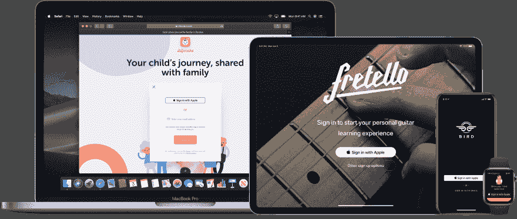

# iOS 13 中 ASWebAuthenticationSession API 变化快速指南

> 原文：<https://dev.to/robotsquidward/quick-guide-to-aswebauthenticationsession-api-changes-in-ios-13-4m8i>

WWDC 2019 上最大的宣布之一是新的“[用苹果](https://developer.apple.com/sign-in-with-apple/)登录”功能，苹果现在将代表你向应用程序提供认证电子邮件&密码，并使用 iCloud 钥匙链安全地管理它们。

[](https://res.cloudinary.com/practicaldev/image/fetch/s--AXrjNh51--/c_limit%2Cf_auto%2Cfl_progressive%2Cq_auto%2Cw_880/https://user-images.githubusercontent.com/10855762/60725200-7438a400-9f06-11e9-8c41-2efd5325a328.png)

苹果继续推动这些以隐私为中心的功能，尤其是围绕认证的功能，试图扰乱无处不在的服务，如脸书和谷歌 OAuth，这些服务使用户登录更加容易，但代价是他们的数据进入广告公司的手中。

因此，iOS 中的认证服务受到了广泛关注。我们看到它从去年开始从 [`SafariServices`](https://developer.apple.com/documentation/safariservices) 内部的授权服务转移到专用的[`AuthenticationServices`](https://developer.apple.com/documentation/authenticationservices)API。今年，iOS 13 利用`AuthenticationServices`支持使用苹果 API 登录，并继续完善登录体验。

## [`ASWebAuthenticationSession`](https://developer.apple.com/documentation/authenticationservices/aswebauthenticationsession)变动指南

去年，我在关于苹果从`SFAuthenticationSession`转移到`ASWebAuthenticationSession` 的帖子[中谈到了 iOS 中的 OAuth，以及我如何着手转换我的 iOS 应用程序以使用新的 API。今年，`ASWebAuthenticationSession`做了一些小调整，以增强 iOS(包括 iPadOS)设备上的 OAuth 登录体验。](https://ajkueterman.dev/posts/sfauthenticationsession-and-aswebauthenticationsession/)

如果你是一名开发人员，已经为 2019 年开发人员面临的大量变化和机遇感到焦虑，那么不要担心这一点，这只是一个小小的调整，纯粹是为了增强跨设备的 OAuth 体验。

为了做好准备，我们来看看 iOS 12 中`ASWebAuthenticationSession`的一段代码。

```
//...
var webAuthSession: ASWebAuthenticationSession?
//...
@available(iOS 12.0, *)
func getAuthTokenWithWebLogin() {

    let authURL = URL(string: "https://github.com/login/oauth/authorize?client_id=<client_id>")
    let callbackUrlScheme = "octonotes://auth"

    self.webAuthSession = ASWebAuthenticationSession.init(url: authURL!, callbackURLScheme: callbackUrlScheme, completionHandler: { (callBack:URL?, error:Error?) in

        // handle auth response
        guard error == nil, let successURL = callBack else {
            return
        }

        let oauthToken = NSURLComponents(string: (successURL.absoluteString))?.queryItems?.filter({$0.name == "code"}).first

        // Do what you now that you've got the token, or use the callBack URL
        print(oauthToken ?? "No OAuth Token")
    })

    // Kick it off
    self.webAuthSession?.start()
} 
```

<svg width="20px" height="20px" viewBox="0 0 24 24" class="highlight-action crayons-icon highlight-action--fullscreen-on"><title>Enter fullscreen mode</title></svg> <svg width="20px" height="20px" viewBox="0 0 24 24" class="highlight-action crayons-icon highlight-action--fullscreen-off"><title>Exit fullscreen mode</title></svg>

在这个例子中，我们唯一需要提供的`ASWebAuthenticationSession`是认证`URL`，一个回调 URL 方案，和一个处理 OAuth 结果的完成块。操作系统处理剩下的事情——显示一个警告，启动一个 Web 登录流，然后关闭。

在 iOS 13 中，随着苹果继续完善 iOS 和 iPadOS 的多应用体验，我们现在需要帮助操作系统决定在哪里以及如何显示 OAuth 警报和 Web 登录流程。

为此，我们必须让`ASWebAuthenticationSession`知道哪个窗口正在呈现 OAuth 请求。这是通过在呈现视图控制器中实现 [`ASWebAuthenticationPresentationContextProviding`](https://developer.apple.com/documentation/authenticationservices/aswebauthenticationpresentationcontextproviding) 接口来实现的。

呈现视图控制器需要实现`ASWebAuthenticationPresentationContextProviding`接口，并在`presentationAnchor`方法中返回相关窗口。

```
class LoginViewController: UIViewController, ASWebAuthenticationPresentationContextProviding {
    //...
    func presentationAnchor(for session: ASWebAuthenticationSession) -> ASPresentationAnchor {
        return self.view.window ?? ASPresentationAnchor()
    }
    //...
} 
```

<svg width="20px" height="20px" viewBox="0 0 24 24" class="highlight-action crayons-icon highlight-action--fullscreen-on"><title>Enter fullscreen mode</title></svg> <svg width="20px" height="20px" viewBox="0 0 24 24" class="highlight-action crayons-icon highlight-action--fullscreen-off"><title>Exit fullscreen mode</title></svg>

然后，在设置我们的授权会话时，我们需要指定我们的 [`presentationContextProvider`](https://developer.apple.com/documentation/authenticationservices/aswebauthenticationsession/3237232-presentationcontextprovider) 代表。

```
self.webAuthSession?.presentationContextProvider = context 
```

<svg width="20px" height="20px" viewBox="0 0 24 24" class="highlight-action crayons-icon highlight-action--fullscreen-on"><title>Enter fullscreen mode</title></svg> <svg width="20px" height="20px" viewBox="0 0 24 24" class="highlight-action crayons-icon highlight-action--fullscreen-off"><title>Exit fullscreen mode</title></svg>

完全更新的方法，现在传入一个`ASWebAuthenticationPresentationContextProviding`上下文(我们呈现的 VC 实现了`ASWebAuthenticationPresentationContextProviding`接口)。

```
//...
var webAuthSession: ASWebAuthenticationSession?
//...
@available(iOS 13.0, *)
func getAuthTokenWithWebLogin(context: ASWebAuthenticationPresentationContextProviding) {

    let authURL = URL(string: "https://github.com/login/oauth/authorize?client_id=<client_id>")
    let callbackUrlScheme = "octonotes://auth"

    self.webAuthSession = ASWebAuthenticationSession.init(url: authURL!, callbackURLScheme: callbackUrlScheme, completionHandler: { (callBack:URL?, error:Error?) in

        // handle auth response
        guard error == nil, let successURL = callBack else {
            return
        }

        let oauthToken = NSURLComponents(string: (successURL.absoluteString))?.queryItems?.filter({$0.name == "code"}).first

        // Do what you now that you've got the token, or use the callBack URL
        print(oauthToken ?? "No OAuth Token")
    })

    // New in iOS 13
    self.webAuthSession?.presentationContextProvider = context

    // Kick it off
    self.webAuthSession?.start()
} 
```

<svg width="20px" height="20px" viewBox="0 0 24 24" class="highlight-action crayons-icon highlight-action--fullscreen-on"><title>Enter fullscreen mode</title></svg> <svg width="20px" height="20px" viewBox="0 0 24 24" class="highlight-action crayons-icon highlight-action--fullscreen-off"><title>Exit fullscreen mode</title></svg>

此时，您的`ASWebAuthenticationSession`现在知道在哪里以及如何显示您的基于 Web 的登录流程，并将提供跨设备的一致体验！

## 关于 OAuth 的想法

在过去的两年里，修补 OAuth 是一次有趣的经历。就在我学习 API 的时候，苹果向新的 API 迈出了一大步，今年很明显这种变化如何为用户带来更好的登录体验。

现在在 iOS 13 中，通过观察这个小 API 的具体变化，可以看到 iOS 向多窗口体验的演变。

当我看到这种缓慢的进展时，我开始怀疑 OAuth 在 iOS 中的未来。网络认证会不会为了支持苹果的登录而一起被列入黑名单？苹果会不会以一种方式集中 auth，让我不用去 GitHub services 找令牌就可以用 GitHub 认证？只有时间能证明一切，但是今天的变化可以预测未来的变化——保持警惕！

如果你对 iOS 的 OAuth 和 Web 认证有任何想法/问题/预测，不要犹豫，在 Twitter 上联系我 [@ajkueterman](https://www.linkedin.com/in/ajkueterman/) 。