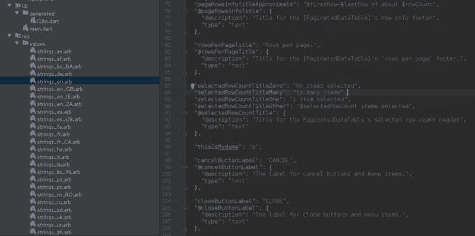
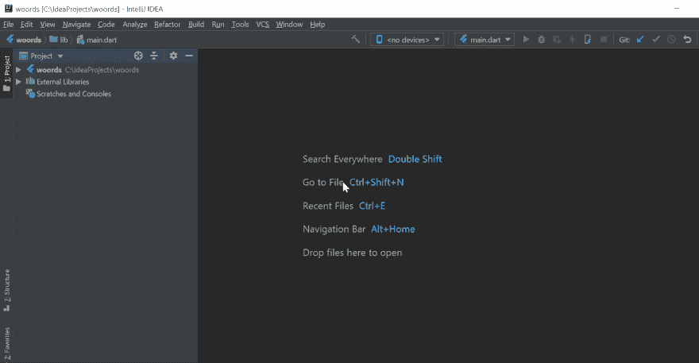
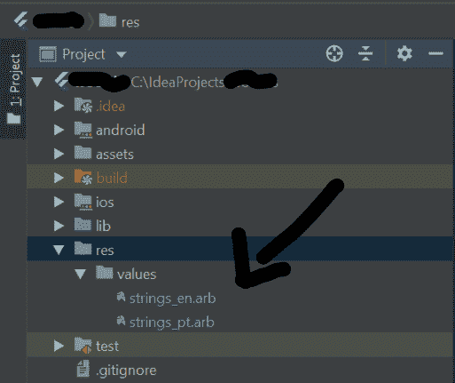
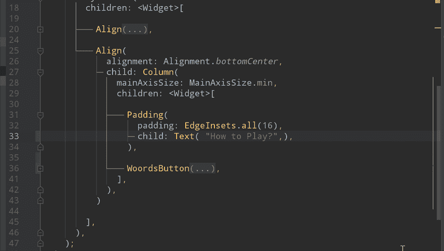

# 如何在颤振中 i18n？

> 原文：<https://dev.to/pedromassango/how-to-i18n-in-flutter-46km>

### 更新:

本文中使用的插件已被弃用，使用时风险自担。

在和 Flutter 一起工作了几个月(也许一年)之后，我想开始分享一些关于 Flutter 的高级东西，比如状态管理、i18n 等等。也可以查看我的 Youtube 频道上关于 Flutter 的视频。

在这篇文章中，我们将讨论 i18n，并看看在我们项目中处理 i18n 的两种选择。

### i18n 是什么？

是国际化的简称。之所以出现是因为国际化单词有二十个字母，在第一个字母( ***i*** )和最后一个( ***n*** )之间有十八个字母。

> **国际化**意味着让我们的应用程序可以在其他语言、国家或地区使用。

### **我们如何在 Flutter 中设置 i18n？**

我知道两种在 Flutter 中做 i18n 的方法，只要继续读下去…

### 1.常见的方式:手动

在这里，也许你想暂停我的帖子，看看 Flutter 文档，了解一些背景知识。基本上，您需要:

1.  创建一个包含您的字符串的单源类，您将使用该类来访问您的字符串。它使用 Intl 包来选择你的字符串，或者你可以选择你自己的方法。
2.  通过您的应用程序为每个支持的区域设置创建一个类😔您还需要为您的应用程序支持的每个区域设置创建一个单独的文件。每个文件都有针对该地区的本地化文本。
3.  用**localizationdelegates**配置您的 MaterialApp，以指向您的自定义本地化委托(这允许您访问字符串)。

你将使用类似的东西来访问你的字符串:

```
MyLocalizations.of(context).appDescription
```

#### 这种方法有什么问题？

这里没有问题，我们只是有一些负面的观点…

*   很难设置。您必须创建包含已翻译字符串的类。
*   很难翻译你的字符串😪。
*   每次您想要添加一个新字符串时，您都需要将它添加到每个区域设置的字符串文件中😔。
*   IntelliJ 不能告诉你你的 strings 键是否已经存在或者它是错误的，你会得到运行时错误(甚至崩溃)。

这对小项目来说很棒(也许不是)。如果您有一个支持两个以上地区的大型项目，那么您需要为每个地区创建文件并手动添加字符串。翻译你的字符串会非常困难。

### 2.自动方式:**颤振 i18n p** 卢金

给大家介绍一下 [Razvan Lung](https://github.com/long1eu) 为 **IntelliJ IDEA** 打造的 **Flutter i18n** 插件。一个简化项目中 i18n 管理的插件。

这个插件比默认实现有什么优势？

*   易于实现；
*   容易翻译你的字符串，因为它使用了**。arb** 文件；
*   IntelliJ 会在开发时让你知道你的字符串的键是错误的还是重复的。



**。arb** (Android 资源包)是由 **Intl** Dart 的包支持的文件，也由 Google translator toolkit 支持。每个地方都有自己的特色。arb 文件包含带有该地区字符串的 JSON 表。

### 我如何设置它？

1.  **在 IntelliJ IDEA 上获取插件** 进入**设置>插件**搜索 **Flutter i18n** 点击安装。下载完成后，重启您的 IDE。

 2\. **The next step** is to update our **MaterialApp** widget and add the generated localization delegate to give us the the access of our strings over all of our widgets and the generated supported locales list that is basically contains the locale code of each generated **.arb** locale’s file.

```
class MyApp extends StatelessWidget {

  @override
  Widget build(BuildContext context) {
    return MaterialApp(
      title: 'My App',
      localizationsDelegates: [S.*delegate*],
      supportedLocales: S.*delegate*.supportedLocales,
      *//localeResolutionCallback:* ,
      home: HomePage(),
    );
  }
}
```

这个插件生成了一个名为 **S** 的类，这个类可以让你的字符串提供上下文。您可以通过调用:`S.of(context).yourStringKey`来获取字符串。

注意:我们也可以选择注册一个**解析回调**(如果用户选择了一个不支持的区域设置，这个回调就会被调用)，这里我们基本上应该选择一个默认的区域设置，以防选择了一个不支持的区域设置。如果我们不提供解析回调，插件将选择第一个支持的语言环境，或者我们可以提供一个自定义的语言环境…

```
// use English as the default locale
localeResolutionCallback: S.*delegate*.resolution(fallback: Locale('en'))
```

### 手动添加新的 arb 文件

插件创建了一个默认值。英语 arb 文件。要添加新的 arb 文件，右击 **root-project/res** 文件夹，选择**New**->-**Arb 文件**。然后从列表中选择您的语言，必要时选择地区。您的 arb 文件位于“ **root-project/res/values/”下。**



#### 1.引用值

arb JSON 表的键，成为一个有效的 Dart 变量名。它们对应于来自 **S** 类的方法。例如:

`S.of(context).how_to_play`

提取字符串时也会生成这些 Dart 变量名。如果用户更改了设备语言，( **S** )类会自动加载新区域设置的值(不需要重启)。

#### 添加新的。arb 文件并自动注册字符串

来创建。例如，葡萄牙语的 arb 文件，你只需找到一个字符串，然后按下 **Alt+Enter** 就可以选择自动国际化该字符串。如果该地区的 arb 文件不存在，您可以很容易地创建它。亲眼所见…

<figure>

<figcaption>Easily extract strings to yours .arb files</figcaption>

</figure>

现在你有了。arb 文件你可以使用像[谷歌翻译工具包](https://translate.google.com/toolkit/docupload)这样的工具自动翻译你的文件。不要手动制作 i18n 浪费时间。😎


在[官方页面](https://plugins.jetbrains.com/plugin/10128-flutter-i18n)中阅读更多关于该插件的信息。

暂时就这样了。希望你读得愉快。在下面的评论中分享和留下你的想法。别忘了留下你的投票。下次见。