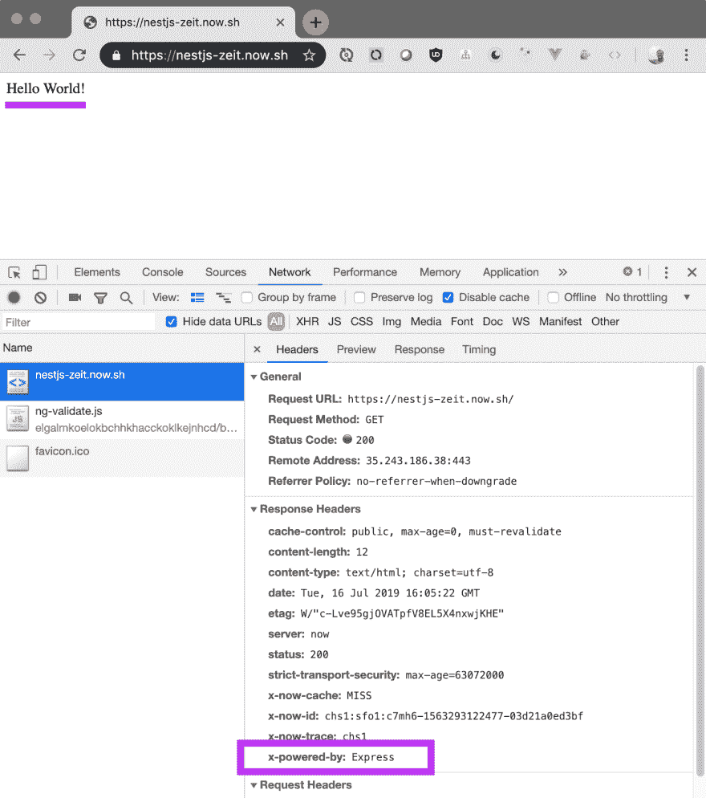

# 现在用 Zeit 在 2 分钟内将 NestJS 应用程序部署到云上！

> 原文：<https://dev.to/trilon/deploying-nestjs-apps-to-the-cloud-with-zeit-now-1jc4>

> **原载于 [Trilon 博客](https://trilon.io/blog/deploying-nestjs-to-zeit-now)作者[马克·皮耶萨克](https://twitter.com/MarkPieszak)T5】**

* * *

## 将 NestJS 部署到生产系列:

*   [**第 1 部分:将 NestJS 部署到 Zeit Now.sh**](https://trilon.io/blog/deploying-nestjs-to-zeit-now) *(本文)*
*   [第 2 部分:将 NestJS 部署到 Azure 函数中](https://trilon.io/blog/deploy-nestjs-azure-functions)
*   ...还会有更多...

* * *

## 我们在努力实现什么？

在本文中，我们将了解如何在几分钟内将应用部署到云平台 **[Zeit Now](https://zeit.co/now)** ！

> **参见《Hello World》NestJS+Zeit Now live demo:
> [NestJS-Zeit。Now.sh](https://NestJS-Zeit.Now.sh/)**
> 
> 你可以在这里找到 Github 代码示例

# 什么是 Zeit“现在”？

Zeit **现在**是一个无服务器部署的云平台。
这是一个极其简单、易于使用的平台，允许您立即部署从
静态网站到服务器/无服务器应用程序的任何东西，自动扩展，所有这些都只需最少的配置。

这包括前端应用程序(Angular/React/Vue/etc ),或者您选择的任何后端应用程序——Go、Node.js、Python 以及介于两者之间的所有应用程序！

NestJS 毕竟是 Node.js 框架，那么我们如何利用像现在的**和**这样不可思议的云平台，部署我们的应用呢？

# 获取设置

> **注意:**在本次演示中，我们将展示一个由 CLI 生成的新的 NestJS 应用程序，但是如果您喜欢使用现有的 NestJS 应用程序，请随意，直接跳过！

## 生成新的 NestJS 应用程序

出于演示目的，让我们确保安装了最新的 NestJS CLI 并创建一个新的应用程序。

```
☁ npm i -g @nestjs/cli
☁ nest new PROJECT_NAME 
```

<svg width="20px" height="20px" viewBox="0 0 24 24" class="highlight-action crayons-icon highlight-action--fullscreen-on"><title>Enter fullscreen mode</title></svg> <svg width="20px" height="20px" viewBox="0 0 24 24" class="highlight-action crayons-icon highlight-action--fullscreen-off"><title>Exit fullscreen mode</title></svg>

现在让我们进入新创建的目录并打开我们的 IDE。至此，我们已经生成了一个简单的 NestJS 应用程序。

# 现在设置 Zeit

```
# Install the Now CLI
☁ npm i -g now 
```

<svg width="20px" height="20px" viewBox="0 0 24 24" class="highlight-action crayons-icon highlight-action--fullscreen-on"><title>Enter fullscreen mode</title></svg> <svg width="20px" height="20px" viewBox="0 0 24 24" class="highlight-action crayons-icon highlight-action--fullscreen-off"><title>Exit fullscreen mode</title></svg>

确保您已登录 Now CLI(或在登录前[创建一个帐户](https://zeit.co/login))。

```
☁ now login
# enter email & password 
```

<svg width="20px" height="20px" viewBox="0 0 24 24" class="highlight-action crayons-icon highlight-action--fullscreen-on"><title>Enter fullscreen mode</title></svg> <svg width="20px" height="20px" viewBox="0 0 24 24" class="highlight-action crayons-icon highlight-action--fullscreen-off"><title>Exit fullscreen mode</title></svg>

好极了。我们有了一个“hello world”NestJS 应用程序& **Now** setup，接下来我们要做什么呢？

* * *

# 现在为 NestJS 配置 Zeit

通常有了现在的**，部署就像在你的终端键入`now`一样简单。**

 **但是仅仅这样对我们的 NestJS 应用程序来说是行不通的。

* * *

**现在**让您通过一个 **`now.json`** 文件配置您的[部署配置](https://zeit.co/docs/v2/deployments/configuration/?query=now.json)(通常可以在项目的根目录中找到)。

# Now.json 配置

有了这个`now.json`配置文件，我们可以控制部署的许多方面:

*   部署/项目名称
*   别名(即:你的域名网址)
*   构建设置
*   按指定路线发送
*   服务静态资产
*   [更多...](https://zeit.co/docs/v2/deployments/configuration/?query=now.json)

在应用程序的根目录下，创建一个 **`now.json`** 文件，并添加下面的 JSON 代码。

*   注意:您可以将下面的`name`设置为您喜欢的任何值

```
{  "version":  2,  "name":  "nestjs-now",  "builds":  [  {  "src":  "dist/main.js",  "use":  "@now/node"  }  ],  "routes":  [  {  "src":  "/(.*)",  "dest":  "dist/main.js"  }  ]  } 
```

<svg width="20px" height="20px" viewBox="0 0 24 24" class="highlight-action crayons-icon highlight-action--fullscreen-on"><title>Enter fullscreen mode</title></svg> <svg width="20px" height="20px" viewBox="0 0 24 24" class="highlight-action crayons-icon highlight-action--fullscreen-off"><title>Exit fullscreen mode</title></svg>

## 这个配置是干什么的？

*   **构建**

    *   在第 **`"use": "@now/node"`** 行，我们告诉 Now 构建器将文件`dist/main.js`作为 Node.js 函数的入口点，构建它的依赖项，并将它们捆绑成一个 [Lambda](https://zeit.co/docs/v2/deployments/concepts/lambdas/) 。
    *   让我们记住，最终，NestJS 编译成 JavaScript 并像标准 Node.js 服务器一样运行
    *   默认情况下，NestJS 在后台使用 Express，但是可以选择切换到使用 Fastify。
    *   *更多关于@now/node 的信息[这里](https://zeit.co/docs/v2/deployments/official-builders/node-js-now-node/)*
*   **路线**

    *   我们希望确保所有的路由`/(.*)`都是由我们在 NestJS 应用程序中设置的 API 路由来处理的，所以我们现在只是告诉我们的主文件在哪里。
    *   *更多信息请点击**现在**路线[这里](https://zeit.co/docs/v2/deployments/routes/)T5】*

* * *

# 大楼&正在部署

现在我们已经做好了一切准备——现在让我们把它部署到**吧**！

NestJS 是一个基于类型脚本的 Node.js 框架，所以我们需要确保我们为生产(通过`npm run build`)构建它，然后我们可以让**现在**做它的事情(通过`now`)！！

```
☁ npm run build && now

# ---------------------
#    example output
# ---------------------

> zeit-now-nestjs@0.0.1 build /Users/Documents/Trilon/zeit-now-nestjs
> tsc -p tsconfig.build.json

> Deploying ~/Documents/Trilon/zeit-now-nestjs under trilon-io
> Using project nestjs-now
> Synced 2 files (462.27KB) [2s]
> https://nestjs-zeit.now.sh/ [v2] [928ms]
> Ready! Aliased to https://nestjs-zeit.now.sh/ [in clipboard] [43s] 
```

<svg width="20px" height="20px" viewBox="0 0 24 24" class="highlight-action crayons-icon highlight-action--fullscreen-on"><title>Enter fullscreen mode</title></svg> <svg width="20px" height="20px" viewBox="0 0 24 24" class="highlight-action crayons-icon highlight-action--fullscreen-off"><title>Exit fullscreen mode</title></svg>

# NestJS 部署到☁！

如果你看上面(或者在你的终端中，如果你跟着看)，我们可以看到在终端中输出了一个 URL！它被自动复制到我们的剪贴板上，所以请打开浏览器看看吧！！

“你好，世界”的神奇荣耀...

[](https://res.cloudinary.com/practicaldev/image/fetch/s--OOD6aWv5--/c_limit%2Cf_auto%2Cfl_progressive%2Cq_auto%2Cw_880/https://thepracticaldev.s3.amazonaws.com/i/76n6xmfotb7f7r6wbqgh.png)

> **注意:**检查页面本身，我们可以看到它实际上是由一个 Express 服务器提供的，就像默认的 NestJS 应用程序一样！

# 有了！

只需几分钟和一个小文件——我们用 Zeit **Now** 将我们的 NestJS 应用程序带到了云上！

* * *

> **参见《Hello World》NestJS+Zeit Now live demo:
> [NestJS-Zeit。Now.sh](https://NestJS-Zeit.Now.sh/)**
> 
> 你可以在这里找到 Github 代码示例

* * *

# 总之

*   **现在**使得将我们的 NestJS 应用程序部署到云中变得更加简单。
*   在部署之前，确保您的脚本正在构建您的嵌套。
*   设置您的`now.json`以便为 NestJS 构建进行配置。
*   负责任地享受☁！**