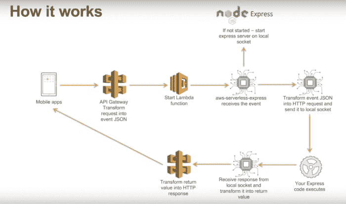
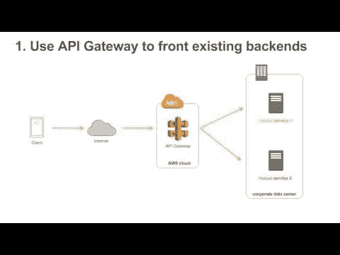
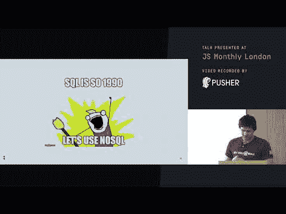
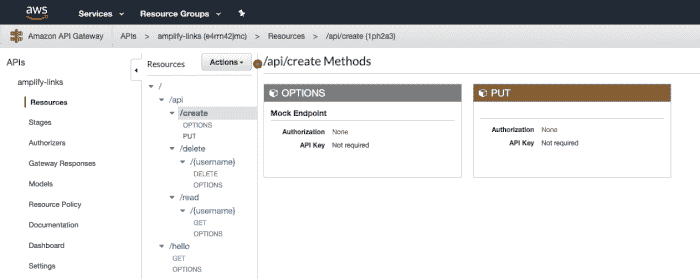
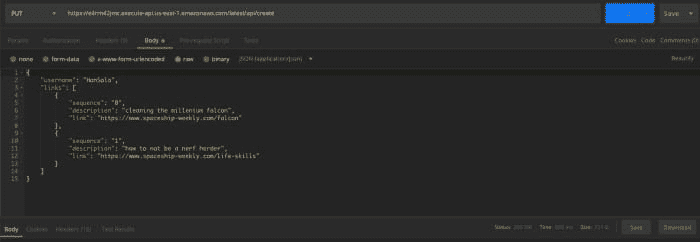

# 用 ClaudiaJS 构建无服务器 API

> 原文：<https://dev.to/andrewevans0102/building-a-serverless-api-with-claudiajs-34cd>

<figure>[](https://res.cloudinary.com/practicaldev/image/fetch/s--lSwwyRig--/c_limit%2Cf_auto%2Cfl_progressive%2Cq_auto%2Cw_880/https://atevans85.files.wordpress.com/2019/07/construction-2578410_960_720.jpg%3Fw%3D700) 

<figcaption>一个建筑工人用 claudiajs([source](https://pixabay.com/photos/construction-worker-safety-2578410/))</figcaption>

</figure>

构建一个无服务器 API

最近，我试图用 AWS 构建一个无服务器的 JavaScript API，发现了一个非常好的 CLI 和框架，叫做 [ClaudiaJS](https://claudiajs.com/) 。使用 ClaudiaJS，我能够为我的应用程序构建一个基本的 CRUD 接口。这种体验非常简单，极大地改善了我对 AWS Lambda 和 API Gateway 的体验。下面的帖子将涵盖我的经历和我所做的事情的基础。

## 无服务器

在开始讨论我做了什么之前，我想花点时间定义一些我将使用的基本术语:

*   **API** =应用编程接口
*   **无服务器** =任何不需要维护物理服务器的系统类型
*   让你在云中运行代码而无需托管基础设施的技术
*   **CRUD** =创建、读取、更新、删除

无服务器技术在最近几年变得非常流行。所有的云提供商都有自己的特色。为了这篇文章的目的，我将完全在 AWS 内部工作。查看以下链接了解更多信息:

*   [AWSλs](https://docs.aws.amazon.com/lambda/latest/dg/welcome.html)
*   [谷歌云功能](https://cloud.google.com/functions/)
*   [Firebase 云功能](https://firebase.google.com/docs/functions/http-events)
*   [Azure 功能](https://azure.microsoft.com/en-us/services/functions/)

为什么无服务器很重要？无服务器技术弥补了许多伴随传统软件开发的痛点。在过去，工程师不仅需要开发代码，还需要找到托管代码的地方，以便与世界其他地方进行交互。这通常包括设置服务器、安装补丁等。这通常是一个令人头疼的维护问题，因为开发人员还必须是系统管理员和支持人员。无服务器技术使这一切变得更容易，因为你只需要对你的代码负责。这意味着您可以依靠云提供商来完成所有的维护工作，而您(作为开发人员)只需确保您的代码正确运行。

## 克劳迪亚斯

ClaudiaJS 是一个 CLI，它利用 NPM 包 [claudia](https://www.npmjs.com/package/claudia) 以及 NPM 包 [claudia-api-builder](https://www.npmjs.com/package/claudia-api-builder) 来快速(轻松)构建一个无服务器后端。

CladuiaJS 有一个很好的站点，提供了几个不同用例的基本演练。在这里查看他们的主网页。

它的基本工作方式是，ClaudiaJS 利用 API 网关代理和 [AWS serverless-express](https://github.com/awslabs/aws-serverless-express) 模型来创建一组充当 API 的 lambdas。下图很好地映射了整个过程:

<figure>[](https://res.cloudinary.com/practicaldev/image/fetch/s--iprp66UI--/c_limit%2Cf_auto%2Cfl_progressive%2Cq_auto%2Cw_880/https://atevans85.files.wordpress.com/2019/07/screen-shot-2019-07-15-at-5.40.04-pm.png%3Fw%3D700) 

<figcaption>(来源[https://www.youtube.com/watch?v=Cuh_gtFX5gI](https://www.youtube.com/watch?v=Cuh_gtFX5gI))</figcaption>

</figure>

正如你在截图中看到的:

1.  应用程序基本上从网关开始
2.  一旦用户点击网关，就会调用一个 lambda 来启动一个 [node express](https://expressjs.com/) 实例
3.  `AWS event`被转换成节点快速请求
4.  相应的请求端点被调用、运行，相应的返回值以 HTTP 响应的形式反馈给调用者。

这也有点类似于 Firebase Cloud 函数利用 Node Express 的方式，如[他们的 HTTP 请求文档](https://firebase.google.com/docs/functions/http-events)所示。

AWS 也有一个很好的视频，涵盖了引擎盖下发生的事情:

[](http://www.youtube.com/watch?feature=player_embedded&v=Cuh_gtFX5gI<br>%0A)

在我的谷歌搜索中，我还发现这个演示文稿有助于从较高的层面概述其工作原理:

[](http://www.youtube.com/watch?feature=player_embedded&v=16s0UUU0oGI<br>%0A)

## 从哪里入手？

为了开始使用 ClaudiaJS，我建议你在这里浏览一下[教程。](https://claudiajs.com/tutorials/index.html)在我的项目中，我创建了一些与 AWS 中 DynamoDB 表交互的基本端点。为了审查我的项目，[在 GitHub 上签出我的代码](https://github.com/andrewevans0102/amplify-links-claudiajs-lambda/tree/master)。

对于我的项目，我遵循了这里的教程中的[基本大纲。我做了以下工作:](https://claudiajs.com/tutorials/hello-world-api-gateway.html)

在全球范围内安装了 claudiajs

`npm install -g claudia`

为我的项目创建了一个目录

`mkdir amplify-links-claudiajs-lambda`

做了标准的`npm init`来设置我的`package.json`文件

将 claudiajs api builder 作为项目依赖项安装在

`npm install claudia-api-builder -S`

使用
为我的服务器创建了初始应用文件

```
var ApiBuilder = require('claudia-api-builder'),
  api = new ApiBuilder();

module.exports = api;

api.get('/hello', function () {
  return 'hello world';
}); 
```

<svg width="20px" height="20px" viewBox="0 0 24 24" class="highlight-action crayons-icon highlight-action--fullscreen-on"><title>Enter fullscreen mode</title></svg> <svg width="20px" height="20px" viewBox="0 0 24 24" class="highlight-action crayons-icon highlight-action--fullscreen-off"><title>Exit fullscreen mode</title></svg>

然后使用 claudiajs CLI 测试部署，如下所示:

`claudia create --region us-east-1 --api-module app`

在初始部署之后，我得到了一个不错的终端消息，其中包含了我的 API 的基本 URL:

```
{
  "lambda": {
    "role": "amplify-links-executor",
    "name": "amplify-links",
    "region": "us-east-1"
  },
  "api": {
    "id": "e4rrn42jmc",
    "module": "app",
    "url": "https://e4rrn42jmc.execute-api.us-east-1.amazonaws.com/latest"
  }
} 
```

<svg width="20px" height="20px" viewBox="0 0 24 24" class="highlight-action crayons-icon highlight-action--fullscreen-on"><title>Enter fullscreen mode</title></svg> <svg width="20px" height="20px" viewBox="0 0 24 24" class="highlight-action crayons-icon highlight-action--fullscreen-off"><title>Exit fullscreen mode</title></svg>

然后，对于任何更新，我只是继续运行`claudia update`

## 成品

当我完成时，我的基本应用程序如下所示:

```
var ApiBuilder = require('claudia-api-builder'),
    AWS = require('aws-sdk'),
    api = new ApiBuilder(),
    documentClient = new AWS.DynamoDB.DocumentClient(),
    dynamoDBTableName = 'amplify-links';

AWS.config.update({region: 'us-east-1'});

module.exports = api;

// hello world
api.get('/hello', function () {
  return 'hello world';
});

// create
api.put('/api/create', function (request) {
    'use strict';
    try {
        const params = {
            TableName: dynamoDBTableName,
            Item: {
                username: request.body.username,
                links: request.body.links
            }
        };
        return documentClient.put(params).promise();
    } catch (error) {
        return error;
    }
}, { success: {code: 200}, error: {code: 500} });

// read
api.get('/api/read/{username}', function (request) {
    'use strict';
    try {
        const params = {
            TableName: dynamoDBTableName,
            Key: {
                username: request.pathParams.username
            }
        };
        return documentClient.get(params).promise();
    } catch (error) {
        return error;
    }
});

// delete
api.delete('/api/delete/{username}', function (request) {
    'use strict';
    try {
        const params = {
            TableName: dynamoDBTableName,
            Key: {
                username: request.pathParams.username
            }
        };
        return documentClient.delete(params).promise();
    } catch (error) {
        return error;
    }
}); 
```

<svg width="20px" height="20px" viewBox="0 0 24 24" class="highlight-action crayons-icon highlight-action--fullscreen-on"><title>Enter fullscreen mode</title></svg> <svg width="20px" height="20px" viewBox="0 0 24 24" class="highlight-action crayons-icon highlight-action--fullscreen-off"><title>Exit fullscreen mode</title></svg>

如你所见，我基本上构建了基本的 CRUD 函数。例外是我没有真正的`update`函数。然而，对于我将使用的前端应用程序，我只真正创建了条目，并不关心更新。

在我运行 claudiajs 之后，我去了 AWS 控制台。如果您打开 API Gateway，您会发现必要的端点是这样构建的:

[](https://res.cloudinary.com/practicaldev/image/fetch/s--e5TyKuJT--/c_limit%2Cf_auto%2Cfl_progressive%2Cq_auto%2Cw_880/https://atevans85.files.wordpress.com/2019/07/screen-shot-2019-07-17-at-2.53.08-pm.png%3Fw%3D700)

正如你从截图中看到的，claudiajs 已经处理了很多手工操作，否则你会创建端点、分配权限等等。

我还必须向我的 AWS lambda 添加一个策略，使它能够与 dynamoDB 交互。我添加了以下策略:

```
{
    "Version": "2012-10-17",
    "Statement": [
        {
            "Sid": "AmplifyLinksLambdaActions",
            "Effect": "Allow",
            "Action": [
                "dynamodb:Get*",
                "dynamodb:Query",
                "dynamodb:Scan",
                "dynamodb:Delete*",
                "dynamodb:Update*",
                "dynamodb:PutItem"
            ],
            "Resource": "arn:aws:dynamodb:us-east-1:XXXX:table/amplify-links"
        }
    ]
} 
```

<svg width="20px" height="20px" viewBox="0 0 24 24" class="highlight-action crayons-icon highlight-action--fullscreen-on"><title>Enter fullscreen mode</title></svg> <svg width="20px" height="20px" viewBox="0 0 24 24" class="highlight-action crayons-icon highlight-action--fullscreen-off"><title>Exit fullscreen mode</title></svg>

然后当(在我部署之后)我能够用 Postman 成功地运行它，就像你在下面的截图中看到的那样:

[](https://res.cloudinary.com/practicaldev/image/fetch/s--rFnncJHz--/c_limit%2Cf_auto%2Cfl_progressive%2Cq_auto%2Cw_880/https://atevans85.files.wordpress.com/2019/07/screen-shot-2019-07-17-at-2.56.36-pm.png%3Fw%3D700)

## 关闭思绪

我希望这篇文章已经向您介绍了 claudiajs，并有可能帮助您构建无服务器 API。claudiajs 附带了很多很好的文档，我鼓励您多读一些。