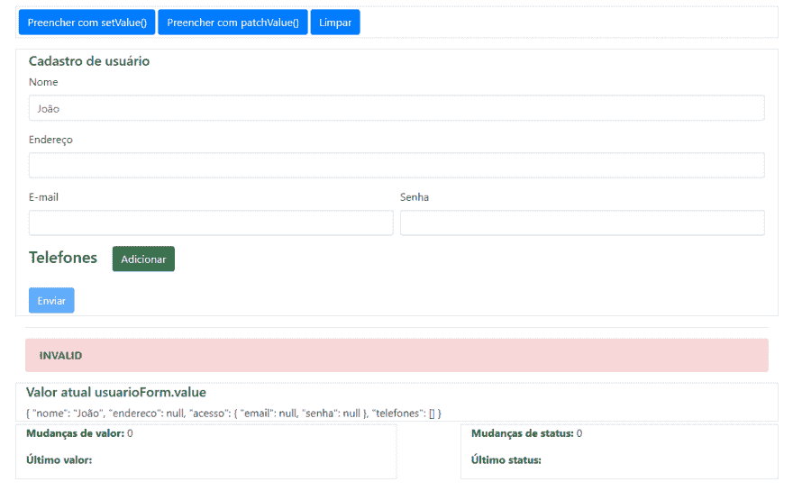
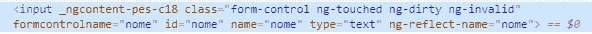
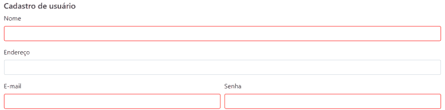

# 表单反应堆简介！

> 原文：<https://dev.to/felipedsc/introducao-aos-reactive-forms-3ehl>

## 导言

借助**反应式表单**，我们对表单的控制有所增强:与**模板驱动表单**(也称为 **TD 表单**不同的是，我们在组件中创建了其结构，并在中添加了对该结构的引用
除了对表格的基本控制(状态、清洁、填写等)。)，os **活性形式**为我们提供了对以下方面的控制:

*   Campos(表单控件)
*   坎普斯集团
*   具有自身标识符(shape array)的多值字段
*   有效的
*   异步自定义验证(例如，参见服务器)
*   随时添加和删除控件
*   控件操作

* * *

## 物体

构造符合以下模型的表格:

```
{  "nome":  "Felipe dos Santos Carvalho",  "endereco":  "Rua Um",  "acesso":  {  "email":  "contato@felipecarvalho.net",  "senha":  "senha"  },  "telefones":  ["12345678",  "23456789"]  } 
```

Enter fullscreen mode Exit fullscreen mode

电话字段必须动态添加，添加时必须是必填字段。
除地址外，所有字段都必须填写。
电子邮件栏位必须具有电子邮件验证。
密码栏位必须至少接收 3 个字元。
除了显示窗体的当前状态外，还必须有用于填写、清理和提交窗体的控件。
*表格不会很漂亮，但周围的控件会使人更容易理解:*



* * *

## 实施

首先，应用模块的**导入**中必须包含反应模块。在这种情况下，在 **app.module** :

```
import { NgModule } from '@angular/core';
import { BrowserModule } from '@angular/platform-browser';
import { ReactiveFormsModule } from '@angular/forms';
import { AppComponent } from './app.component';

@NgModule({
  imports: [
    BrowserModule,
    ReactiveFormsModule
  ],
  declarations: [AppComponent],
  bootstrap: [AppComponent]
})
export class AppModule { } 
```

Enter fullscreen mode Exit fullscreen mode

* * *

### 定义表格结构

在要显示窗体的组件(“t0”app . component)中，创建了一个用于存储窗体结构的变量。该结构被实例化为**【NGO ninit()**。基本上建立了一个**形组** com **形控制** s，另一个**形组**和 um **形阵列**。

*   **FormControl** :将应用于表单域的控件，可以接收 um **初始值、验证器数组(包括自定义)和异步验证器数组**。

*   **FormArray** :控制多值字段，其中数组中的每个索引都是一个值的标识符。分组**模具控制** s。*备注。:重要的是要强调，不是多选择的情况，对他们来说，shape control 就足够了。*

*   **模具组**:将上述控件以及其他**模具组**组合在一起。

*备注。:FormArray 和 FormGroup 还可以接收 FormControl 等验证器，但更重要的是，我从未需要使用这些验证器，为了简单起见，我不会讨论它们。*

```
import { Component, OnInit } from '@angular/core';
import { FormGroup, FormControl, FormArray, Validators } from '@angular/forms';

@Component({
  selector: 'app-root',
  templateUrl: './app.component.html',
  styleUrls: ['./app.component.scss']
})
export class AppComponent implements OnInit {
  usuarioForm: FormGroup;

  ngOnInit() {
    this.usuarioForm = new FormGroup({
      "nome": new FormControl("João", [Validators.required]),
      "endereco": new FormControl(),
      "acesso": new FormGroup({
        "email": new FormControl(null, [Validators.required, Validators.email]),
        "senha": new FormControl(null, [Validators.required, Validators.minLength(3)])
      }),
      "telefones": new FormArray([])
    });
  }
} 
```

Enter fullscreen mode Exit fullscreen mode

* * *

### 添加对模板的引用

现在必须将在组件中定义的控件应用于模板中的字段。

*   **【form group]=【user oform】为创建的表单附加标签。**
*   **formControlName** 指向创建的控件之一:**名称、【地址】、【电子邮件】和【密码】。**
*   **formGroupName** 将标签与数据子集相关联，在这种情况下，**【access】**。

```
<form [formGroup]="usuarioForm" (ngSubmit)="enviar()">
  <h5>Cadastro de usuário</h5>

  <div class="form-row">
    <div class="form-group col-12">
      <label for="nome">Nome</label>
      <input type="text" name="nome" id="nome" class="form-control" formControlName="nome">
    </div>
  </div>

  <div class="form-row">
    <div class="form-group col-12">
      <label for="endereco">Endereço</label>
      <input name="endereco" id="endereco" class="form-control" formControlName="endereco">
    </div>
  </div>

  <div class="form-row" formGroupName="acesso">
    <div class="form-group col-12 col-sm-6">
      <label for="email">E-mail</label>
      <input type="email" name="email" id="email" class="form-control" formControlName="email">
    </div>

    <div class="form-group col-12 col-sm-6">
      <label for="senha">Senha</label>
      <input type="password" name="senha" id="senha" class="form-control" formControlName="senha">
    </div>
  </div>
</form> 
```

Enter fullscreen mode Exit fullscreen mode

* * *

### 提交按钮

窗体可以与常用的“**div**标签相关联，而不是与“**form**标签相关联。
也不需要使用**【nsubmit()**调用表单提交功能，因为组件完全控制了表单的当前状态，所以可以在常用按钮上或在应用程序的任何时候执行此操作。
在表格的末尾添加了一个按钮，当表格为**无效**时，通过**禁用该按钮！用户表单有效**。值得注意的是，也有**【invalid】**的属性，这可能会给人的印象是它会提供预期的结果，但是-我...。**表单也具有状态*【pending】*，该状态无效，但无效，当某些异步验证正在处理/等待**时发生。不久，如果使用属性 **invalid** ，则在表单**待定**时将启用该按钮，允许用户提交可能不正确的表单！
考虑到这一点，按钮改为:

```
<button type="submit" class="btn btn-primary mt-3"  [disabled]="!usuarioForm.valid">Enviar</button> 
```

Enter fullscreen mode Exit fullscreen mode

* * *

### 验证

通过检查元素，您可以看到角度向输入中添加了一些类，以标识接触过哪些元素以及哪些元素无效，例如:

[](https://res.cloudinary.com/practicaldev/image/fetch/s--LcJDrfK6--/c_limit%2Cf_auto%2Cfl_progressive%2Cq_auto%2Cw_880/https://thepracticaldev.s3.amazonaws.com/i/edqq6wle8u7wlizx31y4.PNG)

通常用它来更改无效字段的 CSS。
组件 CSS 中添加了一种样式，这样当输入无效且被触摸时，边框颜色就会变为红色。

```
input.ng-invalid.ng-touched {
    border-color: red;    
} 
```

Enter fullscreen mode Exit fullscreen mode

[](https://res.cloudinary.com/practicaldev/image/fetch/s--I9TDUjSE--/c_limit%2Cf_auto%2Cfl_progressive%2Cq_auto%2Cw_880/https://thepracticaldev.s3.amazonaws.com/i/41p44aj6b9ihys5d2s3i.PNG)

还添加了针对无效密码、**无效电子邮件、**以及访问组具有某些无效控制的警报。

```
<div class="col-12" *ngIf="senhaInvalida">
  <div class="alert alert-danger" role="alert">
    <strong>Senha inválida!</strong>
  </div>
</div>

<div class="col-12" *ngIf="emailInvalido">
  <div class="alert alert-danger" role="alert">
    <strong>Informe um e-mail válido!</strong>
  </div>
</div>

<div class="col-12" *ngIf="acessoInvalidos">
  <div class="alert alert-danger" role="alert">
    <strong>Dados de acesso inválidos!</strong>
  </div>
</div> 
```

Enter fullscreen mode Exit fullscreen mode

**ngIf** 存取下列元件性质:

```
get emailInvalido() {
  return !this.usuarioForm.get('acesso.email').valid
    && this.usuarioForm.get('acesso.email').touched;
}

get senhaInvalida() {
  return !this.usuarioForm.get('acesso.senha').valid
    && this.usuarioForm.get('acesso.senha').touched;
}

get acessoInvalidos() {
  return !this.usuarioForm.get('acesso').valid
    && this.usuarioForm.get('acesso').touched;
} 
```

Enter fullscreen mode Exit fullscreen mode

* * *

## 电话的形式阵列

**FormArray** 的实现是通过使用指令**form name**指向之前创建的**form array**【phone】来划定其开始位置。
阵列**电话**将通过 **ngFor** ，对于**阵列电话**的每个元素，将在屏幕上呈现新的输入内容，其中其索引将成为**的标识符
方法**【add rtelefone()**将负责将新元素添加到数组中。** 

```
<div class="row" formArrayName="telefones">
  <div class="col-12">
    <h4>
      Telefones
      <button type="button" class="btn btn-success ml-3" (click)="adicionarTelefone()">Adicionar</button>
    </h4>
    <div class="form-group mt-3" *ngFor="let telefone of telefones; let i = index">
      <label>Telefone {{i + 1}}</label>
      <input type="text" class="form-control" [formControlName]="i">
    </div>
  </div>
</div> 
```

Enter fullscreen mode Exit fullscreen mode

在**add rtelefone()**中，创建一个新控件，并将其添加到**user oform**的电话阵列中。请注意，需要转换为 **FormArray** :这是因为**【get()**返回**【abstract control】**，后者是由 **FormArray** 继承而来的，而不是

```
adicionarTelefone() {
  const control = new FormControl(null, [Validators.required, Validators.minLength(8)]);
  (<FormArray>this.usuarioForm.get("telefones")).push(control);
} 
```

Enter fullscreen mode Exit fullscreen mode

已经拥有**电话机**只是返回添加到**shape array**的控件列表。

```
get telefones() {
  return (<FormArray>this.usuarioForm.get("telefones")).controls;
} 
```

Enter fullscreen mode Exit fullscreen mode

* * *

## 预定义表单值

填写表格有两种方法，它们有微妙的区别:

*   **【set value()**，其中应向**所有**表单域提供数据。
*   **补丁程序()**，您可以在其中部分填写表格，如果不传递给方法，表格中已经存在的数据将保持不变。

在表单顶部，创建了用于测试行为的按钮。请注意，对于 **setValue()** ，如果添加了电话，控制台将显示错误。
*由于方法接收任何类型的对象，只要满足要求，没有什么能阻止你通过以前实例化的对象。*
实施情况如下:

```
preencherComPatchValue() {
  this.usuarioForm.patchValue({
    "nome": "Felipe dos Santos Carvalho",
    "acesso": {
      "email": "contato@felipecarvalho.net"
    }
  });
}

preencherComSetValue() {
  this.usuarioForm.setValue({
    "nome": "Felipe dos Santos Carvalho",
    "endereco": "Rua Um",
    "acesso": {
      "email": "contato@felipecarvalho.net",
      "senha": "senha"
    },
    "telefones": []
  });
} 
```

Enter fullscreen mode Exit fullscreen mode

* * *

## 清理表格

还创建了一个按钮，用于清除只调用方法 **reset()** 的窗体。根据应用程序的需要，您可能还需要以下某些控件:

*   **【mark matter ucted()**返回用户未通过任何字段(未聚焦)的状态。
*   **markaspristin()**返回用户未修改任何字段的状态-未提供任何值。

```
 limpar() {
    this.usuarioForm.reset();
  } 
```

Enter fullscreen mode Exit fullscreen mode

* * *

## 服务员

由于在“**唤醒表单”**中，我们没有将模板与表单相关联，因此我们有以下选项:使用原始数据、获取字段到字段值或对与创建的模板相同的模板进行某些转换。
在**发送()**中展示了一些处理数据的可能性:

```
enviar() {
  console.log(this.usuarioForm.value);

  this.usuarioModel = Object.assign(this.usuarioForm.value);
  console.log(this.usuarioModel);

  this.usuarioModel = <Usuario>this.usuarioForm.value;
  console.log(this.usuarioModel);

  const nome = this.usuarioForm.get("nome").value;
  console.log(nome);
} 
```

Enter fullscreen mode Exit fullscreen mode

## 侦探

订阅 **【值变更】**(对于数值)和**【状态变更】**时，可以检测到变化。
创建了计数器和变量，以便从返回的**可观察到的**接收值。
O **valueChanges** 依赖于 *plus* :添加了运算子**r js**，使得**内的函数订阅**只运行 2 秒钟这对于实现要在键入时运行的自动保存或过滤器可能很有用。

```
this.usuarioForm.valueChanges
  .pipe(debounceTime(2000))
  .subscribe((valor) => {
    this.countMudancaValor++;
    this.ultimaMudancaValor = valor;
  });

this.usuarioForm.statusChanges
  .subscribe((status) => {
    this.countMudancaStatus++;
    this.ultimaMudancaStatus = status;
  }); 
```

Enter fullscreen mode Exit fullscreen mode

* * *

## Vamos ver functionando？

我利用并添加了几个其他字段，以此作为一个基础来降低复杂性。
我建议你在新标签中打开，以便有更好的体验。为此，请单击[此处](https://stackblitz.com/edit/angular-intro-reactive-forms?embed=1&file=src/app/app.component.ts)。

[https://stackblitz.com/edit/angular-intro-reactive-forms?embed=1&&](https://stackblitz.com/edit/angular-intro-reactive-forms?embed=1&&)