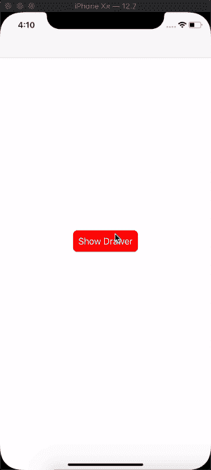

# 我的第一个 iOS 框架🎉

> 原文：<https://dev.to/kevinmaarek/my-first-ios-framework-2l20>

今天对我来说是个大日子。

### 我刚刚发布了我的第一个公开 iOS 框架！

名为 [UIDrawer](https://github.com/Que20/UIDrawer) 。
这是一个定制的 UIPresentationController，显示像底部抽屉一样的模态，你可能在几个系统 iOS 应用程序(如地图)和多个 Android 应用程序中见过这个组件。

在最近的一个项目中，我需要这个组件。这不是我第一次遇到这种产品请求，我决定用它来做一个分布式框架。

我为此感到非常自豪。我觉得在为项目编写代码行和将这些代码行公开作为任何人都可以使用的框架之间存在差距。

你呢？你的第一个开源框架是什么时候写的？