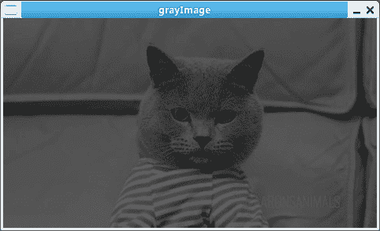
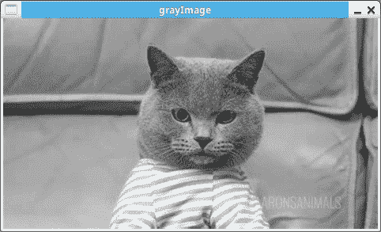

# 用 Python 实现灰度图像转换

> 原文：<https://dev.to/petercour/grayscale-image-conversion-with-python-50ho>

您可以将彩色图像转换为灰度图像。因为你有不同的颜色通道(R，G，B)，你可以改变它如何做到这一点。

输入图像是彩色的，然后程序运行，并输出灰度图像。我拍摄了这张输入图像:

[](https://res.cloudinary.com/practicaldev/image/fetch/s--nmDFwmE---/c_limit%2Cf_auto%2Cfl_progressive%2Cq_auto%2Cw_880/https://thepracticaldev.s3.amazonaws.com/i/numj98y8mvcqp5ihnaj1.jpg)

下面的例子使用 OpenCV，这是一个 Python 的计算机视觉库。计算机视觉超越了基本的图像处理，计算机视觉领域使用[机器学习](https://pythonprogramminglanguage.com/python-machine-learning/)或者深度学习。

回到图像处理，所以所有的像素被替换为它自己乘以一个数量。

这样我们可以访问每个像素的颜色通道，其中(I，j)是坐标

```
image[i,j][0] 
image[i,j][1]
image[i,j][2] 
```

然后在代码中:

```
#!/usr/bin/python3                                                                                                                                                      
import cv2

image = cv2.imread('image.jpg')

grayimg = image
height, width, channels = image.shape

for i in range(height):
    for j in range(width):
        grayimg[i,j] = 0.3 * image[i,j][0] + 0.59 * image[i,j][1] +  0.11 * image[i,j][2]

cv2.imshow('srcImage', image)
cv2.imshow('grayImage', grayimg)
cv2.waitKey(0) 
```

通过更改这些值，您可以创建不同的灰度图像:

[](https://res.cloudinary.com/practicaldev/image/fetch/s--4Q0-5jJg--/c_limit%2Cf_auto%2Cfl_progressive%2Cq_auto%2Cw_880/https://thepracticaldev.s3.amazonaws.com/i/38fp0q0tk95kx1lba2sj.png)

[](https://res.cloudinary.com/practicaldev/image/fetch/s--zo9FS3CM--/c_limit%2Cf_auto%2Cfl_progressive%2Cq_auto%2Cw_880/https://thepracticaldev.s3.amazonaws.com/i/yn8t7h0mj46uemqxir0m.png)

因此，根据您强调的颜色通道，颜色到灰度的转换可以创建非常不同的图像。

相关链接:

*   [OpenCV 模块](https://opencv.org/)
*   [计算机视觉课程&例题](https://gumroad.com/l/GQWGG)
*   [Python 教程](https://pythonprogramminglanguage.com/)