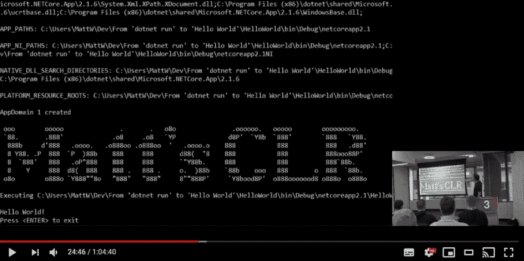

# ASCII 艺术在。网络代码

> 原文：<https://dev.to/mattwarren/ascii-art-in-net-code-3kcj>

谁不喜欢一点“ASCII 艺术”呢？我知道我当然喜欢！

[](https://www.youtube.com/watch?v=bwSNyA1Nfz4&t=1477)

要想知道马特的 CLR T1 是怎么回事，你可以看看我在《网络快跑》和《你好，世界》中的演讲[的录音。'](https://www.youtube.com/watch?v=bwSNyA1Nfz4&t=1477)(从大约 24:30 分开始)

* * *

有了可靠的正则表达式`/\*(.*?)\*/|//(.*?)\r?\n|"((\\[^\n]|[^"\n])*)"|@("[^"]*")+`，我开始在下面的*中寻找源代码注释中使用的所有**有趣的 ASCII 艺术**。NET 相关的*知识库:

*   [dot net/core clr](https://github.com/dotnet/coreclr/)-*运行时为。网芯。它包括垃圾收集器、JIT 编译器、原始数据类型和低级类。*
*   [Mono](https://github.com/mono/mono)-*开源 ECMA CLI，C#和。NET 实现。*
*   [dot net/CoreFX](https://github.com/dotnet/corefx)-*的基础类库。网芯。它包括集合、文件系统、控制台、JSON、XML、异步和许多其他类型。*
*   [dot net/Roslyn](https://github.com/dotnet/Roslyn)-“*为 C#和 Visual Basic 语言提供丰富的代码分析 API*
*   [aspnet/AspNetCore](https://github.com/aspnet/AspNetCore)-*一个跨平台。NET 框架，用于在 Windows、Mac 或 Linux 上构建现代的基于云的 web 应用程序。*

**注**:是的，我无耻地“借用”了[约翰·雷格尔](https://twitter.com/johnregehr/status/1095018518737637376)的这个想法，我写这个的动机是因为他的精彩帖子[“用 ASCII 艺术解释代码”](https://blog.regehr.org/archives/1653)没有任何*。NET 相关的*代码在里面！

如果你发现我遗漏了什么有趣的例子，请告诉我！

* * *

## 目录

为了让示例更容易浏览，我将它们分成了几类:

*   [目录](#table-of-contents)
*   戴夫·卡特勒
*   [语法树](#syntax-trees)
*   [时间线](#timelines)
*   [逻辑表](#logic-tables)
*   [阶级阶层](#class-hierarchies)
*   [部件图](#component-diagrams)
*   [算法](#algorithms)
*   [钻头包装](#bit-packing)
*   [数据结构](#data-structures)
*   [状态机](#state-machines)
*   [RFC 和规格](#rfcs-and-specs)
*   [日期&时间](#dates--times)
*   [堆栈布局](#stack-layouts)
*   [其余的](#the-rest)

* * *

## 戴夫·卡特勒

这本书里没有艺术，但它值得拥有自己的类别，因为它引用了领导 Windows NT 开发的令人惊叹的[戴夫·卡特勒](https://en.wikipedia.org/wiki/Dave_Cutler)。因此，没有更好的人来问一个关于*线程挂起*如何在 Windows 上工作的深刻的技术问题，来自[core clr/src/VM/Thread suspend . CPP](https://github.com/dotnet/coreclr/blob/dc11162e1c36624d3cabb6e0bf6583a94ab2e30c/src/vm/threadsuspend.cpp#L102-L124)

```
// Message from David Cutler
/*
    After SuspendThread returns, can the suspended thread continue to execute code in user mode?

    [David Cutler] The suspended thread cannot execute any more user code, but it might be currently "running"
    on a logical processor whose other logical processor is currently actually executing another thread.
    In this case the target thread will not suspend until the hardware switches back to executing instructions
    on its logical processor. In this case even the memory barrier would not necessarily work - a better solution
    would be to use interlocked operations on the variable itself.

    After SuspendThread returns, does the store buffer of the CPU for the suspended thread still need to drain?

    Historically, we've assumed that the answer to both questions is No.  But on one 4/8 hyper-threaded machine
    running Win2K3 SP1 build 1421, we've seen two stress failures where SuspendThread returns while writes seem to still be in flight.

    Usually after we suspend a thread, we then call GetThreadContext.  This seems to guarantee consistency.
    But there are places we would like to avoid GetThreadContext, if it's safe and legal.

    [David Cutler] Get context delivers a APC to the target thread and waits on an event that will be set
    when the target thread has delivered its context.

    Chris.
*/ 
```

想了解更多关于戴夫·卡特勒的信息，请看这个精彩的采访[“有趣的互联网#6:戴夫·卡特勒谈戴夫·卡特勒”](https://dave.cheney.net/2018/10/06/internets-of-interest-6-dave-cutler-on-dave-cutler)或[“工程师的工程师:计算机行业杰出人士向戴夫·卡特勒长达五十年的质量追求致敬”](https://news.microsoft.com/features/the-engineers-engineer-computer-industry-luminaries-salute-dave-cutlers-five-decade-long-quest-for-quality/)

* * *

## 语法树

的内部工作方式。NET“实时”(JIT)编译器对我来说一直有点神秘。但是，像这样来自 coreclr/src/jit/lsra.cpp 的信息性注释在一定程度上展示了它在做什么

```
// For example, for this tree (numbers are execution order, lower is earlier and higher is later):
//
//                                   +---------+----------+
//                                   |       GT_ADD (3)   |
//                                   +---------+----------+
//                                             |
//                                           /   \
//                                         /       \
//                                       /           \
//                   +-------------------+           +----------------------+
//                   |         x (1)     | "tree"    |         y (2)        |
//                   +-------------------+           +----------------------+
//
// generate this tree:
//
//                                   +---------+----------+
//                                   |       GT_ADD (4)   |
//                                   +---------+----------+
//                                             |
//                                           /   \
//                                         /       \
//                                       /           \
//                   +-------------------+           +----------------------+
//                   |  GT_RELOAD (3)    |           |         y (2)        |
//                   +-------------------+           +----------------------+
//                             |
//                   +-------------------+
//                   |         x (1)     | "tree"
//                   +-------------------+ 
```

在[core clr/src/JIT/morph . CPP](https://github.com/dotnet/coreclr/blob/9d3f264b9ef8b4715017ec615dcb6f9d57e607cc/src/jit/morph.cpp#L6170-L6236)中还有一个更深入的例子

同样来自[roslyn/src/Compilers/visual basic/Portable/Semantics/type inference/required conversion . VB](https://github.com/dotnet/roslyn/blob/Visual-Studio-2017-Version-15.9/src/Compilers/VisualBasic/Portable/Semantics/TypeInference/RequiredConversion.vb#L87-L104)

```
 '// These restrictions form a partial order composed of three chains: from less strict to more strict, we have:
'//    [reverse chain] [None] < AnyReverse < ReverseReference < Identity
'//    [middle  chain] None < [Any,AnyReverse] < AnyConversionAndReverse < Identity
'//    [forward chain] [None] < Any < ArrayElement < Reference < Identity
'//
'//            =           KEY:
'//         /  |  \           =     Identity
'//        /   |   \         +r     Reference
'//      -r    |    +r       -r     ReverseReference
'//       |  +-any  |       +-any   AnyConversionAndReverse
'//       |   /|\   +arr     +arr   ArrayElement
'//       |  / | \  |        +any   Any
'//      -any  |  +any       -any   AnyReverse
'//         \  |  /           none  None
'//          \ | /
'//           none
'// 
```

* * *

## 时间轴

这个来自[core clr/src/VM/comwaithandle . CPP](https://github.com/dotnet/coreclr/blob/e277764916cbb740db199132be81701593820bb0/src/vm/comwaithandle.cpp#L129-L156)的例子是独一无二的！我没有找到另一个 ASCII 艺术的例子来说明时间线，这是一个非常新颖的方法。

```
// In case the CLR is paused inbetween a wait, this method calculates how much 
// the wait has to be adjusted to account for the CLR Freeze. Essentially all
// pause duration has to be considered as "time that never existed".
//
// Two cases exists, consider that 10 sec wait is issued 
// Case 1: All pauses happened before the wait completes. Hence just the 
// pause time needs to be added back at the end of wait
// 0           3                   8       10
// |-----------|###################|------>
//                 5-sec pause    
//             ....................>
//                                            Additional 5 sec wait
//                                        |=========================> 
//
// Case 2: Pauses ended after the wait completes. 
// 3 second of wait was left as the pause started at 7 so need to add that back
// 0                           7           10
// |---------------------------|###########>
//                                 5-sec pause   12
//                             ...................>
//                                            Additional 3 sec wait
//                                                |==================> 
//
// Both cases can be expressed in the same calculation
// pauseTime:   sum of all pauses that were triggered after the timer was started
// expDuration: expected duration of the wait (without any pauses) 10 in the example
// actDuration: time when the wait finished. Since the CLR is frozen during pause it's
//              max of timeout or pause-end. In case-1 it's 10, in case-2 it's 12 
```

* * *

## 逻辑表

ASCII 艺术的最佳选择似乎是表格，有很多例子。从[core clr/src/VM/method table builder . CPP](https://github.com/dotnet/coreclr/blob/9d3f264b9ef8b4715017ec615dcb6f9d57e607cc/src/vm/methodtablebuilder.cpp#L4675-L4686)开始(将注释和代码结合在一起的加分！)

```
//               |        Base type
// Subtype       |        mdPrivateScope  mdPrivate   mdFamANDAssem   mdAssem     mdFamily    mdFamORAssem    mdPublic
// --------------+-------------------------------------------------------------------------------------------------------
/*mdPrivateScope | */ { { e_SM,           e_NO,       e_NO,           e_NO,       e_NO,       e_NO,           e_NO    },
/*mdPrivate      | */   { e_SM,           e_YES,      e_NO,           e_NO,       e_NO,       e_NO,           e_NO    },
/*mdFamANDAssem  | */   { e_SM,           e_YES,      e_SA,           e_NO,       e_NO,       e_NO,           e_NO    },
/*mdAssem        | */   { e_SM,           e_YES,      e_SA,           e_SA,       e_NO,       e_NO,           e_NO    },
/*mdFamily       | */   { e_SM,           e_YES,      e_YES,          e_NO,       e_YES,      e_NSA,          e_NO    },
/*mdFamORAssem   | */   { e_SM,           e_YES,      e_YES,          e_SA,       e_YES,      e_YES,          e_NO    },
/*mdPublic       | */   { e_SM,           e_YES,      e_YES,          e_YES,      e_YES,      e_YES,          e_YES   } }; 
```

另外[core clr/src/jit/importer . CPP](https://github.com/dotnet/coreclr/blob/9d3f264b9ef8b4715017ec615dcb6f9d57e607cc/src/jit/importer.cpp#L15265-L15283)展示了 JIT 如何处理装箱/取消装箱

```
/*
    ----------------------------------------------------------------------
    | \ helper  |                         |                              |
    |   \       |                         |                              |
    |     \     | CORINFO_HELP_UNBOX      | CORINFO_HELP_UNBOX_NULLABLE  |
    |       \   | (which returns a BYREF) | (which returns a STRUCT)     |
    | opcode  \ |                         |                              |
    |---------------------------------------------------------------------
    | UNBOX     | push the BYREF          | spill the STRUCT to a local, |
    |           |                         | push the BYREF to this local |
    |---------------------------------------------------------------------
    | UNBOX_ANY | push a GT_OBJ of        | push the STRUCT              |
    |           | the BYREF               | For Linux when the           |
    |           |                         |  struct is returned in two   |
    |           |                         |  registers create a temp     |
    |           |                         |  which address is passed to  |
    |           |                         |  the unbox_nullable helper.  |
    |---------------------------------------------------------------------
*/ 
```

最后，还有一些很好的例子，展示了 C# (Roslyn)编译器中的[操作符重载](https://github.com/dotnet/roslyn/blob/Visual-Studio-2017-Version-15.9/src/Compilers/CSharp/Portable/Binder/Semantics/Operators/BinaryOperatorEasyOut.cs#L104-L165)的规则。NET 数据类型[可以通过`System.ToXXX()`函数转换成](https://github.com/dotnet/corefx/blob/4b9fff5c022269c7dbb000bd14c10be27400beb2/src/Common/src/CoreLib/System/Convert.cs#L46-L63)。

* * *

## 阶级等级制度

当然，大多数 IDE 都附带了为您生成类层次结构的工具，但是在 ASCII 中看到它们会更好，从 [coreclr/src/vm/object.h](https://github.com/dotnet/coreclr/blob/9d3f264b9ef8b4715017ec615dcb6f9d57e607cc/src/vm/object.h#L28-L55)

```
 * COM+ Internal Object Model
 *
 *
 * Object              - This is the common base part to all COM+ objects
 *  |                        it contains the MethodTable pointer and the
 *  |                        sync block index, which is at a negative offset
 *  |
 *  +-- code:StringObject       - String objects are specialized objects for string
 *  |                        storage/retrieval for higher performance
 *  |
 *  +-- BaseObjectWithCachedData - Object Plus one object field for caching.
 *  |       |
 *  |       +-  ReflectClassBaseObject    - The base object for the RuntimeType class
 *  |       +-  ReflectMethodObject       - The base object for the RuntimeMethodInfo class
 *  |       +-  ReflectFieldObject        - The base object for the RtFieldInfo class
 *  |
 *  +-- code:ArrayBase          - Base portion of all arrays
 *  |       |
 *  |       +-  I1Array    - Base type arrays
 *  |       |   I2Array
 *  |       |   ...
 *  |       |
 *  |       +-  PtrArray   - Array of OBJECTREFs, different than base arrays because of pObjectClass
 *  |              
 *  +-- code:AssemblyBaseObject - The base object for the class Assembly 
```

还有一个[甚至更大的](https://github.com/dotnet/coreclr/blob/1f02c30e053b1da4410e20c3b715128e3d1e354a/src/vm/frames.h#L7-L197)，是我在 2010 年写[“堆栈审核”时偶然发现的。NET 运行时](http://mattwarren.org/2019/01/21/Stackwalking-in-the-.NET-Runtime/)。

* * *

## 组件图

当一个代码库中有几个不同的组件时，看到它们如何组合在一起总是很好的。从 [coreclr/src/vm/codeman.h](https://github.com/dotnet/coreclr/blob/9d3f264b9ef8b4715017ec615dcb6f9d57e607cc/src/vm/codeman.h#L14-L56) 我们可以看到。NET JIT 协同工作

```
 ExecutionManager
                                                       |
                           +-----------+---------------+---------------+-----------+--- ...
                           |           |                               |           |
                        CodeType       |                            CodeType       |
                           |           |                               |           |
                           v           v                               v           v
+---------------+      +--------+<---- R    +---------------+      +--------+<---- R
|ICorJitCompiler|<---->|IJitMan |<---- R    |ICorJitCompiler|<---->|IJitMan |<---- R
+---------------+      +--------+<---- R    +---------------+      +--------+<---- R
                           |       x   .                               |       x   .
                           |        \  .                               |        \  .
                           v         \ .                               v         \ .
                       +--------+      R                           +--------+      R
                       |ICodeMan|                                  |ICodeMan|     (RangeSections)
                       +--------+                                  +--------+ 
```

其他值得注意的例子有:

*   [coreclr/src/vm/compile.h](https://github.com/dotnet/coreclr/blob/9d3f264b9ef8b4715017ec615dcb6f9d57e607cc/src/vm/compile.h#L14-L47)
*   [coreclr/src/inc/ceegen.h](https://github.com/dotnet/coreclr/blob/9d3f264b9ef8b4715017ec615dcb6f9d57e607cc/src/inc/ceegen.h#L47-L92)
*   [core clr/src/debug/di/divalue . CPP](https://github.com/dotnet/coreclr/blob/9d3f264b9ef8b4715017ec615dcb6f9d57e607cc/src/debug/di/divalue.cpp#L1432-L1451)
*   [coreclr/src/VM/cielo ad . CPP](https://github.com/dotnet/coreclr/blob/9d3f264b9ef8b4715017ec615dcb6f9d57e607cc/src/vm/ceeload.cpp#L10543-L10578)

最后，从[core clr/src/VM/CEE load . CPP](https://github.com/dotnet/coreclr/blob/e6034d903f2608445a3f66e3694f461fad7b8b88/src/vm/ceeload.cpp#L10350-L10385)我们看到了[本地映像生成器(NGEN)](https://docs.microsoft.com/en-us/dotnet/framework/tools/ngen-exe-native-image-generator) 的内部工作方式

```
 This diagram illustrates the layout of fixups in the ngen image.
        This is the case where function foo2 has a class-restore fixup
        for class C1 in b.dll.

                                  zapBase+curTableVA+rva /         FixupList (see Fixup Encoding below)
                                  m_pFixupBlobs
                                                            +-------------------+
                  pEntry->VA +--------------------+         |     non-NULL      | foo1
                             |Handles             |         +-------------------+
ZapHeader.ImportTable        |                    |         |     non-NULL      |
                             |                    |         +-------------------+
   +------------+            +--------------------+         |     non-NULL      |
   |a.dll       |            |Class cctors        |<---+    +-------------------+
   |            |            |                    |     \   |         0         |
   |            |     p->VA/ |                    |<---+ \  +===================+
   |            |      blobs +--------------------+     \ +-------non-NULL      | foo2
   +------------+            |Class restore       |      \  +-------------------+
   |b.dll       |            |                    |       +-------non-NULL      |
   |            |            |                    |         +-------------------+
   |  token_C1  |<--------------blob(=>fixedUp/0) |<--pBlob--------index        |
   |            | \          |                    |         +-------------------+
   |            |  \         +--------------------+         |     non-NULL      |
   |            |   \        |                    |         +-------------------+
   |            |    \       |        .           |         |         0         |
   |            |     \      |        .           |         +===================+
   +------------+      \     |        .           |         |         0         | foo3
                        \    |                    |         +===================+
                         \   +--------------------+         |     non-NULL      | foo4
                          \  |Various fixups that |         +-------------------+
                           \ |need too happen     |         |         0         |
                            \|                    |         +===================+
                             |(CorCompileTokenTable)
                             |                    |
               pEntryEnd->VA +--------------------+ 
```

* * *

## 算法

他们说“一图胜千言”，这绝对适用于描述复杂的算法，从[罗斯林/src/work spaces/Core/Portable/Utilities/edit distance . cs](https://github.com/dotnet/roslyn/blob/Visual-Studio-2017-Version-15.9/src/Workspaces/Core/Portable/Utilities/EditDistance.cs#L232-L287)

```
// If we fill out the matrix fully we'll get:
//          
//           s u n d a y <-- source
//      ----------------
//      |∞ ∞ ∞ ∞ ∞ ∞ ∞ ∞
//      |∞ 0 1 2 3 4 5 6
//    s |∞ 1 0 1 2 3 4 5 
//    a |∞ 2 1 1 2 3 3 4 
//    t |∞ 3 2 2 2 3 4 4 
//    u |∞ 4 3 2 3 3 4 5 
//    r |∞ 5 4 3 3 4 4 5 
//    d |∞ 6 5 4 4 3 4 5 
//    a |∞ 7 6 5 5 4 3 4 
//    y |∞ 8 7 6 6 5 4 3 <--
//                     ^
//                     | 
```

接下来，这个解释 DOS 通配符匹配如何工作的宝石， [corefx/src/System。IO.FileSystem/src/System/IO/Enumeration/FileSystemName.cs](https://github.com/dotnet/corefx/blob/4b9fff5c022269c7dbb000bd14c10be27400beb2/src/System.IO.FileSystem/src/System/IO/Enumeration/FileSystemName.cs#L104-L158)

```
// Matching routine description
// ============================
// (copied from native impl)
//
// This routine compares a Dbcs name and an expression and tells the caller
// if the name is in the language defined by the expression.  The input name
// cannot contain wildcards, while the expression may contain wildcards.
//
// Expression wild cards are evaluated as shown in the nondeterministic
// finite automatons below.  Note that ~* and ~? are DOS_STAR and DOS_QM.
//
//        ~* is DOS_STAR, ~? is DOS_QM, and ~. is DOS_DOT
//
//                                  S
//                               <-----<
//                            X  |     |  e       Y
//        X * Y ==       (0)----->-(1)->-----(2)-----(3)
//
//                                 S-.
//                               <-----<
//                            X  |     |  e       Y
//        X ~* Y ==      (0)----->-(1)->-----(2)-----(3)
//
//                           X     S     S     Y
//        X ?? Y ==      (0)---(1)---(2)---(3)---(4)
//
//                           X     .        .      Y
//        X ~.~. Y ==    (0)---(1)----(2)------(3)---(4)
//                              |      |________|
//                              |           ^   |
//                              |_______________|
//                                 ^EOF or .^
//
//                           X     S-.     S-.     Y
//        X ~?~? Y ==    (0)---(1)-----(2)-----(3)---(4)
//                              |      |________|
//                              |           ^   |
//                              |_______________|
//                                 ^EOF or .^
//
//    where S is any single character
//          S-. is any single character except the final .
//          e is a null character transition
//          EOF is the end of the name string
//
//   In words:
//
//       * matches 0 or more characters.
//       ? matches exactly 1 character.
//       DOS_STAR matches 0 or more characters until encountering and matching
//           the final . in the name.
//       DOS_QM matches any single character, or upon encountering a period or
//           end of name string, advances the expression to the end of the
//           set of contiguous DOS_QMs.
//       DOS_DOT matches either a . or zero characters beyond name string. 
```

最后从[roslyn/src/work spaces/Core/Portable/Shared/Collections/interval tree 1。Node.cs](https://github.com/dotnet/roslyn/blob/Visual-Studio-2017-Version-15.9/src/Workspaces/Core/Portable/Shared/Collections/IntervalTree%601.Node.cs#L65-L125) 我们有每个方法的示例注释，这是一个好主意！

```
// Sample:
//   1            1                  3
//  / \          / \              /     \
// a   2        a   3            1       2
//    / \   =>     / \     =>   / \     / \
//   3   d        b   2        a   b   c   d
//  / \              / \
// b   c            c   d
internal Node InnerRightOuterLeftRotation(IIntervalIntrospector<T> introspector)
{
    ...
}

// Sample:
//     1              1              3
//    / \            / \          /     \
//   2   d          3   d        2       1
//  / \     =>     / \     =>   / \     / \
// a   3          2   c        a   b   c   d
//    / \        / \
//   b   c      a   b
internal Node InnerLeftOuterRightRotation(IIntervalIntrospector<T> introspector)
{
    ...
} 
```

* * *

## 钻头包装

也许你可以想象给定一个十六进制值，设置哪些*位*位，但我不能，所以我总是感谢来自[roslyn/src/Compilers/cs harp/Portable/Symbols/Source/sourcemembercontainersymbol . cs](https://github.com/dotnet/roslyn/blob/Visual-Studio-2017-Version-15.9/src/Compilers/CSharp/Portable/Symbols/Source/SourceMemberContainerSymbol.cs#L28-L37)的类似评论

```
// We current pack everything into two 32-bit ints; layouts for each are given below.

// First int:
//
// | |d|yy|xxxxxxxxxxxxxxxxxxxxxxx|wwwwww|
//
// w = special type.  6 bits.
// x = modifiers.  23 bits.
// y = IsManagedType.  2 bits.
// d = FieldDefinitionsNoted. 1 bit 
```

这个来自 [corefx/src/System。runtime . windows runtime/src/System/Threading/Tasks/tasktoasyncinfoadapter . cs](https://github.com/dotnet/corefx/blob/4b9fff5c022269c7dbb000bd14c10be27400beb2/src/System.Runtime.WindowsRuntime/src/System/Threading/Tasks/TaskToAsyncInfoAdapter.cs#L26-L43)也很好地显示了不同的位标志以及它们是如何交互的

```
// ! THIS DIAGRAM ILLUSTRATES THE CONSTANTS BELOW. UPDATE THIS IF UPDATING THE CONSTANTS BELOW!:
//     3         2         1         0
//    10987654321098765432109876543210
//    X...............................   Reserved such that we can use Int32 and not worry about negative-valued state constants
//    ..X.............................   STATEFLAG_COMPLETED_SYNCHRONOUSLY
//    ...X............................   STATEFLAG_MUST_RUN_COMPLETION_HNDL_WHEN_SET
//    ....X...........................   STATEFLAG_COMPLETION_HNDL_NOT_YET_INVOKED
//    ................................   STATE_NOT_INITIALIZED
//    ...............................X   STATE_STARTED
//    ..............................X.   STATE_RUN_TO_COMPLETION
//    .............................X..   STATE_CANCELLATION_REQUESTED
//    ............................X...   STATE_CANCELLATION_COMPLETED
//    ...........................X....   STATE_ERROR
//    ..........................X.....   STATE_CLOSED
//    ..........................XXXXXX   STATEMASK_SELECT_ANY_ASYNC_STATE
//    XXXXXXXXXXXXXXXXXXXXXXXXXX......   STATEMASK_CLEAR_ALL_ASYNC_STATES
//     3         2         1         0
//    10987654321098765432109876543210 
```

最后，我们有一些关于不同编码如何工作的有用解释。首先是来自[corefx//src/Common/src/CoreLib/System/Text/utf8 encoding . cs](https://github.com/dotnet/corefx/blob/4b9fff5c022269c7dbb000bd14c10be27400beb2/src/Common/src/CoreLib/System/Text/UTF8Encoding.cs#L38-L49)的 UTF-8

```
/*
    bytes   bits    UTF-8 representation
    -----   ----    -----------------------------------
    1        7      0vvvvvvv
    2       11      110vvvvv 10vvvvvv
    3       16      1110vvvv 10vvvvvv 10vvvvvv
    4       21      11110vvv 10vvvvvv 10vvvvvv 10vvvvvv
    -----   ----    -----------------------------------
    Surrogate:
    Real Unicode value = (HighSurrogate - 0xD800) * 0x400 + (LowSurrogate - 0xDC00) + 0x10000
*/ 
```

然后是[corefx/src/Common/src/CoreLib/System/Text/UTF 32 encoding . cs](https://github.com/dotnet/corefx/blob/4b9fff5c022269c7dbb000bd14c10be27400beb2/src/Common/src/CoreLib/System/Text/UTF32Encoding.cs#L26-L35)中的 UTF-32

```
/*
    words   bits    UTF-32 representation
    -----   ----    -----------------------------------
    1       16      00000000 00000000 xxxxxxxx xxxxxxxx
    2       21      00000000 000xxxxx hhhhhhll llllllll
    -----   ----    -----------------------------------
    Surrogate:
    Real Unicode value = (HighSurrogate - 0xD800) * 0x400 + (LowSurrogate - 0xDC00) + 0x10000
*/ 
```

* * *

## 数据结构

来自 [mono/utils/dlmalloc.c](https://github.com/mono/mono/blob/2019-02/mono/utils/dlmalloc.c#L1509-L1564) 的这条评论很好地展示了`malloc`如何管理内存块

```
 A chunk that's in use looks like:

   chunk-> +-+-+-+-+-+-+-+-+-+-+-+-+-+-+-+-+-+-+-+-+-+-+-+-+-+-+-+-+-+-+-+-+
           | Size of previous chunk (if P = 1)                             |
           +-+-+-+-+-+-+-+-+-+-+-+-+-+-+-+-+-+-+-+-+-+-+-+-+-+-+-+-+-+-+-+-+
         +-+-+-+-+-+-+-+-+-+-+-+-+-+-+-+-+-+-+-+-+-+-+-+-+-+-+-+-+-+-+-+ |P|
         | Size of this chunk                                         1| +-+
   mem-> +-+-+-+-+-+-+-+-+-+-+-+-+-+-+-+-+-+-+-+-+-+-+-+-+-+-+-+-+-+-+-+-+
         |                                                               |
         +-                                                             -+
         |                                                               |
         +-                                                             -+
         |                                                               :
         +-      size - sizeof(size_t) available payload bytes          -+
         :                                                               |
 chunk-> +-                                                             -+
         |                                                               |
         +-+-+-+-+-+-+-+-+-+-+-+-+-+-+-+-+-+-+-+-+-+-+-+-+-+-+-+-+-+-+-+-+
       +-+-+-+-+-+-+-+-+-+-+-+-+-+-+-+-+-+-+-+-+-+-+-+-+-+-+-+-+-+-+-+ |1|
       | Size of next chunk (may or may not be in use)               | +-+
 mem-> +-+-+-+-+-+-+-+-+-+-+-+-+-+-+-+-+-+-+-+-+-+-+-+-+-+-+-+-+-+-+-+-+

    And if it's free, it looks like this:

   chunk-> +-                                                             -+
           | User payload (must be in use, or we would have merged!)       |
           +-+-+-+-+-+-+-+-+-+-+-+-+-+-+-+-+-+-+-+-+-+-+-+-+-+-+-+-+-+-+-+-+
         +-+-+-+-+-+-+-+-+-+-+-+-+-+-+-+-+-+-+-+-+-+-+-+-+-+-+-+-+-+-+-+ |P|
         | Size of this chunk                                         0| +-+
   mem-> +-+-+-+-+-+-+-+-+-+-+-+-+-+-+-+-+-+-+-+-+-+-+-+-+-+-+-+-+-+-+-+-+
         | Next pointer                                                  |
         +-+-+-+-+-+-+-+-+-+-+-+-+-+-+-+-+-+-+-+-+-+-+-+-+-+-+-+-+-+-+-+-+
         | Prev pointer                                                  |
         +-+-+-+-+-+-+-+-+-+-+-+-+-+-+-+-+-+-+-+-+-+-+-+-+-+-+-+-+-+-+-+-+
         |                                                               :
         +-      size - sizeof(struct chunk) unused bytes               -+
         :                                                               |
 chunk-> +-+-+-+-+-+-+-+-+-+-+-+-+-+-+-+-+-+-+-+-+-+-+-+-+-+-+-+-+-+-+-+-+
         | Size of this chunk                                            |
         +-+-+-+-+-+-+-+-+-+-+-+-+-+-+-+-+-+-+-+-+-+-+-+-+-+-+-+-+-+-+-+-+
       +-+-+-+-+-+-+-+-+-+-+-+-+-+-+-+-+-+-+-+-+-+-+-+-+-+-+-+-+-+-+-+ |0|
       | Size of next chunk (must be in use, or we would have merged)| +-+
 mem-> +-+-+-+-+-+-+-+-+-+-+-+-+-+-+-+-+-+-+-+-+-+-+-+-+-+-+-+-+-+-+-+-+
       |                                                               :
       +- User payload                                                -+
       :                                                               |
       +-+-+-+-+-+-+-+-+-+-+-+-+-+-+-+-+-+-+-+-+-+-+-+-+-+-+-+-+-+-+-+-+
                                                                     |0|
                                                                    +-+ 
```

此外，从[corefx/src/Common/src/CoreLib/System/memory extensions . cs](https://github.com/dotnet/corefx/blob/4b9fff5c022269c7dbb000bd14c10be27400beb2/src/Common/src/CoreLib/System/MemoryExtensions.cs#L1185-L1311)我们可以看到如何检测重叠的内存区域:

```
//  Visually, the two sequences are located somewhere in the 32-bit
//  address space as follows:
//
//      [----------------------------------------------)                            normal address space
//      0                                             2³²
//                            [------------------)                                  first sequence
//                            xRef            xRef + xLength
//              [--------------------------)     .                                  second sequence
//              yRef          .         yRef + yLength
//              :             .            .     .
//              :             .            .     .
//                            .            .     .
//                            .            .     .
//                            .            .     .
//                            [----------------------------------------------)      relative address space
//                            0            .     .                          2³²
//                            [------------------)             :                    first sequence
//                            x1           .     x2            :
//                            -------------)                   [-------------       second sequence
//                                         y2                  y1 
```

* * *

## 状态机

来自[mono/benchmark/zip mark . cs](https://github.com/mono/mono/blob/2019-02/mono/benchmark/zipmark.cs#L204-L237)的评论对 [RFC 1951 - DEFLATE 压缩数据格式规范](https://www.ietf.org/rfc/rfc1951.txt)的实现给出了一个很好的概述

```
/*
 * The Deflater can do the following state transitions:
    *
    * (1) -> INIT_STATE   ----> INIT_FINISHING_STATE ---.
    *        /  | (2)      (5)                         |
    *       /   v          (5)                         |
    *   (3)| SETDICT_STATE ---> SETDICT_FINISHING_STATE |(3)
    *       \   | (3)                 |        ,-------'
    *        |  |                     | (3)   /
    *        v  v          (5)        v      v
    * (1) -> BUSY_STATE   ----> FINISHING_STATE
    *                                | (6)
    *                                v
    *                           FINISHED_STATE
    *    \_____________________________________/
    *          | (7)
    *          v
    *        CLOSED_STATE
    *
    * (1) If we should produce a header we start in INIT_STATE, otherwise
    *     we start in BUSY_STATE.
    * (2) A dictionary may be set only when we are in INIT_STATE, then
    *     we change the state as indicated.
    * (3) Whether a dictionary is set or not, on the first call of deflate
    *     we change to BUSY_STATE.
    * (4) -- intentionally left blank -- :)
    * (5) FINISHING_STATE is entered, when flush() is called to indicate that
    *     there is no more INPUT.  There are also states indicating, that
    *     the header wasn't written yet.
    * (6) FINISHED_STATE is entered, when everything has been flushed to the
    *     internal pending output buffer.
    * (7) At any time (7)
    *
    */ 
```

这可能把“状态机”的定义推得有点远，但我想包括它，因为它显示了“异常处理”可以有多复杂，从[core clr/src/JIT/jiteh . CPP](https://github.com/dotnet/coreclr/blob/9d3f264b9ef8b4715017ec615dcb6f9d57e607cc/src/jit/jiteh.cpp#L1935-L1966)

```
// fgNormalizeEH: Enforce the following invariants:
//
//   1\. No block is both the first block of a handler and the first block of a try. In IL (and on entry
//      to this function), this can happen if the "try" is more nested than the handler.
//
//      For example, consider:
//
//               try1 ----------------- BB01
//               |                      BB02
//               |--------------------- BB03
//               handler1
//               |----- try2 ---------- BB04
//               |      |               BB05
//               |      handler2 ------ BB06
//               |      |               BB07
//               |      --------------- BB08
//               |--------------------- BB09
//
//      Thus, the start of handler1 and the start of try2 are the same block. We will transform this to:
//
//               try1 ----------------- BB01
//               |                      BB02
//               |--------------------- BB03
//               handler1 ------------- BB10 // empty block
//               |      try2 ---------- BB04
//               |      |               BB05
//               |      handler2 ------ BB06
//               |      |               BB07
//               |      --------------- BB08
//               |--------------------- BB09
// 
```

* * *

## RFC 和规范

接下来， [Kestrel 网络服务器](https://docs.microsoft.com/en-us/aspnet/core/fundamentals/servers/kestrel?view=aspnetcore-2.2)如何处理 [RFC 7540 -超文本传输协议版本 2 (HTTP/2)](https://tools.ietf.org/html/rfc7540) 。

首先，从[aspnet/AspNetCore/src/Servers/Kestrel/Core/src/Internal/http 2/http 2 frame . cs](https://github.com/aspnet/AspNetCore/blob/ab3e0f953e537c71b3ba06966e6db1e88e33bc41/src/Servers/Kestrel/Core/src/Internal/Http2/Http2Frame.cs#L6-L16)

```
/* https://tools.ietf.org/html/rfc7540#section-4.1
    +-----------------------------------------------+
    |                 Length (24)                   |
    +---------------+---------------+---------------+
    |   Type (8)    |   Flags (8)   |
    +-+-------------+---------------+-------------------------------+
    |R|                 Stream Identifier (31)                      |
    +=+=============================================================+
    |                   Frame Payload (0...)                      ...
    +---------------------------------------------------------------+
*/ 
```

然后在[aspnet/AspNetCore/src/Servers/Kestrel/Core/src/Internal/http 2/http 2 frame。Headers.cs](https://github.com/aspnet/AspNetCore/blob/9f1a978230cdd161998815c425bfd2d25e8436b6/src/Servers/Kestrel/Core/src/Internal/Http2/Http2Frame.Headers.cs#L6-L18)

```
/* https://tools.ietf.org/html/rfc7540#section-6.2
    +---------------+
    |Pad Length? (8)|
    +-+-------------+-----------------------------------------------+
    |E|                 Stream Dependency? (31)                     |
    +-+-------------+-----------------------------------------------+
    |  Weight? (8)  |
    +-+-------------+-----------------------------------------------+
    |                   Header Block Fragment (*)                 ...
    +---------------------------------------------------------------+
    |                           Padding (*)                       ...
    +---------------------------------------------------------------+
*/ 
```

在[aspnet/AspNetCore/src/Servers/Kestrel/Core/src/Internal/http 2/http 2 frame reader . cs](https://github.com/aspnet/AspNetCore/blob/9f1a978230cdd161998815c425bfd2d25e8436b6/src/Servers/Kestrel/Core/src/Internal/Http2/Http2FrameReader.cs#L15-L25)和[aspnet/AspNetCore/src/Servers/Kestrel/Core/src/Internal/http 2/http 2 frame writer . cs](https://github.com/aspnet/AspNetCore/blob/9f1a978230cdd161998815c425bfd2d25e8436b6/src/Servers/Kestrel/Core/src/Internal/Http2/Http2FrameWriter.cs#L145-L158)中还有其他值得注意的例子。

另外 [RFC 3986 -统一资源标识符(URI)](https://tools.ietf.org/html/rfc3986) 在[corefx/src/Common/src/System/Net/IP v4 address helper 中讨论。Common.cs](https://github.com/dotnet/corefx/blob/4b9fff5c022269c7dbb000bd14c10be27400beb2/src/Common/src/System/Net/IPv4AddressHelper.Common.cs#L105-L113)

最后，[RFC 7541-HPACK:HTTP/2](https://httpwg.org/specs/rfc7541.html)的头压缩在[aspnet/AspNetCore/src/Servers/Kestrel/Core/src/Internal/HTTP 2/HPACK/HPACK decoder . cs](https://github.com/aspnet/AspNetCore/blob/9f1a978230cdd161998815c425bfd2d25e8436b6/src/Servers/Kestrel/Core/src/Internal/Http2/HPack/HPackDecoder.cs#L26-L71)中有所涉及

```
// http://httpwg.org/specs/rfc7541.html#rfc.section.6.1
//   0   1   2   3   4   5   6   7
// +---+---+---+---+---+---+---+---+
// | 1 |        Index (7+)         |
// +---+---------------------------+
private const byte IndexedHeaderFieldMask = 0x80;
private const byte IndexedHeaderFieldRepresentation = 0x80;

// http://httpwg.org/specs/rfc7541.html#rfc.section.6.2.1
//   0   1   2   3   4   5   6   7
// +---+---+---+---+---+---+---+---+
// | 0 | 1 |      Index (6+)       |
// +---+---+-----------------------+
private const byte LiteralHeaderFieldWithIncrementalIndexingMask = 0xc0;
private const byte LiteralHeaderFieldWithIncrementalIndexingRepresentation = 0x40;

// http://httpwg.org/specs/rfc7541.html#rfc.section.6.2.2
//   0   1   2   3   4   5   6   7
// +---+---+---+---+---+---+---+---+
// | 0 | 0 | 0 | 0 |  Index (4+)   |
// +---+---+-----------------------+
private const byte LiteralHeaderFieldWithoutIndexingMask = 0xf0;
private const byte LiteralHeaderFieldWithoutIndexingRepresentation = 0x00;

// http://httpwg.org/specs/rfc7541.html#rfc.section.6.2.3
//   0   1   2   3   4   5   6   7
// +---+---+---+---+---+---+---+---+
// | 0 | 0 | 0 | 1 |  Index (4+)   |
// +---+---+-----------------------+
private const byte LiteralHeaderFieldNeverIndexedMask = 0xf0;
private const byte LiteralHeaderFieldNeverIndexedRepresentation = 0x10;

// http://httpwg.org/specs/rfc7541.html#rfc.section.6.3
//   0   1   2   3   4   5   6   7
// +---+---+---+---+---+---+---+---+
// | 0 | 0 | 1 |   Max size (5+)   |
// +---+---------------------------+
private const byte DynamicTableSizeUpdateMask = 0xe0;
private const byte DynamicTableSizeUpdateRepresentation = 0x20;

// http://httpwg.org/specs/rfc7541.html#rfc.section.5.2
//   0   1   2   3   4   5   6   7
// +---+---+---+---+---+---+---+---+
// | H |    String Length (7+)     |
// +---+---------------------------+
private const byte HuffmanMask = 0x80; 
```

* * *

## 日期&时间

人们普遍认为[日期和时间很难](https://www.reddit.com/r/programming/comments/ln1tg/bad_timing_why_dates_and_times_are_hard/)，这反映在大量解释不同场景的评论中。例如来自[corefx/src/Common/src/CoreLib/System/time zoneinfo . cs](https://github.com/dotnet/corefx/blob/4b9fff5c022269c7dbb000bd14c10be27400beb2/src/Common/src/CoreLib/System/TimeZoneInfo.cs#L1273-L1289)

```
// startTime and endTime represent the period from either the start of DST to the end and
// ***does not include*** the potentially overlapped times
//
//         -=-=-=-=-=- Pacific Standard Time -=-=-=-=-=-=-
//    April 2, 2006                            October 29, 2006
// 2AM            3AM                        1AM              2AM
// |      +1 hr     |                        |       -1 hr      |
// | <invalid time> |                        | <ambiguous time> |
//                  [========== DST ========>)
//
//        -=-=-=-=-=- Some Weird Time Zone -=-=-=-=-=-=-
//    April 2, 2006                          October 29, 2006
// 1AM              2AM                    2AM              3AM
// |      -1 hr       |                      |       +1 hr      |
// | <ambiguous time> |                      |  <invalid time>  |
//                    [======== DST ========>)
// 
```

还有，从[corefx/src/Common/src/CoreLib/System/time zoneinfo。Unix.cs](https://github.com/dotnet/corefx/blob/4b9fff5c022269c7dbb000bd14c10be27400beb2/src/Common/src/CoreLib/System/TimeZoneInfo.Unix.cs#L1244-L1265) 我们看到了如何处理“闰年”的一些细节:

```
// should be n Julian day format which we don't support. 
// 
// This specifies the Julian day, with n between 0 and 365\. February 29 is counted in leap years.
//
// n would be a relative number from the begining of the year. which should handle if the 
// the year is a leap year or not.
// 
// In leap year, n would be counted as:
// 
// 0                30 31              59 60              90      335            365
// |-------Jan--------|-------Feb--------|-------Mar--------|....|-------Dec--------|
//
// while in non leap year we'll have 
// 
// 0                30 31              58 59              89      334            364
// |-------Jan--------|-------Feb--------|-------Mar--------|....|-------Dec--------|
//
// 
// For example if n is specified as 60, this means in leap year the rule will start at Mar 1,
// while in non leap year the rule will start at Mar 2.
// 
// If we need to support n format, we'll have to have a floating adjustment rule support this case. 
```

最后，这个评论来自 [corefx/src/System。runtime/tests/System/time zoneinfotests . cs](https://github.com/dotnet/corefx/blob/4b9fff5c022269c7dbb000bd14c10be27400beb2/src/System.Runtime/tests/System/TimeZoneInfoTests.cs#L1512-L1524)讨论了测试中包含的无效和不明确的时间:

```
//    March 26, 2006                            October 29, 2006
// 2AM            3AM                        2AM              3AM
// |      +1 hr     |                        |       -1 hr      |
// | <invalid time> |                        | <ambiguous time> |
//                  *========== DST ========>*

//
// * 00:59:59 Sunday March 26, 2006 in Universal converts to
//   01:59:59 Sunday March 26, 2006 in Europe/Amsterdam (NO DST)
//
// * 01:00:00 Sunday March 26, 2006 in Universal converts to
//   03:00:00 Sunday March 26, 2006 in Europe/Amsterdam (DST)
// 
```

* * *

## 堆栈布局

最后，我想看看“堆栈布局”,因为它们似乎是。NET/Mono 运行时工程师，有太多的例子了！

首先，`x68`来自[core clr/src/JIT/LCL vars . CPP](https://github.com/dotnet/coreclr/blob/9d3f264b9ef8b4715017ec615dcb6f9d57e607cc/src/jit/lclvars.cpp#L4309-L4374)(还可以看到 [x64](https://github.com/dotnet/coreclr/blob/e277764916cbb740db199132be81701593820bb0/src/jit/lclvars.cpp#L3574-L3658) 、 [ARM](https://github.com/dotnet/coreclr/blob/e277764916cbb740db199132be81701593820bb0/src/jit/lclvars.cpp#L3660-L3744) 和 [ARM64](https://github.com/dotnet/coreclr/blob/e277764916cbb740db199132be81701593820bb0/src/jit/lclvars.cpp#L3746-L3835) 版本)。

```
 *  The frame is laid out as follows for x86:
 *
 *              ESP frames                
 *
 *      |                       |         
 *      |-----------------------|         
 *      |       incoming        |         
 *      |       arguments       |         
 *      |-----------------------| <---- Virtual '0'         
 *      |    return address     |         
 *      +=======================+
 *      |Callee saved registers |         
 *      |-----------------------|         
 *      |       Temps           |         
 *      |-----------------------|         
 *      |       Variables       |         
 *      |-----------------------| <---- Ambient ESP
 *      |   Arguments for the   |         
 *      ~    next function      ~ 
 *      |                       |         
 *      |       |               |         
 *      |       | Stack grows   |         
 *              | downward                
 *              V                         
 *
 *
 *              EBP frames
 *
 *      |                       |
 *      |-----------------------|
 *      |       incoming        |
 *      |       arguments       |
 *      |-----------------------| <---- Virtual '0'         
 *      |    return address     |         
 *      +=======================+
 *      |    incoming EBP       |
 *      |-----------------------| <---- EBP
 *      |Callee saved registers |         
 *      |-----------------------|         
 *      |   security object     |
 *      |-----------------------|
 *      |     ParamTypeArg      |
 *      |-----------------------|
 *      |  Last-executed-filter |
 *      |-----------------------|
 *      |                       |
 *      ~      Shadow SPs       ~
 *      |                       |
 *      |-----------------------|
 *      |                       |
 *      ~      Variables        ~
 *      |                       |
 *      ~-----------------------|
 *      |       Temps           |
 *      |-----------------------|
 *      |       localloc        |
 *      |-----------------------| <---- Ambient ESP
 *      |   Arguments for the   |
 *      |    next function      ~
 *      |                       |
 *      |       |               |
 *      |       | Stack grows   |
 *              | downward
 *              V
 * 
```

不要被遗漏，Mono 有一些很好的例子，包括 [MIPS](https://github.com/mono/mono/blob/2019-02/mono/mini/mini-mips.c#L4682-L4705) (下图) [PPC](https://github.com/mono/mono/blob/2019-02/mono/mini/mini-ppc.c#L4677-L4692) 和 [ARM](https://github.com/mono/mono/blob/2019-02/mono/mini/mini-arm.c#L6137-L6149)

```
/*
 * Stack frame layout:
 * 
 *   ------------------- sp + cfg->stack_usage + cfg->param_area
 *      param area      incoming
 *   ------------------- sp + cfg->stack_usage + MIPS_STACK_PARAM_OFFSET
 *      a0-a3           incoming
 *   ------------------- sp + cfg->stack_usage
 *  ra
 *   ------------------- sp + cfg->stack_usage-4
 *      spilled regs
 *   ------------------- sp + 
 *      MonoLMF structure   optional
 *   ------------------- sp + cfg->arch.lmf_offset
 *      saved registers     s0-s8
 *   ------------------- sp + cfg->arch.iregs_offset
 *      locals
 *   ------------------- sp + cfg->param_area
 *      param area      outgoing
 *   ------------------- sp + MIPS_STACK_PARAM_OFFSET
 *      a0-a3           outgoing
 *   ------------------- sp
 *      red zone
 */ 
```

最后，还有一个例子[涉及`[DLLImport]`回调](https://github.com/dotnet/coreclr/blob/9d3f264b9ef8b4715017ec615dcb6f9d57e607cc/src/vm/dllimportcallback.cpp#L254-L293)，还有一个[涉及 ARM64](https://github.com/dotnet/coreclr/blob/9d3f264b9ef8b4715017ec615dcb6f9d57e607cc/src/jit/codegenarm64.cpp#L791-L873) 中的 funclet 框架，我告诉过你有很多！！

* * *

## 休息

如果你现在还没有厌倦“ASCII 艺术”,这里还有几个例子供你参考！！

*   CoreCLR
    *   [coreclr/stubs.cpp](https://github.com/dotnet/coreclr/blob/release/2.2/src/vm/arm/stubs.cpp#L1934-L1966)
    *   [coreclr/inlinetracking.h](https://github.com/dotnet/coreclr/blob/9d3f264b9ef8b4715017ec615dcb6f9d57e607cc/src/vm/inlinetracking.h#L191-L203)
    *   [coreclr/inlinetracking.h](https://github.com/dotnet/coreclr/blob/9d3f264b9ef8b4715017ec615dcb6f9d57e607cc/src/vm/inlinetracking.h#L248-L260)
    *   [core clr/comcallablewrapper . h](https://github.com/dotnet/coreclr/blob/9d3f264b9ef8b4715017ec615dcb6f9d57e607cc/src/vm/comcallablewrapper.h#L105-L131)
    *   [core clr/comcallablewrapper . CPP](https://github.com/dotnet/coreclr/blob/9d3f264b9ef8b4715017ec615dcb6f9d57e607cc/src/vm/comcallablewrapper.cpp#L1986-L2012)
    *   [coreclr/SafeHandle.cs](https://github.com/dotnet/coreclr/blob/4e2d07b5f592627530ee5645fd94325f17ee9487/src/System.Private.CoreLib/shared/System/Runtime/InteropServices/SafeHandle.cs#L36-L46)
    *   [coreclr/gcpriv.h](https://github.com/dotnet/coreclr/blob/9d3f264b9ef8b4715017ec615dcb6f9d57e607cc/src/gc/gcpriv.h#L375-L398)
    *   [coreclr/compiler.hpp](https://github.com/dotnet/coreclr/blob/9d3f264b9ef8b4715017ec615dcb6f9d57e607cc/src/jit/compiler.hpp#L2081-L2104)
    *   [coreclr/optimizer.cpp](https://github.com/dotnet/coreclr/blob/9d3f264b9ef8b4715017ec615dcb6f9d57e607cc/src/jit/optimizer.cpp#L1004-L1019)
    *   [core clr/codegencommon . CPP](https://github.com/dotnet/coreclr/blob/9d3f264b9ef8b4715017ec615dcb6f9d57e607cc/src/jit/codegencommon.cpp#L4858-L4911)
    *   [coreclr/morph.cpp](https://github.com/dotnet/coreclr/blob/c4dca1072d15bdda64c754ad1ea474b1580fa554/src/jit/morph.cpp#L1768-L1785)
*   罗斯林
    *   [罗斯林/签名回收 2.il](https://github.com/dotnet/roslyn/blob/Visual-Studio-2017-Version-15.9/src/Compilers/Test/Resources/Core/MetadataTests/Invalid/Signatures/SignatureCycle2.il#L3-L20)
    *   [罗斯林/sourcemembercontainersymbol . cs](https://github.com/dotnet/roslyn/blob/Visual-Studio-2017-Version-15.9/src/Compilers/CSharp/Portable/Symbols/Source/SourceMemberContainerSymbol.cs#L1017-L1022)
    *   [罗斯林/RealParserTests.cs](https://github.com/dotnet/roslyn/blob/Visual-Studio-2017-Version-15.9/src/Compilers/Core/CodeAnalysisTest/RealParserTests.cs#L529-L551)
    *   [罗斯林/CSharpSemanticModel.cs](https://github.com/dotnet/roslyn/blob/Visual-Studio-2017-Version-15.9/src/Compilers/CSharp/Portable/Compilation/CSharpSemanticModel.cs#L2718-L2759)
*   corelx
    *   [corefx/Decimal。DecCalc.cs](https://github.com/dotnet/corefx/blob/4b9fff5c022269c7dbb000bd14c10be27400beb2/src/Common/src/CoreLib/System/Decimal.DecCalc.cs#L1433-L1453)
    *   [corefx/Number。Grisu3.cs](https://github.com/dotnet/corefx/blob/4b9fff5c022269c7dbb000bd14c10be27400beb2/src/Common/src/CoreLib/System/Number.Grisu3.cs#L964-L991)
    *   [corefx/Reader.cs](https://github.com/dotnet/corefx/blob/4b9fff5c022269c7dbb000bd14c10be27400beb2/src/Common/src/CoreLib/System/Buffers/Binary/Reader.cs#L89-L107)
    *   [corefx/Calendar.cs](https://github.com/dotnet/corefx/blob/4b9fff5c022269c7dbb000bd14c10be27400beb2/src/Common/src/CoreLib/System/Globalization/Calendar.cs#L371-L400)
    *   [corefx/LargeArrayBuilder。SpeedOpt.cs](https://github.com/dotnet/corefx/blob/4b9fff5c022269c7dbb000bd14c10be27400beb2/src/Common/src/System/Collections/Generic/LargeArrayBuilder.SpeedOpt.cs#L196-L203)
    *   [corefx/Vector128.cs](https://github.com/dotnet/corefx/blob/4b9fff5c022269c7dbb000bd14c10be27400beb2/src/Common/src/CoreLib/System/Runtime/Intrinsics/Vector128.cs#L610-L625)
    *   [corefx/SortedSet.cs](https://github.com/dotnet/corefx/blob/4b9fff5c022269c7dbb000bd14c10be27400beb2/src/System.Collections/src/System/Collections/Generic/SortedSet.cs#L18-L26)
    *   [corefx/RbTree.cs](https://github.com/dotnet/corefx/blob/4b9fff5c022269c7dbb000bd14c10be27400beb2/src/System.Data.Common/src/System/Data/RbTree.cs#L75-L81)
    *   [corefx/Matrix4x4.cs](https://github.com/dotnet/corefx/blob/4b9fff5c022269c7dbb000bd14c10be27400beb2/src/System.Numerics.Vectors/src/System/Numerics/Matrix4x4.cs#L818-L842)
    *   [corefx/BlobBuilder.cs](https://github.com/dotnet/corefx/blob/4b9fff5c022269c7dbb000bd14c10be27400beb2/src/System.Reflection.Metadata/src/System/Reflection/Metadata/BlobBuilder.cs#L396-L410)
    *   [corefx/BufferedStream.cs](https://github.com/dotnet/corefx/blob/4b9fff5c022269c7dbb000bd14c10be27400beb2/src/System.Runtime.Extensions/src/System/IO/BufferedStream.cs#L909-L918)
*   AspNetCore
    *   [AspNetCore/Http2Frame。Data.cs](https://github.com/aspnet/AspNetCore/blob/9f1a978230cdd161998815c425bfd2d25e8436b6/src/Servers/Kestrel/Core/src/Internal/Http2/Http2Frame.Data.cs#L6-L14)
    *   [AspNetCore/Http2Frame。Ping.cs](https://github.com/aspnet/AspNetCore/blob/9f1a978230cdd161998815c425bfd2d25e8436b6/src/Servers/Kestrel/Core/src/Internal/Http2/Http2Frame.Ping.cs#L6-L12)
    *   [AspNetCore/Http2Frame。GoAway.cs](https://github.com/aspnet/AspNetCore/blob/9f1a978230cdd161998815c425bfd2d25e8436b6/src/Servers/Kestrel/Core/src/Internal/Http2/Http2Frame.GoAway.cs#L6-L14)
    *   [AspNetCore/Http2Frame。Priority.cs](https://github.com/aspnet/AspNetCore/blob/9f1a978230cdd161998815c425bfd2d25e8436b6/src/Servers/Kestrel/Core/src/Internal/Http2/Http2Frame.Priority.cs#L6-L12)
    *   [AspNetCore/Http2Frame。Settings.cs](https://github.com/aspnet/AspNetCore/blob/9f1a978230cdd161998815c425bfd2d25e8436b6/src/Servers/Kestrel/Core/src/Internal/Http2/Http2Frame.Settings.cs#L6-L13)
    *   [AspNetCore/Http2Frame。RstStream.cs](https://github.com/aspnet/AspNetCore/blob/9f1a978230cdd161998815c425bfd2d25e8436b6/src/Servers/Kestrel/Core/src/Internal/Http2/Http2Frame.RstStream.cs#L6-L10)
    *   [AspNetCore/Http2Frame。Continuation.cs](https://github.com/aspnet/AspNetCore/blob/9f1a978230cdd161998815c425bfd2d25e8436b6/src/Servers/Kestrel/Core/src/Internal/Http2/Http2Frame.Continuation.cs#L6-L10)
    *   [AspNetCore/Http2Frame。WindowUpdate.cs](https://github.com/aspnet/AspNetCore/blob/9f1a978230cdd161998815c425bfd2d25e8436b6/src/Servers/Kestrel/Core/src/Internal/Http2/Http2Frame.WindowUpdate.cs#L6-L10)
    *   [AspNetCore/hpack decoder . cs](https://github.com/aspnet/AspNetCore/blob/9f1a978230cdd161998815c425bfd2d25e8436b6/src/Servers/Kestrel/Core/src/Internal/Http2/HPack/HPackDecoder.cs#L26-L71)
    *   [AspNetCore/rendertreebuildertest . cs](https://github.com/aspnet/AspNetCore/blob/9f1a978230cdd161998815c425bfd2d25e8436b6/src/Components/Components/test/RenderTreeBuilderTest.cs#L188-L203)
    *   [AspNetCore/maxrequestbuffersizetests . cs](https://github.com/aspnet/AspNetCore/blob/9f1a978230cdd161998815c425bfd2d25e8436b6/src/Servers/Kestrel/test/FunctionalTests/MaxRequestBufferSizeTests.cs#L25-L45)
*   单声道的
    *   [mono/sgen/sgen-qsort.c](https://github.com/mono/mono/blob/2019-02/mono/sgen/sgen-qsort.c#L46-L53)