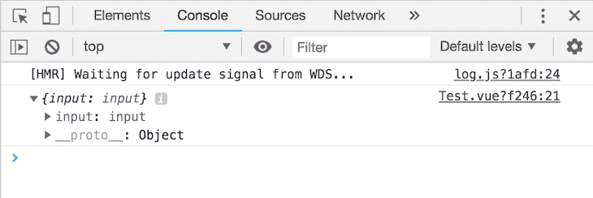
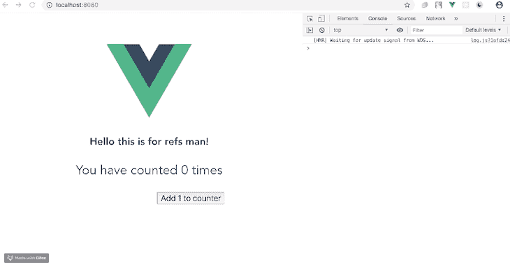
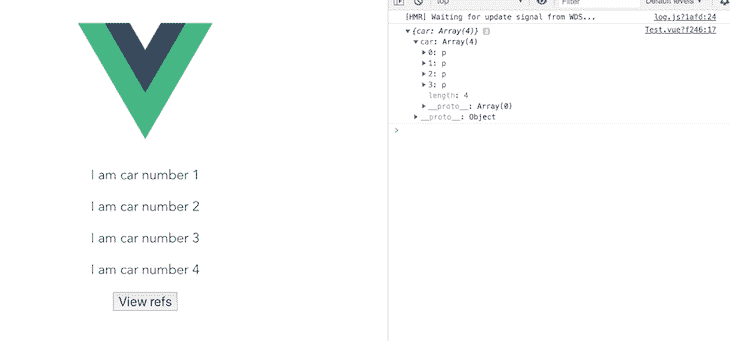

# 如何在 Vue.js 中使用 refs 访问应用程序 DOM

> 原文：<https://dev.to/bnevilleoneill/how-to-use-refs-to-access-your-application-dom-in-vue-js-jel>

[](https://res.cloudinary.com/practicaldev/image/fetch/s--SWaU6ctr--/c_limit%2Cf_auto%2Cfl_progressive%2Cq_auto%2Cw_880/https://thepracticaldev.s3.amazonaws.com/i/wm1j97ziwbjag4lwuois.jpeg)

Vue.js 是一个进步的 JavaScript 框架，由[尤雨溪](https://twitter.com/youyuxi?lang=en)和 Vue 核心团队创建，由 230 多名开源社区爱好者贡献。Vue 被超过 870，000 个项目使用，并在 GitHub 上被[加星 140，000 次。它是一个易于使用的核心库，只关注视图层。它还有一个庞大的支持库生态系统，可以帮助您轻松构建响应迅速的 web 体验。](https://github.com/vuejs/vue)

在这篇文章中，将向你介绍在 Vue.js 组件中引用 HTML 元素的方法。

## 先决条件

这篇文章适合使用 Vue 的所有阶段的开发者——包括初学者。在阅读本文之前，您应该已经具备了一些先决条件。

您将需要以下内容:

*   [node . js](https://nodejs.org/en/)10 . x 以上版本。通过在终端/命令提示符下运行`node -v`来验证您的版本
*   NPM 6.7 或更高版本
*   代码编辑器；我强烈推荐 Visual Studio 代码
*   Vue 的最新版本，全球安装在您的机器上
*   安装在您机器上的 Vue CLI 3.0。为此，首先使用`npm uninstall -g vue-cli`卸载旧版本的 CLI，然后使用`npm install -g @vue/cli`安装新版本
*   下载一个 [Vue starter 项目](https://github.com/viclotana/vue-canvas)
*   解压缩下载的项目，导航到其中，并运行`npm install`来保持所有的依赖项都是最新的

[](https://logrocket.com/signup/)

## 什么是参？

Refs 是 Vue 实例属性，用于注册或指示对应用程序模板中 HTML 元素或子元素的引用。

如果将 ref 属性添加到 Vue 模板中的 HTML 元素中，那么您将能够引用该元素，甚至是 Vue 实例中的子元素。您也可以直接访问 DOM 元素；它是一个只读属性，返回一个对象。

## 为什么裁判很重要？

ref 属性通过作为父属性`$ref`中的键，使包含它的 DOM 元素可选择，这是至关重要的。例如，将 ref 属性放在输入元素中会将父 DOM 节点暴露为`this.$refs.input`，或者您可以说是`this.refs["input"]`。

通过在特定元素的引用上定义方法，可以很容易地操作 DOM 元素。一个很好的例子是用`this` :
将焦点添加到输入元素

```
this.$refs["input"].focus() 
```

Enter fullscreen mode Exit fullscreen mode

这样，可以像 JavaScript 中的`document.querySelector('.element')`或 jQuery 中的`$('.element')`一样使用 refs。在 Vue.js 实例内部和外部都可以访问`$refs`。但是，它们不是数据属性，因此它们不是反应性的。

在浏览器的模板检查中，它们根本不会显示出来，因为它不是一个 HTML 属性；它只是一个 Vue 模板属性。

## 演示

如果您从一开始就关注了这篇文章，那么您应该已经下载了 starter 项目并在 VS 代码上打开了它。打开`components`文件夹，将其复制到`test.vue`文件:

```
<template>
  <div>
    <h2>Hello this is for refs man!</h2>
    <p>You have counted {{this.counter}} times</p>
    <input type="text" ref="input">
    <button @click="submit">Add 1 to counter</button>
  </div>
</template>
<script>
export default {
  name: 'Test',
  data(){
    return {
      counter: 0
    }
  },
  methods: {
    submit(){
      this.counter++;
      console.log(this.ref)
    }
  }
}
</script> 
```

Enter fullscreen mode Exit fullscreen mode

现在在您的开发服务器中运行这个命令:

```
npm run serve 
```

Enter fullscreen mode Exit fullscreen mode

您将看到用户界面显示了一个简单的计数器，单击它就会更新，但是当您在浏览器中打开开发人员工具时，您会注意到它记录了未定义的内容。

语法正确非常重要，因为这意味着 Vue 不会将此视为错误，但它确实是错误。根据我们已经知道的关于 Vue refs 的信息，它们返回一个对象，但是根据未定义的响应判断，有些地方是错误的。将下面的代码复制到`test.vue`文件:

```
<template>
  <div>
    <h2>Hello this is for refs man!</h2>
    <p>You have counted {{this.counter}} times</p>
    <input type="text" ref="input">
    <button @click="submit">Add 1 to counter</button>
  </div>
</template>
<script>
export default {
  name: 'Test',
  data(){
    return {
      counter: 0
    }
  },
  methods: {
    submit(){
      this.counter++;
      console.log(this.$refs)
    }
  }
}
</script> 
```

Enter fullscreen mode Exit fullscreen mode

当您运行并检查它时，您会注意到它现在返回一个对象:

[](https://res.cloudinary.com/practicaldev/image/fetch/s--tC8LTUAU--/c_limit%2Cf_auto%2Cfl_progressive%2Cq_auto%2Cw_880/https://i1.wp.com/blog.logrocket.com/wp-content/uploads/2019/07/running-test.vue-file.png%3Fresize%3D730%252C244%26ssl%3D1)

快速浏览一下代码块就会发现正确的语法:在模板内部它被称为`ref`，但是当我们在 Vue 实例中引用它时，它被称为`$refs`。这是非常重要的注意，以免得到未定义的返回。您可以访问被引用元素的每个可能的属性，包括模板中的元素。

让我们尝试记录一些我们可能感兴趣的属性。您的`test.vue`文件应该是:

```
<template>
  <div>
    <h2>Hello this is for refs man!</h2>
    <p>You have counted {{this.counter}} times</p>
    <input type="text" ref="input">
    <button @click="submit">Add 1 to counter</button>
  </div>
</template>
<script>
export default {
  name: 'Test',
  data(){
    return {
      counter: 0
    }
  },
  methods: {
    submit(){
      this.counter++;
      console.log(this.$refs)
    }
  }
}
</script>
<style scoped>
p , input, button{
  font-size: 30px;
}
input, button{
  font-size: 20px;
}
ul {
  list-style-type: none;
  padding: 0;
}
li {
  display: inline-block;
  margin: 0 10px;
}
a {
  color: #42b983;
}
</style> 
```

Enter fullscreen mode Exit fullscreen mode

浏览器上的应用程序应该如下所示:

[](https://res.cloudinary.com/practicaldev/image/fetch/s--usXmaojZ--/c_limit%2Cf_auto%2Cfl_progressive%2Cq_66%2Cw_880/https://i1.wp.com/blog.logrocket.com/wp-content/uploads/2019/07/test-application-browser.gif%3Fresize%3D730%252C382%26ssl%3D1)

### 显示元素

要显示 DOM 中的 HTML 元素，进入 submit 方法，将`methods`代码改为下面的代码:

```
methods: {
    submit(){
      this.counter++;
      console.log(this.$refs.input)
    }
  } 
```

Enter fullscreen mode Exit fullscreen mode

这里的输入是您之前在元素(`ref="input"`)中创建的引用名。它可以是您选择的任何名称。

### 显示输入值

要显示 HTML 元素输入值——在用户界面的文本框中输入的字符串——进入`submit`方法并将代码改为:

```
methods: {
    submit(){
      this.counter++;
      console.log(this.$refs.input.value)
    }
  } 
```

Enter fullscreen mode Exit fullscreen mode

这会准确地显示您输入的字符串，这显示了与普通 JavaScript 和 jQuery 也可以实现的查询选择的相似性。

### 显示元素的 URL

可以找到该元素的网页也是可以用 Vue ref 显示的许多内容之一。进入`submit`方法，将代码改为:

```
methods: {
    submit(){
      this.counter++;
      console.log(this.$refs.input.baseURI)
 }
} 
```

Enter fullscreen mode Exit fullscreen mode

从返回的对象信息中，您可以访问和记录许多其他内容。

### 处理条件句

Vue.js 引用也可以用在输出 DOM 中多个元素的元素内部，比如使用了`v-for`指令的条件语句。当被调用时，refs 返回一个项目数组，而不是对象。为了说明这一点，创建一个简单的列表，如下所示:

```
<template>
  <div>
    <p v-for="car in 4" v-bind:key="car" ref="car"> I am car number {{car}}</p>
    <button @click="submit">View refs</button>
  </div>
</template>
<script>
export default {
  name: 'Test',
  data(){
    return {
    }
  },
  methods: {
    submit(){
      console.log(this.$refs)
    }
  }
}
</script> 
```

Enter fullscreen mode Exit fullscreen mode

当您在开发服务器中再次运行它时，它将如下所示:

[](https://res.cloudinary.com/practicaldev/image/fetch/s--5XOjmL7C--/c_limit%2Cf_auto%2Cfl_progressive%2Cq_auto%2Cw_880/https://i0.wp.com/blog.logrocket.com/wp-content/uploads/2019/07/app-with-conditionals.png%3Fresize%3D730%252C341%26ssl%3D1)

你可以在 [GitHub 这里](https://github.com/viclotana/vue-refs)找到这个教程的完整代码。

## 结论

这篇文章向您展示了在 Vue.js 中引用 DOM 中的 HTML 元素。现在，您可以通过所有元素属性(如值、子节点、数据属性，甚至包含它的基本 URL)来访问和记录这些元素。

你也已经被介绍了你可以实现这一点的方法。值得注意的是，在初始化 Vue 实例和呈现组件之后，会填充 refs，因此不鼓励在计算属性中使用 refs，因为它能够直接操作子节点。黑客快乐！

* * *

## Plug: [LogRocket](https://logrocket.com/signup/) ，一款适用于网络应用的 DVR

[](https://logrocket.com/signup/)

[log rocket](https://logrocket.com/signup/)是一个前端日志工具，让你重放问题，就像它们发生在你自己的浏览器中一样。LogRocket 不需要猜测错误发生的原因，也不需要向用户询问截图和日志转储，而是让您重放会话以快速了解哪里出错了。它可以与任何应用程序完美配合，不管是什么框架，并且有插件可以记录来自 Redux、Vuex 和@ngrx/store 的额外上下文。

除了记录 Redux 动作和状态，LogRocket 还记录控制台日志、JavaScript 错误、stacktraces、带有头+体的网络请求/响应、浏览器元数据、自定义日志。它还使用 DOM 来记录页面上的 HTML 和 CSS，甚至为最复杂的单页面应用程序重新创建像素级完美视频。

[免费试用](https://logrocket.com/signup/)。

* * *

帖子[如何使用 refs 访问 Vue.js 中的应用程序 DOM](https://blog.logrocket.com/how-to-use-refs-to-access-your-application-dom-in-vue-js/)最先出现在[的 LogRocket 博客](https://blog.logrocket.com)上。