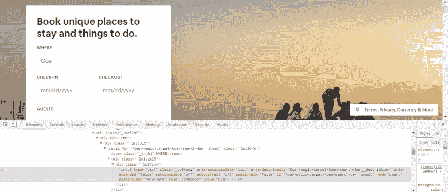
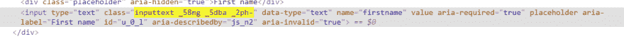
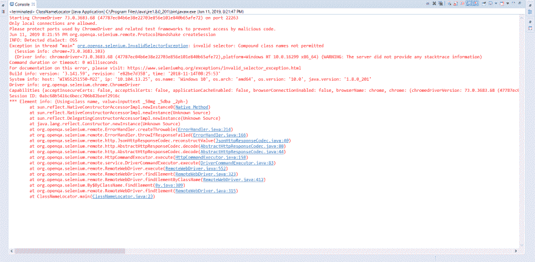
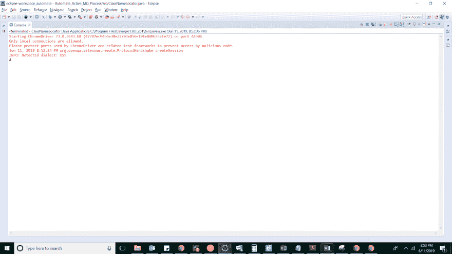

# Selenium Java 教程——Selenium 中的类名定位器

> 原文：<https://dev.to/lambdatest/selenium-java-tutorial-class-name-locator-in-selenium-11fa>

Selenium 中的 CSS 定位器是编写脚本最重要的方面之一。如果不能使用 Selenium 中的任何 CSS 定位器来定位元素，那么精通 Selenium 自动化将是一项艰巨的任务。硒提供了多种定位元素的方法。

您可以查看 Selenium 中关于不同 CSS 定位器的其他文章，Selenium 通过各种方式帮助定位元素:

*   [链接文本&硒中部分链接文本](https://www.lambdatest.com/blog/using-link-text-and-partial-link-text-in-selenium/)

*   [硒中的 ID 定位器](https://www.lambdatest.com/blog/making-the-move-with-id-locator-in-selenium-webdriver/)

*   [在 Selenium 中命名定位器](https://www.lambdatest.com/blog/how-to-use-name-locator-in-selenium-automation-scripts/)

*   [Selenium 中的标记名定位器](https://www.lambdatest.com/blog/locating-elements-by-tagname-in-selenium/)

*   [Selenium 中的 CSS 选择器](https://www.lambdatest.com/blog/how-pro-testers-use-css-selectors-in-selenium-automation-scripts/)

*   [硒中的 XPath](https://www.lambdatest.com/blog/complete-guide-for-using-xpath-in-selenium-with-examples/)

如果您是高级或中级 Selenium Java 实践者，那么您可以阅读上面提到的专门文章。我已经写了一个完整的指南来帮助您说明在 Selenium 中 CSS locator 的实际演示。

在这篇 Selenium Java 教程中，我将引用 Selenium 中的**类名定位器来演示如何通过类名定位网页上的元素。**

## Selenium 中的类名定位器入门示例

接下来，在这个 Selenium Java 教程中，我们将考虑 Airbnb 的场景，我们打算通过类名定位 Airbnb 主页的搜索表单中的‘Where’字段。下面是 Airbnb 页面的截图，我们在这里检查表单中的“where”字段。
图片:

[](https://res.cloudinary.com/practicaldev/image/fetch/s--kNkBf0JL--/c_limit%2Cf_auto%2Cfl_progressive%2Cq_auto%2Cw_880/https://cdn-images-1.medium.com/max/2730/0%2AMzw5nFAZQBCbT6sm.png)

为了在 Selenium 中使用类名定位器，我们需要使用下面的语法:
find element(by . Class name(" _ up 0 kwni "))

现在，让我们看看在定位器中通过类名查找元素的代码:

```
import java.util.concurrent.TimeUnit;

import org.openqa.selenium.By;
import org.openqa.selenium.WebDriver;
import org.openqa.selenium.chrome.ChromeDriver;

public class ClassNameLocator {

public static void main(String[] args) {
        // TODO Auto-generated method stub

        System.setProperty("webdriver.chrome.driver", ".\\ChromeDriver\\chromedriver.exe");
        WebDriver driver=new ChromeDriver();
        driver.manage().timeouts().implicitlyWait(20, TimeUnit.SECONDS);

        driver.manage().window().maximize();

        //Opening the air bnb home page
        driver.get("[https://www.airbnb.co.in/](https://www.airbnb.co.in/)");

        //Locating location field for the search  form via class name 
        driver.findElement(By.className("_up0kwni")).sendKeys("Goa", Keys.ENTER);

//Locating check-in field for the search  form via class name 
        driver.findElement(By.className("_14fdu48d")).click();

        //Locating the date 12th June for check-in field
        driver.findElement(By.className("_1wh4xpp1")).click();

        //closing the driver
        driver.quit();

}

} 
```

<svg width="20px" height="20px" viewBox="0 0 24 24" class="highlight-action crayons-icon highlight-action--fullscreen-on"><title>Enter fullscreen mode</title></svg> <svg width="20px" height="20px" viewBox="0 0 24 24" class="highlight-action crayons-icon highlight-action--fullscreen-off"><title>Exit fullscreen mode</title></svg>

很简单，不是吗？在接下来的 Java Selenium 教程中，我们将学习如何处理类名 Selenium locator 的常见异常。

[](https://res.cloudinary.com/practicaldev/image/fetch/s--DjAVmzHq--/c_limit%2Cf_auto%2Cfl_progressive%2Cq_auto%2Cw_880/https://cdn-images-1.medium.com/max/2000/0%2AKjjTXswyk66dRUUo.png)

## Selenium 中类名定位器最常见的异常之一

在 Selenium 中使用类名定位器时，您可能会遇到的另一个有趣的事实和一个常见的错误是:

[](https://res.cloudinary.com/practicaldev/image/fetch/s--Juj9sBr3--/c_limit%2Cf_auto%2Cfl_progressive%2Cq_auto%2Cw_880/https://cdn-images-1.medium.com/max/2266/0%2AMB4T_3O7QmVepSL1.png)

我敢肯定，你可能遇到过这个错误。让我们试着在下面脸书注册页面的代码片段中加入这个场景。下面是 facebook“名字”字段的 DOM 结构，其中类名属性在下面突出显示:

[](https://res.cloudinary.com/practicaldev/image/fetch/s--OcA-1bEu--/c_limit%2Cf_auto%2Cfl_progressive%2Cq_auto%2Cw_880/https://cdn-images-1.medium.com/max/2344/0%2AFaWGsiisb2sBDWBE.png)

引用的代码片段，尝试使用 Selenium 中的类名定位器访问名字字段:

```
import java.util.concurrent.TimeUnit;

import org.openqa.selenium.By;
import org.openqa.selenium.Keys;
import org.openqa.selenium.WebDriver;
import org.openqa.selenium.chrome.ChromeDriver;

public class ClassNameLocator {

public static void main(String[] args) throws InterruptedException {
        // TODO Auto-generated method stub

        System.setProperty("webdriver.chrome.driver", ".\\ChromeDriver\\chromedriver.exe");
        WebDriver driver=new ChromeDriver();
        driver.manage().timeouts().implicitlyWait(20, TimeUnit.SECONDS);

        driver.manage().window().maximize();

        //Opening the air bnb home page
        driver.get("[https://www.facebook.com/](https://www.facebook.com/)");

        //Locating by firstname via class name 
        driver.findElement(By.className("inputtext _58mg _5dba _2ph-")).sendKeys("Sadhvi");

        //closing the driver
        driver.quit();

}

} 
```

<svg width="20px" height="20px" viewBox="0 0 24 24" class="highlight-action crayons-icon highlight-action--fullscreen-on"><title>Enter fullscreen mode</title></svg> <svg width="20px" height="20px" viewBox="0 0 24 24" class="highlight-action crayons-icon highlight-action--fullscreen-off"><title>Exit fullscreen mode</title></svg>

下面引用了控制台错误:

[](https://res.cloudinary.com/practicaldev/image/fetch/s--ddPM8pZ9--/c_limit%2Cf_auto%2Cfl_progressive%2Cq_auto%2Cw_880/https://cdn-images-1.medium.com/max/3830/0%2Agauxu-oFQ0gkLJt9.png)

如何处理这个错误？Selenium 认为这是一个复合类，这意味着不止一个通过空格标记的类。因此，任何包含空格的类名都将被视为两个、三个或更多的类。

在这种情况下，这个标记为“inputtext _58mg _5dba _2ph-”的类名包含三个空格，从而使它成为三个不同的类。因此， **Selenium 提到了错误，指出它不能同时找到多个类**。在这种情况下，您可以选择通过 Selenium 中的 **CSS 选择器定位元素，或者使用**类名属性**通过 Selenium** 中的 **XPath 定位元素。下面引用的代码片段:**

```
import java.util.concurrent.TimeUnit;

import org.openqa.selenium.By;
import org.openqa.selenium.Keys;
import org.openqa.selenium.WebDriver;
import org.openqa.selenium.chrome.ChromeDriver;

public class ClassNameLocator {

public static void main(String[] args) throws InterruptedException {
        // TODO Auto-generated method stub

        System.setProperty("webdriver.chrome.driver", ".\\ChromeDriver\\chromedriver.exe");
        WebDriver driver=new ChromeDriver();
        driver.manage().timeouts().implicitlyWait(20, TimeUnit.SECONDS);

        driver.manage().window().maximize();

        //Opening the facebook home page
        driver.get("[https://www.facebook.com/](https://www.facebook.com/)");

        //Locating by firstname via class name 
        driver.findElement(By.xpath("//input[[@class](http://twitter.com/class)='inputtext _58mg _5dba _2ph-']")).sendKeys("Sadhvi");

        //closing the driver
        driver.quit();

}

} 
```

<svg width="20px" height="20px" viewBox="0 0 24 24" class="highlight-action crayons-icon highlight-action--fullscreen-on"><title>Enter fullscreen mode</title></svg> <svg width="20px" height="20px" viewBox="0 0 24 24" class="highlight-action crayons-icon highlight-action--fullscreen-off"><title>Exit fullscreen mode</title></svg>

***在[在线模拟器 android](https://www.lambdatest.com/android-emulator-online?utm_source=devto&utm_medium=organic&utm_campaign=sep01_sd&utm_term=sd&utm_content=webpage) 上测试你的网络和移动应用。确保您的应用程序兼容最新和传统的 Android 操作系统、设备和浏览器。***

## 当我们有多个元素共享同一个类名时，如何定位一个元素？

现在您知道了什么时候使用类名，什么时候不能使用类名。但是，您曾经想象过多个元素共享同一个类名的场景吗？你如何处理这种情况？这又是一件事，你可以简单地通过使用 **findElements 关键字**来实现。您需要做的就是，使用 findElements 关键字定位具有该类名的所有元素，并通过 index 遍历所需的元素类名。话虽如此，我宁愿建议寻找另一种定位该元素的方法，而不是这个方法。因为它的断裂倾向会相当高，并且可能导致错误。

[](https://res.cloudinary.com/practicaldev/image/fetch/s--bWbdWwGQ--/c_limit%2Cf_auto%2Cfl_progressive%2Cq_auto%2Cw_880/https://cdn-images-1.medium.com/max/2000/0%2AGhN1VGM7uYV03-2Z.png)

该认证是为那些希望在硒自动化测试领域保持领先地位的专业人士准备的。

以下是来自 LambdaTest 的 Selenium 101 认证的简要介绍:

[https://www.youtube.com/embed/qx9FPFfJm7E](https://www.youtube.com/embed/qx9FPFfJm7E)

***在[在线安卓模拟器](https://www.lambdatest.com/android-emulator-online?utm_source=devto&utm_medium=organic&utm_campaign=sep01_sd&utm_term=sd&utm_content=webpage)上测试你的网络和移动应用。确保您的应用程序兼容最新和传统的 Android 操作系统、设备和浏览器。***

## Selenium 中具有相似类名的多个元素的类名定位器示例

让我们考虑下面的例子，突出上面的场景。在这种情况下，我们考虑 LinkedIn 注册页面，其中所有字段共享相同的类名。在这种情况下，我们需要注意两件重要的事情:

*   如果没有定义索引，那么缺省情况下 selenium 选择它遇到的第一个具有该类名的元素。在下面的代码片段中，它找到了第一个元素，即名字:

    ```
    import java.util.concurrent.TimeUnit;
    import org.openqa.selenium.By;
    import org.openqa.selenium.Keys;
    import org.openqa.selenium.WebDriver;
    import org.openqa.selenium.chrome.ChromeDriver;

    public class ClassNameLocator {

    public static void main(String[] args) throws InterruptedException {
            // TODO Auto-generated method stub

            System.setProperty("webdriver.chrome.driver", ".\\ChromeDriver\\chromedriver.exe");
            WebDriver driver=new ChromeDriver();
            driver.manage().timeouts().implicitlyWait(20, TimeUnit.SECONDS);

            driver.manage().window().maximize();

            //Opening the linkedin sign up home page
            driver.get("[https://www.linkedin.com/start/join](https://www.linkedin.com/start/join)");

            //Locating by firstname via class name 
            driver.findElement(By.className("cell-body-textinput")).sendKeys("Sadhvi");

            //closing the driver
            driver.quit();

    }

    } 
    ```

注意:看一下类名，在本例中是 cell-body-textinput，因为它没有用空格标记，所以被认为是一个单独的类。

*   使用索引定位具有相同类名的不同元素。下面引用的片段:

    ```
    import java.util.List;
    import java.util.concurrent.TimeUnit;
    import org.openqa.selenium.By;
    import org.openqa.selenium.Keys;
    import org.openqa.selenium.WebDriver;
    import org.openqa.selenium.WebElement;
    import org.openqa.selenium.chrome.ChromeDriver;

    public class ClassNameLocator {

    public static void main(String[] args) throws InterruptedException {
            // TODO Auto-generated method stub

            System.setProperty("webdriver.chrome.driver", ".\\ChromeDriver\\chromedriver.exe");
            WebDriver driver=new ChromeDriver();
            driver.manage().timeouts().implicitlyWait(20, TimeUnit.SECONDS);

            driver.manage().window().maximize();

            //Opening the air bnb home page
            driver.get("[https://www.linkedin.com/start/join](https://www.linkedin.com/start/join)");

            //Locating by firstname via class name 
            List signUpForm=driver.findElements(By.className("cell-body-textinput"));

            //finding the number of elments with the same class name
            int size=signUpForm.size();

            System.out.print(size);

            //locating the first name locator
            signUpForm.get(0).sendKeys("Sadhvi");

            //locating the last name locator
            signUpForm.get(1).sendKeys("Singh");

    //locating the email  locator
            signUpForm.get(2).sendKeys("[sadhvisingh24@gmail.com](mailto:sadhvisingh24@gmail.com)");

            //locating the password  locator
            signUpForm.get(3).sendKeys("password");

            //closing the driver
            //driver.quit();

    }

    } 
    ```

**控制台输出:**

[](https://res.cloudinary.com/practicaldev/image/fetch/s--QIkHZeP---/c_limit%2Cf_auto%2Cfl_progressive%2Cq_auto%2Cw_880/https://cdn-images-1.medium.com/max/3200/0%2A5d8ul2V0pCiOMmIi.png)

宾果，你现在可以走了。这都是关于 Selenium 中的类名定位器。

***在[安卓在线模拟器](https://www.lambdatest.com/android-emulator-online?utm_source=devto&utm_medium=organic&utm_campaign=sep01_sd&utm_term=sd&utm_content=webpage)上测试你的网络和移动应用。确保您的应用程序兼容最新和传统的 Android 操作系统、设备和浏览器。***

## 关于 Selenium 中的类名定位器，我们学到了什么？

好了，这就是今天 Selenium 中 CSS locator 的 Selenium Java 教程。我相信到目前为止，您已经对如何有效地使用 Selenium 中的类名定位器有了深刻的理解。我们遇到了在 Selenium 中实现类名定位器时最常见的错误。我们还学习了如何克服多个元素共享相似类名的复杂场景。如果你是硒的新手。你可以看看这篇关于 Selenium Java 入门的教程。再见，测试愉快！🙂