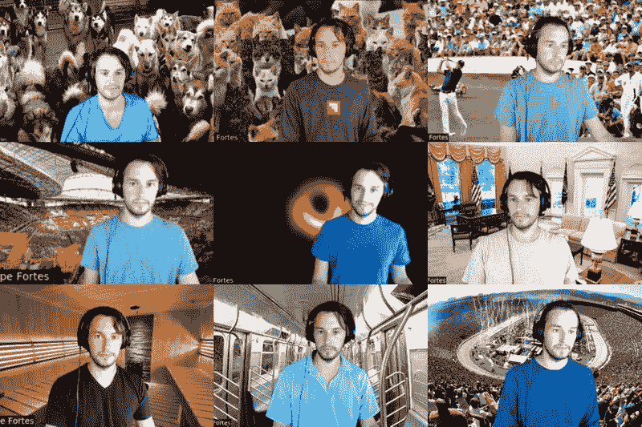
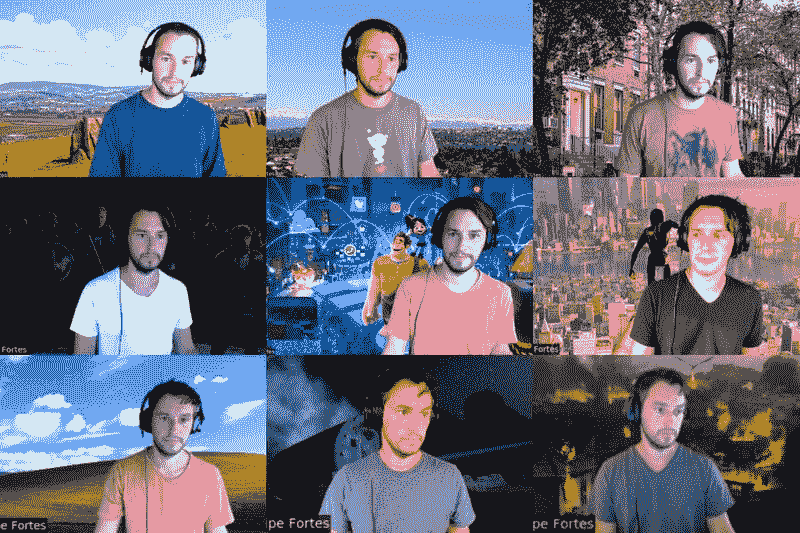
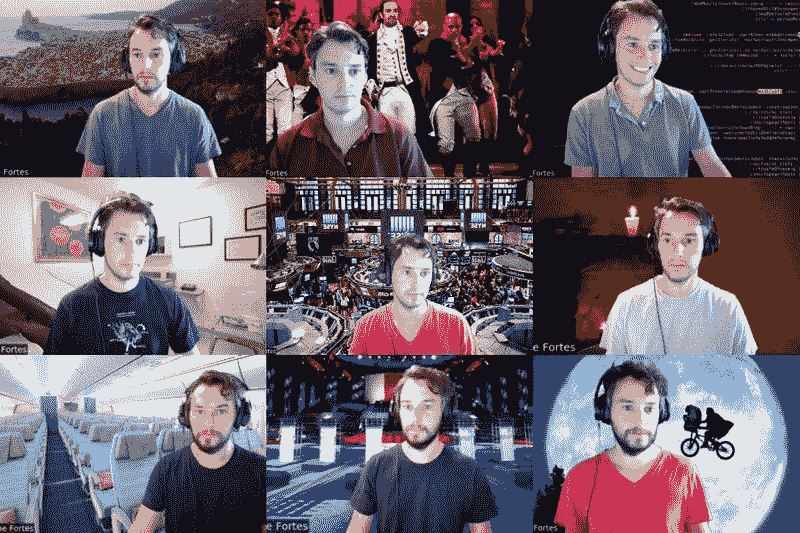

# 在任何地方工作

> 原文：<https://dev.to/fortesdotcom/working-from-everywhere-25f6>

在过去的一年半里，我一直在为 [Coda](https://coda.io) 远程工作。幸运的是，由于该公司已经在加利福尼亚州和华盛顿州设立了办事处，这种方式运行良好。

Coda 非常依赖视频会议，我们使用 Zoom，它有一个[虚拟背景功能](https://support.zoom.us/hc/en-us/articles/210707503-Virtual-Background)，让你选择一个自定义图像作为背景，绝对欺骗你所有的同事，让他们认为你实际上不是在家工作(假设你的同事像我一样容易受骗)。

Zoom 使用色度键合成来添加虚拟背景，这种背景在绿色背景下效果最佳，因为它与非火星人的肤色不匹配。我不喜欢半途而废，所以我决定全力以赴，花大约 70 美元买一个[绿屏](https://amzn.to/2Ye3h4O)和[支架](https://amzn.to/32rIjip)，以便添加使最真实的虚拟场景成为可能。

这种设置相对来说没什么痛苦，可以在几分钟内完成，就像一个英俊的匿名模特展示的那样:

[https://www.youtube.com/embed/x0DWXTz-Kew](https://www.youtube.com/embed/x0DWXTz-Kew)

每隔一段时间，我都会记得对我用过的背景进行截屏。我在这里收集了一些(我会尝试更新这些，但不保证):

<figure></figure>

<figure></figure>

<figure></figure>

对即将到来的背景有什么建议吗？让我知道！