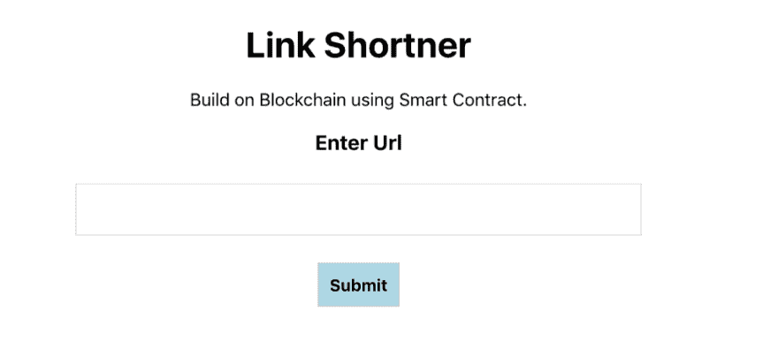
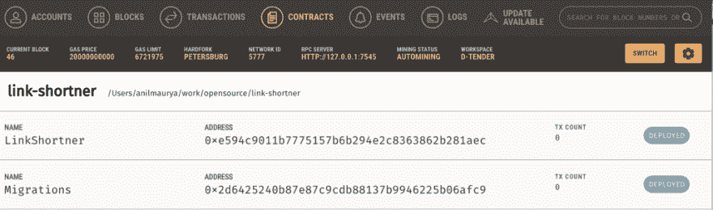

# 使用块菌在以太坊区块链建造分散式链路缩短器

> 原文：<https://dev.to/anilmaurya/building-decentralised-link-shortner-on-ethereum-blockchain-using-truffle-18i0>

<figure>[](https://res.cloudinary.com/practicaldev/image/fetch/s--KRcfE1cx--/c_limit%2Cf_auto%2Cfl_progressive%2Cq_auto%2Cw_880/https://cdn-images-1.medium.com/max/1024/1%2Ask-QwadTmfhVunslJvQ6vA.png)

<figcaption></figcaption>

</figure>

区块链是新兴技术，无需介绍。万一你被落在后面，不知道区块链，那么我建议在阅读这篇文章之前先阅读一下区块链。你可以在这里阅读关于区块链[的文章，或者在这里](https://blockgeeks.com/guides/what-is-blockchain-technology/)阅读关于 T2 的文章，或者在网上搜索，你会找到大量可供阅读的文章。

**以太坊是什么？**

以太坊于 2015 年推出，是世界领先的可编程区块链。它是一个面向分散应用程序的全球性开源平台。这些分散的应用程序(或“dapps”)受益于加密货币和区块链技术。点击阅读更多关于以太坊[的内容。](https://www.ethereum.org)

**什么是松露？**

[松露](https://truffleframework.com/)是区块链开发的一个框架，它将**智能合约** *创建**编译**测试*，以及*部署*到以太坊上。在这里阅读更多关于松露的信息

**什么是去中心化 App？**

分散式应用不需要集中式服务器工作(因此没有维护成本)。它与部署在区块链网络上的智能合同进行交互。

**什么是智能合同？**

智能合约是在以太坊状态下控制账户行为的程序。我们将用 Solidity 语言编写智能合同，Solidity 是一种面向对象的高级语言，用于实现智能合同。从[这里](https://solidity.readthedocs.io/en/v0.5.10/)阅读更多关于可靠性的内容。

**入门:**

a)安装 npm、节点和块材

按照[https://docs . npmjs . com/downloading-and-installing-node-js-and-NPM](https://docs.npmjs.com/downloading-and-installing-node-js-and-npm)安装 npn &节点。

然后安装松露

```
npm install -g truffle 
```

检查块菌安装是否成功

```
$ truffle version
Truffle v5.0.21 (core: 5.0.21)
Solidity v0.5.0 (solc-js)
Node v11.0.0
Web3.js v1.0.0-beta.37 
```

b)创建项目

为项目创建新的文件夹，并用 truffle 初始化。我们将使用[反应真实波](https://www.trufflesuite.com/boxes/react) x

```
$ mkdir link\_shortner
$ cd link\_shortner/
$ truffle unbox react
✔ Preparing to download
✔ Downloading
✔ Cleaning up temporary files
✔ Setting up box

Unbox successful. Sweet!

Commands:

Compile: truffle compile
  Migrate: truffle migrate
  Test contracts: truffle test 
```

如果你是 Truffle 的新手，那么请从[https://www . Truffle suite . com/docs/Truffle/getting-started/creating-a-project](https://www.trufflesuite.com/docs/truffle/getting-started/creating-a-project)阅读关于创建目录的内容

c)在本地机器[https://www.trufflesuite.com/docs/ganache/overview](https://www.trufflesuite.com/docs/ganache/overview)上安装用于区块链设置的 Ganache

**Link Shortner 智能合约**

在 *contracts/* 文件夹下创建 LinkShortner.sol 文件，并在其中写入以下内容。

```
pragma solidity ^0.5.0;

contract LinkShortner {
  event LinkAdded(uint linkId, string url);
  uint lastLinkId;

struct LinkTemplate {
  address userAddress;
  string url;
 }

mapping (uint => LinkTemplate) public linkMapping;

constructor() public {
  lastLinkId = 0;
 }

function createNewLink(string memory url) public returns (uint, string memory) {
   lastLinkId++;
  linkMapping[lastLinkId] = LinkTemplate(msg.sender, url);
    emit LinkAdded(lastLinkId, url);
  return(lastLinkId, url);
 }

function getLink(uint linkId) public view returns(address, string memory) {
  LinkTemplate memory link = linkMapping[linkId];
  return(link.userAddress, link.url);
 }

function getLastLink() public view returns(address, string memory, uint) {
  LinkTemplate memory link = linkMapping[lastLinkId];
  return(link.userAddress, link.url, lastLinkId);
 }

} 
```

现在在本地区块链网络上部署该合同:

```
$ truffle compile
$ truffle migrate 
```

<figure>[](https://res.cloudinary.com/practicaldev/image/fetch/s--84DbSoVD--/c_limit%2Cf_auto%2Cfl_progressive%2Cq_auto%2Cw_880/https://cdn-images-1.medium.com/max/1024/1%2AwZ0QsuCLcaaLyTitaoTH8A.png) 

<figcaption>Ganache 合同部署后截图</figcaption>

</figure>

**React 应用与智能合约的交互**

打开 client/src/App.js 文件

替换

```
import SimpleStorageContract from "./contracts/SimpleStorage.json"; 
```

用

```
import SimpleStorageContract from "./contracts/LinkShortner.json"; 
```

创建新链接

```
contract.methods.createNewLink(this.state.url).send({ from: accounts[0] }) 
```

安装[金属掩模](https://metamask.io)镀铬延伸件

并运行 React app

```
cd client
npm run start 
```

**在 Ropsten 测试网络**上部署合同

```
- Register new account on infura.io
- Create new project
- Get project api and connection link:
ROPSTEN\_URL=https://ropsten.infura.io/v3/<your-api-key> 
```

转到 Truffle 项目，安装 truffle-hdwallet-provider

```
npm install truffle-hdwallet-provider — save 
```

创建`.env`文件，将助记符和 _URL 放入文件

```
MNEMONIC=wallet mnemonic 12 words
ROPSTEN\_URL=https://ropsten.infura.io/v3/<your-api-key> 
```

用以下内容更新 truffle-config

```
const path = require("path");
require('dotenv').config()
const HDWalletProvider = require('truffle-hdwallet-provider')
const MNEMONIC = process.env.MNEMONIC
const ROPSTEN\_URL = process.env.ROPSTEN\_URL

module.exports = {
  // See <[http://truffleframework.com/docs/advanced/configuration](http://truffleframework.com/docs/advanced/configuration)>
  // to customize your Truffle configuration!
  contracts\_build\_directory: path.join(\_\_dirname, "client/src/contracts"),
  networks: {
    ropsten: {
      provider: function() {
        return new HDWalletProvider(MNEMONIC, ROPSTEN\_URL);
      },
      network\_id: '3',
    },
    development: {
      host: "127.0.0.1",
      port: 7545,
      network\_id: "\*",
   },
   test: {
     host: "127.0.0.1",
     port: 7545,
     network\_id: "\*",
  }
 }
}; 
```

运行以下命令部署

```
truffle migrate --network ropsten 
```

**Sinatra 用于阅读以太坊网络上短链接的 API**

创建文件夹后端

在 backend/app.rb 中添加以下内容

```
# Require the bundler gem and then call Bundler.require to load in all gems
# listed in Gemfile.
require 'bundler'
Bundler.require

require 'sinatra'
require 'ethereum'

before do
  content\_type 'application/json'
end

class Contract
  def initialize
[@client](http://twitter.com/client) = Ethereum::HttpClient.new("[https://ropsten.infura.io/v3/](https://ropsten.infura.io/v3/ebcc6fb682fd49a589e84d8a2360cbf0)<API-KEY>")
    contract\_json = JSON.parse(File.read('LinkShortner.json'))
[@contract\_abi](http://twitter.com/contract_abi) = contract\_json['abi']
[@address](http://twitter.com/address) = contract\_json["networks"]["3"]["address"]
[@client](http://twitter.com/client).default\_account = "0x3b8B0b23C4850FA8289da815a6abEE4Fc2DF941A"
  end

def result(id)
    return nil unless id
    contract\_instance.call.get\_link(id.to\_i)[1]
  end

def contract\_instance
    Ethereum::Contract.create(name: "LinkShortner", address: [@address](http://twitter.com/address), abi: [@contract\_abi](http://twitter.com/contract_abi),
                              client: [@client](http://twitter.com/client))
  end
end
class App < Sinatra::Base
  get '/url' do
    response.headers["Access-Control-Allow-Origin"] = "\*"
    return {url: Contract.new.result(params[:id])}.to\_json
  end
end 
```

在 heroku 上部署 Sinatra API

```
heroku create
heroku buildpacks:set [https://github.com/timanovsky/subdir-heroku-buildpack](https://github.com/timanovsky/subdir-heroku-buildpack)
heroku buildpacks:add heroku/ruby
heroku config:set PROJECT\_PATH=backend
git push heroku master 
```

**现在使用部署的 API 来读取短链接**

```
fetch("https://<heroku-app-url>/url?id="+id).then((response) => {
  return response.json();
}).then((response) => {
  const url = response.url
  console.log(url)
}) 
```

就这样，现在你已经把你的 link shortner 分散式应用程序部署在以太坊网络上了。生成的短链接可以与任何人共享，而不考虑浏览器。创建短链接[需要元掩码](https://metamask.io)插件。

代码托管在 [**github**](https://github.com/anilmaurya/link-shortner)

应用托管在[http://anilmaurya.github.io/link-shortner](http://anilmaurya.github.io/link-shortner)

[https://www.youtube.com/embed/O0lsTIwUVk8](https://www.youtube.com/embed/O0lsTIwUVk8)

参考资料:

[https://medium . com/@ nhancv/deploy-smart-contract-with-truffle-79 d2bf 218332](https://medium.com/@nhancv/deploy-smart-contract-with-truffle-79d2bf218332)

[https://hacker noon . com/making-a-decentralized-URL-shortener-using-ether eum-4 fdfccf 712 a 6](https://hackernoon.com/making-a-decentralized-url-shortener-using-ethereum-4fdfccf712a6)