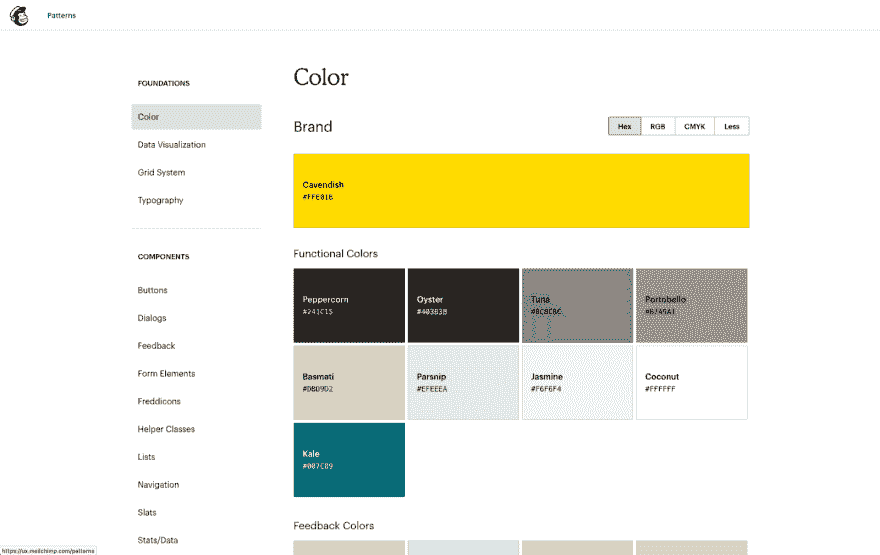
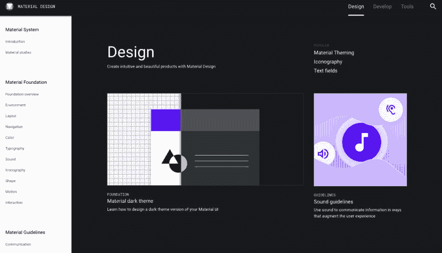
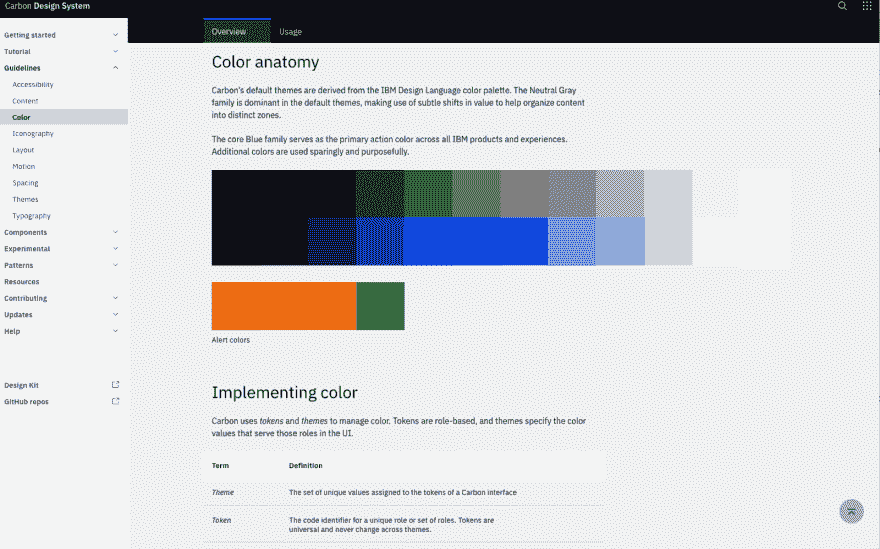
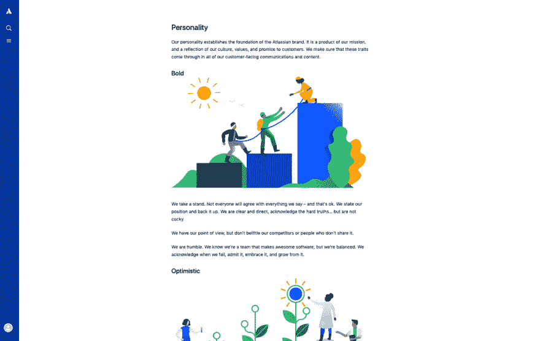

# 设计系统(第一部分:基础)

> 原文：<https://dev.to/emmabostian/design-systems-part-i-foundations-45hd>

网络是由一组相互连接的页面组成的，并从历史上人们消费内容的方式中发展起来:通过书籍。由于书籍将内容格式化为一系列页面，所以网页利用这种熟悉的模式是很自然的。于是，网页诞生了。

其他技术术语源于印刷书籍:书签和分页就是两个这样的例子。虽然传统的网页概念已经运作了几十年，但我们很快意识到这种模式不再适用于构建可持续的 web 应用程序。

许多公司正处于通过使用可重用组件向更模块化的 web 应用程序进行范式转换的阵痛中。尽管模块化 web 应用程序更具可扩展性和可测试性，但它们也带来了一些挑战。

构建组件库是很好的实践，只要一个组织内的所有团队都在开发和使用一个库；不幸的是，情况往往并非如此。更有可能你会看到多个团队在不同的地方构建同一个组件；这是应用程序不一致的催化剂。

这是设计系统的闪光点。设计系统允许整个组织中的团队定义他们自己的身份，并将其转化为可访问的和一致的组件。这些随后被产品团队使用，并对产品的成功有着不可估量的影响。

让我们深入研究一些设计系统的基础知识，并了解您的团队如何采用它们来构建可访问的、可伸缩的和一致的产品。

# 什么是设计系统？

设计系统是一套可重复使用的标准和组件，它们强化了品牌的身份。这些标准和组件允许团队有效地构建关于可访问性、性能、一致性和品牌的用户界面。

虽然业界还没有正式定义一个设计系统，但一般来说它由三个方面组成:一个*设计语言*、一个*组件库*和一个*风格指南*。稍后我们将深入探讨这些领域。

# 设计系统的好处

建立设计体系有很多好处。以下是一些好处。

### 可达性

设计系统将可访问性融入到设计语言和组件库中，最终确保每个客户都能使用你的产品，并获得相同的结果。

通过设计语言，我们可以确保调色板有足够的对比度，字体大小清晰可辨，内容易于消化。

这些设计语言模式是构建组件库的基础，确保我们利用语义 HTML 元素。当 HTML 不够用时，我们引入 WAI-ARIA 来填补空白。可及性不再是事后的想法。

### 涓滴式更新

当一个设计模式被更新时，开发人员不再需要费力地在多个地方更新组件。设计系统为组件和模式提供了一个真实的来源。因此，样式只能在一个地方更新。然后，只需对库包版本进行快速更新，这些更改就会传播到产品中。

### 反应灵敏

组件库是为响应而构建的。它们说明了不同的屏幕分辨率和视窗。

### 一致性

可以说，设计系统最重要的好处之一就是一致性。随着开发一个产品的团队数量的增加，UI 保持一致。

### 易上手

拥有一个设计系统可以为新团队成员提供一个学习的真实来源，从而显著减少他们的入职时间。通过在一个容易找到的位置提供全面的文档，我们减少了开始一项新工作的压力。

此外，当使用一个组件库时，开发人员和设计人员可以很容易地跨团队协作。

### 提高了开发速度

一旦组件库有了稳定的版本，开发速度将会大大提高。

开发人员将不再负担从零开始构建组件，并确保它们是可访问的和可响应的。他们将能够简单地导入和利用这些组件。

# 设计系统的弊端

虽然设计系统有很多好处，但也有一些缺点。下面是一些最常见的。

### 消耗时间

设计系统不是一夜之间建成的。通常他们需要几个月到几年的时间来构建一个稳定的版本。

此外，设计系统永远不会“完成”在系统生命周期中，会有一些点主要关注于维护而不是主动开发。虽然这些维护周期占用较少的设计师和开发人员资源，但最终的现实是设计系统是产品，而不是项目；他们必须被培养才能生存。

### 大额、预先承诺

一个成功的系统必须有设计者和开发者的前期投资。缺乏专用资源通常会导致系统故障。

### 产品团队买入

产品团队是设计系统的主要利益相关者。没有他们的认同和支持，一个系统不可能成功。

# 谁是建筑设计系统？

有许多受人尊敬的公司采用了设计系统的范例。系统的优势正得到更广泛的认可，促使行业领导者为采用铺平道路。

下面是一些最广为人知的正在开发的设计系统。

### Mailchimp

Mailchimp 是一款流行的电子邮件营销工具。他们开发了一套全面的设计系统。

他们甚至出版了单独的[内容风格指南](https://styleguide.mailchimp.com/)来帮助他们的员工以 Mailchimp 的形象制作产品。

### 材料设计

谷歌[材料设计](https://material.io/design/)是迄今为止最著名的系统之一。风格指南不仅包括颜色和图标等基础，而且他们的[组件库](https://material.io/develop/)服务于 iOS、web、Android 和 Flutter。

### IBM 碳

IBM [Carbon](https://www.carbondesignsystem.com/) 是另一个受人尊敬的设计系统。它们在 React、Vue、Angular，当然还有 vanilla JavaScript 中提供组件。

### 亚特兰蒂斯人

Atlassian 的[设计系统](https://www.atlassian.design/guidelines/brand/color)位于一个漂亮的风格指南中。他们为品牌、身份和形象提供了许多资源。

* * *

我希望第一部分成为设计系统的坚实基础。第二部分将深入讨论设计语言。请随时让我知道你对下面设计系统的想法。

所有图片均由 [unDraw](https://undraw.co/illustrations) 提供。