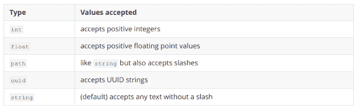

# 烧瓶教程完整的烧瓶初学者教程

> 原文：<https://dev.to/gajesh/the-complete-flask-beginner-tutorial-124i>

## 什么是烧瓶？

根据 flask 的网站，Flask 是一个基于 Werkzeug、Jinja 2 和 good intentions 的 Python 微框架。简单来说，它是一个基于 python 的框架，用于构建 web 应用程序。

但是这个 Werkzeug ( [怎么发音呢？](https://en.wiktionary.org/wiki/Werkzeug))和金佳？

Werkzeug:它是最先进的 WSGI ( [Web 服务器网关接口](https://en.wikipedia.org/wiki/Web_Server_Gateway_Interface))模块之一，包含各种工具和实用程序，有助于 Web 应用程序的开发。Flask 是基于 WSGI 接口的。

Jinja 2:是一个模板渲染引擎。它使用 web 服务器提供给它的任何指定的自定义内容为服务器呈现网页。我们将在本系列的后面部分详细讨论 Jinja。

## 为什么要烧瓶，可以用它做什么？

flask 的微框架并不意味着它只能做很少的事情或者提供很少的功能。这意味着它更具可扩展性，让你可以自由选择和决定要使用的自定义扩展和插件。这很有帮助，我们将在下一部分的用户管理中看到这一点。(登录、注册、修改密码等。).与 Django 等其他 Python web 框架相比，Flask 更加灵活，但正确工作的责任在于您，因为没有太多规则或做事的“Flask 方式”。

## 基本实现

烧瓶的最佳指南是[烧瓶文档](http://flask.pocoo.org/docs/1.0)本身。它有大多数问题的答案，我不得不承认，就细节和写作的清晰度而言，它是最好的开源项目之一。您可以阅读文档以获得深入的报道。

您可以在一个文件中创建一个 flask 应用程序，如下所述。即使对初学者来说，编写代码也很容易。我假设您已经安装了 Python 3 并让它正常工作。如果没有，你可以谷歌一下，找到一些好的教程，用你关心的操作系统来做。

## 设置虚拟环境

为了开始这个项目的工作，我们必须做一些基本的设置，这样我们才能顺利进行。除非您知道如何设置虚拟环境和运行 Flask，否则请不要跳过这些步骤。

创建一个虚拟环境，这样就不会弄乱系统上现有的 python 库和函数。为了做到这一点，

1.  我们将使用`virtualenv`为这个项目管理一个单独的虚拟环境。这将有助于我们避免项目间依赖关系的冲突。

2.  使用命令`pip3 install virtualenv`在您的系统中安装`virtualenv`。

3.  移动到项目文件夹，键入命令`virtualenv venv`以创建一个名为`venv`的虚拟环境，这将创建一个名为`venv`的文件夹，其中将有我们将需要的所有 python 可执行文件，以开始在一个独立的项目环境中工作，而不干扰现有的系统设置和其他库的依赖性。

4.  记得将`venv`添加到您的。gitignore 文件，这样它就不会被写入源代码控制。(说白了就是简单的话，它不会出现在你的 Github 上)

5.  您还可以通过运行命令`virtualenv -p /usr/bin/python3.6 venv`来更改您正在使用的 python 解释器。请这样做，因为我们将在本教程的剩余部分使用 Python 3。

6.  要启动虚拟环境，您可以键入`source venv/bin/activate`,请记住每次您想要在项目上工作时都要运行它。当虚拟环境被激活时，你的 shell 提示符看起来会像下面这样
    `(venv) yourusername@yourcomputername:~/Flask_project$`

7.  完成项目后，不要忘记通过键入`deactivate`来取消激活

8.  您现在可以使用命令`pip3 install Flask`在虚拟环境中安装 Flask。它还会引入一些正常工作所需的依赖关系。您可以将所有的 pip 包保存在一个名为`requirements.txt`的文件中

现在我们已经创建了一个虚拟环境，并安装了 flask，我们可以开始编写代码了。下面是运行一个简单 web 应用程序的系统，该应用程序显示 Hello world。这直接来自于 [Flask 的文档](http://flask.pocoo.org/docs/1.0/quickstart/)。

```
from flask import Flask
app = Flask(__name__)
​
@app.route(‘/’)
def hello_world():
   return ‘Hello, World!’ 
```

<svg width="20px" height="20px" viewBox="0 0 24 24" class="highlight-action crayons-icon highlight-action--fullscreen-on"><title>Enter fullscreen mode</title></svg> <svg width="20px" height="20px" viewBox="0 0 24 24" class="highlight-action crayons-icon highlight-action--fullscreen-off"><title>Exit fullscreen mode</title></svg>

将它保存在一个名为 application.py 的文件中(文件名可以是任何名称)，然后转到命令行并键入(在键入每行命令后按 enter】

```
export FLASK_APP=application.py
flask run 
```

<svg width="20px" height="20px" viewBox="0 0 24 24" class="highlight-action crayons-icon highlight-action--fullscreen-on"><title>Enter fullscreen mode</title></svg> <svg width="20px" height="20px" viewBox="0 0 24 24" class="highlight-action crayons-icon highlight-action--fullscreen-off"><title>Exit fullscreen mode</title></svg>

如果您使用的是 Windows，您可以执行以下操作，

1.  如果 Powershell : `PS C:\path\to\app> $env:FLASK_APP = "application.py"`
2.  如果命令提示:`C:\path\to\app>set FLASK_APP=application.py`

然后键入`flask run`

它将显示类似于
的控制台输出

```
* Serving Flask app "application.py"
 * Environment: production
   WARNING: Do not use the development server in a production environment.
   Use a production WSGI server instead.
 * Debug mode: off
 * Running on http://127.0.0.1:5000/ (Press CTRL+C to quit)
127.0.0.1 - - [18/Jan/2019 23:56:53] "GET / HTTP/1.1" 200 -
127.0.0.1 - - [18/Jan/2019 23:56:54] "GET /favicon.ico HTTP/1.1" 404 
```

<svg width="20px" height="20px" viewBox="0 0 24 24" class="highlight-action crayons-icon highlight-action--fullscreen-on"><title>Enter fullscreen mode</title></svg> <svg width="20px" height="20px" viewBox="0 0 24 24" class="highlight-action crayons-icon highlight-action--fullscreen-off"><title>Exit fullscreen mode</title></svg>

您现在可以前往`http://127.0.0.1:5000/`查看您的第一个 web 应用程序。

## 一些基本术语

第一行从库中导入 Flask，下一行创建一个变量名并使用 Flask 类实例化应用程序。
下一行`@app.route('/')` ( `/`表示主页)被称为路由，用于在用户访问特定 URL 时将用户重定向到特定页面或执行特定功能。

**示例** : `@app.route('/login')`重定向到登录页面。我们将在后面介绍许多其他路线和标签。

代码的其余部分显示 Hello world。但是这个方法可以做你想让它做的任何事情。

```
def hello_world():
    return 'Hello, World!' 
```

<svg width="20px" height="20px" viewBox="0 0 24 24" class="highlight-action crayons-icon highlight-action--fullscreen-on"><title>Enter fullscreen mode</title></svg> <svg width="20px" height="20px" viewBox="0 0 24 24" class="highlight-action crayons-icon highlight-action--fullscreen-off"><title>Exit fullscreen mode</title></svg>

您可以创建您的路线，并指定当特定路线被调用时函数应该做的事情。

### 有提示:

每次运行 flask 项目时都运行`export FLASK_APP=application.py`是相当令人恼火的。要解决这个问题，您可以将这一行添加到您的`~/.bashrc` (Linux)或`~/.bash_profile` (Mac)中，并保存它，以便下次您不必重新运行导出命令。但是请记住，如果您在您的项目中更改了文件名`application.py`，您将不得不更改`bashrc`文件中的文件名。为了启用所有的开发特性，您还可以向`export FLASK_ENV=development`添加 bash 文件。

## 在 Flask 中使用路线、模板和会话

### 烧瓶中的路线

路线是网站上用户访问的地方。它也就是通常所说的 URL ( [统一资源定位符](https://en.wikipedia.org/wiki/URL))。重要的是要有有意义的 URL，让用户能够容易地记住和重新访问网站。这也有助于搜索引擎优化。

Flask 使用方法`route()`将函数绑定到 URL。每当用户访问一个 URL 时，附加到它的方法就会执行。

```
@app.route("/")
def home_page():
    # '/' takes user to home page
@app.route("/login")
def login_page():
    # Process login
    return result 
```

<svg width="20px" height="20px" viewBox="0 0 24 24" class="highlight-action crayons-icon highlight-action--fullscreen-on"><title>Enter fullscreen mode</title></svg> <svg width="20px" height="20px" viewBox="0 0 24 24" class="highlight-action crayons-icon highlight-action--fullscreen-off"><title>Exit fullscreen mode</title></svg>

Flask 支持不同类型的可变结构。您还可以在 URL 中包含自定义字符串、整数和其他类型的字符，并显示它们的相关结果。

值类型在 [Flask 文档](http://flask.pocoo.org/docs/1.0/quickstart/#variable-rules)中。我在这里转载了一下。
T3T5】

您可以创建带有尖括号(<>)和冒号(:)的自定义 URL，如下图所示。

```
@app.route("/user/<name>")
def display_user(name):
    # A string of any length(without slashes) can be assigned to the variable name. 
    print(name)

@app.route("/total/<int:amount>")
def display_total_amount(amount):
    # Amount holds the value in int(Only Positive Integers). No other charcter accepted.
    print(amount)

@app.route("/path/<path:sub_path>")
def take_to_subpath(sub_path):
    # Accepts any string with slashes.
    print(sub_path)

@app.route("/key/<uuid:api_key>")
def display_key(api_key):
    # Unique 16 digit UUID. Helpful in API key or token generation/authentication.
    print(api_key) 
```

<svg width="20px" height="20px" viewBox="0 0 24 24" class="highlight-action crayons-icon highlight-action--fullscreen-on"><title>Enter fullscreen mode</title></svg> <svg width="20px" height="20px" viewBox="0 0 24 24" class="highlight-action crayons-icon highlight-action--fullscreen-off"><title>Exit fullscreen mode</title></svg>

### 关于 URL 行为的说明

如果您在 flask(例如:`app.route("/user/ram/")`)中的路由中添加了一个前导斜杠，并且在没有斜杠的情况下访问 URL，那么 Flask 会自动将用户重定向到斜杠 URL。但是需要注意的是，当用户访问带有前导斜杠的 URL 时，没有前导斜杠(`Ex: app.route("/user/ram")`)的路由将不会被重定向。将产生 404 错误。

### 使用方法名访问 URL

您可以使用`url_for()`轻松访问路线或路线附带的方法。第一个参数是函数名，您可以传递任何长度的其他参数，只要它们符合 route 的可变规则。下面一个简单的例子说明了`url_for`T2 的方法

```
@app.route("/login/<user>")
def login_user(user):
 # User login flow.
def redirect_to_login():
 url_for('login_user',user='some_user_name') 
```

<svg width="20px" height="20px" viewBox="0 0 24 24" class="highlight-action crayons-icon highlight-action--fullscreen-on"><title>Enter fullscreen mode</title></svg> <svg width="20px" height="20px" viewBox="0 0 24 24" class="highlight-action crayons-icon highlight-action--fullscreen-off"><title>Exit fullscreen mode</title></svg>

### 处理请求

当用户访问网站或提出请求时，网站必须做出适当的响应。Flask 支持 [GET](https://en.wikipedia.org/wiki/Hypertext_Transfer_Protocol#Request_methods) 和 [POST](https://en.wikipedia.org/wiki/POST_(HTTP)) 请求。默认情况下，Flask 只接受 GET 请求。为了接受 post 请求，必须在函数`route()`
的参数中指定

```
@app.route('/login', methods=['GET', 'POST'])
def login():
    if request.method == 'POST':
        return do_the_login()
    else:
        return show_the_login_form() 
```

<svg width="20px" height="20px" viewBox="0 0 24 24" class="highlight-action crayons-icon highlight-action--fullscreen-on"><title>Enter fullscreen mode</title></svg> <svg width="20px" height="20px" viewBox="0 0 24 24" class="highlight-action crayons-icon highlight-action--fullscreen-off"><title>Exit fullscreen mode</title></svg>

### 静态文件和模板。

每一个现代的网页都需要 CSS 和 JavaScript。要使用 flask 中的 CSS 和 JS，您需要在 Flask 应用程序的工作目录中创建一个`static`文件夹。您可以将所有 CSS 和 JS 文件放在那里，并在项目中访问它们。

*工程目录结构示例*

```
|----- Project/
  |--- flask_app.py
  |--- static/
     |-- style.css
     |-- script.js
  |--- templates/
     |-- base.html
     |-- home.html
     |-- login.html 
```

<svg width="20px" height="20px" viewBox="0 0 24 24" class="highlight-action crayons-icon highlight-action--fullscreen-on"><title>Enter fullscreen mode</title></svg> <svg width="20px" height="20px" viewBox="0 0 24 24" class="highlight-action crayons-icon highlight-action--fullscreen-off"><title>Exit fullscreen mode</title></svg>

Flask 中的 Templates 文件夹用于存储 HTML 文件和其他要用应用程序显示的网页。当您在代码中引用网页时，它会在项目目录中查找文件夹模板。

### 渲染模板

您可以使用 methodrender_template 在烧瓶中呈现模板。下面的代码说明了一个简单的例子。

```
from Flask import render_template

@app.route("/")
def display_home():
    return render_template('home.html',thing_to_say='hello') 
```

<svg width="20px" height="20px" viewBox="0 0 24 24" class="highlight-action crayons-icon highlight-action--fullscreen-on"><title>Enter fullscreen mode</title></svg> <svg width="20px" height="20px" viewBox="0 0 24 24" class="highlight-action crayons-icon highlight-action--fullscreen-off"><title>Exit fullscreen mode</title></svg>

`home.html`看起来像

```
<html>
    <body>
    <h1>
     Flask says {{ thing_to_say }}   
     </h1>
    </body>
</html> 
```

<svg width="20px" height="20px" viewBox="0 0 24 24" class="highlight-action crayons-icon highlight-action--fullscreen-on"><title>Enter fullscreen mode</title></svg> <svg width="20px" height="20px" viewBox="0 0 24 24" class="highlight-action crayons-icon highlight-action--fullscreen-off"><title>Exit fullscreen mode</title></svg>

请注意，在上面的代码中，您从程序后端传递的变量在标签`<h1>`内的`{{ }}`大括号中被引用。你可以在 Flask Docs 中阅读更多关于 [Jinja Docs](http://jinja.pocoo.org/docs/2.10/) 和[渲染模板的细节。](http://flask.pocoo.org/docs/1.0/quickstart/#rendering-templates)

### 从表单中读取数据并使用会话

当您构建 web 应用程序时，您经常使用网站上的表单从用户那里获取数据。Flask 的对象请求程序可以处理这些数据。

下面的一个例子清楚地解释了这个问题。

```
from flask import request

@app.route('/login', methods=['POST', 'GET'])
def login():
    error = None
    if request.method == 'POST':
        if valid_login(request.form['username'],
                       request.form['password']):
            return log_the_user_in(request.form['username'])
        else:
            error = 'Invalid username/password'
    # the code below is executed if the request method
    # was GET or the credentials were invalid
    return render_template('login.html', error=error) 
```

<svg width="20px" height="20px" viewBox="0 0 24 24" class="highlight-action crayons-icon highlight-action--fullscreen-on"><title>Enter fullscreen mode</title></svg> <svg width="20px" height="20px" viewBox="0 0 24 24" class="highlight-action crayons-icon highlight-action--fullscreen-off"><title>Exit fullscreen mode</title></svg>

`request.form`可以用来访问表单的字段。

您可能希望在用户的浏览器中存储一些关于用户的自定义信息。饼干会帮你做到这一点。但是简单地使用 cookies 会有安全风险。因此，建议使用`Sessions`。

`Sessions`允许您从一个请求到下一个请求存储特定于用户的信息。会话的优点是它对 cookie 进行加密签名，这样它们就不会被复制或窃取。

要加密会话，您需要分配一个应用程序密码。这必须是存储在您的计算机上的随机字符串，并且应该安全地存储，因为它可以用于解密所有会话。下面的代码展示了文档中的一个例子。

```
from flask import Flask, session, redirect, url_for, escape, request
from os import environ

app = Flask(__name__)
# Set the secret key to some random bytes. DO NOT put it in source code. Instead use something like
app.secret_key = environ('FLASK_SECRET')
@app.route('/')
def index():
    if 'username' in session:
        return 'Logged in as %s' % escape(session['username'])
    return 'You are not logged in'
@app.route('/login', methods=['GET', 'POST'])
def login():
    if request.method == 'POST':
        session['username'] = request.form['username']
        return redirect(url_for('index'))
    return '''
        <form method="post">
            <p><input type=text name=username>
            <p><input type=submit value=Login>
        </form>
    '''
@app.route('/logout')
def logout():
    # remove the username from the session if it's there
    session.pop('username', None)
    return redirect(url_for('index')) 
```

<svg width="20px" height="20px" viewBox="0 0 24 24" class="highlight-action crayons-icon highlight-action--fullscreen-on"><title>Enter fullscreen mode</title></svg> <svg width="20px" height="20px" viewBox="0 0 24 24" class="highlight-action crayons-icon highlight-action--fullscreen-off"><title>Exit fullscreen mode</title></svg>

您可以使用 python shell 生成一个好的伪随机数。
`$ python3 -c 'import os; print(os.urandom(30))'`

您可以将该命令的输出添加到`~/.bash_profile`或`~/.bashrc as FLASK_SECRET`。

## 使用 Flask-User 管理 Flask 中的用户帐户

### 安装和设置

你可以将`Flask-User==0.6.21`添加到你的`requirements.txt`中，或者输入 pip install `Flask-User==0.6.21`来安装 flask。这将为 flask 用户安装所有必需的依赖项。

您需要做的另一件事是下载 Flask-user[Github repository](https://github.com/lingthio/Flask-User/tree/master/flask_user/templates)中可用的模板，向您的登录页面添加定制。为此，您需要在项目文件夹中创建一个模板文件夹，用于存储您的 web 应用程序使用的所有 HTML 文件。

然后从上面的 Github 资源库链接下载源代码，提取 zip 文件并移动到`flask_user`文件夹，然后到 templates，并将其所有内容复制到您的项目文件夹中。

### 不要多此一举

当我为这个项目做研究并写这篇文章时，我从 Pretty Printed 找到了一系列关于 Anthony 的简单教程视频。所以与其重新发明轮子。我把你链接到 Flask 用户教程。

第 1 部分:[烧瓶用户介绍](https://youtu.be/YJ93-qkskrQ)

第二部分:[烧瓶-用户:启用电子邮件](https://youtu.be/MQ-O0Vx5YFw)

第 3 部分:[烧瓶-用户:配置和模板](https://youtu.be/hCYa451V_0s)

*注*:零件编号是我给你做的，方便你快速跟进流程。

如果您在某个地方遇到困难，您可以随时参考文档，并按照我的方式发送拥抱或 bug。

非常感谢 Pretty Printed 的 Anthony 提供了详细且解释清楚的视频。

## 参考和进一步阅读

1.  [烧瓶文件](http://flask.pocoo.org/docs/1.0/quickstart/)
2.  [虚拟环境设置](https://docs.python-guide.org/dev/virtualenvs/#lower-level-virtualenv)
3.  [金佳文档](http://jinja.pocoo.org/)
4.  [烧瓶-用户 Github Repo](https://github.com/lingthio/Flask-User/tree/master/flask_user/templates)
5.  [订阅 Youtube 上的 Pretty Printed](https://www.youtube.com/channel/UC-QDfvrRIDB6F0bIO4I4HkQ/videos)