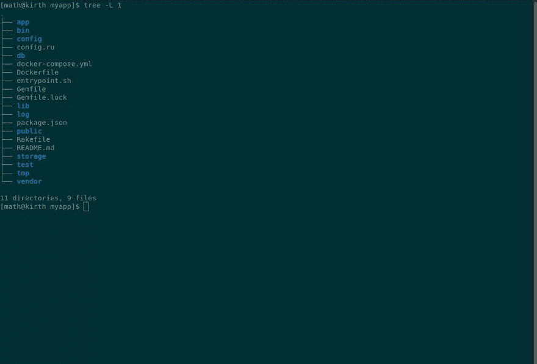

# 为我们的 Rails 应用构建 Docker 容器

> 原文：<https://dev.to/scoutapm/building-docker-containers-for-our-rails-apps-178k>

*这篇文章最初出现在[童子军博客](https://scoutapm.com/blog/building-docker-containers-for-our-rails-apps)上。*

在最近的一篇文章中，我们讨论了关于 Docker 容器你所知道的 8 件事，以及你应该知道的事情。希望我们消除了你对 Docker 生态系统的任何困惑。也许说了这么多，它让你想到在你自己的应用程序中尝试一下？在这篇文章中，我们将向您展示将现有的 Ruby on Rails 应用程序放在一个容器中运行是多么容易。因此，让我们假设您有一个带有 PostgreSQL 数据库的 Rails 项目，让我们带您完成在容器中运行它的步骤。这比你可能想象的要容易得多！

## 创建 Dockerfile

要让我们的应用程序在容器中运行，我们需要做的第一件事是定义我们将作为容器运行的自定义图像，我们可以在 **Dockerfile** 中完成这项工作。这个 Docker 文件本质上是 Docker 在构建我们的容器映像时使用的一组指令。这个想法是，这个文件是在任何系统上产生一个相同的容器所需要的，所以我们可以将这个文件添加到源代码控制中，这样我们团队中的每个人都可以利用它。让我们创建以下名为“Dockerfile”的文件，并将它放在我们项目的根目录中:

```
# Start from the official ruby image, then update and install JS & DB
FROM ruby:2.6.2
RUN apt-get update -qq && apt-get install -y nodejs postgresql-client

# Create a directory for the application and use it
RUN mkdir /myapp
WORKDIR /myapp

# Gemfile and lock file need to be present, they'll be overwritten immediately
COPY Gemfile /myapp/Gemfile
COPY Gemfile.lock /myapp/Gemfile.lock

# Install gem dependencies
RUN bundle install COPY . /myapp

# This script runs every time the container is created, necessary for rails
COPY entrypoint.sh /usr/bin/
RUN chmod +x /usr/bin/entrypoint.sh
ENTRYPOINT ["entrypoint.sh"]
EXPOSE 3000

# Start rails
CMD ["rails", "server", "-b", "0.0.0.0"] 
```

<svg width="20px" height="20px" viewBox="0 0 24 24" class="highlight-action crayons-icon highlight-action--fullscreen-on"><title>Enter fullscreen mode</title></svg> <svg width="20px" height="20px" viewBox="0 0 24 24" class="highlight-action crayons-icon highlight-action--fullscreen-off"><title>Exit fullscreen mode</title></svg>

让我们一步一步地看看这个文件，以准确理解我们要求 Docker 做什么。使用“FROM”语句，我们从一个官方的 ruby Docker 映像(托管在 Docker Hub 上)开始，并将其复制到一个全新的映像中。在这个新映像中，我们调用“RUN ”,它在新映像中更新并安装一个 JavaScript 运行时和一个 PostgreSQL DB 客户端。使用下一个“RUN”命令，我们在我们的映像中创建一个名为 myapp 的目录(注意，您应该将“myapp”的引用改为*您的*应用程序的目录名)，然后我们将它设置为我们的映像的工作目录。下一步是使用“复制”将项目中的 Gemfile 和 Gemfile.lock 文件复制到该图像中。我们需要这些文件存在，这样我们就可以“运行捆绑安装”并将所有的 gem 安装到这个映像中。然后，我们使用“复制”将整个项目复制到映像中。接下来的四行特定于 Rails 项目，允许它们在容器中正确运行，如果您不理解这一部分，不要太担心。但是我们需要将下面显示的文件添加到我们的项目目录中，并将其命名为 **entrypoint.sh** ，这样才能工作。当映像在容器中运行时，docker 文件的最后一行“CMD”将启动 Rails 服务器。

这是我们需要创建并添加到我们的项目
中的 **entrypoint.sh** 文件

```
#!/bin/bash

# Rails-specific issue, deletes a pre-existing server, if it exists
set -e
rm -f /myapp/tmp/pids/server.pid
exec "$@" 
```

<svg width="20px" height="20px" viewBox="0 0 24 24" class="highlight-action crayons-icon highlight-action--fullscreen-on"><title>Enter fullscreen mode</title></svg> <svg width="20px" height="20px" viewBox="0 0 24 24" class="highlight-action crayons-icon highlight-action--fullscreen-off"><title>Exit fullscreen mode</title></svg>

因此，使用这个 **Dockerfile** 和 **entrypoint.sh** 脚本，我们可以用一个命令构建我们的映像。但是您可能已经注意到，我们还没有指定 PostgreSQL 数据库的详细信息。数据库引擎通常运行在自己的容器中，与您的 web 应用程序分开。好消息是，我们不必为这个数据库容器定义一个带有 Dockerfile 的定制映像，我们可以只使用 Docker Hub 中的一个标准 PostgreSQL 映像，并按原样使用它。但这仍然意味着我们将有两个需要相互通信的独立容器。我们如何做到这一点？这就是 T4 码头工人作曲 T5 的用武之地。

## 创建 docker-compose.yml 文件

Docker Compose 是一个工具，它允许我们将多个容器连接到一个多容器环境中，我们可以将这个环境视为一个服务。例如，在我们的情况下，我们有一个数据库引擎容器和一个 rails 环境容器。因此，我们可以使用 Docker Compose 将它们组合到一个多容器环境中，我们可以从概念上将其视为完整的应用程序。要使用 Docker Compose，我们需要创建一个 **docker-compose.yml** 文件，除了我们已经有的 Docker 文件，并把它放在您的项目目录中。这个文件将把我们之前在 docker 文件中定义的 rails 容器(让我们称之为“web”)和另一个数据库容器(我们称之为“db”):

```
version: '3'
services:
  db:
    image: postgres
    volumes:
      - ./tmp/db:/var/lib/postgresql/data
  web:
    build: .
    command: bash -c "rm -f tmp/pids/server.pid && bundle exec rails s -p 3000 -b '0.0.0.0'"
    volumes:
      - .:/myapp
    ports:
      - "3000:3000"
    depends_on:
      - db 
```

<svg width="20px" height="20px" viewBox="0 0 24 24" class="highlight-action crayons-icon highlight-action--fullscreen-on"><title>Enter fullscreen mode</title></svg> <svg width="20px" height="20px" viewBox="0 0 24 24" class="highlight-action crayons-icon highlight-action--fullscreen-off"><title>Exit fullscreen mode</title></svg>

如您所见，对于 db 部分，我们只需从 Docker hub 指定“postgres”映像，然后将数据库的位置装载到容器中。然而，对于 web 部件，我们构建 docker 文件中定义的图像，运行一些命令，并将应用程序代码装入容器。注意，如果您使用的是执行 SELinux 的系统(比如 Red Hat、Fedora 或 CentOS)，那么您需要在卷路径的末尾附加一个特殊的:z 标志。

## 把所有的东西放在一起

现在我们的项目目录中已经有了一个 **Dockerfile** 、 **docker-compose.yml** 和 **entrypoint.sh** 脚本，在构建我们的映像并将应用程序作为容器运行之前，我们只需要再做几个步骤。

首先，在我们继续之前，清除我们的 **Gemfile.lock** 文件的内容是一个好主意:

```
$ rm Gemfile.lock
$ touch Gemfile.lock 
```

<svg width="20px" height="20px" viewBox="0 0 24 24" class="highlight-action crayons-icon highlight-action--fullscreen-on"><title>Enter fullscreen mode</title></svg> <svg width="20px" height="20px" viewBox="0 0 24 24" class="highlight-action crayons-icon highlight-action--fullscreen-off"><title>Exit fullscreen mode</title></svg>

接下来，我们需要更新数据库设置，因为 PostgreSQL 映像的凭证不同于您将在本地安装中使用的凭证。主要的区别在于，这里我们将“db”容器指定为主机。您可以对您的 **config/database.rb** 文件的相关部分进行这些更改:

```
default: &default                                                               
  adapter: postgresql                                                           
  encoding: unicode                                                             
  host: db                                                                      
  username: postgres                                                            
  password: 
```

<svg width="20px" height="20px" viewBox="0 0 24 24" class="highlight-action crayons-icon highlight-action--fullscreen-on"><title>Enter fullscreen mode</title></svg> <svg width="20px" height="20px" viewBox="0 0 24 24" class="highlight-action crayons-icon highlight-action--fullscreen-off"><title>Exit fullscreen mode</title></svg>

下一步是构建我们在 docker 文件中定义的自定义图像，我们可以这样做:

```
$ docker-compose build 
```

<svg width="20px" height="20px" viewBox="0 0 24 24" class="highlight-action crayons-icon highlight-action--fullscreen-on"><title>Enter fullscreen mode</title></svg> <svg width="20px" height="20px" viewBox="0 0 24 24" class="highlight-action crayons-icon highlight-action--fullscreen-off"><title>Exit fullscreen mode</title></svg>

现在我们有了 web 应用程序的图像，我们需要准备数据库(在容器内部)。

```
$ docker-compose run web rake db:create
$ docker-compose run web rake db:migrate 
```

<svg width="20px" height="20px" viewBox="0 0 24 24" class="highlight-action crayons-icon highlight-action--fullscreen-on"><title>Enter fullscreen mode</title></svg> <svg width="20px" height="20px" viewBox="0 0 24 24" class="highlight-action crayons-icon highlight-action--fullscreen-off"><title>Exit fullscreen mode</title></svg>

## 在容器中运行

就是这样！我们完了！现在运行整个应用程序(这一次以及将来)所需要做的就是这个命令:

```
$ docker-compose up 
```

<svg width="20px" height="20px" viewBox="0 0 24 24" class="highlight-action crayons-icon highlight-action--fullscreen-on"><title>Enter fullscreen mode</title></svg> <svg width="20px" height="20px" viewBox="0 0 24 24" class="highlight-action crayons-icon highlight-action--fullscreen-off"><title>Exit fullscreen mode</title></svg>

完成后，为了正确关闭并移除容器，运行:

```
$ docker-compose down 
```

<svg width="20px" height="20px" viewBox="0 0 24 24" class="highlight-action crayons-icon highlight-action--fullscreen-on"><title>Enter fullscreen mode</title></svg> <svg width="20px" height="20px" viewBox="0 0 24 24" class="highlight-action crayons-icon highlight-action--fullscreen-off"><title>Exit fullscreen mode</title></svg>

[](https://res.cloudinary.com/practicaldev/image/fetch/s--aHo7tag_--/c_limit%2Cf_auto%2Cfl_progressive%2Cq_66%2Cw_880/https://thepracticaldev.s3.amazonaws.com/i/4bgckx1u5xk178k15ws9.gif)