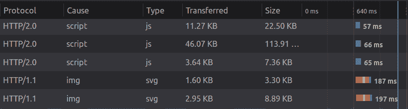

# HTTP2:为什么要查？

> 原文：<https://dev.to/jjroush/http2-why-should-i-check-it-out-2obc>

作为一名开发人员，我开始研究 HTTP2，因为我注意到 Node.js 实现了[原生支持](https://nodejs.org/api/http2.html)。当我深入研究时，令人困惑的是为什么人们没有对 20 多年前的 HTTP 1.1 规范的更新做出更大的贡献。

设置 Node.js HTTP2 的例子比我预期的要少，这令人困惑，因为 javascript 开发人员总是走在曲线的前面。我意识到 HTTP2 一定是最尖端的技术

## HTTP 超级迷你历史课

超文本传输协议是我们在古老万维网上获取信息的方式。它是用于客户端与服务器通信的应用程序级协议。
HTTP 1.1 于 1997 年问世。自 1997 年以来发生了很多变化，但 HTTP 没有。那是直到 2015 年。

## 该不该关心？

是的。

这是一个伟大的全方位的性能改进。要实现的工作量取决于您使用的堆栈。目前，大约 30%的网络使用 HTTP2。

### 速度测试(它更快)

我对自己的网站进行了一个快速的不科学的测试:打开和关闭 http2 我发现我的网站包含大约 20 个网络请求，使用 HTTP2 时速度快了 12%。一个 [*CSS 招数*](https://css-tricks.com/) 测试显示速度提升 25%。

在有大量网络请求的站点和连接速度较慢的客户端上，HTTP2 速度的提高会更加明显。

由于传输的数据格式是二进制而不是文本，多路复用，重复使用 TCP 连接，所以速度更快...我不会告诉你细节，但是如果你喜欢这个，规范的 [FAQ 页面](https://http2.github.io/faq/)是一个很好的开始。我也找到了一个恶心的[现实世界的例子](https://imagekit.io/demo/http2-vs-http1)。

### 服务器推送

HTTP2 的一大特色就是服务器推送。在请求原始 HTML 文档时，可以告诉服务器发送:请求的文档、样式表和 javascript。任何不想缓存但知道用户会需要的资源都是服务器推送的好选择。

## 实现

实现 HTTP2 的难易取决于服务器。Node.js 包含几行额外的代码，告诉您的首选服务器框架使用 Node 的 HTTP2 服务器(这是一个非常简单的例子)。与。NET 和。Net 核心框架，HTTP2 支持来自操作系统。Windows 10 或 Windows Server 2016。现在在节点和中。NET 场景中，HTTP2 的一部分就是实施 TLS。所以如果你想进入现代网络时代，你需要一个 SSL 证书。localhost 也不例外。

当试图在我参与的一些项目中实现 HTTP2 时，我注意到了一些事情。如果你使用的是 CloudFlare，你可以免费获得 HTTP2】开箱。包括像服务器推送这样的功能。亚马逊的 CloudFront 也有现成的 HTTP2。对于网络服务提供商来说，这不是一个卖点，这让我有点惊讶。

### 检查你现在是否在用

希望你至少对 HTTP2 有点兴趣，即使只有 12%的兴趣。若要查看您的网站是否正在使用它:

1.  转到您最喜欢的浏览器(chrome 或 firefox)的网络选项卡。
2.  右击网络表头选择`protocol`。
3.  刷新页面。

值得注意的是，HTTP2 依赖于托管资源的服务器，所以如果使用图像 CDN 不支持 HTTP2，您的网站可能支持最新和最好的东西，但图像可能不会受益于速度的提高。

## 结论

现在，在你对 HTTP 的超前感觉感到兴奋之前，先打住。2018 年 **HTTP3** 开始进入市场。最初由谷歌以 Quic 的名义开发；HTTP3 将很快成为 T2 的标准。

不过就目前而言，我会确保自己赶上 2015 年的技术。

 [
T4】](http://www.commitstrip.com/en/2018/11/15/http-3/)

我发誓每件事都有一个提交条...

## 问题

你有过实现 HTTP2 的个人经验吗？如果有，什么栈？难点是什么？

*感谢阅读我的第一篇开发帖子！*