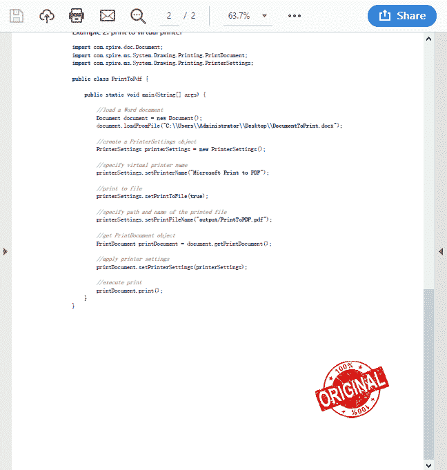
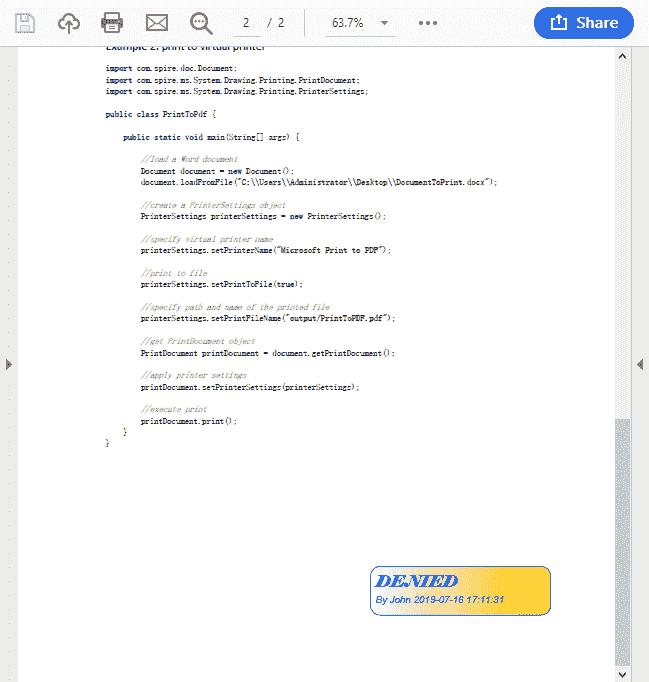

# 在 Java 中向 PDF 添加图像或文本图章

> 原文：<https://dev.to/eiceblue/add-image-or-text-stamps-to-pdf-in-java-2p7g>

PDF 印章通常用于合同、报告和受限材料中，以证明文件已经过审查并标记为“已读”、“合格”或“机密”等。这篇文章将向你展示我们如何通过使用 Java 的免费 Spire.PDF 来给 PDF 文档添加图像图章和文本图章。

## 添加图像图章

```
import com.spire.pdf.annotations.PdfRubberStampAnnotation;
import com.spire.pdf.annotations.appearance.PdfAppearance;
import com.spire.pdf.graphics.PdfImage;
import com.spire.pdf.graphics.PdfTemplate;

import java.awt.geom.Rectangle2D;

public class ImageStamp {

    public static void main(String[] args) {

        //create a PdfDocument object
        PdfDocument doc = new PdfDocument();

        //load a PDF document
        doc.loadFromFile("C:\\Users\\Administrator\\Desktop\\sample.pdf");

        //get the last page
        PdfPageBase page = doc.getPages().get(doc.getPages().getCount()-1);

        //load an image file
        PdfImage image = PdfImage.fromFile("C:\\Users\\Administrator\\Desktop\\100-percent-original-stamp.png");

        //get the width and height of the image
        int width = image.getWidth();
        int height = image.getHeight();

        //create a PdfTemplate object based on the size of the image
        PdfTemplate template = new PdfTemplate(width, height);

        //draw image on the template
        template.getGraphics().drawImage(image, 0, 0, width, height);

        //create a rubber stamp annotation, specifying its location and position
        Rectangle2D rect = new Rectangle2D.Float((float) (page.getActualSize().getWidth() - width - 50), (float) (page.getActualSize().getHeight() - height - 80), width, height);
        PdfRubberStampAnnotation stamp = new PdfRubberStampAnnotation(rect);

        //create a PdfAppearance object
        PdfAppearance pdfAppearance = new PdfAppearance(stamp);

        //set the template as the normal state of the appearance
        pdfAppearance.setNormal(template);

        //the appearance to the stamp
        stamp.setAppearance(pdfAppearance);

        //add the stamp annotation to PDF
        page.getAnnotationsWidget().add(stamp);

        //save the file
        doc.saveToFile("output/AddImageStamp.pdf");
        doc.close();
    }
} 
```

输出:
[](https://res.cloudinary.com/practicaldev/image/fetch/s--mVC7OLbg--/c_limit%2Cf_auto%2Cfl_progressive%2Cq_auto%2Cw_880/https://thepracticaldev.s3.amazonaws.com/i/y1ar59csxzd9izl5nk8c.png)

## 添加文字戳

```
import com.spire.pdf.annotations.PdfRubberStampAnnotation;
import com.spire.pdf.annotations.appearance.PdfAppearance;
import com.spire.pdf.graphics.*;

import java.awt.*;
import java.awt.geom.Point2D;
import java.awt.geom.Rectangle2D;
import java.text.SimpleDateFormat;

public class TextStamp {

    public static void main(String[] args) {

        //create a PdfDocument object
        PdfDocument document = new PdfDocument();

        //load a PDF file
        document.loadFromFile("C:\\Users\\Administrator\\Desktop\\sample.pdf");

        //get the last page
        PdfPageBase page = document.getPages().get(document.getPages().getCount()-1);

        //create a pdf template
        PdfTemplate template = new PdfTemplate(185, 50);

        //create two fonts
        PdfTrueTypeFont font1 = new PdfTrueTypeFont(new Font("Elephant", Font.ITALIC,16), true);
        PdfTrueTypeFont font2 = new PdfTrueTypeFont(new Font("Arial", Font.ITALIC  ,10), true);

        //create a solid brush and a gradient brush
        PdfSolidBrush solidBrush = new PdfSolidBrush(new PdfRGBColor(Color.blue));
        Rectangle2D rect1 = new Rectangle2D.Float();
        rect1.setFrame(new Point2D.Float(0,0),template.getSize());
        PdfLinearGradientBrush linearGradientBrush = new PdfLinearGradientBrush(rect1,new PdfRGBColor(Color.white),new PdfRGBColor(Color.orange),PdfLinearGradientMode.Horizontal);

        //create rounded rectangle path
        int CornerRadius = 20;
        PdfPath path = new PdfPath();
        path.addArc(template.getBounds().getX(), template.getBounds().getY(), CornerRadius, CornerRadius, 180, 90);
        path.addArc(template.getBounds().getX() + template.getWidth() - CornerRadius,template.getBounds().getY(), CornerRadius, CornerRadius, 270, 90);
        path.addArc(template.getBounds().getX() + template.getWidth() - CornerRadius, template.getBounds().getY()+ template.getHeight() - CornerRadius, CornerRadius, CornerRadius, 0, 90);
        path.addArc(template.getBounds().getX(), template.getBounds().getY() + template.getHeight() - CornerRadius, CornerRadius, CornerRadius, 90, 90);
        path.addLine( template.getBounds().getX(), template.getBounds().getY() + template.getHeight() - CornerRadius, template.getBounds().getX(), template.getBounds().getY() + CornerRadius / 2);

        //draw path on the template
        template.getGraphics().drawPath(linearGradientBrush, path);
        template.getGraphics().drawPath(PdfPens.getBlue(), path);

        //draw dynamic text on the template
        String s1 = "DENIED\n";
        String s2 = "By John " + dateToString(new java.util.Date(),"yyyy-MM-dd HH:mm:ss");
        template.getGraphics().drawString(s1, font1, solidBrush, new Point2D.Float(5, 5));
        template.getGraphics().drawString(s2, font2, solidBrush, new Point2D.Float(5, 28));

        //create a rubber stamp, specifying its size and location
        Rectangle2D rect2= new Rectangle2D.Float();
        rect2.setFrame(new Point2D.Float((float)(page.getActualSize().getWidth()-250),(float)(page.getActualSize().getHeight()-120)),  template.getSize());
        PdfRubberStampAnnotation stamp = new PdfRubberStampAnnotation(rect2);

        //create a PdfAppearance object and apply the template as its normal state
        PdfAppearance appearance = new PdfAppearance(stamp);
        appearance.setNormal(template);

        //apply the appearance to stamp
        stamp.setAppearance(appearance);

        //add the stamp annotation to annotation collection
        page.getAnnotationsWidget().add(stamp);

        //save the file
        document.saveToFile("output/AddTextStamp.pdf");
        document.close();
    }

    //convert date to string
    public static String dateToString(java.util.Date poDate,String pcFormat) {
        SimpleDateFormat loFormat = new SimpleDateFormat(pcFormat);
        return loFormat.format(poDate);
    }
} 
```

输出:
[](https://res.cloudinary.com/practicaldev/image/fetch/s--L0lYaW0f--/c_limit%2Cf_auto%2Cfl_progressive%2Cq_auto%2Cw_880/https://thepracticaldev.s3.amazonaws.com/i/dmxfyfvbim5db20larfz.png)