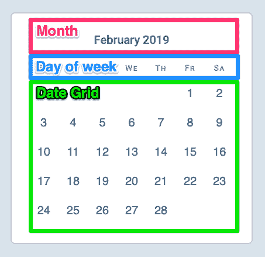
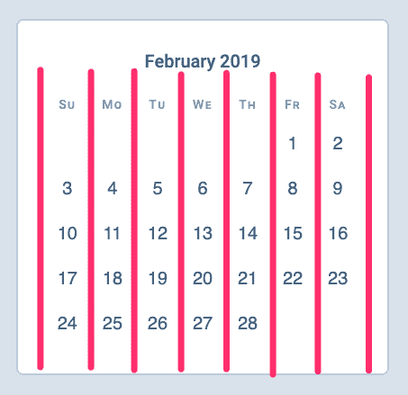
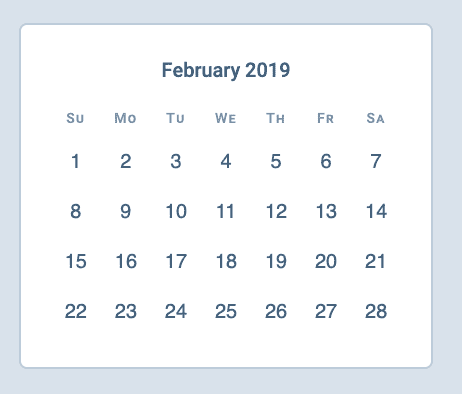

# 如何用 CSS 网格构建日历

> 原文：<https://dev.to/zellwk/how-to-build-a-calendar-with-css-grid-1c46>

用 CSS Grid 构建日历实际上相当容易。我想告诉你怎么做。

在本文结束时，您将创建以下内容:

[](https://res.cloudinary.com/practicaldev/image/fetch/s--sWRuCzm3--/c_limit%2Cf_auto%2Cfl_progressive%2Cq_auto%2Cw_880/https://zellwk.cimg/2019/calendar-css-grid/calendar-fixed.png)

# 创建 HTML

从图中可以看出，日历包含三个部分:

1.  月份指示器
2.  工作日/周末指示器
3.  日期本身

[](https://res.cloudinary.com/practicaldev/image/fetch/s--62cMUiuM--/c_limit%2Cf_auto%2Cfl_progressive%2Cq_auto%2Cw_880/https://zellwk.cimg/2019/calendar-css-grid/structure.png)

构建 HTML 的最佳方式是选择感觉正确的内容。我们将根据这三个部分创建 HTML:

```
<div class="calendar">
  <div class="month-indicator">...</div>
  <div class="day-of-week">...</div>
  <div class="date-grid">...</div>
</div> 
```

您还应该能够看到，我们需要七列网格。

[](https://res.cloudinary.com/practicaldev/image/fetch/s--26UO3ykf--/c_limit%2Cf_auto%2Cfl_progressive%2Cq_auto%2Cw_880/https://zellwk.cimg/2019/calendar-css-grid/seven-columns.png)

我们将重点讨论`.day-of-week`和`.date-grid`，因为我们只讨论了电网。

## 结构化网格

有两种方法可以创建 CSS 网格。

第一种方法是将`.day-of-week`和`.date-grid`中的元素合并到一个选择器中。如果我们这样做，我们可以在`display: grid`中设置选择器。如果我们这样做，HTML 看起来会是这样的:

```
<div class="grid">
  <!-- Day of week -->
  <div>Su</div>
  <div>Mo</div>
  <div>Tu</div>
  <div>We</div>
  <div>Th</div>
  <div>Fr</div>
  <div>Sa</div>

  <!-- Dates -->
  <button><time datetime="2019-02-01">1</time></button>
  <button><time datetime="2019-02-02">2</time></button>
  <button><time datetime="2019-02-03">3</time></button>
  <!-- ... -->
  <button><time datetime="2019-02-28">28</time></button>
</div> 
```

我不鼓励这种方法，因为 HTML 失去了它的结构意义。如果可能的话，我更喜欢将`.day-of-week`和`date-grid`作为独立的元素。这让我很容易阅读/理解我写的代码。

下面是我选择的 HTML 结构:

```
<div class="day-of-week">
  <div>Su</div>
  <div>Mo</div>
  <div>Tu</div>
  <div>We</div>
  <div>Th</div>
  <div>Fr</div>
  <div>Sa</div>
</div>

<div class="date-grid">
  <button><time datetime="2019-02-01">1</time></button>
  <button><time datetime="2019-02-02">2</time></button>
  <button><time datetime="2019-02-03">3</time></button>
  <!-- ... -->
  <button><time datetime="2019-02-28">28</time></button>
</div> 
```

用我提出的结构创建 CSS 网格的最好方法是使用 subgrid。不幸的是，大多数浏览器还不支持子网格。同时，最好的方法是创建两个独立的网格——一个用于`.day-of-week`，一个用于`.date-grid`。

`.day-of-week`和`.date-grid`都可以使用相同的七列网格。

```
/* The grid */
.day-of-week,
.date-grid {
  display: grid;
  grid-template-columns: repeat(7, 1fr);
} 
```

[](https://res.cloudinary.com/practicaldev/image/fetch/s--TcGGZG8I--/c_limit%2Cf_auto%2Cfl_progressive%2Cq_auto%2Cw_880/https://zellwk.cimg/2019/calendar-css-grid/calendar-grid.png)

## 推送日期

2019 年 2 月始于一个星期五。如果我们希望日历是正确的，我们需要确保:

1.  2019 年 2 月 1 日星期五
2.  2019 年 2 月 2 日星期六
3.  2019 年 2 月 3 日是周日
4.  等等...

有了 CSS Grid，这部分就简单了。

CSS 网格的布局算法遵循以下规则(如果您没有将`grid-auto-flow`设置为`dense`):

1.  首先放置具有显式`grid-column`或`grid-row`的项目
2.  根据最后一项填写其余部分

这意味着:

1.  如果第一项落在第 6 列
2.  第二个项目将放在第 7 列。
3.  第三个项目将放在下一行的第 1 列(因为只有 7 列)。
4.  第四个项目将被放置在列 2 中，
5.  等等...

因此，如果我们将 2 月 1 日放在第六列(星期五)，其余的日期将被正确放置。

就这么简单！

```
/* Positioning the first day on a Friday */
.date-grid button:first-child {
  grid-column: 6;
} 
```

[](https://res.cloudinary.com/practicaldev/image/fetch/s--sWRuCzm3--/c_limit%2Cf_auto%2Cfl_progressive%2Cq_auto%2Cw_880/https://zellwk.cimg/2019/calendar-css-grid/calendar-fixed.png)

这里有一支笔供你使用:

[https://codepen.io/zellwk/embed/xNpKwp?height=600&default-tab=result&embed-version=2](https://codepen.io/zellwk/embed/xNpKwp?height=600&default-tab=result&embed-version=2)

## 想了解更多？

本文包含了 Learn JavaScript 中的一个组件(一个日期选择器)的一部分。我还有很多东西想给你看。(但它们大多是与 JavaScript 相关的主题)。

例如，在《学习 JavaScript》中，我向您展示了如何:

1.  为任何月份(和任何年份)建立一个日历
2.  添加上一个/下一个按钮以在月份之间切换
3.  单击每个日期以显示日期

它看起来是这样的:

[](https://res.cloudinary.com/practicaldev/image/fetch/s--5MRuS-rQ--/c_limit%2Cf_auto%2Cfl_progressive%2Cq_66%2Cw_880/https://zellwk.cimg/2019/calendar-css-grid/datepicker.gif)

* * *

感谢阅读。这篇文章最初发表在我的博客上。如果你想要更多的文章来帮助你成为一个更好的前端开发者，请注册[我的时事通讯](https://zellwk.com)。