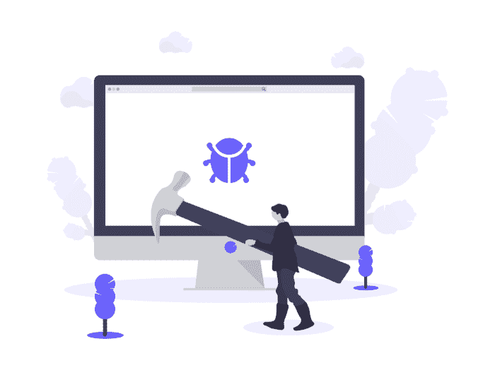

# 如何成为世界上最差的程序员手册

> 原文：<https://dev.to/bybruno/manual-on-how-to-become-the-worst-programmer-in-the-world-18km>

如果你想成为世界上最差的程序员，我强烈推荐阅读那些在一些程序员的生活中被证明有效的步骤。

#### 一次性学习多种语言/框架

如果你想成为程序员，同时学习 8 种语言和 5 种框架。

#### 为面包屑创造复杂的工作

作为世界上最差的程序员，最好的部分就是做一个复杂的系统，并以 25 美元的价格出售。

#### 讨论最佳语言/框架

与同学讨论指出 React 比 angular 更好会给你带来很大的感觉，即使 React 能解决所有问题。

#### 不使用版本控制

你可以使用 Google Drive 来修改你的代码。最好的做法！

#### 你在一个团队吗？单独工作！

独自工作，你不必依赖另一个人。要知道，“想做成事情，自己动手”。

#### 不主动出击

主动做什么？什么都不会发生，一切都会好的！

#### 不尊重资深开发者

高级开发人员不知道你在说什么，你在 facebook 上看到的那个帖子是一个知道如何在 react 中创建一个组件的 17 岁男孩写的，他知道自己在说什么。

#### 没有纪律

我们成为程序员是为了随时做你想做的事情，这是我们的世界，习惯吧！

#### 忘记你的精神和身体健康

你只需要呆在电脑前，不用担心你的健康。离开电脑几个小时去锻炼可能会让你花钱。时间就是金钱，写下来！

#### 远离你爱的人

学习，做个人项目，做明天要做的项目的交付。没有人的时间，但没有问题，因为他们永远在你身边。

最后...在 Dev.to 小手册中写下
如何成为世界上最差的程序员。

原文帖子[pt/br]:[https://medium . com/@ brunoandrade . me/manual-如何成为世界上最差的程序员-3ac 70 B4 fa 1 和 2](https://medium.com/@brunoandrade.me/manual-de-como-se-tornar-o-pior-programador-do-mundo-3ac70b4fa1e2)

如果你发现翻译中有错误，请通知我。