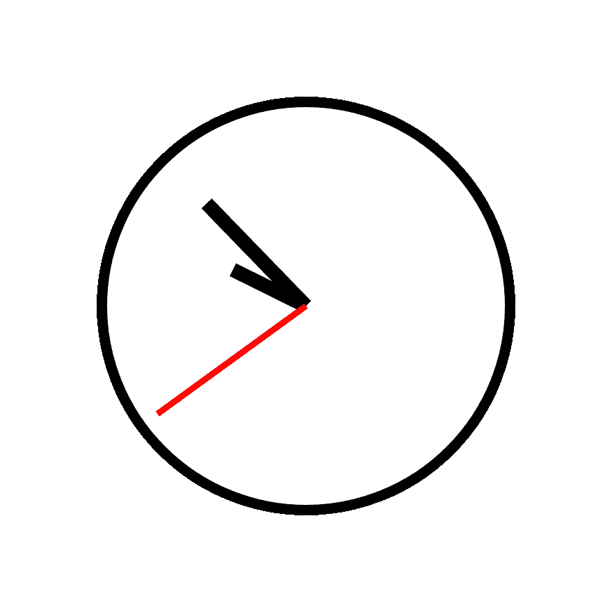
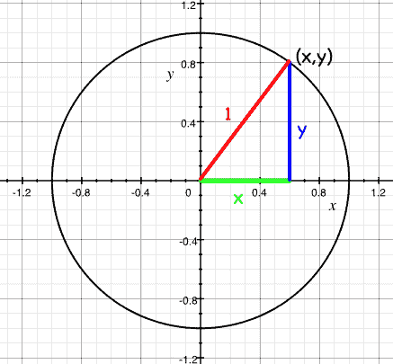
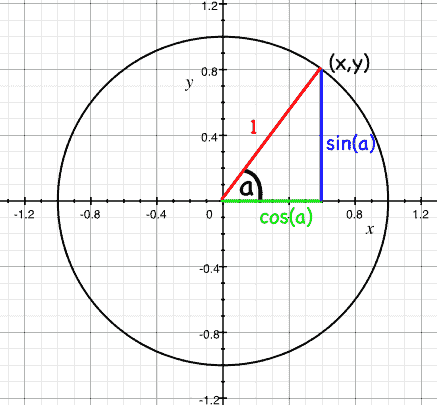
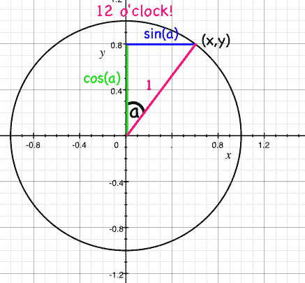
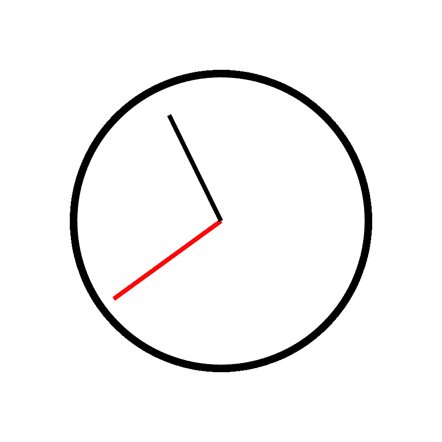
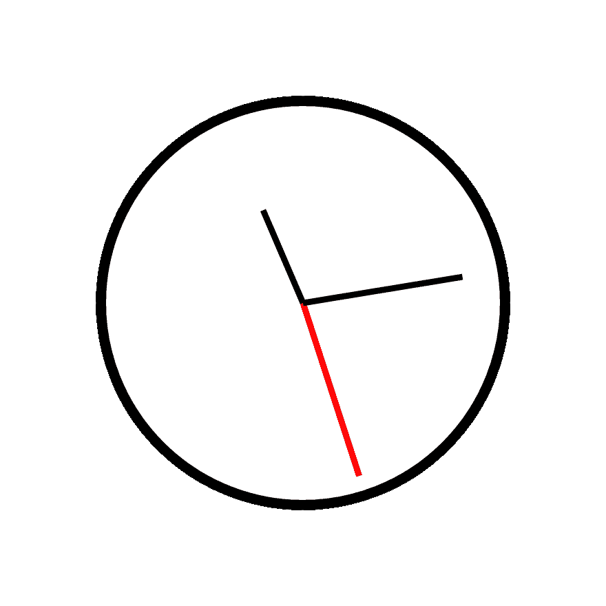

# 围棋中的模拟钟面

> 原文：<https://dev.to/gypsydave5/tdd-an-analogue-clockface-in-go-4ono>

我为 [@quii](https://dev.to/quii) 的非常精彩和值得一读的书 [*Learn Go With Tests*](https://github.com/quii/learn-go-with-tests) 写了*另一章*——这一章是关于使用 SVGs 和`math`包绘制模拟钟面的。

这一章介绍了`math`包(我们做一些三角学！)并涉及使用浮点运算的一些问题。我们还将看看如何测试 SVG...带来了一些(或许)令人惊讶的后果。

这是一个相当晚的章节，所以我希望大多数读者对测试驱动开发有一定的了解，并对 Go 有所了解。但是你不需要了解(太多)数学或者任何关于 SVGs 和 XML 的知识——我已经尽力让每个人都能理解它。如果不是，请告诉我！

如果你喜欢这个，或者即使你不喜欢，这本书的其余部分是*更好的*和*完全免费的*。

如果你在家玩，你可以在这里看看我们钟面生成器代码[迭代的所有源文件。](https://github.com/quii/learn-go-with-tests/tree/master/math)

不管怎样，继续表演...

* * *

## 问题

你想做一个时钟的 SVG。不是数字钟——不，那很简单——一个带指针的*模拟*钟。您不需要任何花哨的东西，只需要一个漂亮的函数，它从`time`包中取出一个`Time`,并输出一个时钟的 SVG，所有的指针——时针、分针和秒针都指向正确的方向。这能有多难？

首先，我们需要一个 SVG 的时钟来玩。SVG 是一种很好的编程图像格式，因为它们被写成一系列形状，用 XML 描述。所以这个钟:

[](https://res.cloudinary.com/practicaldev/image/fetch/s--3jxWzBBA--/c_limit%2Cf_auto%2Cfl_progressive%2Cq_auto%2Cw_880/https://raw.githubusercontent.com/quii/learn-go-with-tests/master/math/example_clock.svg)

是这样描述的:

```
<?xml version="1.0" encoding="UTF-8" standalone="no"?>
<!DOCTYPE svg PUBLIC "-//W3C//DTD SVG 1.1//EN" "http://www.w3.org/Graphics/SVG/1.1/DTD/svg11.dtd">
<svg xmlns="http://www.w3.org/2000/svg"
     width="100%"
     height="100%"
     viewBox="0 0 300 300"
     version="2.0">

  <!-- bezel -->
  <circle cx="150" cy="150" r="100" style="fill:#fff;stroke:#000;stroke-width:5px;"/>

  <!-- hour hand -->
  <line x1="150" y1="150" x2="114.150000" y2="132.260000"
        style="fill:none;stroke:#000;stroke-width:7px;"/>

  <!-- minute hand -->
  <line x1="150" y1="150" x2="101.290000" y2="99.730000"
        style="fill:none;stroke:#000;stroke-width:7px;"/>

  <!-- second hand -->
  <line x1="150" y1="150" x2="77.190000" y2="202.900000"
        style="fill:none;stroke:#f00;stroke-width:3px;"/>
</svg> 
```

这是一个有三条线的圆，每条线都从圆的中间开始(x=150，y=150)，在一段距离外结束。

所以我们要做的是以某种方式重建上面的，但是改变线，使它们在给定的时间内指向合适的方向。

## 一次验收测试

在我们深陷其中之前，让我们考虑一下验收测试。我们已经有了一个示例时钟，所以让我们考虑一下重要的参数是什么。

```
<line x1="150" y1="150" x2="114.150000" y2="132.260000"
        style="fill:none;stroke:#000;stroke-width:7px;"/> 
```

时钟的中心(这条线的属性`x1`和`y1`)对于时钟的每个指针都是相同的。时钟的每个指针需要改变的数字——构建 SVG 的参数——是`x2`和`y2`属性。我们需要一个 X 和一个 Y 来代表时钟的每个指针。

我能不能考虑更多的参数——钟面圆的半径、SVG 的大小、指针的颜色、形状等等...但是，最好从用简单、具体的解决方案解决简单、具体的问题开始，然后开始添加参数使其通用化。

所以我们会说

*   每个钟都有一个(150，150)的中心
*   时针长 50
*   分针有 80 长
*   秒针 90 长。

关于 SVGs 需要注意的一点是:原点(0，0)在左上角的处，而不是像我们预期的那样在左下角的*处。当我们决定在什么地方插入什么号码时，记住这一点是很重要的。*

最后，我没有决定*如何*构造 SVG——我们可以使用 [`text/template`](https://golang.org/pkg/text/template/) 包中的模板，或者我们可以将字节发送到`bytes.Buffer`或写入器中。但是我们知道我们将需要那些数字，所以让我们集中测试产生它们的东西。

### 先写测试

所以我的第一个测试是这样的:

```
package clockface_test

import (
    "testing"
    "time"

    "github.com/gypsydave5/learn-go-with-tests/math/v1/clockface"
)

func TestSecondHandAtMidnight(t *testing.T) {
    tm := time.Date(1337, time.January, 1, 0, 0, 0, 0, time.UTC)

    want := clockface.Point{X: 150, Y: 150 - 90}
    got := clockface.SecondHand(tm)

    if got != want {
        t.Errorf("Got %v, wanted %v", got, want)
    }
} 
```

还记得 SVG 是如何从左上角绘制坐标的吗？为了在午夜放置秒针，我们期望它没有从 X 轴上的钟面中心移动——仍然是 150——并且 Y 轴是指针从中心“向上”的长度；150 减 90。

### 试运行测试

这就排除了与缺少的函数和类型相关的预期故障:

```
--- FAIL: TestSecondHandAtMidnight (0.00s)
# github.com/gypsydave5/learn-go-with-tests/math/v1/clockface_test [github.com/gypsydave5/learn-go-with-tests/math/v1/clockface.test]
./clockface_test.go:13:10: undefined: clockface.Point
./clockface_test.go:14:9: undefined: clockface.SecondHand
FAIL    github.com/gypsydave5/learn-go-with-tests/math/v1/clockface [build failed] 
```

因此一个`Point`秒针的尖端应该去哪里，和一个函数来得到它。

### 编写运行测试所需的最少代码，并检查失败的测试输出

让我们实现这些类型来获得要编译的代码

```
package clockface

import "time"

// A Point represents a two dimensional Cartesian coordinate
type Point struct {
    X float64
    Y float64
}

// SecondHand is the unit vector of the second hand of an analogue clock at time `t`
// represented as a Point.
func SecondHand(t time.Time) Point {
    return Point{}
} 
```

现在我们得到了

```
--- FAIL: TestSecondHandAtMidnight (0.00s)
    clockface_test.go:17: Got {0 0}, wanted {150 60}
FAIL
exit status 1
FAIL    github.com/gypsydave5/learn-go-with-tests/math/v1/clockface 0.006s 
```

### 写足够的代码让它通过

当我们得到预期的失败时，我们可以填入`HandsAt` :
的返回值

```
// SecondHand is the unit vector of the second hand of an analogue clock at time `t`
// represented as a Point.
func SecondHand(t time.Time) Point {
    return Point{150, 60}
} 
```

看，一个通过的测试。

```
PASS
ok      github.com/gypsydave5/learn-go-with-tests/math/v1/clockface 0.006s 
```

### 重构

还不需要重构——代码还不够多！

### 重复进行新的要求

我们可能需要在这里做一些工作，而不仅仅是返回一个每次都显示午夜的时钟...

### 先写测试

```
func TestSecondHandAt30Seconds(t *testing.T) {
    tm := time.Date(1337, time.January, 1, 0, 0, 30, 0, time.UTC)

    want := clockface.Point{X: 150, Y: 150 + 90}
    got := clockface.SecondHand(tm)

    if got != want {
        t.Errorf("Got %v, wanted %v", got, want)
    }
} 
```

同样的想法，但是现在秒针指向下方，所以我们用 T2 把 T4 的长度加到 Y 轴上。

这将编译...但是我们如何让它过去呢？

## 思考时间

我们将如何解决这个问题？

秒针每分钟都要经过相同的 60 个状态，指向 60 个不同的方向。当时间为 0 秒时，它指向钟面的顶部，当时间为 30 秒时，它指向钟面的底部。很简单。

所以如果我想考虑秒针指向哪个方向，比如说 37 秒，我想知道 12 点和圆周 37/60 之间的角度。在度数上，这是`(360 / 60 ) * 37 = 222`，但是更容易记住的是，这是一个完整旋转的`37/60`。

但角度只是故事的一半；我们需要知道秒针尖端指向的 X 和 Y 坐标。我们如何解决这个问题？

## 数学

想象在原点周围画一个半径为 1 的圆——坐标`0, 0`。

[](https://res.cloudinary.com/practicaldev/image/fetch/s--JTszuvFz--/c_limit%2Cf_auto%2Cfl_progressive%2Cq_auto%2Cw_880/https://raw.githubusercontent.com/quii/learn-go-with-tests/master/maimg/unit_circle.png)

这被称为“单位圆”,因为...嗯，半径是 1 个单位！

圆的圆周是由网格上的点组成的——更多的坐标。每个坐标的 x 和 y 分量形成一个三角形，其斜边总是 1 -圆的半径

[](https://res.cloudinary.com/practicaldev/image/fetch/s--jLZaomR_--/c_limit%2Cf_auto%2Cfl_progressive%2Cq_auto%2Cw_880/https://raw.githubusercontent.com/quii/learn-go-with-tests/master/maimg/unit_circle_coords.png)

现在，三角学将让我们计算出每个三角形的 X 和 Y 的长度，如果我们知道它们与原点所成的角度。X 坐标将是 cos(a)，Y 坐标将是 sin(a)，其中 a 是直线和(正)X 轴之间的角度。

[](https://res.cloudinary.com/practicaldev/image/fetch/s--lhigcsGr--/c_limit%2Cf_auto%2Cfl_progressive%2Cq_auto%2Cw_880/https://raw.githubusercontent.com/quii/learn-go-with-tests/master/maimg/unit_circle_params.png)

(如果你不相信这个，去看看维基百科...)

最后一个扭曲——因为我们想从 12 点钟位置测量角度，而不是从 X 轴(3 点钟位置)测量，所以我们需要交换轴；现在 x = sin(a)，y = cos(a)。

[](https://res.cloudinary.com/practicaldev/image/fetch/s--ZRcfQDD4--/c_limit%2Cf_auto%2Cfl_progressive%2Cq_auto%2Cw_880/https://raw.githubusercontent.com/quii/learn-go-with-tests/master/maimg/unit_circle_12_oclock.png)

所以现在我们知道如何获得秒针的角度(每秒 1/60 个圆)以及 X 和 Y 坐标。我们将需要用于`sin`和`cos`的函数。

## `math`

幸运的是，Go `math`包两者兼而有之，有一个小问题我们需要解决；如果我们看一下 [`math.Cos`](https://golang.org/pkg/math/#Cos) 的描述:

> Cos 返回弧度参数 x 的余弦值。

它希望角度在*弧度*内。太好了。那么什么是弧度呢？

我们没有将圆的整圈定义为 360 度，而是将整圈定义为 2π弧度。有很好的理由这样做，我们不会去。 <sup id="fnref1">[1](#fn1)</sup>

既然我们已经做了一些阅读、学习和思考，我们可以写下一个测试了。

### 先写测试

所有这些数学既难又令人困惑。我不确定我是否明白发生了什么——所以让我们写一个测试吧！我们不需要一次解决整个问题——让我们从计算秒针在特定时间的正确角度(弧度)开始。

我将在的`clockface`包中编写这些测试*；它们可能永远也不会被导出，一旦我更好地掌握了正在发生的事情，它们可能会被删除(或移动)。*

我还将*注释掉*我在进行这些测试时正在进行的验收测试——在我通过这个测试时，我不想被那个测试分心。

```
package clockface

import (
    "math"
    "testing"
    "time"
)

func TestSecondsInRadians(t *testing.T) {
    thirtySeconds := time.Date(312, time.October, 28, 0, 0, 30, 0, time.UTC)
    want := math.Pi
    got := secondsInRadians(thirtySeconds)

    if want != got {
        t.Fatalf("Wanted %v radians, but got %v", want, got)
    }
} 
```

在这里，我们测试的是，一分钟过去 30 秒后，秒针应该位于时钟的中间位置。这是我们第一次使用`math`包！如果圆的整圈是 2π弧度，我们知道半圈应该正好是π弧度。`math.Pi`为我们提供了π的值。

### 试运行测试

```
# github.com/gypsydave5/learn-go-with-tests/math/v2/clockface [github.com/gypsydave5/learn-go-with-tests/math/v2/clockface.test]
./clockface_test.go:12:9: undefined: secondsInRadians
FAIL    github.com/gypsydave5/learn-go-with-tests/math/v2/clockface [build failed] 
```

### 编写运行测试所需的最少代码，并检查失败的测试输出

```
func secondsInRadians(t time.Time) float64 {
    return 0
} 
```

```
--- FAIL: TestSecondsInRadians (0.00s)
    clockface_test.go:15: Wanted 3.141592653589793 radians, but got 0
FAIL
exit status 1
FAIL    github.com/gypsydave5/learn-go-with-tests/math/v2/clockface 0.007s 
```

### 写足够的代码让它通过

```
func secondsInRadians(t time.Time) float64 {
    return math.Pi
} 
```

```
PASS
ok      github.com/gypsydave5/learn-go-with-tests/math/v2/clockface 0.011s 
```

### 重构

还没有什么需要重构的

### 重复进行新的要求

现在我们可以将测试扩展到更多的场景。我将向前跳一点，展示一些已经重构的测试代码——这应该足够清楚我是如何到达我想要的地方的。

```
func TestSecondsInRadians(t *testing.T) {
    cases := []struct {
        time  time.Time
        angle float64
    }{
        {simpleTime(0, 0, 30), math.Pi},
        {simpleTime(0, 0, 0), 0},
        {simpleTime(0, 0, 45), (math.Pi / 2) * 3},
        {simpleTime(0, 0, 7), (math.Pi / 30) * 7},
    }

    for _, c := range cases {
        t.Run(testName(c.time), func(t *testing.T) {
            got := secondsInRadians(c.time)
            if got != c.angle {
                t.Fatalf("Wanted %v radians, but got %v", c.angle, got)
            }
        })
    }
} 
```

我添加了几个助手函数，使编写这个基于表的测试不那么繁琐。`testName`将时间转换成数字手表格式(HH:MM:SS)，`simpleTime`仅使用我们真正关心的部分(同样是小时、分钟和秒)构建一个`time.Time`。 <sup id="fnref2">[2](#fn2)</sup>

```
func simpleTime(hours, minutes, seconds int) time.Time {
    return time.Date(312, time.October, 28, hours, minutes, seconds, 0, time.UTC)
}

func testName(t time.Time) string {
    return t.Format("15:04:05")
} 
```

这两个函数应该有助于使这些测试(以及未来的测试)更容易编写和维护。

这给了我们一些不错的测试输出:

```
--- FAIL: TestSecondsInRadians (0.00s)
    --- FAIL: TestSecondsInRadians/00:00:00 (0.00s)
        clockface_test.go:24: Wanted 0 radians, but got 3.141592653589793
    --- FAIL: TestSecondsInRadians/00:00:45 (0.00s)
        clockface_test.go:24: Wanted 4.71238898038469 radians, but got 3.141592653589793
    --- FAIL: TestSecondsInRadians/00:00:07 (0.00s)
        clockface_test.go:24: Wanted 0.7330382858376184 radians, but got 3.141592653589793
FAIL
exit status 1
FAIL    github.com/gypsydave5/learn-go-with-tests/math/v3/clockface 0.007s 
```

是时候实现我们上面讨论的所有数学知识了:

```
func secondsInRadians(t time.Time) float64 {
    return float64(t.Second()) * (math.Pi / 30)
} 
```

一秒是(2π / 60)弧度...取消 2，我们得到π/30 弧度。乘以秒数(作为一个`float64`)，我们现在应该已经通过了所有的测试...

```
--- FAIL: TestSecondsInRadians (0.00s)
    --- FAIL: TestSecondsInRadians/00:00:30 (0.00s)
        clockface_test.go:24: Wanted 3.141592653589793 radians, but got 3.1415926535897936
FAIL
exit status 1
FAIL    github.com/gypsydave5/learn-go-with-tests/math/v3/clockface 0.006s 
```

等等，什么？

### 花车很恐怖

浮点运算是[出了名的不准确](https://0.30000000000000004.com/)。计算机在某种程度上只能处理整数和有理数。十进制数字开始变得不准确，特别是当我们像在`secondsInRadians`函数中那样上下因子化它们时。通过将`math.Pi`除以 30，然后乘以 30，我们得到了*，一个不再与`math.Pi`T6 相同的数字。*

有两种方法可以解决这个问题:

1.  与它一起生活
2.  通过重构我们的方程来重构我们的函数

现在(1)可能看起来不那么吸引人，但它通常是使浮点等式工作的唯一方法。坦白地说，一些微小的分数的不准确对于画钟面来说无关紧要，所以我们可以写一个函数，为我们的角度定义一个“足够接近”的等式。但是有一个简单的方法可以让我们恢复精度:我们重新排列等式，这样我们就不再除法然后乘法。我们只要分开就能做到。

所以不要

```
numberOfSeconds * π / 30 
```

我们可以写作

```
π / (30 / numberOfSeconds) 
```

这相当于。

在 Go:

```
func secondsinradians(t time.time) float64 {
    return (math.Pi / (30 / (float64(t.Second()))))
} 
```

我们就能通过了。

```
PASS
ok      github.com/gypsydave5/learn-go-with-tests/math/v2/clockface     0.005s 
```

### 重复进行新的要求

所以我们已经讨论了第一部分——我们知道秒针将以弧度指向哪个角度。现在我们需要算出坐标。

还是那句话，让我们尽量简单，只使用*单位圆*；半径为 1 的圆。这意味着我们的手都只有一个长度，但从好的方面来看，这意味着数学对我们来说很容易理解。

### 先写测试

```
func TestSecondHandVector(t *testing.T) {
    cases := []struct {
        time  time.Time
        point Point
    }{
        {simpleTime(0, 0, 30), Point{0, -1}},
    }

    for _, c := range cases {
        t.Run(testName(c.time), func(t *testing.T) {
            got := secondHandPoint(c.time)
            if got != c.point {
                t.Fatalf("Wanted %v Point, but got %v", c.point, got)
            }
        })
    }
} 
```

### 试运行测试

```
# github.com/gypsydave5/learn-go-with-tests/math/v4/clockface [github.com/gypsydave5/learn-go-with-tests/math/v4/clockface.test]
./clockface_test.go:40:11: undefined: secondHandPoint
FAIL    github.com/gypsydave5/learn-go-with-tests/math/v4/clockface [build failed] 
```

### 编写运行测试所需的最少代码，并检查失败的测试输出

```
func secondHandPoint(t time.Time) Point {
    return Point{}
} 
```

```
--- FAIL: TestSecondHandPoint (0.00s)
    --- FAIL: TestSecondHandPoint/00:00:30 (0.00s)
        clockface_test.go:42: Wanted {0 -1} Point, but got {0 0}
FAIL
exit status 1
FAIL    github.com/gypsydave5/learn-go-with-tests/math/v4/clockface 0.010s 
```

### 写足够的代码让它通过

```
func secondHandPoint(t time.Time) Point {
    return Point{0, -1}
} 
```

```
PASS
ok      github.com/gypsydave5/learn-go-with-tests/math/v4/clockface 0.007s 
```

### 重复进行新的要求

```
func TestSecondHandPoint(t *testing.T) {
    cases := []struct {
        time  time.Time
        point Point
    }{
        {simpleTime(0, 0, 30), Point{0, -1}},
        {simpleTime(0, 0, 45), Point{-1, 0}},
    }

    for _, c := range cases {
        t.Run(testName(c.time), func(t *testing.T) {
            got := secondHandPoint(c.time)
            if got != c.point {
                t.Fatalf("Wanted %v Point, but got %v", c.point, got)
            }
        })
    }
} 
```

### 试运行测试

```
--- FAIL: TestSecondHandPoint (0.00s)
    --- FAIL: TestSecondHandPoint/00:00:45 (0.00s)
        clockface_test.go:43: Wanted {-1 0} Point, but got {0 -1}
FAIL
exit status 1
FAIL    github.com/gypsydave5/learn-go-with-tests/math/v4/clockface 0.006s 
```

### 写足够的代码让它通过

还记得我们的单位圆图吗？

[](https://res.cloudinary.com/practicaldev/image/fetch/s--lhigcsGr--/c_limit%2Cf_auto%2Cfl_progressive%2Cq_auto%2Cw_880/https://raw.githubusercontent.com/quii/learn-go-with-tests/master/maimg/unit_circle_params.png)

我们现在想要产生 X 和 y 的方程。让我们把它写成秒:

```
func secondHandPoint(t time.Time) Point {
    angle := secondsInRadians(t)
    x := math.Sin(angle)
    y := math.Cos(angle)

    return Point{x, y}
} 
```

现在我们得到

```
--- FAIL: TestSecondHandPoint (0.00s)
    --- FAIL: TestSecondHandPoint/00:00:30 (0.00s)
        clockface_test.go:43: Wanted {0 -1} Point, but got {1.2246467991473515e-16 -1}
    --- FAIL: TestSecondHandPoint/00:00:45 (0.00s)
        clockface_test.go:43: Wanted {-1 0} Point, but got {-1 -1.8369701987210272e-16}
FAIL
exit status 1
FAIL    github.com/gypsydave5/learn-go-with-tests/math/v4/clockface 0.007s 
```

等等，什么？看起来我们又一次被浮点数诅咒了——这两个意想不到的数字都是无限小的——在小数点后第 16 位。所以我们可以选择提高精度，或者说它们大致相等，继续我们的生活。

提高这些角度精度的一个选择是使用`math/big`包中的有理类型`Rat`。但是考虑到我们的目标是绘制一个 SVG，而不是登月，我认为我们可以忍受一点模糊。

```
func TestSecondHandPoint(t *testing.T) {
    cases := []struct {
        time  time.Time
        point Point
    }{
        {simpleTime(0, 0, 30), Point{0, -1}},
        {simpleTime(0, 0, 45), Point{-1, 0}},
    }

    for _, c := range cases {
        t.Run(testName(c.time), func(t *testing.T) {
            got := secondHandPoint(c.time)
            if !roughlyEqualPoint(got, c.point) {
                t.Fatalf("Wanted %v Point, but got %v", c.point, got)
            }
        })
    }
}

func roughlyEqualFloat64(a, b float64) bool {
    const equalityThreshold = 1e-7
    return math.Abs(a-b) < equalityThreshold
}

func roughlyEqualPoint(a, b Point) bool {
    return roughlyEqualFloat64(a.X, b.X) &&
        roughlyEqualFloat64(a.Y, b.Y)
} 
```

我们已经定义了两个函数来定义两个`Points`之间的近似相等——如果 X 和 Y 元素彼此相差在 0.0000001 以内，它们将会工作。这还是很准确的。

现在我们得到了

```
PASS
ok      github.com/gypsydave5/learn-go-with-tests/math/v4/clockface 0.007s 
```

### 重构

对此我还是挺开心的。

### 重复进行新的要求

嗯，说*新*一点也不准确——我们现在真正能做的是通过验收测试！让我们提醒自己它看起来像什么:

```
func TestSecondHandAt30Seconds(t *testing.T) {
    tm := time.Date(1337, time.January, 1, 0, 0, 30, 0, time.UTC)

    want := clockface.Point{X: 150, Y: 150 + 90}
    got := clockface.SecondHand(tm)

    if got != want {
        t.Errorf("Got %v, wanted %v", got, want)
    }
} 
```

### 试运行测试

```
--- FAIL: TestSecondHandAt30Seconds (0.00s)
    clockface_acceptance_test.go:28: Got {150 60}, wanted {150 240}
FAIL
exit status 1
FAIL    github.com/gypsydave5/learn-go-with-tests/math/v5/clockface 0.007s 
```

### 写足够的代码让它通过

我们需要做三件事来将单位向量转换成 SVG 上的一个点:

1.  将它缩放到手的长度
2.  将它翻转到 X 轴上，因为考虑到 SVG 的原点在左上角
3.  将其平移到正确的位置(因此它来自(150，150)的原点)

欢乐时光！

```
// SecondHand is the unit vector of the second hand of an analogue clock at time `t`
// represented as a Point.
func SecondHand(t time.Time) Point {
    p := secondHandPoint(t)
    p = Point{p.X * 90, p.Y * 90}   // scale
    p = Point{p.X, -p.Y}            // flip
    p = Point{p.X + 150, p.Y + 150} // translate
    return p
} 
```

缩放、翻转和平移的顺序完全相同。数学万岁！

```
PASS
ok      github.com/gypsydave5/learn-go-with-tests/math/v5/clockface 0.007s 
```

### 重构

这里有几个幻数应该作为常数提取出来，所以
让我们这样做

```
const secondHandLength = 90
const clockCentreX = 150
const clockCentreY = 150

// SecondHand is the unit vector of the second hand of an analogue clock at time `t`
// represented as a Point.
func SecondHand(t time.Time) Point {
    p := secondHandPoint(t)
    p = Point{p.X * secondHandLength, p.Y * secondHandLength}
    p = Point{p.X, -p.Y}
    p = Point{p.X + clockCentreX, p.Y + clockCentreY} //translate
    return p
} 
```

## 画时钟

良好的...反正是二手的...

让我们做这件事吧——因为没有什么比没有交付一些价值更糟糕的了，当它只是坐在那里等待进入这个世界让人们眼花缭乱。来画个秒针吧！

我们将在主`clockface`包目录下添加一个新目录，名为`clockface`(令人困惑)。在那里，我们将放入`main`包，它将创建二进制文件，该文件将构建一个 SVG:

```
├── clockface
│   └── main.go
├── clockface.go
├── clockface_acceptance_test.go
└── clockface_test.go 
```

还有里面的`main.go`

```
package main

import (
    "fmt"
    "io"
    "os"
    "time"

    "github.com/gypsydave5/learn-go-with-tests/math/v6/clockface"
)

func main() {
    t := time.Now()
    sh := clockface.SecondHand(t)
    io.WriteString(os.Stdout, svgStart)
    io.WriteString(os.Stdout, bezel)
    io.WriteString(os.Stdout, secondHandTag(sh))
    io.WriteString(os.Stdout, svgEnd)
}

func secondHandTag(p clockface.Point) string {
    return fmt.Sprintf(`<line x1="150" y1="150" x2="%f" y2="%f" style="fill:none;stroke:#f00;stroke-width:3px;"/>`, p.X, p.Y)
}

const svgStart = `<?xml version="1.0" encoding="UTF-8" standalone="no"?>
<!DOCTYPE svg PUBLIC "-//W3C//DTD SVG 1.1//EN" "http://www.w3.org/Graphics/SVG/1.1/DTD/svg11.dtd">
<svg 
     width="100%"
     height="100%"
     viewBox="0 0 300 300"
     version="2.0">`

const bezel = `<circle cx="150" cy="150" r="100" style="fill:#fff;stroke:#000;stroke-width:5px;"/>`

const svgEnd = `</svg>` 
```

哦，天哪，我不是想用*这个*烂摊子赢得漂亮代码的任何奖项——但它确实起作用了。它将一个 SVG 写到`os.Stdout`——一次一个字符串。

如果我们建造这个

```
go build 
```

并运行它，将输出发送到一个文件

```
./clockface > clock.svg 
```

我们应该会看到类似

[](https://res.cloudinary.com/practicaldev/image/fetch/s--TxC3yHu6--/c_limit%2Cf_auto%2Cfl_progressive%2Cq_auto%2Cw_880/https://raw.githubusercontent.com/quii/learn-go-with-tests/master/math/v6/clockface/clockface/clock.svgg)

### 重构

这太臭了。嗯，它不太臭，但是我不喜欢它。

1.  这整个`SecondHand`功能是*超级*与 SVG 联系在一起...没有提到 SVG 或实际生成 SVG...
2.  ...同时我没有测试任何 SVG 代码。

是的，我想我搞砸了。这感觉不对。让我们尝试用一个更加以 SVG 为中心的测试来恢复。

我们有什么选择？嗯，我们可以试着测试一下从`SVGWriter`中喷涌出来的字符是否包含了看起来像我们在某个特定时间所期待的那种 SVG 标签的东西。比如:

```
func TestSVGWriterAtMidnight(t *testing.T) {
    tm := time.Date(1337, time.January, 1, 0, 0, 0, 0, time.UTC)

    var b strings.Builder
    clockface.SVGWriter(&b, tm)
    got := b.String()

    want := `<line x1="150" y1="150" x2="150" y2="60"`

    if !strings.Contains(got, want) {
        t.Errorf("Expected to find the second hand %v, in the SVG output %v", want, got)
    }
} 
```

但这真的是一种进步吗？

如果我没有生成有效的 SVG(因为它只是测试一个字符串是否出现在输出中),它不仅会通过，而且如果我对该字符串做了最小的、不重要的更改——例如，如果我在属性之间添加了一个额外的空格，它也会失败。

最大的问题是我正在测试一个数据结构——XML——通过把它表示为一系列字符——一个字符串。这绝对不是一个好主意，因为它会产生一些问题，就像我上面概述的那样:一个既太脆弱又不够敏感的测试。一个错误的测试！

所以唯一的解决方案是将输出*测试为 XML* 。为此，我们需要
来解析它。

## 解析 XML

[`encoding/xml`](https://godoc.org/encoding/xml) 是一个 Go 包，可以处理与
简单 XML 解析相关的所有事情。

函数 [`xml.Unmarshall`](https://godoc.org/encoding/xml#Unmarshal) 接受
一个`[]byte`XML 数据和一个指向结构的指针，以便在
中解组到。

所以我们需要一个结构体来解组 XML。我们可以花一些时间
计算出所有节点和属性的正确名称，以及
如何编写正确的结构，但是令人高兴的是，有人已经编写了一个程序
[`zek`](https://github.com/miku/zek) ，它将为我们自动完成所有的
艰苦工作。更好的是，在 https://www.onlinetool.io/xmltogo/
还有一个在线版本。只需
将文件顶部的 SVG 粘贴到一个框中，然后——砰

*   弹出窗口:

```
type Svg struct {
    XMLName xml.Name `xml:"svg"`
    Text    string   `xml:",chardata"`
    Xmlns   string   `xml:"xmlns,attr"`
    Width   string   `xml:"width,attr"`
    Height  string   `xml:"height,attr"`
    ViewBox string   `xml:"viewBox,attr"`
    Version string   `xml:"version,attr"`
    Circle  struct {
        Text  string `xml:",chardata"`
        Cx    string `xml:"cx,attr"`
        Cy    string `xml:"cy,attr"`
        R     string `xml:"r,attr"`
        Style string `xml:"style,attr"`
    } `xml:"circle"`
    Line []struct {
        Text  string `xml:",chardata"`
        X1    string `xml:"x1,attr"`
        Y1    string `xml:"y1,attr"`
        X2    string `xml:"x2,attr"`
        Y2    string `xml:"y2,attr"`
        Style string `xml:"style,attr"`
    } `xml:"line"`
} 
```

如果需要的话，我们可以对此进行调整(比如将
结构的名称改为`SVG`),但这绝对足以让我们开始。

```
func TestSVGWriterAtMidnight(t *testing.T) {
    tm := time.Date(1337, time.January, 1, 0, 0, 0, 0, time.UTC)

    b := bytes.Buffer{}
    clockface.SVGWriter(&b, tm)

    svg := Svg{}
    xml.Unmarshal(b.Bytes(), &svg)

    x2 := "150"
    y2 := "60"

    for _, line := range svg.Line {
        if line.X2 == x2 && line.Y2 == y2 {
            return
        }
    }

    t.Errorf("Expected to find the second hand with x2 of %+v and y2 of %+v, in the SVG output %v", x2, y2, b.String())
} 
```

我们将`clockface.SVGWriter`的输出写入一个`bytes.Buffer`，然后`Unmarshall`将其写入一个`Svg`。然后我们查看`Svg`中的每个`Line`,看它们是否有预期的`X2`和`Y2`值。如果我们得到一个匹配，我们会提前返回(通过测试)；如果没有，我们会失败，并给出一个(希望是)有用的消息。

```
# github.com/gypsydave5/learn-go-with-tests/math/v7b/clockface_test [github.com/gypsydave5/learn-go-with-tests/math/v7b/clockface.test]
./clockface_acceptance_test.go:41:2: undefined: clockface.SVGWriter
FAIL    github.com/gypsydave5/learn-go-with-tests/math/v7b/clockface [build failed] 
```

看来我们最好写那个`SVGWriter`...

```
package clockface

import (
    "fmt"
    "io"
    "time"
)

const (
    secondHandLength = 90
    clockCentreX     = 150
    clockCentreY     = 150
)

//SVGWriter writes an SVG representation of an analogue clock, showing the time t, to the writer w
func SVGWriter(w io.Writer, t time.Time) {
    io.WriteString(w, svgStart)
    io.WriteString(w, bezel)
    secondHand(w, t)
    io.WriteString(w, svgEnd)
}

func secondHand(w io.Writer, t time.Time) {
    p := secondHandPoint(t)
    p = Point{p.X * secondHandLength, p.Y * secondHandLength} // scale
    p = Point{p.X, -p.Y}                                      // flip
    p = Point{p.X + clockCentreX, p.Y + clockCentreY}         // translate
    fmt.Fprintf(w, `<line x1="150" y1="150" x2="%.3f" y2="%.3f" style="fill:none;stroke:#f00;stroke-width:3px;"/>`, p.X, p.Y)
}

const svgStart = `<?xml version="1.0" encoding="UTF-8" standalone="no"?>
<!DOCTYPE svg PUBLIC "-//W3C//DTD SVG 1.1//EN" "http://www.w3.org/Graphics/SVG/1.1/DTD/svg11.dtd">
<svg 
     width="100%"
     height="100%"
     viewBox="0 0 300 300"
     version="2.0">`

const bezel = `<circle cx="150" cy="150" r="100" style="fill:#fff;stroke:#000;stroke-width:5px;"/>`

const svgEnd = `</svg>` 
```

最美的 SVG 写手？没有，但希望它能起作用...

```
--- FAIL: TestSVGWriterAtMidnight (0.00s)
    clockface_acceptance_test.go:56: Expected to find the second hand with x2 of 150 and y2 of 60, in the SVG output <?xml version="1.0" encoding="UTF-8" standalone="no"?>
        <!DOCTYPE svg PUBLIC "-//W3C//DTD SVG 1.1//EN" "http://www.w3.org/Graphics/SVG/1.1/DTD/svg11.dtd">
        <svg 
             width="100%"
             height="100%"
             viewBox="0 0 300 300"
             version="2.0"><circle cx="150" cy="150" r="100" style="fill:#fff;stroke:#000;stroke-width:5px;"/><line x1="150" y1="150" x2="150.000000" y2="60.000000" style="fill:none;stroke:#f00;stroke-width:3px;"/></svg>
FAIL
exit status 1
FAIL    github.com/gypsydave5/learn-go-with-tests/math/v7b/clockface    0.008s 
```

呜哇！格式指令将我们的坐标打印到默认的精度水平——六位小数。我们应该明确我们期望坐标的精度水平。比如说小数点后三位。

```
s := fmt.Sprintf(`<line x1="150" y1="150" x2="%.3f" y2="%.3f" style="fill:none;stroke:#f00;stroke-width:3px;"/>`, p.X, p.Y) 
```

当我们在测试中更新我们的期望后

```
 x2 := "150.000"
    y2 := "60.000" 
```

我们得到:

```
PASS
ok      github.com/gypsydave5/learn-go-with-tests/math/v7b/clockface    0.006s 
```

我们现在可以缩短我们的`main`函数:

```
package main

import (
    "os"
    "time"

    "github.com/gypsydave5/learn-go-with-tests/math/v7b/clockface"
)

func main() {
    t := time.Now()
    clockface.SVGWriter(os.Stdout, t)
} 
```

我们可以按照同样的模式为下一次写一个测试，但不是之前...

### 重构

有三件事很突出:

1.  我们并没有真正测试我们需要确保存在的所有信息——例如，`x1`值呢？
2.  还有，`x1`等的那些属性。难道真的不是`strings`吗？它们是数字！
3.  我真的在乎手的`style`吗？或者，就此而言，由`zak`生成的空的`Text`节点？

我们可以做得更好。让我们对`Svg`结构和测试做一些调整，让一切更清晰。

```
type SVG struct {
    XMLName xml.Name `xml:"svg"`
    Xmlns   string   `xml:"xmlns,attr"`
    Width   float64  `xml:"width,attr"`
    Height  float64  `xml:"height,attr"`
    ViewBox string   `xml:"viewBox,attr"`
    Version string   `xml:"version,attr"`
    Circle  Circle   `xml:"circle"`
    Line    []Line   `xml:"line"`
}

type Circle struct {
    Cx float64 `xml:"cx,attr"`
    Cy float64 `xml:"cy,attr"`
    R  float64 `xml:"r,attr"`
}

type Line struct {
    X1 float64 `xml:"x1,attr"`
    Y1 float64 `xml:"y1,attr"`
    X2 float64 `xml:"x2,attr"`
    Y2 float64 `xml:"y2,attr"`
} 
```

我在这里

*   将结构的重要部分命名为类型——`Line`和`Circle`
*   将数字属性变成了`float64`而不是`string`
*   删除了未使用的属性，如`Style`和`Text`
*   将`Svg`改名为`SVG`是因为*这么做是对的*。

这将让我们更精确地断言我们正在寻找的行:

```
func TestSVGWriterAtMidnight(t *testing.T) {
    tm := time.Date(1337, time.January, 1, 0, 0, 0, 0, time.UTC)
    b := bytes.Buffer{}

    clockface.SVGWriter(&b, tm)

    svg := SVG{}

    xml.Unmarshal(b.Bytes(), &svg)

    want := Line{150, 150, 150, 60}

    for _, line := range svg.Line {
        if line == want {
            return
        }
    }

    t.Errorf("Expected to find the second hand line %+v, in the SVG lines %+v", want, svg.Line)
} 
```

最后，我们可以从单元测试表中取出一片叶子，我们可以编写一个助手函数`containsLine(line Line, lines []Line) bool`来真正让这些测试发光发亮:

```
func TestSVGWriterSecondHand(t *testing.T) {
    cases := []struct {
        time time.Time
        line Line
    }{
        {
            simpleTime(0, 0, 0),
            Line{150, 150, 150, 60},
        },
        {
            simpleTime(0, 0, 30),
            Line{150, 150, 150, 240},
        },
    }

    for _, c := range cases {
        t.Run(testName(c.time), func(t *testing.T) {
            b := bytes.Buffer{}
            clockface.SVGWriter(&b, c.time)

            svg := SVG{}
            xml.Unmarshal(b.Bytes(), &svg)

            if !containsLine(c.line, svg.Line) {
                t.Errorf("Expected to find the second hand line %+v, in the SVG lines %+v", c.line, svg.Line)
            }
        })
    }
} 
```

现在*这就是*我所说的验收测试！

### 先写测试

这就是秒针的作用。现在让我们从分针开始。

```
func TestSVGWriterMinutedHand(t *testing.T) {
    cases := []struct {
        time time.Time
        line Line
    }{
        {
            simpleTime(0, 0, 0),
            Line{150, 150, 150, 70},
        },
    }

    for _, c := range cases {
        t.Run(testName(c.time), func(t *testing.T) {
            b := bytes.Buffer{}
            clockface.SVGWriter(&b, c.time)

            svg := SVG{}
            xml.Unmarshal(b.Bytes(), &svg)

            if !containsLine(c.line, svg.Line) {
                t.Errorf("Expected to find the minute hand line %+v, in the SVG lines %+v", c.line, svg.Line)
            }
        })
    }
} 
```

### 试运行测试

```
--- FAIL: TestSVGWriterMinutedHand (0.00s)
    --- FAIL: TestSVGWriterMinutedHand/00:00:00 (0.00s)
        clockface_acceptance_test.go:87: Expected to find the minute hand line {X1:150 Y1:150 X2:150 Y2:70}, in the SVG lines [{X1:150 Y1:150 X2:150 Y2:60}]
FAIL
exit status 1
FAIL    github.com/gypsydave5/learn-go-with-tests/math/v8/clockface 0.007s 
```

我们最好开始构建一些其他的时钟，就像我们为秒针生成测试一样，我们可以迭代生成下面的测试集。我们将再次注释掉我们的验收测试，同时让它工作:

```
func TestMinutesInRadians(t *testing.T) {
    cases := []struct {
        time  time.Time
        angle float64
    }{
        {simpleTime(0, 30, 0), math.Pi},
    }

    for _, c := range cases {
        t.Run(testName(c.time), func(t *testing.T) {
            got := minutesInRadians(c.time)
            if got != c.angle {
                t.Fatalf("Wanted %v radians, but got %v", c.angle, got)
            }
        })
    }
} 
```

### 试运行测试

```
# github.com/gypsydave5/learn-go-with-tests/math/v8/clockface [github.com/gypsydave5/learn-go-with-tests/math/v8/clockface.test]
./clockface_test.go:59:11: undefined: minutesInRadians
FAIL    github.com/gypsydave5/learn-go-with-tests/math/v8/clockface [build failed] 
```

### 编写运行测试所需的最少代码，并检查失败的测试输出

```
func minutesInRadians(t time.Time) float64 {
    return math.Pi
} 
```

### 重复进行新的要求

好吧，现在让我们做一些真正的工作。我们可以将分针建模为每一分钟都移动一次，这样它就可以从 30 分钟跳到 31 分钟，而不会在中间移动。但是那样看起来有点垃圾。我们希望它每秒钟移动一点点*。* 

 *```
func TestMinutesInRadians(t *testing.T) {
    cases := []struct {
        time  time.Time
        angle float64
    }{
        {simpleTime(0, 30, 0), math.Pi},
        {simpleTime(0, 0, 7), 7 * (math.Pi / (30 * 60))},
    }

    for _, c := range cases {
        t.Run(testName(c.time), func(t *testing.T) {
            got := minutesInRadians(c.time)
            if got != c.angle {
                t.Fatalf("Wanted %v radians, but got %v", c.angle, got)
            }
        })
    }
} 
```

那一点点是多少钱？良好的...

*   一分钟六十秒
*   半圈三十分钟(`math.Pi`弧度)
*   所以半圈的时间只有`30 * 60`秒。
*   所以如果时间过了 7 秒...
*   ...我们希望看到分针在弧度超过 12 的位置。

### 试运行测试

```
--- FAIL: TestMinutesInRadians (0.00s)
    --- FAIL: TestMinutesInRadians/00:00:07 (0.00s)
        clockface_test.go:62: Wanted 0.012217304763960306 radians, but got 3.141592653589793
FAIL
exit status 1
FAIL    github.com/gypsydave5/learn-go-with-tests/math/v8/clockface 0.009s 
```

### 写足够的代码让它通过

用珍妮弗·安妮斯顿的不朽名言来说:[科学片段](https://www.youtube.com/watch?v=29Im23SPNok)来了

```
func minutesInRadians(t time.Time) float64 {
    return (secondsInRadians(t) / 60) +
        (math.Pi / (30 / float64(t.Minute())))
} 
```

我们可以利用`secondsInRadians`函数，而不是从头开始计算每秒钟将分针推过钟面多远。每过一秒，分针将移动秒针移动角度的 1/60。

```
secondsInRadians(t) / 60 
```

然后，我们只需添加分钟的运动，类似于秒针的运动。

```
math.Pi / (30 / float64(t.Minute())) 
```

和...

```
PASS
ok      github.com/gypsydave5/learn-go-with-tests/math/v8/clockface 0.007s 
```

很好很容易。

### 重复进行新的要求

我应该在`minutesInRadians`测试中增加更多的案例吗？目前只有两家。在我继续测试`minuteHandPoint`函数之前，我需要多少个案例？

我最喜欢的 TDD 名言之一，经常被认为是肯特·贝克的 <sup id="fnref3">[3](#fn3)</sup> 是

> 写测试，直到恐惧转化为厌倦。

坦白地说，我厌倦了测试这个功能。我确信我知道它是如何工作的。所以现在轮到下一个了。

### 先写测试

```
func TestMinuteHandPoint(t *testing.T) {
    cases := []struct {
        time  time.Time
        point Point
    }{
        {simpleTime(0, 30, 0), Point{0, -1}},
    }

    for _, c := range cases {
        t.Run(testName(c.time), func(t *testing.T) {
            got := minuteHandPoint(c.time)
            if !roughlyEqualPoint(got, c.point) {
                t.Fatalf("Wanted %v Point, but got %v", c.point, got)
            }
        })
    }
} 
```

### 试运行测试

```
# github.com/gypsydave5/learn-go-with-tests/math/v9/clockface [github.com/gypsydave5/learn-go-with-tests/math/v9/clockface.test]
./clockface_test.go:79:11: undefined: minuteHandPoint
FAIL    github.com/gypsydave5/learn-go-with-tests/math/v9/clockface [build failed] 
```

### 编写运行测试所需的最少代码，并检查失败的测试输出

```
func minuteHandPoint(t time.Time) Point {
    return Point{}
} 
```

```
--- FAIL: TestMinuteHandPoint (0.00s)
    --- FAIL: TestMinuteHandPoint/00:30:00 (0.00s)
        clockface_test.go:80: Wanted {0 -1} Point, but got {0 0}
FAIL
exit status 1
FAIL    github.com/gypsydave5/learn-go-with-tests/math/v9/clockface 0.007s 
```

### 写足够的代码让它通过

```
func minuteHandPoint(t time.Time) Point {
    return Point{0, -1}
} 
```

```
PASS
ok      github.com/gypsydave5/learn-go-with-tests/math/v9/clockface 0.007s 
```

### 重复进行新的要求

现在进行一些实际工作

```
func TestMinuteHandPoint(t *testing.T) {
    cases := []struct {
        time  time.Time
        point Point
    }{
        {simpleTime(0, 30, 0), Point{0, -1}},
        {simpleTime(0, 45, 0), Point{-1, 0}},
    }

    for _, c := range cases {
        t.Run(testName(c.time), func(t *testing.T) {
            got := minuteHandPoint(c.time)
            if !roughlyEqualPoint(got, c.point) {
                t.Fatalf("Wanted %v Point, but got %v", c.point, got)
            }
        })
    }
} 
```

```
--- FAIL: TestMinuteHandPoint (0.00s)
    --- FAIL: TestMinuteHandPoint/00:45:00 (0.00s)
        clockface_test.go:81: Wanted {-1 0} Point, but got {0 -1}
FAIL
exit status 1
FAIL    github.com/gypsydave5/learn-go-with-tests/math/v9/clockface 0.007s 
```

### 写足够的代码让它通过

对`secondHandPoint`函数进行快速复制和粘贴，并做一些小的改动，应该就可以了...

```
func minuteHandPoint(t time.Time) Point {
    angle := minutesInRadians(t)
    x := math.Sin(angle)
    y := math.Cos(angle)

    return Point{x, y}
} 
```

```
PASS
ok      github.com/gypsydave5/learn-go-with-tests/math/v9/clockface 0.009s 
```

### 重构

我们在`minuteHandPoint`和`secondHandPoint`中肯定有一些重复——我知道，因为我们只是复制和粘贴了一个来制作另一个。让我们用一个函数把它弄干。

```
func angleToPoint(angle float64) Point {
    x := math.Sin(angle)
    y := math.Cos(angle)

    return Point{x, y}
} 
```

我们可以将`minuteHandPoint`和`secondHandPoint`重写为一个 liner:

```
func minuteHandPoint(t time.Time) Point {
    return angleToPoint(minutesInRadians(t))
} 
```

```
func secondHandPoint(t time.Time) Point {
    return angleToPoint(secondsInRadians(t))
} 
```

```
PASS
ok      github.com/gypsydave5/learn-go-with-tests/math/v9/clockface 0.007s 
```

现在我们可以取消验收测试的注释，开始画分针了

### 写足够的代码让它通过

另一个快速的复制粘贴和一些小的调整

```
func minuteHand(w io.Writer, t time.Time) {
    p := minuteHandPoint(t)
    p = Point{p.X * secondHandLength, p.Y * secondHandLength}
    p = Point{p.X, -p.Y}
    p = Point{p.X + clockCentreX, p.Y + clockCentreY}
    fmt.Fprintf(w, `<line x1="150" y1="150" x2="%.3f" y2="%.3f" style="fill:none;stroke:#000;stroke-width:3px;"/>`, p.X, p.Y)
} 
```

```
PASS
ok      github.com/gypsydave5/learn-go-with-tests/math/v9/clockface 0.006s 
```

但是布丁的味道是在吃的过程中得到验证的——如果我们现在编译并运行我们的`clockface`程序，我们应该会看到这样的结果

[](https://res.cloudinary.com/practicaldev/image/fetch/s--lFA-oEYW--/c_limit%2Cf_auto%2Cfl_progressive%2Cq_auto%2Cw_880/https://raw.githubusercontent.com/quii/learn-go-with-tests/master/math/v9/clockface/clockface/clock.svg)

### 重构

让我们去掉`secondHand`和`minuteHand`函数的重复，把所有的缩放、翻转和转换逻辑都放在一个地方。

```
func secondHand(w io.Writer, t time.Time) {
    p := makeHand(secondHandPoint(t), secondHandLength)
    fmt.Fprintf(w, `<line x1="150" y1="150" x2="%.3f" y2="%.3f" style="fill:none;stroke:#f00;stroke-width:3px;"/>`, p.X, p.Y)
}

func minuteHand(w io.Writer, t time.Time) {
    p := makeHand(minuteHandPoint(t), minuteHandLength)
    fmt.Fprintf(w, `<line x1="150" y1="150" x2="%.3f" y2="%.3f" style="fill:none;stroke:#000;stroke-width:3px;"/>`, p.X, p.Y)
}

func makeHand(p Point, length float64) Point {
    p = Point{p.X * length, p.Y * length}
    p = Point{p.X, -p.Y}
    return Point{p.X + clockCentreX, p.Y + clockCentreY}
} 
```

```
PASS
ok      github.com/gypsydave5/learn-go-with-tests/math/v9/clockface 0.007s 
```

在那里...现在就差时针做了！

### 先写测试

```
func TestSVGWriterHourHand(t *testing.T) {
    cases := []struct {
        time time.Time
        line Line
    }{
        {
            simpleTime(6, 0, 0),
            Line{150, 150, 150, 200},
        },
    }

    for _, c := range cases {
        t.Run(testName(c.time), func(t *testing.T) {
            b := bytes.Buffer{}
            clockface.SVGWriter(&b, c.time)

            svg := SVG{}
            xml.Unmarshal(b.Bytes(), &svg)

            if !containsLine(c.line, svg.Line) {
                t.Errorf("Expected to find the minute hand line %+v, in the SVG lines %+v", c.line, svg.Line)
            }
        })
    }
} 
```

### 试运行测试

```
--- FAIL: TestSVGWriterHourHand (0.00s)
    --- FAIL: TestSVGWriterHourHand/06:00:00 (0.00s)
        clockface_acceptance_test.go:113: Expected to find the minute hand line {X1:150 Y1:150 X2:150 Y2:200}, in the SVG lines [{X1:150 Y1:150 X2:150 Y2:60} {X1:150 Y1:150 X2:150 Y2:70}]
FAIL
exit status 1
FAIL    github.com/gypsydave5/learn-go-with-tests/math/v10/clockface    0.013s 
```

同样，让我们把这个注释掉，直到我们得到了一些关于
低级测试的内容:

### 先写测试

```
func TestHoursInRadians(t *testing.T) {
    cases := []struct {
        time  time.Time
        angle float64
    }{
        {simpleTime(6, 0, 0), math.Pi},
    }

    for _, c := range cases {
        t.Run(testName(c.time), func(t *testing.T) {
            got := hoursInRadians(c.time)
            if got != c.angle {
                t.Fatalf("Wanted %v radians, but got %v", c.angle, got)
            }
        })
    }
} 
```

### 试运行测试

```
# github.com/gypsydave5/learn-go-with-tests/math/v10/clockface [github.com/gypsydave5/learn-go-with-tests/math/v10/clockface.test]
./clockface_test.go:97:11: undefined: hoursInRadians
FAIL    github.com/gypsydave5/learn-go-with-tests/math/v10/clockface [build failed] 
```

### 编写运行测试所需的最少代码，并检查失败的测试输出

```
func hoursInRadians(t time.Time) float64 {
    return math.Pi
} 
```

```
PASS
ok      github.com/gypsydave5/learn-go-with-tests/math/v10/clockface    0.007s 
```

### 重复进行新的要求

```
func TestHoursInRadians(t *testing.T) {
    cases := []struct {
        time  time.Time
        angle float64
    }{
        {simpleTime(6, 0, 0), math.Pi},
        {simpleTime(0, 0, 0), 0},
    }

    for _, c := range cases {
        t.Run(testName(c.time), func(t *testing.T) {
            got := hoursInRadians(c.time)
            if got != c.angle {
                t.Fatalf("Wanted %v radians, but got %v", c.angle, got)
            }
        })
    }
} 
```

### 试运行测试

```
--- FAIL: TestHoursInRadians (0.00s)
    --- FAIL: TestHoursInRadians/00:00:00 (0.00s)
        clockface_test.go:100: Wanted 0 radians, but got 3.141592653589793
FAIL
exit status 1
FAIL    github.com/gypsydave5/learn-go-with-tests/math/v10/clockface    0.007s 
```

### 写足够的代码让它通过

```
func hoursInRadians(t time.Time) float64 {
    return (math.Pi / (6 / float64(t.Hour())))
} 
```

### 重复进行新的要求

```
func TestHoursInRadians(t *testing.T) {
    cases := []struct {
        time  time.Time
        angle float64
    }{
        {simpleTime(6, 0, 0), math.Pi},
        {simpleTime(0, 0, 0), 0},
        {simpleTime(21, 0, 0), math.Pi * 1.5},
    }

    for _, c := range cases {
        t.Run(testName(c.time), func(t *testing.T) {
            got := hoursInRadians(c.time)
            if got != c.angle {
                t.Fatalf("Wanted %v radians, but got %v", c.angle, got)
            }
        })
    }
} 
```

### 试运行测试

```
--- FAIL: TestHoursInRadians (0.00s)
    --- FAIL: TestHoursInRadians/21:00:00 (0.00s)
        clockface_test.go:101: Wanted 4.71238898038469 radians, but got 10.995574287564276
FAIL
exit status 1
FAIL    github.com/gypsydave5/learn-go-with-tests/math/v10/clockface    0.014s 
```

### 写足够的代码让它通过

```
func hoursInRadians(t time.Time) float64 {
    return (math.Pi / (6 / (float64(t.Hour() % 12))))
} 
```

请记住，这不是一个 24 小时的时钟；我们必须使用余数运算符来获得当前小时除以 12 的余数。

```
PASS
ok      github.com/gypsydave5/learn-go-with-tests/math/v10/clockface    0.008s 
```

### 先写测试

现在让我们试着根据已经过去的分钟和秒钟来移动时针。

```
func TestHoursInRadians(t *testing.T) {
    cases := []struct {
        time  time.Time
        angle float64
    }{
        {simpleTime(6, 0, 0), math.Pi},
        {simpleTime(0, 0, 0), 0},
        {simpleTime(21, 0, 0), math.Pi * 1.5},
        {simpleTime(0, 1, 30), math.Pi / ((6 * 60 * 60) / 90)},
    }

    for _, c := range cases {
        t.Run(testName(c.time), func(t *testing.T) {
            got := hoursInRadians(c.time)
            if got != c.angle {
                t.Fatalf("Wanted %v radians, but got %v", c.angle, got)
            }
        })
    }
} 
```

### 试运行测试

```
--- FAIL: TestHoursInRadians (0.00s)
    --- FAIL: TestHoursInRadians/00:01:30 (0.00s)
        clockface_test.go:102: Wanted 0.013089969389957472 radians, but got 0
FAIL
exit status 1
FAIL    github.com/gypsydave5/learn-go-with-tests/math/v10/clockface    0.007s 
```

### 写足够的代码让它通过

同样，现在需要一点思考。我们需要将分针和秒针的时针都移动一点。幸运的是，我们已经有了分秒的角度——由`minutesInRadians`返回的角度。我们可以重复使用它！

所以唯一的问题是用什么因素来减少这个角度的大小。分针转一整圈是一小时，但时针是十二小时。所以我们只要把`minutesInRadians`返回的角度除以十二:

```
func hoursInRadians(t time.Time) float64 {
    return (minutesInRadians(t) / 12) +
        (math.Pi / (6 / float64(t.Hour()%12)))
} 
```

不料:

```
--- FAIL: TestHoursInRadians (0.00s)
    --- FAIL: TestHoursInRadians/00:01:30 (0.00s)
        clockface_test.go:104: Wanted 0.013089969389957472 radians, but got 0.01308996938995747
FAIL
exit status 1
FAIL    github.com/gypsydave5/learn-go-with-tests/math/v10/clockface    0.007s 
```

该死的浮点运算！

让我们更新我们的测试，使用`roughlyEqualFloat64`来比较
角度。

```
func TestHoursInRadians(t *testing.T) {
    cases := []struct {
        time  time.Time
        angle float64
    }{
        {simpleTime(6, 0, 0), math.Pi},
        {simpleTime(0, 0, 0), 0},
        {simpleTime(21, 0, 0), math.Pi * 1.5},
        {simpleTime(0, 1, 30), math.Pi / ((6 * 60 * 60) / 90)},
    }

    for _, c := range cases {
        t.Run(testName(c.time), func(t *testing.T) {
            got := hoursInRadians(c.time)
            if !roughlyEqualFloat64(got, c.angle) {
                t.Fatalf("Wanted %v radians, but got %v", c.angle, got)
            }
        })
    }
} 
```

```
PASS
ok      github.com/gypsydave5/learn-go-with-tests/math/v10/clockface    0.007s 
```

### 重构

如果我们要在弧度测试的*一个*中使用`roughlyEqualFloat64`，我们可能应该在所有的中使用*。这是一个很好的简单重构。*

## 时针点

好了，现在是时候通过计算单位向量来计算时针的位置了。

### 先写测试

```
func TestHourHandPoint(t *testing.T) {
    cases := []struct {
        time  time.Time
        point Point
    }{
        {simpleTime(6, 0, 0), Point{0, -1}},
        {simpleTime(21, 0, 0), Point{-1, 0}},
    }

    for _, c := range cases {
        t.Run(testName(c.time), func(t *testing.T) {
            got := hourHandPoint(c.time)
            if !roughlyEqualPoint(got, c.point) {
                t.Fatalf("Wanted %v Point, but got %v", c.point, got)
            }
        })
    }
} 
```

等等，我是不是要一次*抛出*两个*测试用例*？这不是*坏 TDD* 吗？

### 对 TDD 的狂热

测试驱动开发不是一种宗教。有些人可能会表现得像这样——通常是那些不做 TDD 但乐于在 Twitter 或 Dev 上抱怨的人。他们认为这只是狂热者做的，他们不写测试时是“务实的”。但这不是宗教。是工具。

我*知道*这两个测试将会是什么——我已经用完全相同的方式测试了另外两个时钟指针——我已经知道我的实现将会是什么——我写了一个函数，用于在分针迭代中将角度变为点的一般情况。

我不会为了 TDD 仪式而费力去完成它。测试是帮助我编写更好代码的工具。TDD 是一种帮助我写出更好代码的技术。测试和 TDD 本身都不是目的。

我的信心增加了，所以我觉得我可以向前迈出更大的步伐。我要‘跳过’几步，因为我知道我在哪里，我知道我要去哪里，我以前也走过这条路。

但是也要注意:我并没有完全跳过编写测试。

### 试运行测试

```
# github.com/gypsydave5/learn-go-with-tests/math/v11/clockface [github.com/gypsydave5/learn-go-with-tests/math/v11/clockface.test]
./clockface_test.go:119:11: undefined: hourHandPoint
FAIL    github.com/gypsydave5/learn-go-with-tests/math/v11/clockface [build failed] 
```

### 写足够的代码让它通过

```
func hourHandPoint(t time.Time) Point {
    return angleToPoint(hoursInRadians(t))
} 
```

我说过，我知道我在哪里，也知道我要去哪里。为什么要假装不是呢？测试很快就会告诉我是否错了。

```
PASS
ok      github.com/gypsydave5/learn-go-with-tests/math/v11/clockface    0.009s 
```

## 画时针

最后我们画时针。我们可以通过取消注释来引入验收测试:

```
func TestSVGWriterHourHand(t *testing.T) {
    cases := []struct {
        time time.Time
        line Line
    }{
        {
            simpleTime(6, 0, 0),
            Line{150, 150, 150, 200},
        },
    }

    for _, c := range cases {
        t.Run(testName(c.time), func(t *testing.T) {
            b := bytes.Buffer{}
            clockface.SVGWriter(&b, c.time)

            svg := SVG{}
            xml.Unmarshal(b.Bytes(), &svg)

            if !containsLine(c.line, svg.Line) {
                t.Errorf("Expected to find the minute hand line %+v, in the SVG lines %+v", c.line, svg.Line)
            }
        })
    }
} 
```

### 试运行测试

```
--- FAIL: TestSVGWriterHourHand (0.00s)
    --- FAIL: TestSVGWriterHourHand/06:00:00 (0.00s)
        clockface_acceptance_test.go:113: Expected to find the minute hand line {X1:150 Y1:150 X2:150 Y2:200}, in the SVG lines [{X1:150 Y1:150 X2:150 Y2:60} {X1:150 Y1:150 X2:150 Y2:70}]
FAIL
exit status 1
FAIL    github.com/gypsydave5/learn-go-with-tests/math/v10/clockface    0.013s 
```

### 写足够的代码让它通过

现在我们可以对`svgWriter.go`
进行最后的调整了

```
const (
    secondHandLength = 90
    minuteHandLength = 80
    hourHandLength   = 50
    clockCentreX     = 150
    clockCentreY     = 150
)

//SVGWriter writes an SVG representation of an analogue clock, showing the time t, to the writer w
func SVGWriter(w io.Writer, t time.Time) {
    io.WriteString(w, svgStart)
    io.WriteString(w, bezel)
    secondHand(w, t)
    minuteHand(w, t)
    hourHand(w, t)
    io.WriteString(w, svgEnd)
}

// ...

func hourHand(w io.Writer, t time.Time) {
    p := makeHand(hourHandPoint(t), hourHandLength)
    fmt.Fprintf(w, `<line x1="150" y1="150" x2="%.3f" y2="%.3f" style="fill:none;stroke:#000;stroke-width:3px;"/>`, p.X, p.Y)
} 
```

因此...

```
PASS
ok      github.com/gypsydave5/learn-go-with-tests/math/v12/clockface    0.007s 
```

让我们通过编译和运行我们的`clockface`程序来检查一下。

[](https://res.cloudinary.com/practicaldev/image/fetch/s--TPbFHlHI--/c_limit%2Cf_auto%2Cfl_progressive%2Cq_auto%2Cw_880/https://raw.githubusercontent.com/quii/learn-go-with-tests/master/math/v12/clockface/clockface/clock.svg)

### 重构

看着`clockface.go`，有几个‘神奇的数字’在浮动。它们都是基于绕着钟面转一圈有多少小时/分钟/秒。让我们进行重构，以便明确它们的含义。

```
const (
    secondsInHalfClock = 30
    secondsInClock     = 2 * secondsInHalfClock
    minutesInHalfClock = 30
    minutesInClock     = 2 * minutesInHalfClock
    hoursInHalfClock   = 6
    hoursInClock       = 2 * hoursInHalfClock
) 
```

为什么要这么做？嗯，它清楚地表明了等式中每个数字*的含义。如果- *当* -我们回到这段代码，这些名字将帮助我们理解发生了什么。*

此外，如果我们想制造一些非常非常奇怪的钟，比如时针有 4 小时，秒针有 20 秒的钟，这些常数很容易变成参数。我们在帮助打开那扇门(即使我们从未穿过它)。

## 包装完毕

我们还需要做什么吗？

首先，让我们拍拍自己的背——我们已经编写了一个制作 SVG 时钟面的程序。这很有效，而且很棒。它只会制造一种钟面——但这没关系！也许你只想要一种钟面。一个程序只解决一个特定的问题，而不解决其他问题，这没有什么错。

### 一个程序...和一个图书馆

但是我们写的代码*确实解决了一组更普遍的绘制钟面的问题。因为我们使用测试来孤立地考虑问题的每个小部分，并且因为我们用函数来编码这种隔离，我们已经为钟面计算建立了一个非常合理的小 API。*

我们可以做这个项目，把它变成一个更通用的东西——一个用于计算钟面角度和/或向量的库。

事实上，随程序一起提供库是一个非常好的主意。它不花我们一分钱，同时增加了我们程序的实用性，并有助于记录它是如何工作的。

> API 应该和程序一起来，反之亦然。一个你必须写 C 代码才能使用的 API，不容易从命令行调用，更难学习和使用。相反，如果接口的唯一开放的、文档化的形式是一个程序，那么你就不能轻易地从 C 程序中调用它们，这是一件痛苦的事情。
> ——亨利·斯潘塞，在[*Unix 编程的艺术*](http://www.catb.org/~esr/writings/taoup/html/ch04s04.html)

在[我对这个程序](https://dev.tomath/vFinal/clockface)的最后一次尝试中，我已经将`clockface`中未导出的函数制作成了库的公共 API，其中包含计算每个时钟指针的角度和单位向量的函数。我还将 SVG 生成部分拆分到它自己的包`svg`中，然后由`clockface`程序直接使用。当然，我已经记录了每个函数和包。

谈论 SVG...

### 最有价值的测试

我相信您已经注意到，处理 SVG 的最复杂的代码根本不在我们的应用程序代码中；它在测试代码中。这应该让我们感到不舒服吧？我们是不是应该做些像

*   使用来自`text/template`的模板？
*   使用 XML 库(就像我们在测试中做的一样)？
*   使用 SVG 库？

我们可以重构我们的代码来做这些事情，我们可以这样做，因为我们如何产生 SVG 并不重要，重要的是我们产生的是 SVG(T3)。因此，我们系统中最需要了解 SVG 的部分——需要最严格地了解 SVG 的构成——是对 SVG 输出的测试；它需要有足够的关于 SVG 的上下文和知识，让我们确信我们输出的是一个 SVG。

我们可能会觉得奇怪，我们在那些 SVG 测试中投入了大量的时间和精力——导入 XML 库、解析 XML、重构结构——但是测试代码是我们代码库的重要部分——可能比当前的产品代码更有价值。这将有助于保证输出总是有效的 SVG，不管我们选择使用什么来产生它。

测试不是二等公民——它们不是“一次性”代码。好的测试会比他们测试的特定版本的代码持续更长时间。你永远不应该觉得你花了太多的时间来写你的测试。这通常是明智的投资。

* * *

封面图片由才华横溢的丹尼斯·于为这本书绘制。问她是否允许你使用它。

* * *

1.  简而言之，用圆来做微积分会更容易，因为如果你用正常的度数，π只是作为一个角度出现，所以如果你用πs 来计算你的角度，会使所有的方程更简单。 [↩](#fnref1)

2.  这比手写一个名字作为一个字符串，然后让它与实际时间保持同步要容易得多。相信我，你不会想那么做的... [↩](#fnref2)

3.  被误认为是因为，像所有伟大的作家一样，肯特·贝克被引用的次数多于被阅读的次数。贝克本人将其归因于菲力普。 [↩](#fnref3)*