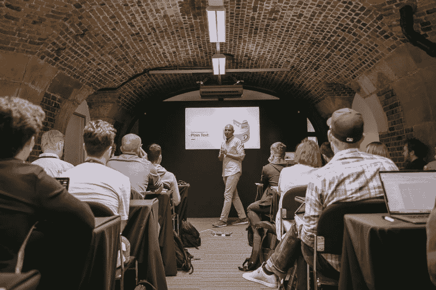
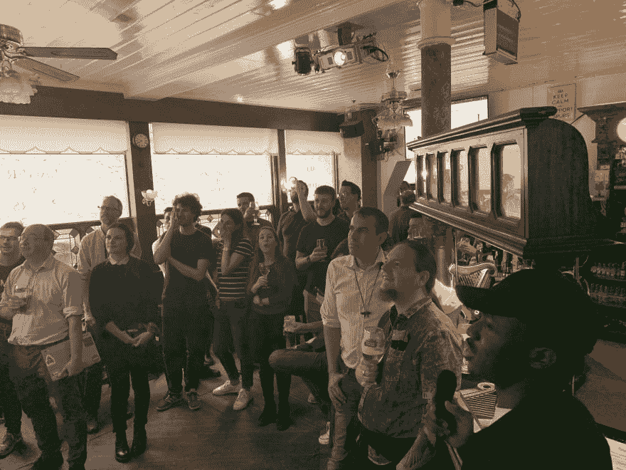
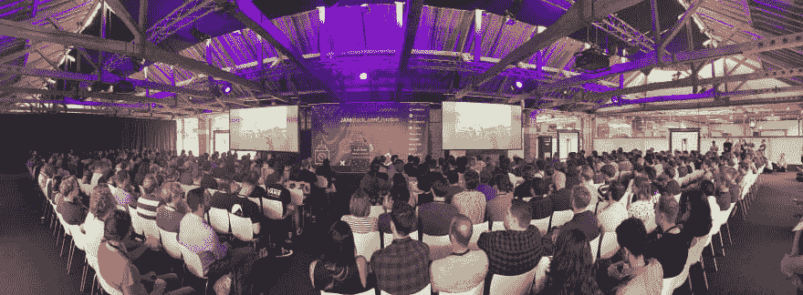
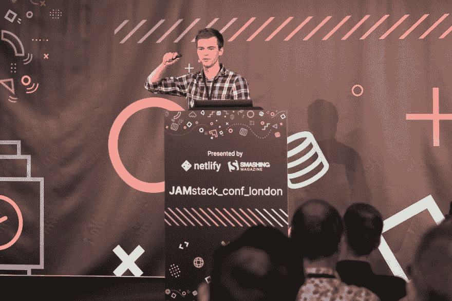
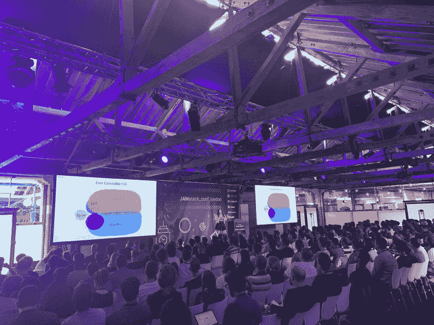
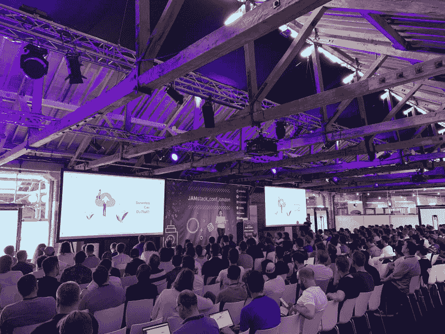
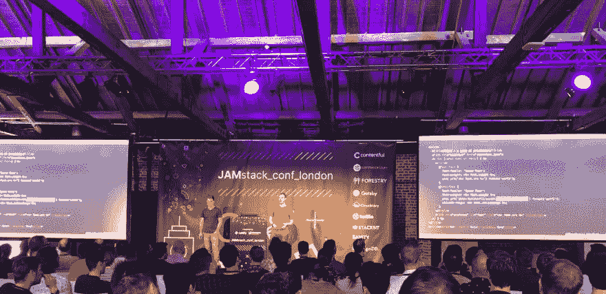
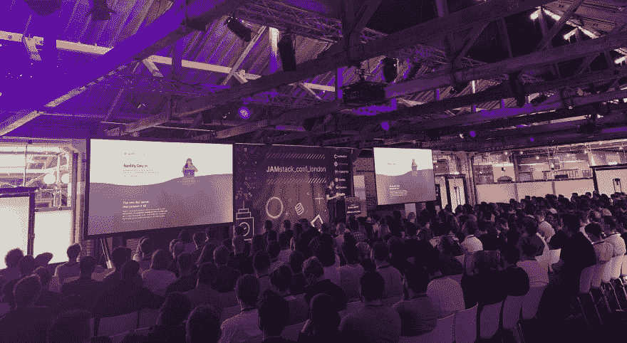
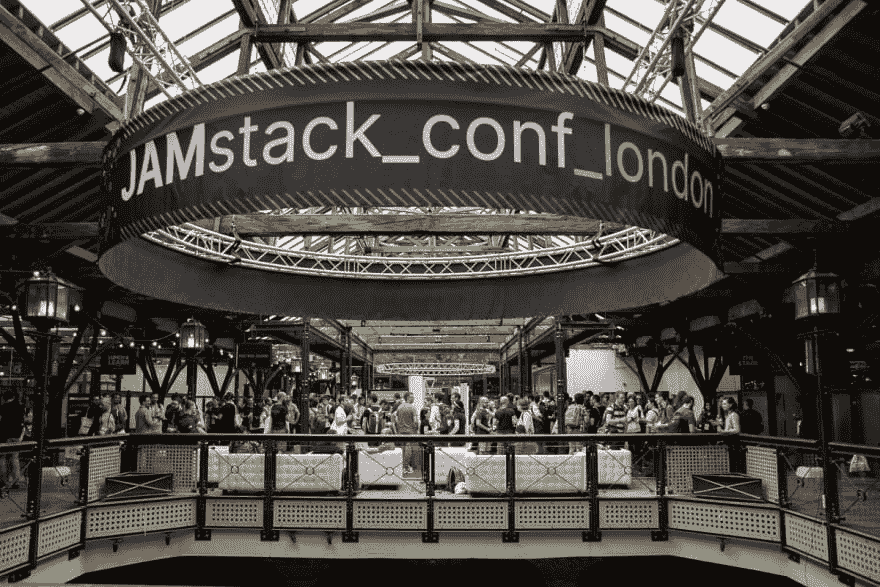

# 对伦敦首届 JAMstack 会议的思考

> 原文：<https://dev.to/philhawksworth/reflecting-on-london-s-first-jamstack-conference-13e9>

经过大量的工作和热切的期待，7 月 9 日和 10 日，第一次 JAMstack 会议来到了伦敦。我很高兴有机会主持这个活动，在参与策划了它的内容后，我对它将如何发展感到无比兴奋。

现在，经过一个周末，我的脚已经完全好了，也有了一点时间来反思，我想分享一下我对这次活动的想法。

## 发布会的前一天

大会前一天有两大活动:研讨会和欢迎招待会与闪电谈话。

在会议现场(帮助团队做最后一天的会议准备)看到所有 4 个全天的研讨会都有很多人参加并受到热烈欢迎，这是一种享受。

看到房间里充满了活动，在休息时间和一些参与者聊天是很棒的。尤其是当人们描述他们有多喜欢在工作室里学习时。我们有:

*   Jessica Parsons 详细介绍静态站点生成器以及如何使用它们。
*   Gerald Onyango 更详细地探索 Netlify，涵盖中级到高级主题，包括 Netlify 开发和 Netlify 函数。
*   [Jesse Martin](https://2019.jamstackconf.com/london/workshop-jesse-martin/?utm_source=blog&utm_medium=devto&utm_campaign=devex) 讲授使用 GraphQL 和 GraphCMS 的解耦数据架构
*   [Vitaly Friedman](https://2019.jamstackconf.com/london/workshop-vitaly-friedman/?utm_source=blog&utm_medium=devto&utm_campaign=devex) 介绍各种前端开发技术和优化。

在可用的研讨会中有各种深度和细节，这意味着人们可以获得对模型和技术的介绍，或者深入到更复杂的主题。和我聊天的人似乎找到了他们最感兴趣的水平和话题，他们沉浸其中度过了美好的一天。

## 史上最烂的卡拉 ok

研讨会结束后，在接下来的会议日之前，我们在当地的一家酒吧喝了些点心，并会见了参加会议的同事。我们还听到了 4 个闪电演讲，选自 CfP(对所有与会者开放)。选择这四个很难。但也是一种享受。正如我们在旧金山第一次 JAMstack 会议上看到的，lightning talk 提交的质量非常好。这是对热衷于 JAMstack 工作方式的社区的真实证明。将我们自己限制在 4 次谈话并不容易。

我们听到了来自以下方面的精彩演讲:

*   Josh Dzielak——我的 JSX 王国
*   杰米·布拉德利 -清理你的聚会
*   Daniel Fascia -医疗保健技术如何从 JAMStack 中获益
*   克里斯蒂安·恩万巴(Christian nwa MBA)——非洲的贾姆斯塔克州

所有人都很聪明。

这个晚上被来自 [MongoDB](https://www.mongodb.com/) 的开发者支持者 Joe Karlsson 提出的一些有趣的问题粘在了一起，他慷慨地赞助了酒会。乔的网络开发脑筋急转弯让回答最快的与会者赢得了一些[梦寐以求的 MongoDB 袜子](https://twitter.com/JoeKarlsson1/status/1148665936708329473)，也让在场的几个酒吧常客感到困惑，他们对我说这是“他们见过的最糟糕的血腥卡拉 ok”。

公平。

酒吧里的气氛活跃、有趣、友好。这是一个很好的方式去认识一些我们会在第二天的会议上更多交谈的人。

## 大喜的日子

我对会议日越来越兴奋。我必须小心，不要太自私地安排内容，只为我自己创建“完美的会议谈话播放列表”！但我相信所有人都会喜欢这里的内容和演讲者。反馈证实了这一点，其中有一些关于会谈的可爱评论，我也认为这些评论非常出色。

一个意想不到的事情是，原定发言的克里斯·科伊尔(Chris Coyier)在旅行前的一场山地车事故中受伤，很遗憾不得不取消。克里斯，曾经的职业球员，似乎更关心让人们失望的前景，而不是专注于治愈他骨折的肘部和手腕。不寒而栗！

很自然，虽然错过了与克里斯见面和联系的机会令人难过，但每个人都理解并更多地考虑他的康复。我们从舞台上给他发了一条“康复”的短信。

液体错误:内部

维塔利·弗里德曼在短时间内介入。维塔利作为“替补”上场的想法令人震惊。他是一位出色的演讲者，有丰富的相关知识和经验可供分享。我们非常幸运，他和我们在一起，还能说话。稍后会有更多的介绍。

**屋内小区**

在介绍活动的过程中，我有机会问观众，是否有人是世界各地众多 JAMstack meetups 中的一员。听到参加伦敦、巴黎、波尔图、柏林、奥斯陆、伊斯坦布尔和底特律聚会的 JAMstackers 们欢快的声音真是太棒了。我希望在未来的 JAMstack 会议上看到更多的 meetup 组织者和参与者。

其他人后来找到我，询问如何最好地开始一个本地 JAMstack 聚会(如果你感兴趣，Netlify 的社区经理 Perry 可以[帮助你开始](https://community.netlify.com/t/organizing-your-first-meetup/208/?utm_source=blog&utm_medium=devto&utm_campaign=devex))。

**萨拉·德拉斯纳-贾姆斯塔克国家**

作为会议的开场， [Sarah](https://twitter.com/sarah_edo) 做了一个演讲，不仅反映了 JAMstack 类别和社区的发展，还演示了如何通过 [Stripe](https://stripe.com) 创建一个具有电子商务集成的 JAMstack 网站。莎拉专门为这次演讲设计和构建的示例网站(与 [VueJS](https://vuejs.org/) 和 [Nuxt](https://nuxtjs.org/) )是一件美妙的事情，它突出了如今电子商务项目是多么的平易近人，因为生态系统变得越来越丰富，工具和服务随时准备帮助这种网站成为可能。

[Sarah 分享了她的代码](https://github.com/sdras/ecommerce-netlify)以供参考，这将是即将发布的视频的精彩伴奏。

**Ives van Hoorne -浏览器功能强大:在浏览器中构建代码编辑器**

基于浏览器的网络集成开发环境 [CodeSandbox](https://codesandbox.io/) 的创建者艾夫斯做了一个精彩的演讲，他分享了一些关于 CodeSandbox 项目的起源和发展的令人惊讶和鼓舞的见解。

有一些关于与项目相关的服务器成本的有趣见解，以及他如何在从最初的 10 个用户扩展到超过 100，000 个用户时，仍然保持令人难以置信的价格。他的秘密武器包括各种巧妙的方法，将工作卸载到浏览器，而不需要扩展大量的主机基础设施。

他在浏览器中的狡猾行为引起了一些人的喘息。好玩。

**Vitaly Friedman -为什么&如何将 Smashing 杂志搬到 JAMstack**

即使维塔利在最后时刻介入，你也不会知道。维塔利有丰富的经验和大量的资源来进行会议演讲。在这次会议上，Vitaly 分享了各种见解和技术，这些见解和技术是在从包括 Wordpress 在内的一系列平台到在 Netlify 上运行的 JAMstack 架构的项目中使用的。

他介绍了各种前端开发技术和性能考虑，并举例说明了它们在 smashing magazine 环境中的应用。然后用一些前后测量来加强。这为该方法提供了一个令人信服的论据。

**Ramin Bozorgzadeh - WeWork 的 JAMstack 之旅**

我喜欢在 JAMstack 聚会和会议上看到案例研究。当人们正在评估这种方法的能力和可取性时，拥有它的实际应用的例子是非常有价值的，并且往往非常有说服力。(另请参见今年早些时候 Citrix 在纽约 JAMstack _ conf】上的演示)

Ramin([we work](https://www.wework.com)的工程副总裁)的演讲正是如此。WeWork 一直在稳步地从各种单一的遗留平台向更现代的 JAMstack 架构迁移，以支持他们运营的各种网站和服务。在这次演讲中，拉明描述了那段旅程的方方面面，并谈到了在那段时间里风景是如何变化的。随着现在构成 JAMstack 生态系统重要部分的许多工具和服务的出现，WeWork 有越来越多的机会进一步进入 JAMstack 体系结构，这对其效率、性能和信心的影响似乎是显著的。

**乌纳克拉韦茨- CSS 胡迪尼今日**

Una 目前在谷歌的材料设计团队中担任开发者顾问。我经常看到她谈论 CSS 的不同方面，并且总是被她的演讲所激励和鼓舞。这没有什么不同。尤娜给她的主题带来了如此的能量和热情，以至于它真的很有感染力。这个演讲探索了 CSS Houdini 出现的可能性，并加入了实际的代码示例和演示。Una 还在 https://extra-css.netlify.com/的[分享了一组可爱的演示和资源](https://extra-css.netlify.com/)

Una 的演示包括各种各样的胡迪尼技术，但也描述了浏览器的就绪性和使用这些诱人的新工具的渐进增强的含义…这让我相当高兴。

**新美乐股份公司 Cotin - Serverless 能做到吗？！**

[新美乐股份公司](https://twitter.com/simona_cotin)对无服务器架构和工作流程有着深刻的体验和理解。作为微软的云倡导者，她在解释概念和展示使用无服务器功能构建的实际例子方面有很强的能力。

谈到无服务器，我喜欢新美乐股份公司对供应商前景的务实而全面的理解。当她描述无服务器功能模型的可负担性如何真正有助于为实验、学习和进化心智模型提供一个平台，然后在没有大量财务支出的情况下投入生产时，她积极地点头。

> “随着所有主要平台免费处理 100，000 次或更多调用，[无服务器](https://twitter.com/hashtag/serverless?src=hash)平台允许我们探索和创新”
> ——[新美乐股份公司·科廷](https://twitter.com/philhawksworth/status/1148971525934059520)

**杰克·阿奇博尔德和苏尔马——在 30 分钟内完成静态渲染**

在节目的最后，[杰克](https://twitter.com/jaffathecake)和[苏尔马](https://twitter.com/dassurma)做了一个典型的详细、精致和有趣的演讲，讲述了他们用来创建 [https://proxx.app](https://proxx.app) 的技术，这是 Windows' hay-day 中曾经流行的扫雷游戏的更新版。

Proxx 是为 Google I/O 2019 而创建的，(并且[部署和托管在 Netlify](https://www.netlify.com/blog/2019/05/08/featured-site-proxx.-a-site-by-google-chrome-labs/?utm_source=blog&utm_medium=devto&utm_campaign=devex) 上，我很自豪地说)Proxx 是作为 web 应用程序开发的一个例子而构建的，着眼于广泛的设备支持和性能。这是聪明和深思熟虑的工程的一个极好的例子。它可以在现代网络浏览器(采用了许多时髦的现代浏览器 API)上播放，也可以在功能手机上播放。杰克和苏尔马谈到了他们对印度的访问，在那里他们对印度的消费者、开发商和制约因素有了更多的了解。这确实是一个不容忽视的市场。

> "今年印度将售出 4 亿部功能手机。"
> ——[苏尔马](https://twitter.com/philhawksworth/status/1148977625869758464)

在本次会议期间，我们听到了无数减少交付和解释 JavaScript 初始负担的巧妙技术，以及各种实用且有指导意义的优化和见解。

太棒了。

## 闪电宣告和发射

让 JAMstack 如此激动人心的原因之一是工具和服务生态系统的蓬勃发展。对我来说，在活动中探索赞助商展位的感觉与许多其他活动不同，因为每个供应商都像是 JAMstack 社区中一个活跃且不断增长的成员，为我们设计项目提供了新的有趣方式。赞助商给了我一种协作和团结的感觉，这种感觉我在类似的活动中不常体验到。

但我可能会泪眼模糊。

所以在 JAMstack_conf 的这一期中，我们决定尝试一些稍微不同的东西。在避免长时间的付费产品推介(这在会议上从来不会成功)的同时，我们希望给一些供应商一个机会，在短短的 10 分钟内发布公告或推出一项功能。他们的想法是，这些公告将会得到观众和行业的重视和热情。

我们在相当紧张的 30 分钟内进行了 3 次这样的会议。它们都涉及某种现场演示，或者某个功能的现场发布。我发现观看它们令人兴奋。有:

**Sanity.io**

Knut Melvæ宣布 Sanity 是开源的 GROQ，他们的 JSON 查询语言被广泛用于 Sanity 的解耦内容管理。Knut 在舞台上现场演示了如何使用 GROQ，并讲述了它的一些更广泛的应用。[规格](https://sanity-io.github.io/GROQ/)和[更多细节](https://www.sanity.io/docs/how-queries-work)可供探索，

**堆栈位**

Stackbit 的 Ben Edwards 演示了 Stackbit 如何将不同的静态站点生成器与解耦的 CMS 工具结合起来，应用一个主题，然后部署到各种主机提供商。全部自动化且简单。真的让人印象深刻。然后 Ben 继续到[宣布在 Stackbit](https://www.stackbit.com/blog/announcing-custom-themes-and-so-much-more/) 上推出定制主题支持，这样你就可以推出你自己的主题，并通过他们的系统将它们应用到不同的静态站点生成器上。现场演示令人印象深刻，提醒我们这款产品值得关注。尤其是如果你在中介公司工作。

**Netlify**

Netlify 还利用其中一个闪电时段发布了一款新产品。[联合创始人兼首席执行官马特·比尔曼](https://twitter.com/biilmann)推出了经常被请求的 [Netlify Analytics](https://www.netlify.com/products/analytics/?utm_source=blog&utm_medium=devto&utm_campaign=devex) ，它提供服务器端分析，以衡量任何 Netlify 网站对 Netlify CDN 的请求(但没有服务器供您管理)。这消除了对客户端 JavaScript 或向第三方发送数据进行分析的需要。你可以在 Netlify 博客上的[公告中了解更多信息。](https://www.netlify.com/blog/2019/07/10/netlify-analytics---accurate-insights-without-performance-impacts/?utm_source=blog&utm_medium=devto&utm_campaign=devex)

在典型的风格中， [Matt 不仅宣布了该功能，还在舞台上现场展示了该功能，使用 Netlify 自己的部署发布机制将更新部署到 Netlify 的用户界面，然后向 jamstack.org 展示新推出的流量分析图表。](https://twitter.com/philhawksworth/status/1149664004681240577)

勇敢和有趣的观看！

## 走向未来

JAMstack_conf 的伦敦版真的让我觉得它正在蓄势待发。第一版，在旧金山，是不到一年前的 2018 年 10 月。从那以后，由于呼吁的声音很大，我们现在也在纽约举办了四月份的活动，这次是在伦敦。

有事发生了！

现在我们的注意力转向旧金山，我们的旗舰会议将于 10 月份在那里举行。然后到 2020 年。我很期待看到我们的目标是让 JAMstack_conf 访问哪些城市！

通过 JAMstack_conf Twitter 帐户: [@jamstackconf](https://twitter.com/jamstackconf) 收听早鸟票和更多信息