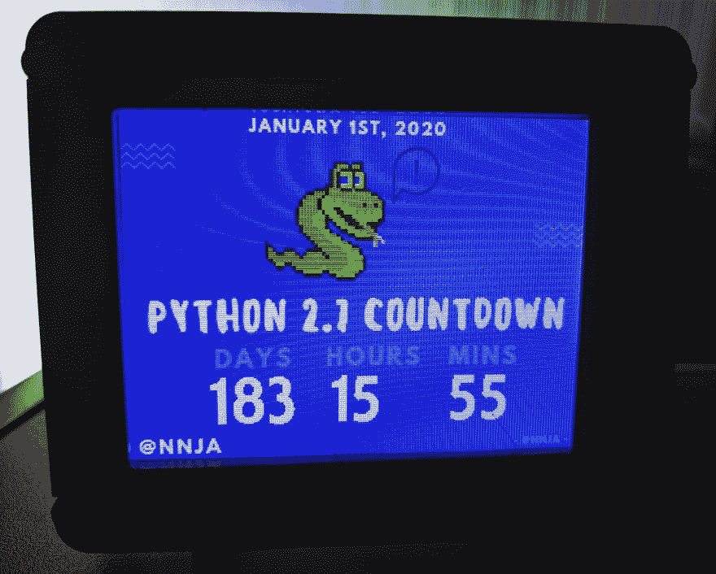
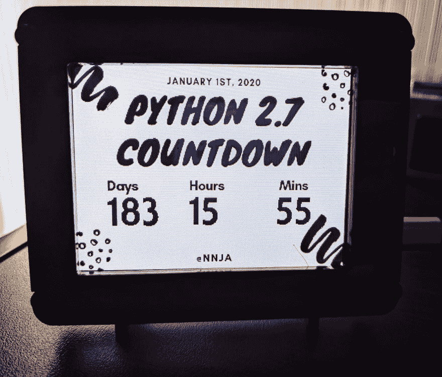
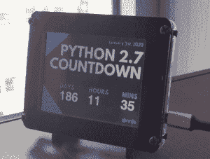

# 带有 CircuitPython 和 PyPortal 的桌面 Python 2.7 倒计时器

> 原文：<https://dev.to/nnja/a-desktop-python-2-7-countdown-timer-with-circuitpython-and-pyportal-3c6e>

## ✨Did 你知道 2020 年 1 月 1 日以后 Python 2.7 就不维护了吗？✨

受菲尔迪尼的 T2 的 Python 时钟的启发，我想为这个大事件制作一个桌面版本的 Python 2.7 倒计时器。

我的倒计时器与我的心情相匹配，有十三种不同的主题可供选择💅。

### 在行动

最重要的是，倒数计时器必须用 Python 本身编写。我使用了 [CircuitPython](https://circuitpython.org/) 和一个支持 wifi 的带触摸屏的 Adafruit [PyPortal](https://www.adafruit.com/product/4116) 。触摸屏可以让你快速切换主题。

### 主题举例

### 如何？

[PyPortal](https://www.adafruit.com/product/4116) 是一款支持 wifi 的微控制器设备，配有 3 英寸电容式触摸屏和内置的 CircuitPython。

它可以用 [CircuitPython](https://circuitpython.org/) 编程，这是 Python 的一个变种，可以用来编程微控制器，最初是从 [MicroPython](https://github.com/micropython/micropython) 派生出来的。

为了便于开发，我使用了 Visual Studio 代码的 [Python 扩展，以及](https://code.visualstudio.com/docs/languages/python?WT.mc_id=py27countdown-blog-ninaz)[工作区](https://code.visualstudio.com/docs/editor/multi-root-workspaces?WT.mc_id=py27countdown-blog-ninaz)。一个工作空间允许我将我的 PyPortal 代码与我的本地(版本受控！)代码库。

### 给我看看代码！

我的 GitHub 上有一个仓库，里面有你需要的所有代码和设置说明，可以让你自己的倒计时钟正常工作。

## [nnja](https://github.com/nnja)/[py27 _ 倒计时](https://github.com/nnja/py27_countdown)

### PyPortal Python 2.7 桌面倒计时钟

<article class="markdown-body entry-content container-lg" itemprop="text">

# Python 2.7 桌面倒计时定时器，带 PyPortal + CircuitPython

<g-emoji class="g-emoji" alias="snake" fallback-src="https://github.githubassets.cimg/icons/emoji/unicode/1f40d.png">🐍</g-emoji><g-emoji class="g-emoji" alias="sparkles" fallback-src="https://github.githubassets.cimg/icons/emoji/unicode/2728.png">✨</g-emoji>2020 年后不再维护 Python 2.7。 <g-emoji class="g-emoji" alias="sparkles" fallback-src="https://github.githubassets.cimg/icons/emoji/unicode/2728.png">✨</g-emoji>

<g-emoji class="g-emoji" alias="timer_clock" fallback-src="https://github.githubassets.cimg/icons/emoji/unicode/23f2.png">⏲</g-emoji>翘首以待 Python 2.7 的退役？使用 [Adafruit PyPortal](https://www.adafruit.com/product/4116) 在你的桌面上显示大事件的倒计时。

<g-emoji class="g-emoji" alias="nail_care" fallback-src="https://github.githubassets.cimg/icons/emoji/unicode/1f485.png">💅</g-emoji>十三个主题让你的倒计时器与你的心情相匹配。通过按触摸屏的左右两侧选择您的主题。

<g-emoji class="g-emoji" alias="purple_heart" fallback-src="https://github.githubassets.cimg/icons/emoji/unicode/1f49c.png">💜</g-emoji>作者尼娜·扎哈伦科。保持联系:

*   Twitter - [@nnja](https://twitter.com/nnja)
*   博客-nnja。我
*   [#推特上的 python hardware](https://twitter.com/search?f=tweets&q=%23PythonHardware&src=typd)

### <g-emoji class="g-emoji" alias="tv" fallback-src="https://github.githubassets.cimg/icons/emoji/unicode/1f4fa.png">📺</g-emoji>在行动！

## 目录

*   [关于 PyPortal 和 CircuitPython](https://raw.githubusercontent.com/nnja/py27_countdown/master/#about-pyportal-and-circuitpython)
*   [关于主题](https://raw.githubusercontent.com/nnja/py27_countdown/master/#about-themes)
*   [依赖项和库](https://raw.githubusercontent.com/nnja/py27_countdown/master/#dependencies-and-libraries)
*   [添加新字体和主题](https://raw.githubusercontent.com/nnja/py27_countdown/master/#adding-new-fonts-and-themes)
*   [贡献和信用](https://raw.githubusercontent.com/nnja/py27_countdown/master/#contributions-and-credits)

### 关于 PyPortal 和 CircuitPython

这段代码应该在 PyPortal 上运行。

一款 [Adafruit PyPortal](https://www.adafruit.com/product/4116) 是一款支持 wifi 的微控制器设备，配有 3 英寸电容式触摸屏和内置 CircuitPython。

它可以用 [CircuitPython](https://circuitpython.org/) 编程，这是 Python 的一个变种，可以…

</article>

[View on GitHub](https://github.com/nnja/py27_countdown)

### 进行切换

您可能会感到惊讶，但是 Python 3.0 已经有十多年的历史了。Python 2.7 的支持原本应该在 2015 年停止，但是最后期限又延长了 5 年到 2020 年，以提供充足的时间进行转换。

在过去的十年中，维护 Python 2 一直是核心开发人员、库作者以及其他志愿者和开源贡献者的压力，正是他们让这种语言变得伟大。

由于对 Python 2.7 的支持将在 2020 年结束，预计主要的软件包也会结束对 Python 2.7 的支持，比如 Tensorflow、PyTest 和[等等](https://python3statement.org/)。

> @ gvanrossum记住 Python 2 将在 2020 年 1 月 1 日到达生命的尽头。对*你*项目的影响见[python3statement.org](https://t.co/giiS9CNn8V)2019 年 5 月 28 日 22:11 点

是时候告别过去，展望未来，支持您可能会错过的难以置信的功能，如 [f 弦](https://docs.python.org/3/whatsnew/3.6.html#pep-498-formatted-string-literals)。

如果您还没有开始迁移，为什么还要等待呢？不要拖延。在这篇博文发表的时候，你还有 169 天的时间。