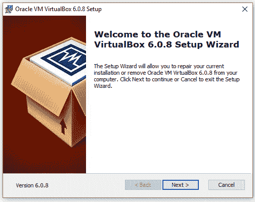
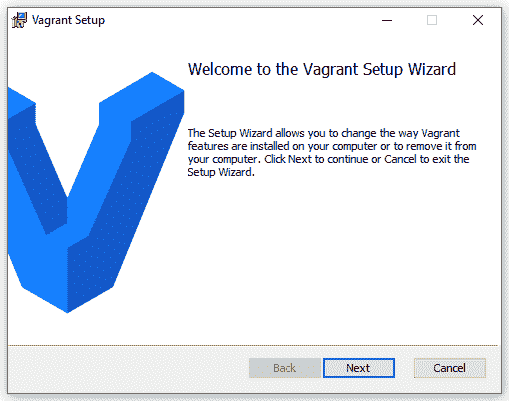
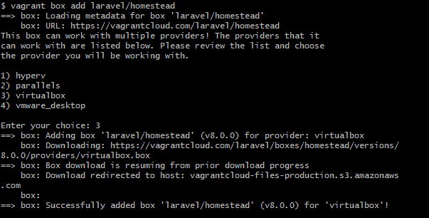
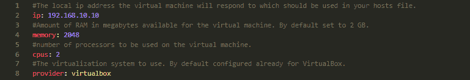
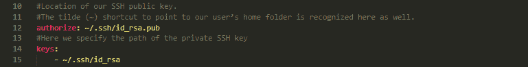
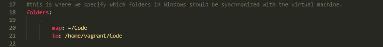
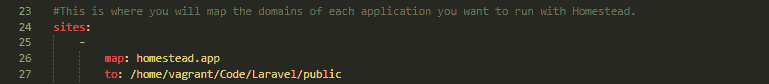
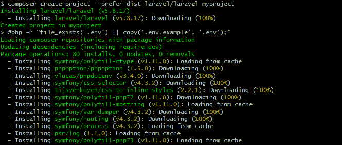
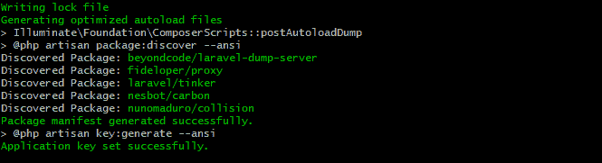

# 用 Laravel Homestead 安装虚拟环境-教程

> 原文：<https://dev.to/lvtdeveloper/installing-virtual-environment-with-laravel-homestead-tutorial-4p32>

使用虚拟环境当你在开发领域工作时，这是非常常见的，因为有太多的理由使用它，例如，如果你需要在不同的操作系统上工作，也许你想在 Windows 上使用 Linux，即使你在相同的操作系统上工作，但应用程序不支持最新版本，你可以在虚拟机上的旧版本上运行它。

以下是使用虚拟机的一些好处:

我们可以在同一台物理机上的不同虚拟机上同时运行不同的操作系统。在转移到生产环境之前，我们可以先有测试环境。
·更好地利用共享资源。
通过减少物理基础设施来降低数据中心的成本。
我们可以在不同的硬件上使用相同的虚拟机配置。

虚拟机的使用也有缺点，比如它们不如真实机器有效，因为它们间接访问硬件。在主机操作系统上运行软件意味着它必须向主机请求访问硬件。这将降低可用性，但即使如此，它也是值得使用的。

安装虚拟机似乎很难，但事实并非如此，所以让我们从教程开始吧！

**安装 VirtualBox**

Virtual Box 是一种虚拟化软件，允许我们在其中安装操作系统，它是一种开源软件，可以在 Linux、Windows 和 Mac 等主流操作系统中运行。正因为如此，它是本教程的完美选择。

首先，我们需要去:
[https://www.virtualbox.org/wiki/Downloads](https://www.virtualbox.org/wiki/Downloads)
为你的平台选择一个 VirtualBox 并安装它。确保您下载了适用于您的操作系统的正确版本。
对于 Linux[https://www.virtualbox.org/wiki/Linux_Downloads](https://www.virtualbox.org/wiki/Linux_Downloads)
如果你用的是 Windows，双击。exe 安装文件来安装 VirtualBox。

如果你使用的是 Mac，只需打开 VirtualBox。dmg 文件，然后单击。要安装的 pkg 文件。

**安装流浪汉**

流浪者是将在我们的虚拟机提供商和我们之间的软件。它允许我们以声明的方式创建虚拟机，因为它通过一个工具和一个配置文件来自动化一切。在这个文件中，我们声明我们想要我们的虚拟机。由于这些配置文件可以存储在存储库中并被共享，因此每个人都有相同的环境，所以它也是可移植的。

下一步是安装流浪者。
流浪者作品在 Mac，Linux，Windows 上。
请转到 http://www.vagrantup.com/downloads.html 的[页面，选择适合您的操作系统的选项。](http://www.vagrantup.com/downloads.html)

**安装家园**

Homestead 是一个预打包的流浪包，提供了一个很好的开发环境，不需要安装 PHP。您可以通过克隆 Homestead 存储库来安装 Homestead。如果您的系统上没有 Git，您需要先安装它。

请前往:[https://git-scm.com/downloads](https://git-scm.com/downloads)

安装上述软件后，您需要将 laravel/homestead 框添加到您的流浪安装中。为此，请运行以下命令:

$流浪者之家添加 laravel/家园

加载元数据后，系统会提示您选择 Hyperv、Parallels、Virtualbox 或 vmware_desktop，输入 3 并按回车键。

现在，在您想要的目录中打开 Git Bash，通过运行以下命令克隆 Homestead 存储库:

$ git 克隆[https://github.com/laravel/homestead.git](https://github.com/laravel/homestead.git)家园

下载完成后，转到 Homestead 目录并运行以下命令:

$ bash 初始化. sh

这将创建 Homestead.yaml 文件。Homestead.yaml 文件将放在您的∽/中。家园目录。

请注意∾/。家园目录是默认隐藏的，确保你能看到隐藏的文件。

**配置 Homestead.yaml 文件**

打开 Homestead.yml 文件，该文件位于 Homestead 目录中。

如您所见，我们可以配置虚拟机的 IP 地址、内存、CPU 和提供商。在这里你可以随意分配你的资源。

我们需要为 Homestead 生成一个 SSH 密钥来认证用户并连接到虚拟机。如果您正在使用 Git，您可能已经有了一个 SSH 密钥。如果没有，只需运行这个命令来生成它:
ssh-keygen-t RSA-b 4096-C[your_email@example.com](mailto:your_email@example.com)T3】该命令将为您生成一个 SSH 密钥，并将其放在∽/中。ssh 目录，你不需要做任何其他事情。

我们使用文件夹部分来指定要与我们的家园环境共享的目录。如果我们在本地机器上添加、编辑或更改任何文件，这些文件将在我们的 Homestead 虚拟机上自动更新。

这一部分允许我们将一个域映射到虚拟机上的一个文件夹。例如，我们可以将 homestead.app 映射到我们的 Laravel 项目的公共文件夹中，然后我们可以通过这个地址轻松访问我们的 Laravel app:“[http://homestead . app](http://homestead.app)”。

请记住，当我们添加任何域时，我们必须编辑本地机器上的 hosts 文件，以便将请求重定向到我们的家园环境。

在 OS X 和 Linux 上，它位于/etc/host 中

在 Windows 上，您可以在 C:Windows system 32 \ drivers \ etc \ hosts 中找到 hosts 文件。

打开文件后，您需要在文件末尾添加这一行:

homestead.app

我们已经完成了 Homestead.yam 文件的基本配置。

一旦我们编辑了 Homestead.yaml 文件，cd 到 Homestead 目录，运行以下命令来引导我们的虚拟机:

$流浪起来

您还可以通过以下命令在虚拟机中使用 SSH:

$流浪儿嘘

**安装拉索**

Laravel 通常是最有用的框架，因为它是具有复杂后端需求的项目的正确选择。在使用 Laravel 之前，请确保您的计算机上安装了 Composer。

[https://get omposer . org/doc/00-intro . MD](https://getcomposer.org/doc/00-intro.md)

安装 Composer 后，转到您在 Homestead.yaml 文件中配置的项目文件夹，在终端中发出以下命令创建一个新项目:

composer create-project-prefere-dist laravel/laravel my project

搞定了。现在，您可以在内部构建您的应用程序。

感谢阅读！编码员们，祝你们愉快💜