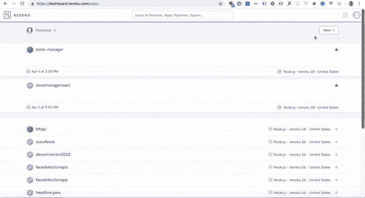
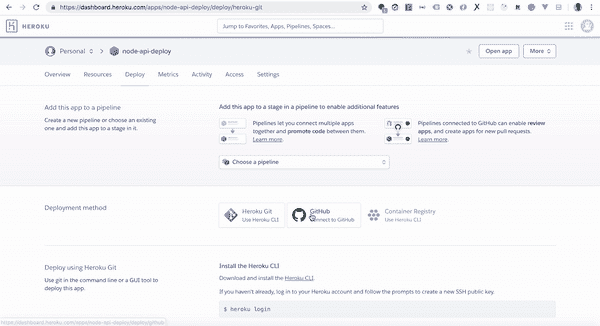
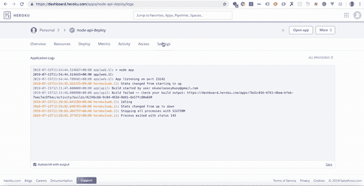
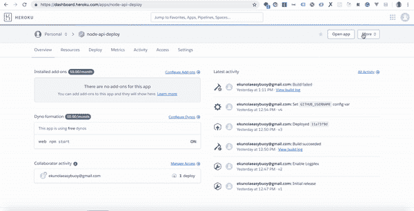

# 将节点应用程序部署到 Heroku

> 原文：<https://dev.to/easybuoy/deploying-node-app-to-heroku-286n>

我将带领大家完成在 Heroku 部署 Node 应用程序的过程。

我们将介绍两种不同的方式，包括:

*   使用 Github 部署
*   使用命令行界面(CLI)部署

# 使用 Github 部署

首要任务是将您的代码推送到 Github。我将使用这个[库](https://github.com/Easybuoy/node-api-deploy/)进行部署。

如果您还没有他们的帐户，请在 Heroku 上注册。

注册后，按照以下步骤在您的仪表板上创建一个应用程序

*   点击页面右上角的**新建**按钮，您应该会看到一个带有**创建新应用**的下拉菜单
*   点击**创建新的 App**
*   提供您希望为应用程序指定的名称(您的应用程序名称必须是小写的)
*   最后，点击**创建**按钮来创建新的应用程序。

下面是一个例子
[](https://res.cloudinary.com/practicaldev/image/fetch/s--gP9U17P0--/c_limit%2Cf_auto%2Cfl_progressive%2Cq_66%2Cw_880/https://thepracticaldev.s3.amazonaws.com/i/elb9vh182tp04p9fqgs6.gif)

创建应用程序后，在 deploy 部分，将您的 Github 帐户连接到 Heroku 并部署应用程序。请参见下面的示例。

[](https://res.cloudinary.com/practicaldev/image/fetch/s--1Lh_IqMf--/c_limit%2Cf_auto%2Cfl_progressive%2Cq_66%2Cw_880/https://thepracticaldev.s3.amazonaws.com/i/xeekgbjyil3khmiic71w.gif)

部署完成后，您可以点击查看应用程序，就这样，我们已经使用 Github 成功部署了。

> 注意:Heroku 在 package.json 文件中查找一个`start`脚本，并运行该脚本来启动您的应用程序。下面是启动脚本命令的示例。

```
"start": "node app.js" 
```

如果您想使用另一个脚本来启动您的应用程序，请向下滚动到下面的 **Procfile** 部分。

# 使用 CLI 部署

浏览[此处](https://devcenter.heroku.com/articles/heroku-cli)为您的操作系统下载 Heroku-CLI。

*   在本地机器上安装 Heroku-CLI

*   在您的终端/命令行上运行以下命令，登录 heroku。

```
heroku login 
```

*   按照指示按下终端上的任意键，您应该会被导航到您的浏览器，在那里您会看到一个登录页面，输入您的登录详细信息，关闭浏览器并返回到您的终端。您应该已经登录。

如果您想通过终端登录，而不被重定向到浏览器，您可以运行下面的命令

```
heroku login -i 
```

*   运行下面的命令在 Heroku 上创建一个应用程序，

```
heroku create node-api-deploy 
```

> 注意:上面命令中的`node-api-deploy`是我们正在创建的应用程序的名称，如果我们只运行`Heroku create`，Heroku 将为我们的应用程序生成一个随机名称。

*   将 git remote 添加到我们刚刚在 Heroku 上创建的应用程序中

```
heroku git:remote -a node-api-deploy 
```

*   添加文件并提交
*   推送文件

```
git add .
git commit -m "Deploy"
git push heroku master 
```

推送过程完成后，您可以运行以下命令在浏览器上查看您的应用。

```
heroku open 
```

### 环境变量

为了在 Heroku 上添加环境变量，我们将使用以下步骤

*   转到设置
*   点击`reveal-config-vars`
*   添加环境变量
*   您可以遵循下图所示的示例*

[](https://res.cloudinary.com/practicaldev/image/fetch/s--CyeL-w2Z--/c_limit%2Cf_auto%2Cfl_progressive%2Cq_66%2Cw_880/https://thepracticaldev.s3.amazonaws.com/i/r5evxzhymzsm2huc4t1v.gif)

使用 CLI 添加环境变量

```
heroku config:set GITHUB_USERNAME=easybuoy 
```

获取环境变量

```
heroku config:get GITHUB_USERNAME 
```

> 点击了解更多关于环境变量[的信息](https://devcenter.heroku.com/articles/config-vars)

### Heroku 日志

通过`Heroku's web interface`查看 Heroku 上的日志

*   点击设置
*   点击下面的`view logs`示例。

[](https://res.cloudinary.com/practicaldev/image/fetch/s--NV_sO7ck--/c_limit%2Cf_auto%2Cfl_progressive%2Cq_66%2Cw_880/https://thepracticaldev.s3.amazonaws.com/i/52onozq39bx20m0e1p2n.gif)

通过 CLI 查看 Heroku 上的日志

*   登录 Heroku 应用程序后，运行

```
heroku logs --tail 
```

### Procfile

一个 *Procfile* 是一个指定应用程序在启动时执行的命令的文件。

例如，如果您想在部署时运行一个`server`脚本而不是`start`脚本，您可以指定一个 web 命令

```
web: npm run server 
```

> 点击了解更多关于 Heroku Procfile [的信息](https://devcenter.heroku.com/articles/procfile)

# 结论

在本教程中，我们学习了如何使用 Github 和命令行界面部署节点应用程序。

如果您对本文有任何问题或反馈，请随时联系我们。
感谢阅读。