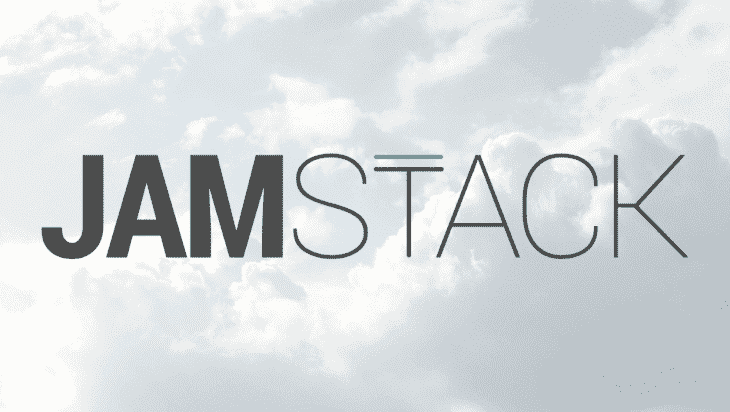
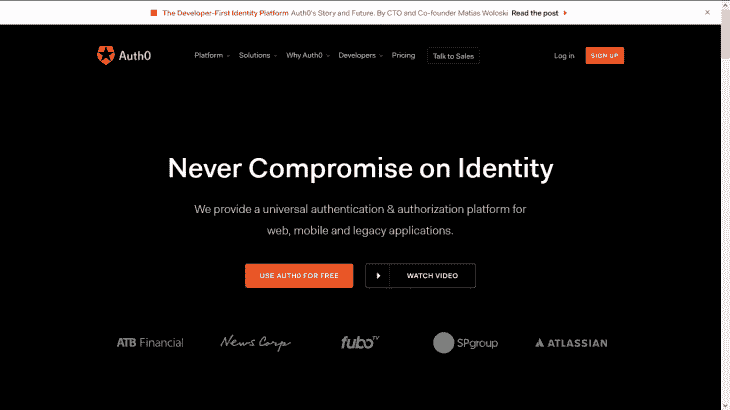
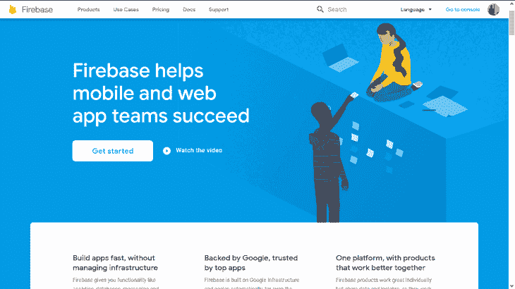
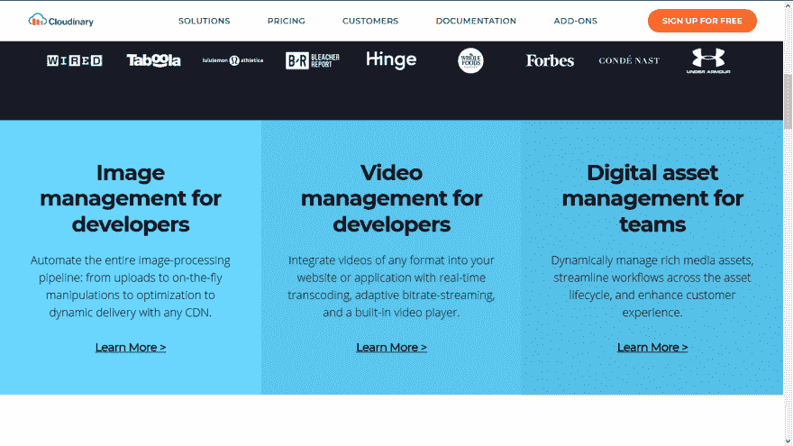
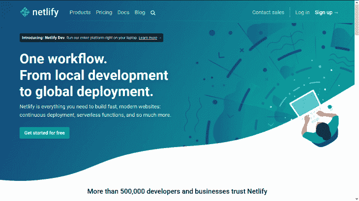
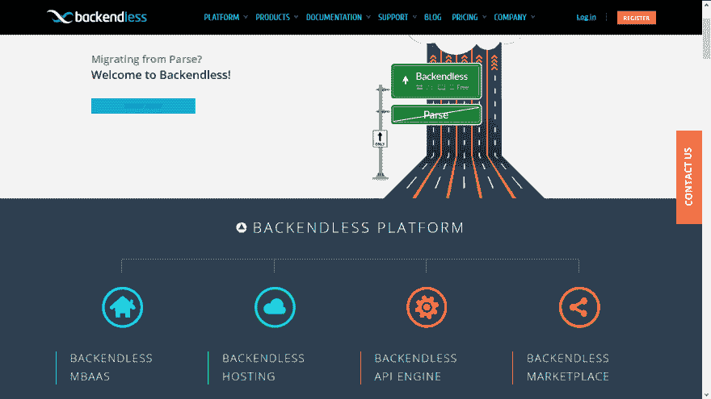
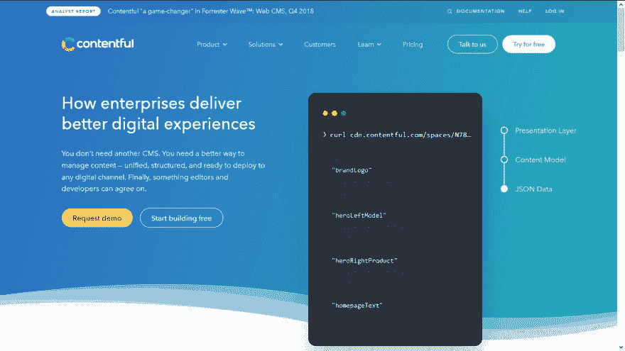

# 构建 JAMstack 应用程序时需要了解的有用 API

> 原文：<https://dev.to/bnevilleoneill/useful-apis-to-know-when-building-a-jamstack-app-2gbc>

JAMstack 是一种构建网站和应用程序的新方法，可以提供更好的性能、更高的安全性、更低的扩展成本和更好的开发人员体验。它通过将大多数关键功能保留在客户端并将所有其他功能抽象给第三方 API 来实现这一点。基本上，所有繁重的工作都由 API 来完成。

这不仅仅是一种新趋势，它实际上正在改变我们思考和构建网络的方式。关于为什么应该使用 JAMstack 的更多信息，请查看这篇文章。

在本文中，我们将关注帮助 JAMstack 实现其速度的一些第三方 API(服务产品)。

## “即服务”产品

通常，我们在会议或脱口秀上经常听到“作为服务”的说法，但是将产品作为服务意味着什么呢？当该术语用在一个词之前时，它通常与客户从云中获得的东西相关联，这意味着它不需要安装在系统上。

既然我们已经弄清楚了这一点，让我们来看看一些有助于使 JAMstack 应用程序易于使用的服务。

## 认证

如果您曾经尝试过构建自己的认证系统，您会知道这是一项繁重的工作，而且压力很大，有些人可能会说，很可怕。我个人喜欢我再也不会写一个认证系统了。让我们看看一些出色的身份认证即服务平台。

### Auth0

Auth0 是一个认证和授权管理平台，可用于网络、物联网、移动设备和传统应用。企业通用身份平台支持 B2B、B2C、B2E 以及这些平台的组合。

该平台非常适合开发人员，允许他们通过不同平台上的各种身份提供者来验证 API 和应用程序。该软件解决方案还使用先进的技术和最佳实践来帮助客户遵守最严格的行业法规和标准。

它还附带了简单易懂的文档。Auth0 公开了两个[API](https://auth0.com/docs/api/authentication#base-url)供开发人员在他们的应用中使用:

*   **认证**:处理与身份相关的任务
*   **管理**:处理你的 Auth0 账户的管理

### 火基

Firebase 是一个后端即服务(BaaS)平台，它有很多很酷的 T2 API(T3 ),所以它可以用于不同的目的，比如实时数据库、文件存储，当然还有授权。

Firebase Authentication 提供后端服务、易于使用的 SDK 和现成的 UI 库，用于向您的应用程序验证用户。它支持使用密码、电话号码、流行的联合身份提供商(如谷歌、脸书和 Twitter)等进行身份认证。

它与其他 Firebase 服务紧密集成，并利用 OAuth 2.0 和 [OpenID Connect](https://openid.net/connect/) 等行业标准，因此它可以轻松地与您的定制后端集成。它带有一个非常简单易用的 API，适用于各种平台(web、iOS、Android)。

您可以在[文档](https://firebase.google.com/docs/auth)中找到实现。

## 媒体存储/优化

当涉及到交付和优化时，处理网络上的媒体是一项繁重的工作。似乎不可能总是知道什么样的质量或格式最适合各种平台:建立一个网站很酷，但拥有经过优化的吸引人的图像更棒。让我们来看看一些有助于为用户创造更好的图像体验的有用平台。

### 云淡风轻

[Cloudinary](https://cloudinary.com) 是一款适用于您的网站和移动应用的端到端图像管理解决方案。Cloudinary 涵盖了从图像上传、存储、操作、优化到交付的所有内容。您可以轻松地将图像上传到云，自动执行智能图像操作，而无需安装任何复杂的软件。

除了保存图像，Cloudinary 还有助于执行[转换](https://cloudinary.com/documentation/image_transformations)，操作您的图像以适应您的网站或移动应用程序的图形设计。这些转变也包括视频。他们最近推出了一个动态媒体平台，可以自动化许多媒体管理组件，因此您无需构建它们。这个平台拥有全面的[文档](https://cloudinary.com/documentation)和 SDK 来帮助快速构建，并且易于设置。

## 即时部署

### Netlify

Netlify 是一家云计算公司，为静态网站提供托管和无服务器后端服务。它[的特点是从 Git](https://www.netlify.com/docs/continuous-deployment/) 到全球应用交付网络的持续部署，无服务器表单处理，对 AWS Lambda 功能的支持，以及与[让我们加密](https://letsencrypt.org/)的完全集成。

Netlify 是一种很酷的新方法，可以直接从您的 Git 存储库部署站点，这个存储库来自于您选择的触发构建的分支，它用简单的步骤来处理这个问题。[使用 Netlify 开始](https://www.netlify.com/docs/)部署您的 JAMstack 应用。它还有其他值得一试的特性。

## 后端服务

### 溯无止境

通过使用所谓的 API 引擎， [Backendless](https://backendless.com/) API 为运行在 Backendless 中的服务处理客户端 API 的生成和管理。

现在，您可以将自己的服务器端代码部署到 API 引擎中，它会自动为运行在 API 引擎中的服务器端代码生成[API](https://backendless.com/products/documentation/)和本地库，这在您尝试从本地服务器客户端转换平台时会很方便。

## 表单处理

### 字体

Typeform 使收集和分享信息变得既舒适又有对话性。这是一个基于网络的平台，你可以用它来创建从调查到应用的任何东西，而不需要写一行代码。在线表单很无聊——打字表单通过使用酷的转换来解决这个问题。

它有一些很棒的特性，比如创建自己的表单 API 和用响应 API 访问表单数据。通过阅读[文档](https://developer.typeform.com/get-started/)学习使用该服务。

## 无头 CMS

### 心满意足

这是一个强大的数字工具，用于存储和管理组成您的网站或应用程序的组件，这些组件可以在任何设备上交付内容。与其他 CMS 相比，Contentful 的优势在于内容被组织成更小的部分，这使得它更加灵活。它还可以保护您的内容安全。

该平台是云原生的，这意味着内容存储在云中。它有一个简单的方法来实现 API，包括内容管理 API (CMA)，内容交付 API (CDA)，内容预览 API (CPA)。

关于如何实施的更多信息可以在[文档](https://www.contentful.com/developers/docs/)中找到。

## 结论

将功能抽象到第三方 API 以提高 JAMstack 的性能和安全性是它的关键特性之一。我分享了一些我用来创建超棒的高速应用程序的 API，我强烈建议在构建时检查这些 API。

* * *

## Plug: [LogRocket](https://logrocket.com/signup/) ，一款适用于网络应用的 DVR

[log rocket](https://logrocket.com/signup/)是一个前端日志工具，让你重放问题，就像它们发生在你自己的浏览器中一样。LogRocket 不需要猜测错误发生的原因，也不需要向用户询问截图和日志转储，而是让您重放会话以快速了解哪里出错了。它可以与任何应用程序完美配合，不管是什么框架，并且有插件可以记录来自 Redux、Vuex 和@ngrx/store 的额外上下文。

除了记录 Redux 动作和状态，LogRocket 还记录控制台日志、JavaScript 错误、stacktraces、带有头+体的网络请求/响应、浏览器元数据、自定义日志。它还使用 DOM 来记录页面上的 HTML 和 CSS，甚至为最复杂的单页面应用程序重新创建像素级完美视频。

[免费试用](https://logrocket.com/signup/)。

* * *

帖子[构建 JAMstack 应用程序时需要知道的有用 API](https://blog.logrocket.com/jamstack-app-apis/)首先出现在[日志博客](https://blog.logrocket.com)上。