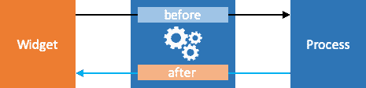

# 在 Dojo 流程中使用中间件

> 原文：<https://dev.to/odoenet/using-middleware-with-dojo-processes-1bd0>

我们之前看了如何在 Dojo 中用[进程和存储](https://learn-dojo.com/maintain-state-with-dojo-stores)来管理状态。这不仅是一种管理应用程序状态的灵活方式，而且为您提供了一些能够深入应用程序业务的方法。

当您开始获取数据和完成获取数据时，您可能希望管理应用程序中的某些状态。您可以尝试在小部件本身或者在过程中管理它。不过这有点棘手。每个进程都可以更新存储，您甚至可以同时运行多个进程，但它被视为单个事务。所以你不能真的开始一个进程，改变`loading`状态，并在完成后以一种在单个事务中更新你的小部件的方式把它改回来。

```
// src/processes/starwarsProcesses.ts
const fetchItems = commandFactory<Item>(async ({ path }) => {
  // where do we change the starting state?
  const response = await fetch("https://swapi.co/api/");
  const json = await response.json();
  const items: Item[] = Object.keys(json).map(key => {
    return {
      label: key,
      value: json[key]
    };
  });
  // this workflow doesn't work, the widget never gets the 'true' state
  // this is a single transaction
  return [
    replace(path("loading"), true),
    replace(path("items"), items),
    replace(path("loading"), false)
  ];
}); 
```

<svg width="20px" height="20px" viewBox="0 0 24 24" class="highlight-action crayons-icon highlight-action--fullscreen-on"><title>Enter fullscreen mode</title></svg> <svg width="20px" height="20px" viewBox="0 0 24 24" class="highlight-action crayons-icon highlight-action--fullscreen-off"><title>Exit fullscreen mode</title></svg>

## 中间件

但是不要害怕！Dojo 为您提供了一种在流程上运行一些中间件的方法，来做各种很酷的事情！这里有一些更详细的信息。

使用中间件可以完成什么样的任务？

*   转换获取的流程结果。
*   验证传递给进程的参数。
*   定义装载状态。
*   添加日志记录和遥测。
*   运行时缓存。

我相信你能想到更多的用途！

中间件 API 允许您提供`after`和`before`方法。所以在我上面的用例中，我们可以在流程开始之前和之后更新流程的`loading`状态。

[](https://res.cloudinary.com/practicaldev/image/fetch/s--N8IuLz12--/c_limit%2Cf_auto%2Cfl_progressive%2Cq_auto%2Cw_880/https://thepracticaldev.s3.amazonaws.com/i/v3035mcjfw54012rulg5.png)

要更新一些加载状态，可能是这样的！

```
// src/processes/starWarsProcess.ts
const progress: ProcessCallback = () => ({
  before(payload, { apply, path }) {
    // update the app store before the process is run
    apply([replace(path("loading"), true)], true);
  },
  after(error, { apply, path }) {
    // update the app store when process is finished
    apply([replace(path("loading"), false)], true);
  }
}); 
```

<svg width="20px" height="20px" viewBox="0 0 24 24" class="highlight-action crayons-icon highlight-action--fullscreen-on"><title>Enter fullscreen mode</title></svg> <svg width="20px" height="20px" viewBox="0 0 24 24" class="highlight-action crayons-icon highlight-action--fullscreen-off"><title>Exit fullscreen mode</title></svg>

在中间件方法中，我们被赋予一个`apply`和一个`path`。`apply`让我们*对商店应用*操作，`path`让我们选择我们想要操作的属性。在这种情况下，我们可以使用`replace`操作来*更新*一个现有的属性。此状态更新将传播到正在使用此存储的应用程序的任何其他部分。

现在我们可以更新流程来使用这个中间件了！

```
// src/processes/starWarsProcess.ts
export const fetchItemsProcess = createProcess(
  "fetch-items", // process name
  [fetchItems],  // command
  [progress]     // middleware
); 
```

<svg width="20px" height="20px" viewBox="0 0 24 24" class="highlight-action crayons-icon highlight-action--fullscreen-on"><title>Enter fullscreen mode</title></svg> <svg width="20px" height="20px" viewBox="0 0 24 24" class="highlight-action crayons-icon highlight-action--fullscreen-off"><title>Exit fullscreen mode</title></svg>

有了中间件，我们可以更新小部件，这样它就可以识别何时获取数据。

```
// src/widgets/APIExplorer.tsx
export class APIExplorer extends WidgetBase<ExplorerProperties> {
  ...
  render() {
    return (
      ...
      <TextArea
       rows={25}
       theme={theme}
       value={loading ? "Loading..." : result}
      />
      ...
    );
  }
  ...
} 
```

<svg width="20px" height="20px" viewBox="0 0 24 24" class="highlight-action crayons-icon highlight-action--fullscreen-on"><title>Enter fullscreen mode</title></svg> <svg width="20px" height="20px" viewBox="0 0 24 24" class="highlight-action crayons-icon highlight-action--fullscreen-off"><title>Exit fullscreen mode</title></svg>

现在在小部件中，如果 store `loading`状态为真，我们可以显示一些加载文本，如果没有加载，我们可以显示结果！

你可以在这里看到它的样子！

[https://codesandbox.io/embed/dojo-stores-middleware-ho8kn?module=/src/processes/starwarsProcesses.ts](https://codesandbox.io/embed/dojo-stores-middleware-ho8kn?module=/src/processes/starwarsProcesses.ts)

## 总结

在我们的应用程序状态中拥有 after/before 中间件的能力不仅实用，而且非常灵活。我们只是触及了您可以用 Dojo 中间件做的事情的表面，但是我对这些可能性感到兴奋，我相信您也一样！