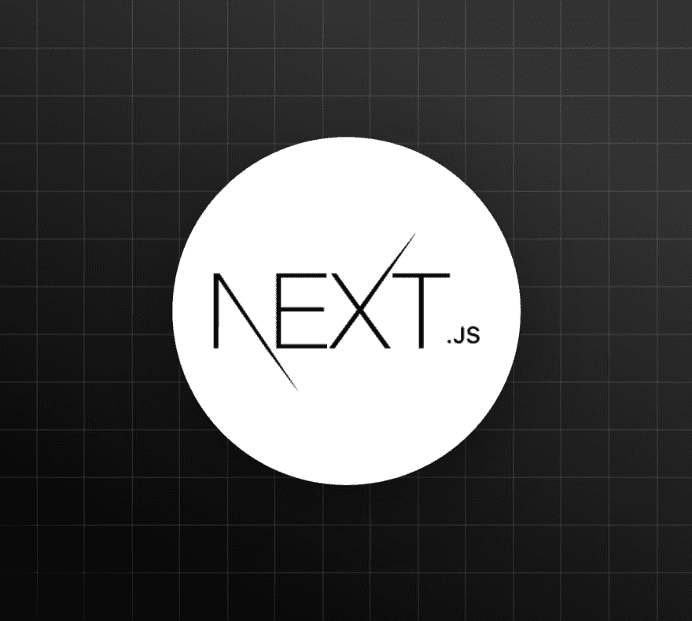

# Next.js 实用介绍:页面和布局

> 原文：<https://dev.to/auth0/next-js-practical-introduction-pages-and-layout-7ec>

在本教程系列中，将为您提供一个关于 Next.js 如何帮助您构建 web 应用程序的实用介绍。

Next.js 由 ZEIT(一家托管前端和无服务器功能的云公司)创建，是一个 React 框架，能够创建在客户端和服务器上运行的应用程序，也称为通用 JavaScript 应用程序。该框架通过简化客户端路由和页面布局等基本功能，同时简化服务器端渲染和代码拆分等高级功能，帮助您更快地构建通用应用。

在本系列的第一部分中，您将学习如何使用 Next.js 9 创建页面和页面布局，这是撰写本文时最新的框架版本。建议熟悉 React 库。

[读于](https://auth0.com/blog/next-js-practical-introduction-for-react-developers-part-1/?utm_source=dev&utm_medium=sc&utm_campaign=nextjs-tutp1)

