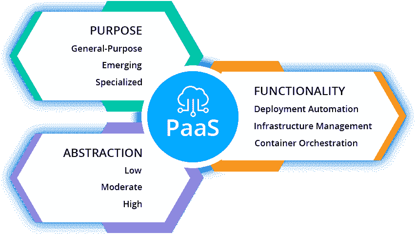

# 什么是 PaaS？解释了平台即服务类型

> 原文：<https://dev.to/tetiana_ftv/what-is-paas-platform-as-a-service-types-explained-384o>

没有适合所有人的单一 PaaS。甚至这种云计算服务模式的定义在今天也是相当模糊的。通常，它被描述为一个云托管平台，具有一组部署和扩展自动化、应用程序管理和 DevOps 工具，可以在共享基础架构或内部运行。此外，PaaS 消除了构建和维护底层基础设施的复杂性。让我们从用例以及支持的技术的角度来看 PaaSes 之间的区别，以及如何确定哪一个能够满足特定的需求。

让我们从几个角度更深入地了解和分析平台即服务解决方案:

*   目的
*   抽象
*   功能

## 目的驱动的 PaaS 类别

今天的 PaaS 供应商通过提供专门为特定服务构建的各种工具，为应用程序开发及其在云中的托管带来了创新的方法。考虑到平台即服务解决方案中托管的用例，我们可以将 PaaS 产品分为三大类:通用、新兴和专业。

**通用**平台被广泛用于传统的有状态 web 和 N 层应用，从而为[迁移现有工作负载](https://jelastic.com/blog/shift-java-applications-to-containers-with-jelastic-paas/)提供了“提升和转移”的方法。此外，这种 PaaS 类型正在及时扩展现代技术，以满足无状态云原生应用程序和微服务的需求，并帮助开发新的可扩展和容错服务。

新兴的 PaaSes 为市场带来了新的方法。它们通常用于开发基于新兴技术的独立服务，如无服务器、分布式事件处理、机器学习框架等。

**专业化**平台专注于狭窄的利基用例，但市场需求高。此类产品已被证明在不同方向有效，包括电子商务、大数据处理和商业应用。通常，这些平台被转化为子类别，如 [CMSaaS](https://jelastic.com/wordpress-enterprise-services/) 、电子商务即服务、 [DBaaS](https://jelastic.com/blog/mysql-mariadb-database-auto-clustering-cloud-hosting/) 、BPaaS 等。

## 平台即服务的抽象层次

PaaS 解决方案越来越关注应用部署和交付流程的全周期自动化。这有助于开发人员将更多精力放在应用程序设计及其实施上，而不是耗时的例行或复杂任务，如服务器和存储配置、应用程序和基础架构安全、自动扩展、负载平衡等。

可以考虑三个级别的 PaaS 抽象:低级、中级和高级。

**低抽象**级平台，尤其是[容器即服务](https://jelastic.com/kubernetes-hosting/) (CaaS)解决方案，为开发运维团队提供了对基础设施配置的深度访问，以及对容器和各种平台服务的精细控制(例如服务发现、日志记录、安全性和负载平衡)。

**Mid abstraction** 的主要目标是让开发人员不用担心基础设施的配置和管理。这些平台使开发人员能够访问广泛的集成和优化的开发框架、中间件软件堆栈、API 和服务，它们完全从 CaaS 和 IaaS 部署属性中抽象出来。此类 PaaS 解决方案通常提供[自动扩展](https://docs.jelastic.com/automatic-vertical-scaling)、负载平衡、高可用性、备份、灾难恢复、CI/CD 和其他开箱即用的应用生命周期管理功能。

**高度抽象**解决方案旨在抽象均匀的编码过程，以提高应用交付速度并降低创新成本。在这种情况下，开发人员获得了整个技术堆栈，但对应用程序、平台和基础架构级别进行了全面抽象。它有助于提高团队成员的绩效，并降低对他们技术技能的要求。

## 集成到 PaaS 的功能和服务

为了实现应用生命周期管理过程的自动化，PaaS 代表了配置工具、持续集成和交付服务、流行 ide 的连接器和插件的集合。

我们可以强调这一类别中的三种主要方法:

**部署自动化**

PAAs 专注于为[部署自动化](https://jelastic.com/apaas/)提供工具和服务，提供“一键式”或“git-push”功能，以及用于代码构建、持续集成和项目管理工具的预配置环境。

**基础设施管理**

云平台专注于基础设施配置、健康和可用性监控、安全和性能检查、成本优化，以及提供与升级和维护相关的自动化和服务。

**容器编排**

容器管理平台提供的功能可解决现有或新应用程序的[容器化](https://jelastic.com/blog/containerization-devops/)流程和云原生方法实施的挑战。许多 PaaS 供应商现在将 CaaS 作为其产品的一个组成部分提供，这进一步强化了 PaaS 作为不同 DevOps 工具集合的观点。

## 做出 PaaS 选择

在为公司选择 PaaS 之前，有几个要点需要考虑。

最重要的是，分析所选择的 PaaS 是否支持开发团队目前使用的或计划在未来使用的技术、中间件堆栈和编程语言。

要考虑的下一点是供应商和数据锁定。尽管有些 PaaSes 提供了好处，但是由于工具和服务的专有设计，对应用程序本身和使用的中间件堆栈的访问可能非常有限。这一方面影响了应用程序的可移植性。因此，迁移到任何其他云或[实施多云互操作性](https://jelastic.com/blog/multi-cloud-interoperability/)方法成为一个真正的挑战。同样的问题也适用于存储的数据。确保 PaaS 提供商能够轻松导入/导出数据，而不会受到任何限制。

他们表示，没有适用于所有项目的“一刀切”技术，但在现代云世界中，所有集成和互连都可用，特定产品之间的界限正在变得模糊。Jelastic Multi-Cloud PaaS 在云服务、DevOps 工具和容器管理系统方面提供了所需的[选择自由](https://jelastic.com/blog/turnkey-multi-cloud-paas-freedom/)。[试一试](https://jelastic.com/)用最少的投资极大地提高开发生产力和应用交付过程。