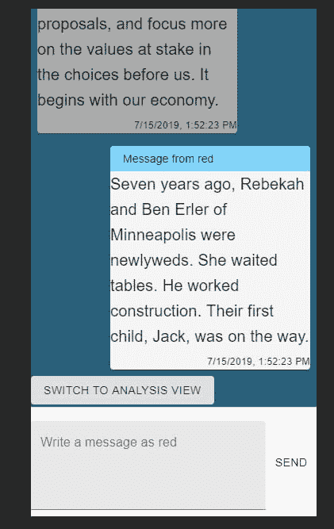
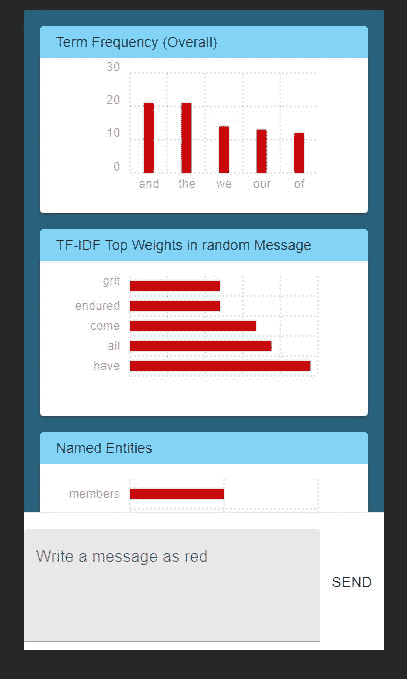
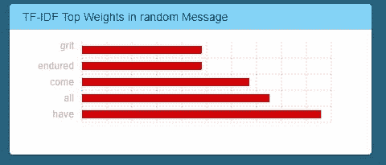

# 自然语言处理...在浏览器中？？？

> 原文：<https://dev.to/charlesdlandau/natural-language-processing-in-the-browser-52hj>

不久前，我一直在寻找一种方法来探索 React 挂钩和材料 UI v4，并像今年一样大致复习一些前端基础知识。我是通过 Python 来到 JS 的，我对自己说“嘿，也许我可以`npm install`一些我已经习惯了的数据科学的东西。”也许我可以用一些自然语言处理来解决聊天客户的无聊练习问题。

[](https://i.giphy.com/media/3o7bugfnfUypgWzwrK/giphy.gif)

不管怎样，事实证明你*可以*，即使这不是最好的主意。在这篇文章中，我将:

1.  简要介绍核心概念
2.  展示 [compromise.js](https://github.com/spencermountain/compromise) 如何让我们在 React 应用中做一些基本的 NLP。
3.  涵盖这种方法的利弊

你可以在这里看到一个使用 React 聊天客户端的演示:[https://chatter-nlp.charlesdlandau.net](https://chatter-nlp.charlesdlandau.net)。

你可以在这里看到演示的源代码:[https://github.com/CharlesDLandau/chatter_nlp](https://github.com/CharlesDLandau/chatter_nlp)

以下是消息视图中的截图:

[](https://res.cloudinary.com/practicaldev/image/fetch/s--ipN-4K6U--/c_limit%2Cf_auto%2Cfl_progressive%2Cq_auto%2Cw_880/https://serve-md.charlesdlandau.net/img/chatterNLPBlogMessageView.jpg)

这是分析视图:

[](https://res.cloudinary.com/practicaldev/image/fetch/s--XpHOgewB--/c_limit%2Cf_auto%2Cfl_progressive%2Cq_auto%2Cw_880/https://serve-md.charlesdlandau.net/img/chatterNLPBlogAnalysisView.jpg)

##### 1。核心概念

**自然语言处理(NLP)** 试图从文本中提取意义、语义、情感、标签、命名实体等等。我过于简单化了，但我发誓我有一个很好的借口。聊天机器人、语音识别和搜索是 NLP 的一些用例。

NLP 中的标签表示词类，如“动词”或“冠词”,但你也可以将更具体的名称称为标签，如“工作日”。妥协提供了一套漂亮的标签【https://observablehq.com/@spencermountain/compromise-tags[和添加新标签的可扩展性。](https://observablehq.com/@spencermountain/compromise-tags)

**语料库**是被分析的文本的主体。例如，如果你正在对一本书(或某某人的全集)进行自然语言处理和分析，那就是你的语料库。一些语料库是专门制作的，可能是预先标记的。

**文档**是被分析的每个文本单元。例如，在演示聊天应用程序中，每条消息都构成一个文档。

**TF-IDF** 是一种对文档中单词的含义进行加权的方法。度量是[“当术语在少量文档中出现多次时最高”](https://nlp.stanford.edu/IR-book/html/htmledition/tf-idf-weighting-1.html)。为了计算它，你需要语料库，你需要在一个特定的文档中选择一个特定的术语。

##### 2。展示和讲解

大多数情况下，演示应用程序负责传递一个`messages`数组。数组在组件层次结构的顶层初始化，用于 NLP 进程，并为 dataviz 解析。

```
const App = (props) => {

  const [messages, setMessages] = useState(dummyMessages)
  const [user, setUser] = useState("red");

  // Append new messages in a user-aware manner
  const mountMessage = (e, contents) =>{
      var text = contents
      var msgUpdate = messages
      msgUpdate.push({text:text, time: new Date().toLocaleString(),
      author:user})
      setMessages(msgUpdate)
      if (user === 'red'){
        setUser('blue')
      }else{
        setUser('red')
      }
      e.preventDefault()
    }

  return (...);

} 
```

<svg width="20px" height="20px" viewBox="0 0 24 24" class="highlight-action crayons-icon highlight-action--fullscreen-on"><title>Enter fullscreen mode</title></svg> <svg width="20px" height="20px" viewBox="0 0 24 24" class="highlight-action crayons-icon highlight-action--fullscreen-off"><title>Exit fullscreen mode</title></svg>

在这个演示中，除了有两个用户之外，我并不真正关心多个用户或命名用户的逻辑，所以“红”和“蓝”表示`user`状态，而`messages`包含了我们关心的几乎所有数据。

最终，所有的分析都发生在接收`messages`数组的类`TextAnalysis`中。

```
import nlp from 'compromise';

class TextAnalysis{
    constructor(docs){
        this.docs = docs
        this.mergedDocs = nlp(
            this.docs.map(obj => obj.text).join()
        )
    }
...

}; 
```

<svg width="20px" height="20px" viewBox="0 0 24 24" class="highlight-action crayons-icon highlight-action--fullscreen-on"><title>Enter fullscreen mode</title></svg> <svg width="20px" height="20px" viewBox="0 0 24 24" class="highlight-action crayons-icon highlight-action--fullscreen-off"><title>Exit fullscreen mode</title></svg>

大多数情况下，`TextAnalysis`是通过它的`.cardData`方法使用的，该方法返回硬编码的对象，如:

```
{
  title: "Parts of Speech",
  chartData: {
    labels: ["Noun", "Verb", "Adjective"],
    series:[
    this.mergedDocs.match('#Noun'
      ).out('array').length,
    this.mergedDocs.match('#Verb'
        ).out('array').length,
    this.mergedDocs.match('#Adjective'
        ).out('array').length
    ]},
  chartType: 'Pie',
  chartOpts: {
    chartPadding: 30,
    labelOffset: 30,
    labelDirection: 'explode'
  }
} 
```

<svg width="20px" height="20px" viewBox="0 0 24 24" class="highlight-action crayons-icon highlight-action--fullscreen-on"><title>Enter fullscreen mode</title></svg> <svg width="20px" height="20px" viewBox="0 0 24 24" class="highlight-action crayons-icon highlight-action--fullscreen-off"><title>Exit fullscreen mode</title></svg>

这是怎么回事？

`compromise`分析来自`constructor`中所有消息的所有文本，并将其存储在`this.mergedDocs`中。因此，`compromise`对象的许多方法都由`this.mergedDocs`公开，包括用于匹配标签的`.match()`。

我们可以用词类匹配的数量填充`chartData`:

```
[
this.mergedDocs.match('#Noun'
  ).out('array').length,
this.mergedDocs.match('#Verb'
    ).out('array').length,
this.mergedDocs.match('#Adjective'
    ).out('array').length
] 
```

<svg width="20px" height="20px" viewBox="0 0 24 24" class="highlight-action crayons-icon highlight-action--fullscreen-on"><title>Enter fullscreen mode</title></svg> <svg width="20px" height="20px" viewBox="0 0 24 24" class="highlight-action crayons-icon highlight-action--fullscreen-off"><title>Exit fullscreen mode</title></svg>

注意由`compromise`公开的`.out`方法，这通常是我们从分析的文档中提取解析数据的方式。[它支持解析文本、数组、html、规范化文本，甚至 csv 等等](https://observablehq.com/@spencermountain/compromise-api)。

这些以及`chartOpts`和`chartType`被传递给[图表制作者](https://gionkunz.github.io/chartist-js/)，我们用它来制作 dataviz。

```
// Parses a single object from TextAnalysis.cardData()
function AnalysisCard(props){
  var { data } = props
  const classes = useStyles();

  return (
    <Grid item>
        <Card className={classes.card}>

        <CardHeader className={classes.cardHead} title={
          <Typography style={
            {textOverflow:'ellipsis', whiteSpace:'nowrap'}
          }
           variant='subtitle2'>
          {data.title}</Typography>
        } /> 

        <ChartistGraph
        data={data.chartData}
        type={data.chartType}
        options={data.chartOpts} />
        </Card>
    </Grid>
  )
} 
```

<svg width="20px" height="20px" viewBox="0 0 24 24" class="highlight-action crayons-icon highlight-action--fullscreen-on"><title>Enter fullscreen mode</title></svg> <svg width="20px" height="20px" viewBox="0 0 24 24" class="highlight-action crayons-icon highlight-action--fullscreen-off"><title>Exit fullscreen mode</title></svg>

就这么多了！

...差不多了。TF-IDF 矢量器似乎不支持折衷(我被 Scipy 宠坏了)。因此，在`TextAnalysis`内，我们可以实现我们自己的...

```
tf(d, occ){
  // Takes a document and N occurrences of a term
  // Returns the term frequency (tf)
  // tf = (occurrences of search term/N terms)
  return (occ/nlp(d.text).terms().out('array').length)
}

idf(t){
  // Takes a term
  // Returns the inverse document frequency (idf)
  // idf = log_e(N documents/N documents containing
  // the search term)

  var nDocs = this.docs.length
  var nMatches = this.docs.filter(
    doc=>{
      var matched = doc.text.match(t)
      if(matched){
        return true}
      else{
        return false}
      }
  ).length

  var result = nDocs / nMatches
  if (!isFinite(result)){
    return 0
  }else{
  return Math.log(result)
  }
}

tfIdf(doc){
  // Takes a document from this.docs
  // Returns a sorted array of objects in the form:
  // {term:<String>, weight:<Float>}
  // This is a vector of terms and Tf-Idf weights

  var tfIdfVector = nlp(doc.text).terms().out('freq').map((d)=>{
    var t = d['normal']

    var tf = this.tf(doc, d['count'])

    var idf = this.idf(t)

    return {term: t, weight:tf*idf}
    }
  )

  var sortedTfIdfVector = tfIdfVector.sort((obj0, obj1)=>{
    var w0 = obj0.weight
    var w1 = obj1.weight
    if (w0 < w1){
      return 1
    }
    if (w0 > w1){
      return -1
    }
    return 0
  })

  return sortedTfIdfVector

} 
```

<svg width="20px" height="20px" viewBox="0 0 24 24" class="highlight-action crayons-icon highlight-action--fullscreen-on"><title>Enter fullscreen mode</title></svg> <svg width="20px" height="20px" viewBox="0 0 24 24" class="highlight-action crayons-icon highlight-action--fullscreen-off"><title>Exit fullscreen mode</title></svg>

(这感觉有点不正常，所以如果有人批评我的实现，我会非常欢迎。)

有了它，我们还可以为一条随机的消息绘制出最高权重的单词！

[](https://res.cloudinary.com/practicaldev/image/fetch/s---K6oMe_J--/c_limit%2Cf_auto%2Cfl_progressive%2Cq_auto%2Cw_880/https://serve-md.charlesdlandau.net/img/chatterNLPBlogTFIDF.jpg)

##### 利弊

我不知道你是否应该这样做，或者至少如果你这样做了，你应该认真想想为什么。

**缺点**

1.  您正在使用用户的浏览器进行分析。同一个浏览器为他们提供你一直努力追求的美好用户体验。
2.  妥协是大约 200kb，主要作者[说你可能无法撼动那棵树](https://github.com/spencermountain/compromise#--of-course-theres-a-lot-more-stuff)。
3.  数据预处理已经是前端的目标了吗？你的组织会把它变成一个吗？这是否需要将您团队的大量代码放到另一个团队维护的代码库中？你给他们量过体温了吗？
4.  在后端进行预处理的好处之一是，您可以对整个数据集进行操作——在浏览器中，我们只能使用浏览器中的消息*来计算 TFIDF，在后端，我们可以使用所有消息来获得更有用的权重。*

**优点**

1.  您正在使用用户的浏览器进行分析。也许这种分析在公共云或其他地方运行成本很高...
2.  所有的见解都可以反馈到客户端并与用户共享(例如我们演示中的分析视图)。
3.  在浏览器中进行更多的分析意味着您可能会找到一种在浏览器中进行更多过滤的方法，最终导致对 API 的调用减少。

##### 进一步阅读:

**妥协**:【https://github.com/spencermountain/compromise】
T5】图表家:[https://gionkunz.github.io/chartist-js](https://gionkunz.github.io/chartist-js)
**演示来源**:[https://github.com/CharlesDLandau/chatter_nlp](https://github.com/CharlesDLandau/chatter_nlp)

##### 欢迎反馈！

我接受了这个迷你项目，作为尝试一些新奇事物的一种方式。我在这里分享它，因为我对人们的反应感兴趣，并且总是想了解更多。感谢阅读！