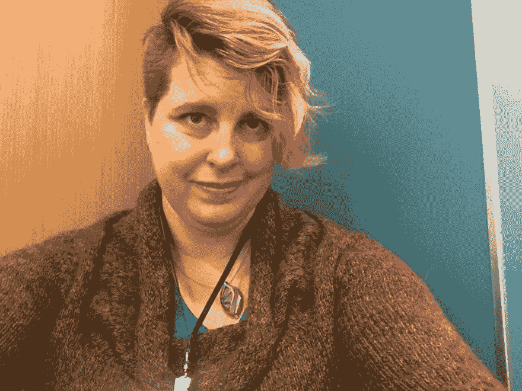
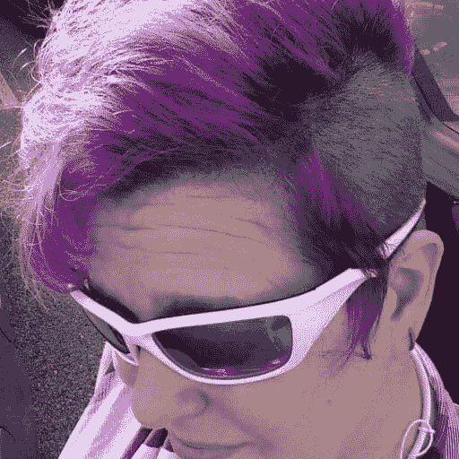
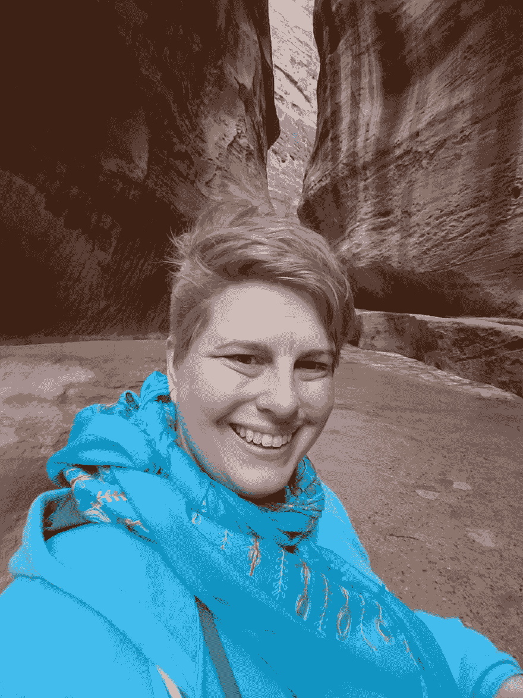
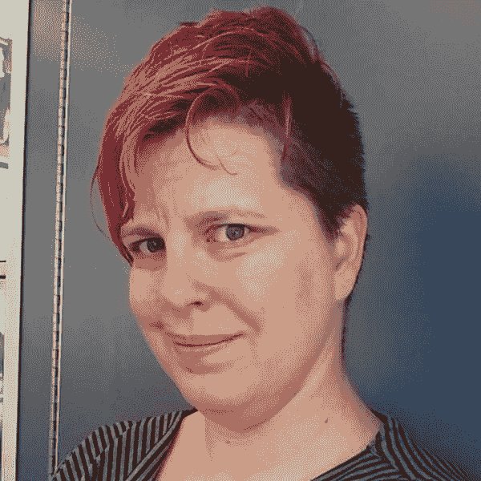
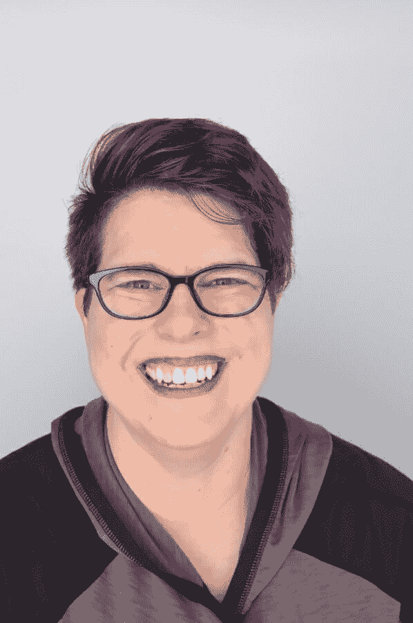
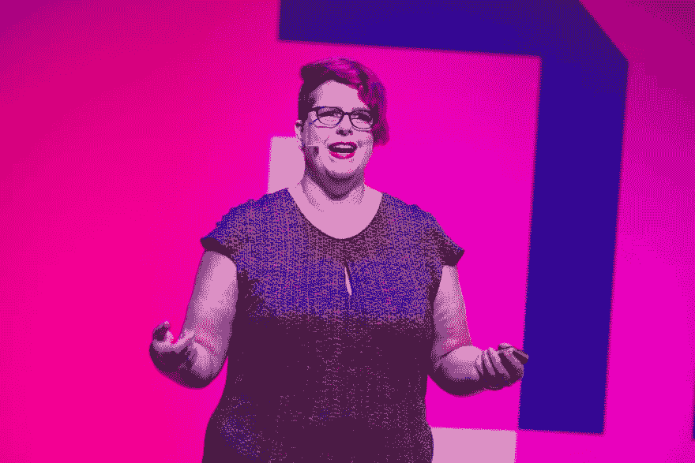

# 女会议发言人头像

> 原文：<https://dev.to/wiredferret/lady-conference-speaker-headshot-5de4>

你是技术专家。因为你出色的提议，你被这个会议接受了，现在他们想要一个…图片？啊！你上一次专业照可能是学长照。

对不起我理解你的不情愿和复杂的感情，但这是过程的一部分。会议需要图片放在网站上，宣传你的演讲，发推文，各种各样的事情。有些人对面孔的记忆比对名字的记忆更好。会议想说，不用说，他们不是 100%的白人。他们真的需要这个。

所以你需要提供一个，它越好，你和会议都会越开心。那么，一个好的头像应该包括什么，尤其是为了会议的目的？

## 爆头最佳实践

*   高分辨率。它需要能够被放大到会议屏幕大小，并且能够被打印出来。压缩的缩略图不能切割它。
*   主要是你的脸。我确实知道有人有 80 年代风格的背景和猫，但这很有趣，没有用。
*   正方形。这样它就能适应他们想要的所有方向。此外，如果它是方形的，他们就不必考虑如何修剪。
*   颜色。有些会议会降低显示头像的饱和度，但是你想给他们彩色的头像，这样他们就可以选择。
*   中性背景。你的背景越多，就越会有人试图分析它，而不注意你。
*   准确。我有一堆不错的头像，现在我戴上眼镜后用得少了，因为我希望人们能认出我来。*(是的，头发有帮助，但仍然)

## 请不要

*   嘈杂的背景。如果你身后发生了很多事情，你的脸就会失去突出性，这就是问题的关键。
*   自拍。我曾用自拍作为扬声器头像，但我向你保证，这不是我的最佳选择。光线很少很好。随着手机上更智能的相机设置，这种情况越来越好，但总的来说，最好让别人来操作快门。
*   政治声明。在美国和世界其他大部分地区，政治正在两极分化。在你的头像中放一些政治性的东西意味着人们会对此做出反应，而不是你的专业知识。特别是如果你是一个来自代表不足的群体的演讲者，你的存在本身就已经是一种声明。
*   有趣的图片。羽毛围巾、啤酒帽、耳罩帽——这些都有损你的职业形象。

## 即是说

还可以有个性。我想，你可以微笑或不微笑，你可以打领结，你可以选择你最喜欢的衣服，你可以带着你团队的球帽出现在会议页面上。一张好的头像很有个性，除此之外别无其他。

## 例子

我本打算给你看一些糟糕的大头照的例子，但是…我不想让任何人难过，也不是真的需要。打开你的 LinkedIn，浏览你的网络页面。你喜欢哪些图片？哪些不太吸引人？我猜你会被那些光线充足的缩略图所吸引，这些缩略图有白色或浅色的背景，而且大多只显示一张脸而不是一个场景。这就是我们的目标。本着披露的精神，这里有一些我用过但也许应该重新思考的头像:

我实际上在 Twitter 上使用顶部中间的一个，因为我不想在我的个人资料中有正面照片，但这并不是说你到处都找不到我的照片。还有佩特拉！这是一张很酷的自拍照，但你也会对正在发生的事情产生很多疑问。最下面的一张是我给巴特拍的自拍照。

相比之下，这里有一些我使用过并且感觉很好的:

 

第一张照片实际上来自明尼阿波利斯机场的一个非常别致的照相亭(我也在机场买化妆品。我说的是，我去机场比去商场多得多。)

第二个是来自 KCDC 的演讲者礼物。会议有时会安排一段时间，他们的摄影师也会拍肖像照/大头照，这很棒，因为你不用带任何东西，而且非常有用。我有其他好的会议头像，但这些将做为例子。

## 建议

很有可能，你知道有人有一台“真正的”相机，并且愿意和你一起拍摄。选择一个中性的背景，使用肖像模式，以确保没有任何东西在清晰的焦点上。尽可能对自己的外表感觉良好。找个人给你讲笑话，这样你就会微笑。如果你没有一个方便的朋友，有很多地方都有足够的照相亭，甚至那些用于护照照片的也可以，尽管我发现灯光很暗。如果你和摄影师在某个地方谈话，向会议摄影师要一些可以拍大头照的照片，他们会明白你的意思。我也喜欢动作片，并把它们用在其他事情上。

## 结论

我不得不在谷歌上搜索自己的照片，这非常奇怪。但是对你来说，确保你发给会议的照片会让你和他们看起来专业、见多识广、才华横溢。

去抓住他们，老虎！