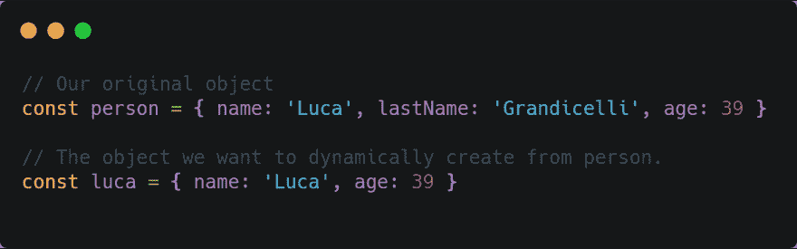
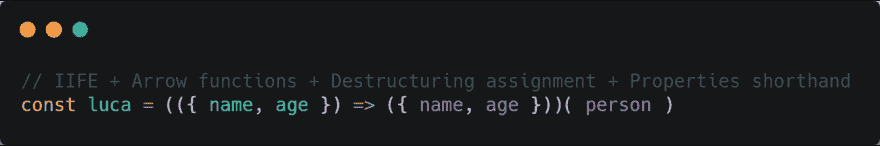

# 如何使用生命的力量、箭头功能、析构赋值和属性快捷键克隆一个对象的一部分。

> 原文：<https://dev.to/lucagrandicelli/how-to-clone-a-portion-of-an-object-using-the-power-of-iife-arrow-functions-destructuring-assignment-and-property-shorthands-379f>

**我们的目标**
假设我们想要创建一个新对象，它只继承另一个对象的一部分`property:value`，而不是全部。就像下面这样:

[](https://res.cloudinary.com/practicaldev/image/fetch/s--eaSZXWYx--/c_limit%2Cf_auto%2Cfl_progressive%2Cq_auto%2Cw_880/https://thepracticaldev.s3.amazonaws.com/i/aqch53gpdhrgjphb0p32.png)

**完成这个**的最好方法是什么？嗯，有几个可用的，但最强大和简洁的一个是/w 怀疑以下:

[](https://res.cloudinary.com/practicaldev/image/fetch/s--bJs_h537--/c_limit%2Cf_auto%2Cfl_progressive%2Cq_auto%2Cw_880/https://thepracticaldev.s3.amazonaws.com/i/bfgjbdgdahufsp1uwim2.png)

您所看到的是一个**立即调用的匿名箭头函数(IIFE ),它接受一个对象，析构其属性，并将其作为一个新对象**返回。

听起来很复杂？好吧，那就让我们来分析一下。

* * *

## 立即调用函数表达式(IIFE)

立即调用的函数表达式是一种一旦声明就立即执行函数
的方法。IIFEs 是一个很好的解决方案，因为它们不会污染全局对象，并且是隔离变量声明的一个聪明的方法。(*感谢[弗拉维奥应对](https://flaviocopes.com/)这一异常解释*

生命的基本形式如下:

```
;(function() {
  // The code we want to execute immediately.
})()

// No need to call this funcion after. 
```

<svg width="20px" height="20px" viewBox="0 0 24 24" class="highlight-action crayons-icon highlight-action--fullscreen-on"><title>Enter fullscreen mode</title></svg> <svg width="20px" height="20px" viewBox="0 0 24 24" class="highlight-action crayons-icon highlight-action--fullscreen-off"><title>Exit fullscreen mode</title></svg>

现在，由于我们希望 life 中的代码对一个对象执行操作，我们需要将原始对象注入其中，以便在整个 life 范围内都可用:

```
// Our original object.
const person = { name: "Luca", lastName: "Grandicelli", age: 39 }

// Let's inject 'person' into the IIFE
;(function() {
  // The object 'person' is now available here.
})( person ) 
```

<svg width="20px" height="20px" viewBox="0 0 24 24" class="highlight-action crayons-icon highlight-action--fullscreen-on"><title>Enter fullscreen mode</title></svg> <svg width="20px" height="20px" viewBox="0 0 24 24" class="highlight-action crayons-icon highlight-action--fullscreen-off"><title>Exit fullscreen mode</title></svg>

> *The '；'帮助我们防止连接两个 JavaScript 文件时出现问题。因为这种语言不需要分号，所以您可能会在文件的最后一行连接一些语句，这会导致语法错误。*

* * *

## 箭头功能

自从在 ES6/ECMAScript 2015 中引入以来，箭头函数可能是 JS dev 社区最受赞赏的变化之一。他们基本上改变了旧的函数声明:

```
 // The old way
const foo = function myFunction( param1, param2 ) {
/* */
}

// The new way
const foo = ( param1, param2 ) => {
/* */
} 
```

<svg width="20px" height="20px" viewBox="0 0 24 24" class="highlight-action crayons-icon highlight-action--fullscreen-on"><title>Enter fullscreen mode</title></svg> <svg width="20px" height="20px" viewBox="0 0 24 24" class="highlight-action crayons-icon highlight-action--fullscreen-off"><title>Exit fullscreen mode</title></svg>

**注意**:箭头函数确实以不同于我们习惯的方式对待`this`关键字，所以它们没有完全取代旧的语法，旧的语法仍然有效，尤其是在类&对象方法或事件回调这样的上下文中。

然而，它们的威力在于它们可以极其简洁的方式:

```
 /*
* When the function body contains only a single statement, you can omit the
* parentheses and put everything on a single line, such as:
*/
const foo = () => doSomething()

// Of course, you can pass parameters too:
const foo = ( param1, param2 ) => doSomething( param1, param2 )

// ...but if you have only one parameter, you can just omit the parentheses completely:
const foo = param => doSomething( param ) 
```

<svg width="20px" height="20px" viewBox="0 0 24 24" class="highlight-action crayons-icon highlight-action--fullscreen-on"><title>Enter fullscreen mode</title></svg> <svg width="20px" height="20px" viewBox="0 0 24 24" class="highlight-action crayons-icon highlight-action--fullscreen-off"><title>Exit fullscreen mode</title></svg>

另一个伟大的性质是**隐性回报** :

```
/**
* When there's an in-line statement in the function body, you can return values
* without using the return keyword:
*/
const foo = () => 'my value'
foo() // Returns 'my value'

/**
* You can return an object too. Just remember to wrap the curly brackets in
* parentheses to avoid it being considered the wrapping function body brackets:
*/
const foo = () => ({ value: 'my value' })
foo() //Returns { value: 'my value' } 
```

<svg width="20px" height="20px" viewBox="0 0 24 24" class="highlight-action crayons-icon highlight-action--fullscreen-on"><title>Enter fullscreen mode</title></svg> <svg width="20px" height="20px" viewBox="0 0 24 24" class="highlight-action crayons-icon highlight-action--fullscreen-off"><title>Exit fullscreen mode</title></svg>

很酷，不是吗？好了，现在让我们结合 life/w 箭头函数:

```
// Let's cast some magic spell here...
;(() => {
/* */
})( person ) 
```

<svg width="20px" height="20px" viewBox="0 0 24 24" class="highlight-action crayons-icon highlight-action--fullscreen-on"><title>Enter fullscreen mode</title></svg> <svg width="20px" height="20px" viewBox="0 0 24 24" class="highlight-action crayons-icon highlight-action--fullscreen-off"><title>Exit fullscreen mode</title></svg>

很好。现在继续，让我们看看如何从一个对象中提取属性。

* * *

## 销毁分配

[来自 MDN 网络文档](https://developer.mozilla.org/en-US/docs/Web/JavaScript/Reference/Operators/Destructuring_assignment):

> *析构赋值语法是一个 JavaScript 表达式，可以将数组中的值或对象中的属性解包到不同的变量中*。

让我们开始/w 一个例子:

```
 /**
* We want to create two variables called 'a' and 'b'
* and fill them /w the first two elements of the 'list' array.
*/
const list = [1, 2, 3, 4, 5]
const [ a, b ] = list
console.log( a ) // Prints 1
console.log( b ) // Prints 2

/**
* Same thing, we can use objects too.
* In this case, we have to use the same property names as variables.
* This allow us to extract multiple properties regarless of their order.
*/
const list = { a: 1, b: 2, c: 3, d: 4, e: 5 }
const { a, c } = list

console.log( a ) // Prints 1
console.log( c ) // Prints 3 
```

<svg width="20px" height="20px" viewBox="0 0 24 24" class="highlight-action crayons-icon highlight-action--fullscreen-on"><title>Enter fullscreen mode</title></svg> <svg width="20px" height="20px" viewBox="0 0 24 24" class="highlight-action crayons-icon highlight-action--fullscreen-off"><title>Exit fullscreen mode</title></svg>

当我们需要将一个对象作为函数的参数传递，然后从中提取值时，析构赋值特别有用。所以让我们将这个概念应用到我们的初始代码中，结合 life+arrow 函数+析构赋值:

```
 // Our original object.
const person = { name: "Luca", lastName: "Grandicelli", age: 39 }

/*
* Let's destructure the original object properties 'name' and 'age'
* into two separate variables in the function args declaration.
* Then return a new object with those props as values.
*/
;(({ name, age }) => {

  // Build & return the new object.
  return { name: name, age: age } // Equals to: { name: "Luca", age: 39 }
})( person ) 
```

<svg width="20px" height="20px" viewBox="0 0 24 24" class="highlight-action crayons-icon highlight-action--fullscreen-on"><title>Enter fullscreen mode</title></svg> <svg width="20px" height="20px" viewBox="0 0 24 24" class="highlight-action crayons-icon highlight-action--fullscreen-off"><title>Exit fullscreen mode</title></svg>

## 属性简写

在 JavaScript ES6/ECMAScript 2015 中，如果您想要定义一个对象，该对象的键与作为属性传入的变量同名，您可以使用简写方式，只需传递键名:

```
 // Let's declare some variables here.
var name = 'Luca';
var lastName = 'Grandicelli';
var age = 39;

/**
* Old pre-ES6 syntax:
*/
var myObject = {
  name : name ,
  lastName : lastName ,
  age : age 
}

/**
* ES6/ECMAScript 2015 syntax
*/
const myObject = {
  name,
  lastName,
  age
}

// ...or...
const myObject = { name, lastName, age } 
```

<svg width="20px" height="20px" viewBox="0 0 24 24" class="highlight-action crayons-icon highlight-action--fullscreen-on"><title>Enter fullscreen mode</title></svg> <svg width="20px" height="20px" viewBox="0 0 24 24" class="highlight-action crayons-icon highlight-action--fullscreen-off"><title>Exit fullscreen mode</title></svg>

这里我们来结束这篇文章。让我们总结每件事，并结合生命+箭头函数+析构赋值+属性速记:

```
// Our original object.
const person = { name: "Luca", lastName: "Grandicelli", age: 39 }

/**
* Now let's apply the property shorthand to our returning object,
* since its keys names equals the value names.
*/

// Our IIFE function.
;(({ name, age }) => {
  return { name, age } // Equals to: { name: "Luca", age: 39 }
})( person )

// Since the above function is one-only return statement, everything becomes:
;(({ name, age }) => ({ name, age }))( person )

// ... and finally:
const luca = (({ name, age }) => ({ name, age }))( person ) 
```

<svg width="20px" height="20px" viewBox="0 0 24 24" class="highlight-action crayons-icon highlight-action--fullscreen-on"><title>Enter fullscreen mode</title></svg> <svg width="20px" height="20px" viewBox="0 0 24 24" class="highlight-action crayons-icon highlight-action--fullscreen-off"><title>Exit fullscreen mode</title></svg>

然而，有几种方法可以完成这项任务；这只是 Javascript 有多强大的一个例子。

如果您想了解更多关于本文讨论的主题，请访问以下链接:

**箭头函数**
[MDN Webdocs](https://developer.mozilla.org/en-US/docs/Web/JavaScript/Reference/Functions/Arrow_functions)
[ES6 箭头函数 cheat sheet](https://dev.to/samanthaming/es6-arrow-functions-cheatsheet-1cn)
[JavaScript 箭头函数教程](https://flaviocopes.com/javascript-arrow-functions/)

**life-立即调用函数表达式**
[MDN Webdocs](https://developer.mozilla.org/en-US/docs/Glossary/IIFE)
[Wikipedia](https://en.wikipedia.org/wiki/Immediately_invoked_function_expression)
[必备 JavaScript:掌握立即调用函数表达式](https://medium.com/@vvkchandra/essential-javascript-mastering-immediately-invoked-function-expressions-67791338ddc6)

**析构任务**
[MDN Webdocs](https://developer.mozilla.org/en-US/docs/Web/JavaScript/Reference/Operators/Destructuring_assignment)
[ES6 析构:完整指南](https://codeburst.io/es6-destructuring-the-complete-guide-7f842d08b98f)

**属性速记**
[MDN Webdocs](https://developer.mozilla.org/en-US/docs/Web/JavaScript/Reference/Operators/Object_initializer)
[JavaScript 中对象属性值速记用 ES6](https://alligator.io/js/object-property-shorthand-es6/)