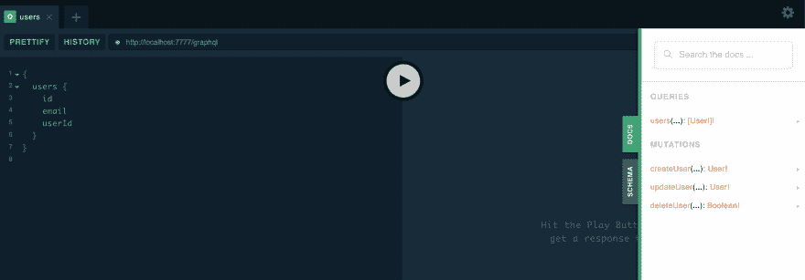

# 用 Go 创建自以为是的 GraphQL 服务器-第 2 部分

> 原文：<https://dev.to/cmelgarejo/creating-an-opinionated-graphql-server-with-go-part-2-46io>

我们现在将 GQLGen 生成的服务器添加到我们的项目中，并开始`gql` ing
away！而且，我们将会比《T2》第一部走得更快

## 向项目中添加 GQLGen

现在，我们可以使用 **GQLGen** 来初始化我们服务器的 GQLGen 生成文件
`go run github.com/99designs/gqlgen init`

这将初始化 gqlgen 服务器，我们必须进行修改以适应我们的
项目布局，移动几个文件并编辑`gqlgen.yml`文件

*   `generated.go`(保存 gql gen 生成的 graphql 服务器代码的文件)
*   `resolver.go`(保存查询和变异的解析器)
*   `schema.graphql`(gqlgen 生成的示例模式，我们将对其进行修改)
*   `server/server.go`(我们将转储存根服务器，但使用处理程序)
*   `models_gen.go`(基于 schema.graphql 生成模型的文件)

现在我们要去做一些可能违背直觉的事情，让我们删除所有的
这些新文件吧！除了`gqlgen.yml`；相信我，我们会把它们找回来，放在一个
合适的地方。

> 关于 gqlgen 配置的更多信息:[点击这里](https://gqlgen.com/config/)

接下来，我们首先需要做的是像这样修改`gqlgen.yml`文件:

```
# go-gql-server gqlgen.yml file
# Refer to https://gqlgen.com/config/
# for detailed .gqlgen.yml documentation.

schema:
  - internal/gql/schemas/schema.graphql
# Let gqlgen know where to put the generated server
exec:
  filename: internal/gql/generated.go
  package: gql
# Let gqlgen know where to put the generated models (if any)
model:
  filename: internal/gql/models/generated.go
  package: models
# Let gqlgen know where to put the generated resolvers
resolver:
  filename: internal/gql/resolvers/generated.go
  type: Resolver
  package: resolvers
autobind: [] 
```

Enter fullscreen mode Exit fullscreen mode

所以，我想自动生成 gqlgen 文件，让我们创建一个脚本
,名为:

*   `scripts/gqlgen.sh`(记得`chmod +x`这个也是)

```
#!/bin/bash
printf "\nRegenerating gqlgen files\n"
rm -f internal/gql/generated.go \
    internal/gql/models/generated.go \
    internal/gql/resolvers/generated.go
time go run -v github.com/99designs/gqlgen $1
printf "\nDone.\n\n" 
```

Enter fullscreen mode Exit fullscreen mode

为什么我还要删除解析器文件？当然，为了重新生成它，如果我们
要改变模式上的任何东西，我们很可能也要更新解析器
，并且，当项目很小很好的时候，你把它们都放在一个文件中，但是我们
要把解析器排序到它们自己的文件中，并且把这个文件
`internal/gql/resolvers/generated.go`作为 gqlgen
代之间的临时文件。这有点乏味，但以后会有回报的。

好了，现在我们需要定义一个 gql 模式文件，这样我们就可以使用我们的脚本
在正确的位置重新生成 gqlgen 文件。

> `$ mkdir -p internal/gql/schemas`

然后你可以编辑一个`schema.graphql`文件

> `$ vi internal/gql/schemas/schema.graphql`

并在上面粘贴以下内容:

```
# Types  type  User  {  id:  ID  email:  String  userId:  String  }  # Input Types  input  UserInput  {  email:  String  userId:  String  }  # Define mutations here  type  Mutation  {  createUser(input:  UserInput!):  User!  updateUser(input:  UserInput!):  User!  deleteUser(userId:  ID!):  Boolean!  }  # Define queries here  type  Query  {  users(userId:  ID):  [User]  } 
```

Enter fullscreen mode Exit fullscreen mode

不要担心 gql 的细节，在接下来的部分中，我们将使用 OpenID 规范进一步增强这个模式。

现在，让我们抓取`internal/gql/resolvers/generated.go`并稍微编辑一下，
返回一个被嘲笑的用户:

```
package resolvers

import (
    "context"

    "github.com/cmelgarejo/go-gql-server/internal/gql"
    "github.com/cmelgarejo/go-gql-server/internal/gql/models"
)

// THIS CODE IS A STARTING POINT ONLY. IT WILL NOT BE UPDATED WITH SCHEMA CHANGES.

type Resolver struct{}

func (r *Resolver) Mutation() gql.MutationResolver {
    return &mutationResolver{r}
}
func (r *Resolver) Query() gql.QueryResolver {
    return &queryResolver{r}
}

type mutationResolver struct{ *Resolver }

func (r *mutationResolver) CreateUser(ctx context.Context, input models.UserInput) (*models.User, error) {
    panic("not implemented")
}
func (r *mutationResolver) UpdateUser(ctx context.Context, input models.UserInput) (*models.User, error) {
    panic("not implemented")
}
func (r *mutationResolver) DeleteUser(ctx context.Context, userID string) (bool, error) {
    panic("not implemented")
}

type queryResolver struct{ *Resolver }

func (r *queryResolver) Users(ctx context.Context, userID *string) ([]*models.User, error) {
    records := []*models.User{
        &models.User{
            ID:     "ec17af15-e354-440c-a09f-69715fc8b595",
            Email:  "your@email.com",
            UserID: "UserID-1",
        },
    }
    return records, nil
} 
```

Enter fullscreen mode Exit fullscreen mode

现在让我们将 Graphql 服务器中间件绑定到我们的服务器上！在
`internal/handlers/gql.go`中创建一个文件并粘贴到:

```
package handlers

import (
    "github.com/99designs/gqlgen/handler"
    "github.com/cmelgarejo/go-gql-server/internal/gql"
    "github.com/cmelgarejo/go-gql-server/internal/gql/resolvers"
    "github.com/gin-gonic/gin"
)

// GraphqlHandler defines the GQLGen GraphQL server handler
func GraphqlHandler() gin.HandlerFunc {
    // NewExecutableSchema and Config are in the generated.go file
    c := gql.Config{
        Resolvers: &resolvers.Resolver{},
    }

    h := handler.GraphQL(gql.NewExecutableSchema(c))

    return func(c *gin.Context) {
        h.ServeHTTP(c.Writer, c.Request)
    }
}

// PlaygroundHandler Defines the Playground handler to expose our playground
func PlaygroundHandler(path string) gin.HandlerFunc {
    h := handler.Playground("Go GraphQL Server", path)
    return func(c *gin.Context) {
        h.ServeHTTP(c.Writer, c.Request)
    }
} 
```

Enter fullscreen mode Exit fullscreen mode

现在我们可以这样修改`pkg/server/main.go`:

```
package server

import (
    "log"

    "github.com/cmelgarejo/go-gql-server/internal/handlers"
    "github.com/cmelgarejo/go-gql-server/pkg/utils"
    "github.com/gin-gonic/gin"
)

var host, port, gqlPath, gqlPgPath string
var isPgEnabled bool

func init() {
    host = utils.MustGet("GQL_SERVER_HOST")
    port = utils.MustGet("GQL_SERVER_PORT")
    gqlPath = utils.MustGet("GQL_SERVER_GRAPHQL_PATH")
    gqlPgPath = utils.MustGet("GQL_SERVER_GRAPHQL_PLAYGROUND_PATH")
    isPgEnabled = utils.MustGetBool("GQL_SERVER_GRAPHQL_PLAYGROUND_ENABLED")
}

// Run spins up the server
func Run() {
    endpoint := "http://" + host + ":" + port

    r := gin.Default()

    // Handlers
    // Simple keep-alive/ping handler
    r.GET("/ping", handlers.Ping())

    // GraphQL handlers
    // Playground handler
    if isPgEnabled {
        r.GET(gqlPgPath, handlers.PlaygroundHandler(gqlPath))
        log.Println("GraphQL Playground @ " + endpoint + gqlPgPath)
    }
    r.POST(gqlPath, handlers.GraphqlHandler())
    log.Println("GraphQL @ " + endpoint + gqlPath)

    // Run the server
    // Inform the user where the server is listening
    log.Println("Running @ " + endpoint)
    // Print out and exit(1) to the OS if the server cannot run
    log.Fatalln(r.Run(host + ":" + port))
} 
```

Enter fullscreen mode Exit fullscreen mode

所以有了新的修改，我们设置了新的环境变量:

``狂欢。包封/包围（动词 envelop 的简写）

# Web 框架配置

GIN _ MODE = debug
GQL _ SERVER _ HOST = localhost
GQL _ SERVER _ PORT = 7777

# GQLGen 配置

gql _ server _ graph QL _ path =/graph QL
gql _ server _ graph QL _ play ground _ enabled = true
gql _ server _ graph QL _ play ground _ path =/

```
 that dictate where will our server listen with the graphql handler and serve
queries and mutations we already defined, and let's try and run the program now:

> `$ ./scripts/run/sh`

```bash
$ ./scripts/run.sh

Start running: gql-server
[GIN-debug] [WARNING] Creating an Engine instance with the Logger and Recovery middleware already attached.

[GIN-debug] [WARNING] Running in "debug" mode. Switch to "release" mode in production.
 - using env:   export GIN_MODE=release
 - using code:  gin.SetMode(gin.ReleaseMode)

[GIN-debug] GET    /ping                     --> github.com/cmelgarejo/go-gql-server/internal/handlers.Ping.func1 (3 handlers)
[GIN-debug] GET    /                         --> github.com/cmelgarejo/go-gql-server/internal/handlers.PlaygroundHandler.func1 (3 handlers)
2019/07/13 23:28:38 GraphQL Playground @ http://localhost:7777/
[GIN-debug] POST   /graphql                  --> github.com/cmelgarejo/go-gql-server/internal/handlers.GraphqlHandler.func1 (3 handlers)
2019/07/13 23:28:38 GraphQL @ http://localhost:7777/graphql
2019/07/13 23:28:38 Running @ http://localhost:7777
[GIN-debug] Listening and serving HTTP on localhost:7777
[GIN] 2019/07/13 - 23:28:39 | 200 |     486.646µs |       127.0.0.1 | GET      /
[GIN] 2019/07/13 - 23:28:40 | 200 |    1.353992ms |       127.0.0.1 | POST     /graphql 
```

Enter fullscreen mode Exit fullscreen mode

我们现在可以看到 GraphQL 请求被重定向到它的处理程序！不错。

让我们导航到: [http://localhost:7777](http://localhost:7777)

[](https://res.cloudinary.com/practicaldev/image/fetch/s--vYY7lLkw--/c_limit%2Cf_auto%2Cfl_progressive%2Cq_auto%2Cw_880/https://github.com/cmelgarejo/go-gql-server/blob/master/docs/tutoriimg/p2-p1.png%3Fraw%3Dtrue)

现在我们有了一个正常运行的 GQL 服务器，让我们试着查询一下...

[](https://res.cloudinary.com/practicaldev/image/fetch/s--le9j4Jd0--/c_limit%2Cf_auto%2Cfl_progressive%2Cq_auto%2Cw_880/https://github.com/cmelgarejo/go-gql-server/blob/master/docs/tutoriimg/p2-p2.png)

现在我们看到一切都在按预期工作，让我们继续做更好的事情，并重构代码，使之更有序一些。

## 重构代码(又名我自己的个人文件名地狱)

正如我之前提到的，我有一个人为的，但有效的方法来组织 GQLgen 的代码，它将有助于保持代码组织在小文件中:

*   `{entity_plural}.go`用我们的`gqlgen.sh`脚本生成的解析将不得不为每个`entity`(用户、帖子、评论，等等)单独复制
*   `transformations/{entity_plural}.go`现在，这个很有趣，一旦我们将 **GORM** 添加到我们的项目中，并使用那个**数据库结构**，我们将不得不*将这些 GQL 输入类型*转换成数据库表示以存储在 *db* 中，反之亦然，以返回从 *db* 到 *GQL* 的查询。
*   然后，我将从`internal/gql/resolvers/generated/generated.go`生成的内容移动到`internal/gql/resolvers/main.go`,并从我们可能有的实体方法中删除它，就像这样:

```
package resolvers

import (
    "github.com/cmelgarejo/go-gql-server/internal/gql"
)

// Resolver is a modifiable struct that can be used to pass on properties used
// in the resolvers, such as DB access
type Resolver struct{}

// Mutation exposes mutation methods
func (r *Resolver) Mutation() gql.MutationResolver {
    return &mutationResolver{r}
}

// Query exposes query methods
func (r *Resolver) Query() gql.QueryResolver {
    return &queryResolver{r}
}

type mutationResolver struct{ *Resolver }

type queryResolver struct{ *Resolver } 
```

Enter fullscreen mode Exit fullscreen mode

从现在开始，这个文件不会再有任何变化了，我们将会改变一些事情，是的，但是那将会在第三部分中完成！(在制品)

我还没有找到一种方法将文件夹结构组织到文件夹中，而不需要
进行递归导入，所以前缀将有助于组织`resolvers`文件夹中实体的
文件名。我的 TOC 迫使我这样做
😅

> 如果你有更好的方法来处理这些乱七八糟的事情，请随时打开问题/公关！

作为最后一部分，所有的代码都可以在这里的[库](https://github.com/cmelgarejo/go-gql-server/tree/tutorial/part-2)中找到！