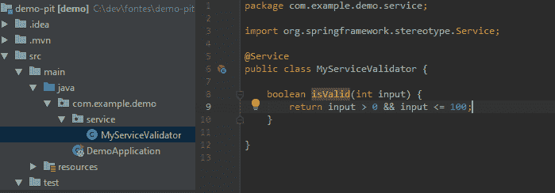
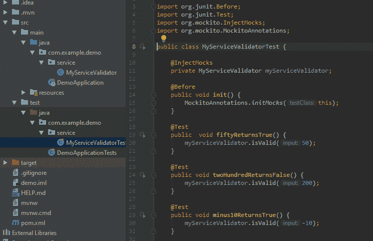
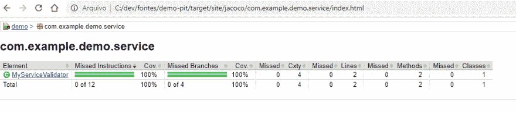
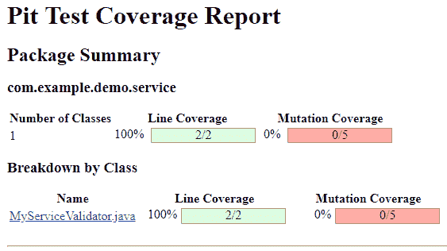
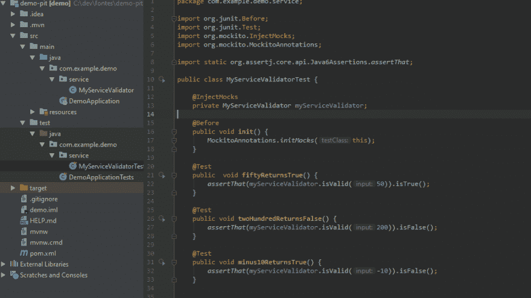
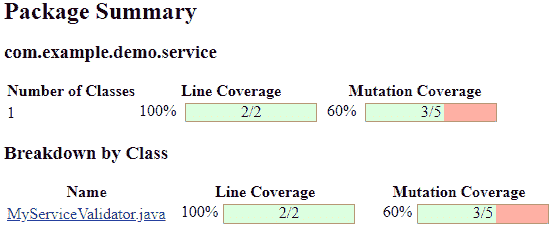
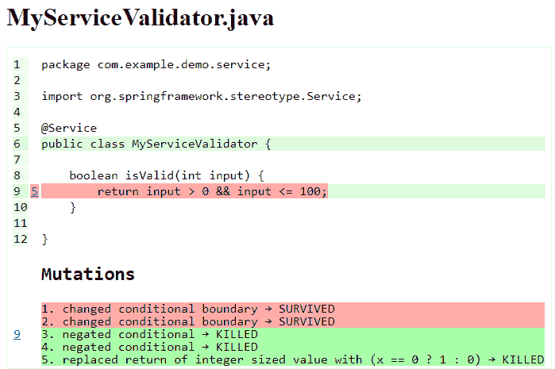
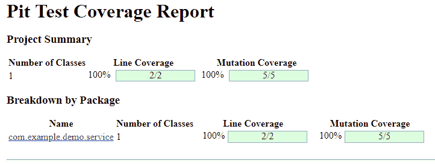
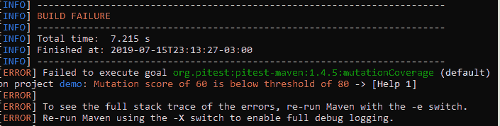

# 使用带 PITest 的变异提高单元测试的质量

> 原文：<https://dev.to/silviobuss/increase-the-quality-of-unit-tests-using-mutation-with-pitest-3b27>

## 简介

代码覆盖率是衡量代码质量的最常见的标准，但是它不能保证测试是在测试预期的行为。

> "...100%的代码覆盖率分数仅仅意味着所有的代码行至少被执行了一次，但是它并没有说测试的准确性或者用例的完整性，这就是为什么变异测试很重要。(Baeldung，2018 年)

变异测试的想法是以一种简单的方式修改被覆盖的代码，检查该代码的现有测试集是否会检测并拒绝修改。

> 当您的服务规则改变时，好的测试应该会失败。

代码中的每一个变化都被称为突变，它会导致程序版本的改变，称为**突变**。一些类型的突变有:

*   改变条件边界变异函数。

| 原始条件 | 变异条件 |
| --- | --- |
| < | <= |
| <= | < |
| > | >= |
| >= | > |

*   更改数学运算符。
*   返回 null 而不是对象值。
*   和许多其他类型。检查[本文档](http://pitest.org/quickstart/mutators/)中的所有可用信息。

突变通常反应如下:

*   **被杀死**:这意味着变异体已经被**杀死**，因此已经测试过的代码部分被正确覆盖。

*   **幸存**:这意味着突变体已经**幸存**，并且增加或改变的功能没有被测试正确覆盖。

*   **无限循环/运行时错误**:这通常意味着突变是在这种情况下不可能发生的事情。

[PITest framework](http://pitest.org/) 是一款基于 JVM 的突变测试工具，性能高，使用方便。我不认为这个工具有[的竞争对手](http://pitest.org/java_mutation_testing_systems/)拥有他们所有的功能。

## 入门:PITest 1.4.5 (2019 发布版)循序渐进

首先，我们将看到 jacoco 代码覆盖是如何出错的。

### 创建演示应用

1 -转到[https://start.spring.io/](https://start.spring.io/)并创建一个简单的演示应用程序(没有网站依赖性)。

2 -编辑`pom.xml`文件，添加 Jacoco 和 maven 插件:

```
 <plugin>
                <groupId>org.apache.maven.plugins</groupId>
                <artifactId>maven-compiler-plugin</artifactId>
                <version>3.7.0</version>
                <configuration>
                    <source>1.8</source>
                    <target>1.8</target>
                </configuration>
            </plugin>
            <plugin>
                <groupId>org.apache.maven.plugins</groupId>
                <artifactId>maven-surefire-plugin</artifactId>
                <version>2.19.1</version>
            </plugin>
            <plugin>
                <groupId>org.jacoco</groupId>
                <artifactId>jacoco-maven-plugin</artifactId>
                <version>0.8.2</version>
                <executions>
                    <execution>
                        <goals>
                            <goal>prepare-agent</goal>
                        </goals>
                    </execution>
                    <execution>
                        <id>report</id>
                        <phase>prepare-package</phase>
                        <goals>
                            <goal>report</goal>
                        </goals>
                    </execution>
                </executions>
            </plugin> 
```

<svg width="20px" height="20px" viewBox="0 0 24 24" class="highlight-action crayons-icon highlight-action--fullscreen-on"><title>Enter fullscreen mode</title></svg> <svg width="20px" height="20px" viewBox="0 0 24 24" class="highlight-action crayons-icon highlight-action--fullscreen-off"><title>Exit fullscreen mode</title></svg>

3 -仍然在`pom.xml`文件中，添加单元测试依赖项。

```
 <dependency>
            <groupId>junit</groupId>
            <artifactId>junit</artifactId>
            <version>4.12</version>
            <scope>test</scope>
        </dependency>
        <dependency>
            <groupId>org.assertj</groupId>
            <artifactId>assertj-core</artifactId>
            <version>3.9.0</version>
            <scope>test</scope>
        </dependency> 
```

<svg width="20px" height="20px" viewBox="0 0 24 24" class="highlight-action crayons-icon highlight-action--fullscreen-on"><title>Enter fullscreen mode</title></svg> <svg width="20px" height="20px" viewBox="0 0 24 24" class="highlight-action crayons-icon highlight-action--fullscreen-off"><title>Exit fullscreen mode</title></svg>

4 -创建一个简单的服务来验证所提供的输入数字是否在 0 到 100 之间。

[](https://res.cloudinary.com/practicaldev/image/fetch/s--NCfZ42nk--/c_limit%2Cf_auto%2Cfl_progressive%2Cq_auto%2Cw_880/https://thepracticaldev.s3.amazonaws.com/i/vlj4jq66wmvkq506oxi8.PNG)

5 -创建一个测试类(没有断言)，如下所示:

[](https://res.cloudinary.com/practicaldev/image/fetch/s--Bm3u4v9B--/c_limit%2Cf_auto%2Cfl_progressive%2Cq_auto%2Cw_880/https://thepracticaldev.s3.amazonaws.com/i/wvr0meer82goebr1pr1p.PNG)

### 运行演示应用程序

在根目录下运行`mvn clean install`。

在这一步，我们可以注意到我们的代码被单元测试完全覆盖。在`target/site/jacoco/index.html`中打开 jacoco 报告。

[](https://res.cloudinary.com/practicaldev/image/fetch/s---WQqhSBq--/c_limit%2Cf_auto%2Cfl_progressive%2Cq_auto%2Cw_880/https://thepracticaldev.s3.amazonaws.com/i/pelapj63iya15mfmdwki.PNG) 
无论是行还是分支覆盖率都报告了 100%的单元测试覆盖率，但是实际上什么都没有被测试！

### 添加最萌插件

我们可以通过使用**目标类**和**目标测试**来限制代码变异和测试运行。

以及**避免调用**以防止指定的线路代码发生变异。这改善了突变时间。

```
 <plugin>
                <groupId>org.pitest</groupId>
                <artifactId>pitest-maven</artifactId>
                <version>1.4.5</version>
                <executions>
                    <execution>
                        <phase>test</phase>
                        <goals>
                            <goal>mutationCoverage</goal>
                        </goals>
                    </execution>
                </executions>
                <configuration>
                    <targetClasses>
                        <param>com.example.demo.service*</param>
                    </targetClasses>
                    <targetTests>
                        <param>com.example.demo.service*</param>
                    </targetTests>
                    <avoidCallsTo>
                        <avoidCallsTo>java.util.logging</avoidCallsTo>
                        <avoidCallsTo>org.apache.log4j</avoidCallsTo>
                        <avoidCallsTo>org.slf4j</avoidCallsTo>
                        <avoidCallsTo>org.apache.commons.logging</avoidCallsTo>
                    </avoidCallsTo>
                </configuration>
            </plugin> 
```

<svg width="20px" height="20px" viewBox="0 0 24 24" class="highlight-action crayons-icon highlight-action--fullscreen-on"><title>Enter fullscreen mode</title></svg> <svg width="20px" height="20px" viewBox="0 0 24 24" class="highlight-action crayons-icon highlight-action--fullscreen-off"><title>Exit fullscreen mode</title></svg>

### 用 PITest 运行演示应用程序

在根目录中运行`mvn clean install`，在`/target/pit-reports/<date>/index.html`中查看 PITest 报告。
这里我们可以注意到线路覆盖率仍然是 100%，但是引入了一个新的覆盖率:**突变覆盖率**。

[](https://res.cloudinary.com/practicaldev/image/fetch/s--kwPIwRjQ--/c_limit%2Cf_auto%2Cfl_progressive%2Cq_auto%2Cw_880/https://thepracticaldev.s3.amazonaws.com/i/6mkdhnh68mwbix650bip.PNG)

### 添加带有断言的真实测试

我们可以像这样添加断言:

[](https://res.cloudinary.com/practicaldev/image/fetch/s--iY5CAheK--/c_limit%2Cf_auto%2Cfl_progressive%2Cq_auto%2Cw_880/https://thepracticaldev.s3.amazonaws.com/i/fz0tpnng7m2apfzox1io.PNG)

运行`mvn clean install`并再次检查 PITest 报告。

[](https://res.cloudinary.com/practicaldev/image/fetch/s--3N90upgz--/c_limit%2Cf_auto%2Cfl_progressive%2Cq_auto%2Cw_880/https://thepracticaldev.s3.amazonaws.com/i/cmctusm8dnl234maplvm.PNG)
[T6】](https://res.cloudinary.com/practicaldev/image/fetch/s--2DvUmpZU--/c_limit%2Cf_auto%2Cfl_progressive%2Cq_auto%2Cw_880/https://thepracticaldev.s3.amazonaws.com/i/q9s31yi0thutesadth0f.PNG)

PITest 在改变了我们的原始源代码后执行了测试，并发现一些改变没有被单元测试处理，所以我们需要修复它。

为此，我们应该涵盖包括极限测试案例在内的案例，极限测试案例意味着所提供的值是 0 还是 100。

下面是涵盖突变测试的测试用例:

```
 @Test
  public void hundredReturnsTrue() {
    assertThat(cut.isValid(100)).isTrue();
  }

  @Test
  public void zeroReturnsFalse() {
    assertThat(cut.isValid(0)).isFalse();
  } 
```

<svg width="20px" height="20px" viewBox="0 0 24 24" class="highlight-action crayons-icon highlight-action--fullscreen-on"><title>Enter fullscreen mode</title></svg> <svg width="20px" height="20px" viewBox="0 0 24 24" class="highlight-action crayons-icon highlight-action--fullscreen-off"><title>Exit fullscreen mode</title></svg>

再次运行 PITest mutation coverage 命令并查看它的报告，我们现在可以注意到行和突变覆盖率看起来 100%良好。

[](https://res.cloudinary.com/practicaldev/image/fetch/s--hqGgFRW5--/c_limit%2Cf_auto%2Cfl_progressive%2Cq_auto%2Cw_880/https://thepracticaldev.s3.amazonaws.com/i/nzlrpfuvu46hwnvngj9n.PNG)

## 奖金

我们可以使用属性 **mutationThreshold** 来定义一个变异的百分比，当这个百分比低于阈值时，构建将会失败。

[](https://res.cloudinary.com/practicaldev/image/fetch/s--xYr4uGWo--/c_limit%2Cf_auto%2Cfl_progressive%2Cq_auto%2Cw_880/https://thepracticaldev.s3.amazonaws.com/i/ou19qei2nf0f0ygwz2jr.PNG)

## 在真实场景中表现最差

在一个小项目中运行 PITest(6300 行代码)的结果是:

```
PIT >> INFO : MINION : 3:56:19 PM PIT >> INFO : Checking environment    
PIT >> INFO : MINION : 3:56:20 PM PIT >> INFO : Found  254 tests
================================================================================
- Timings
================================================================================
> scan classpath : < 1 second
> coverage and dependency analysis : 5 seconds
> build mutation tests : < 1 second
> run mutation analysis : 2 minutes and 15 seconds
--------------------------------------------------------------------------------
> Total  : 2 minutes and 21 seconds
--------------------------------------------------------------------------------
================================================================================
- Statistics
================================================================================
>> Generated 733 mutations Killed 690 (94%)
>> Ran 1158 tests (1.58 tests per mutation) 
```

<svg width="20px" height="20px" viewBox="0 0 24 24" class="highlight-action crayons-icon highlight-action--fullscreen-on"><title>Enter fullscreen mode</title></svg> <svg width="20px" height="20px" viewBox="0 0 24 24" class="highlight-action crayons-icon highlight-action--fullscreen-off"><title>Exit fullscreen mode</title></svg>

对于这个项目，PITest 显示它总共产生了 733 个突变，其中只有 43 个存活，导致 94%的突变覆盖率。

变异测试可能是一个繁重的过程，但是从我的经验来看，通过达到 85%的变异覆盖率，我的团队感到足够安全来发布产品而不需要手工测试。(太酷了！)

## 结论

请注意，代码覆盖率仍然是一个重要的指标，但有时它不足以保证一个经过良好测试的代码。突变测试是一种很好的附加技术，可以使单元测试变得更好。

##  [西尔维奥巴斯](https://github.com/silviobuss) / [皮特-斯普林-布斯 2-德莫](https://github.com/silviobuss/pitest-spring-boot2-demo)

<article class="markdown-body entry-content container-lg" itemprop="text">

# 带 spring-boot2 演示的 pitest

## 使用带 PITest 的变异提高单元测试的质量

你可以在[https://dev . to/Silvio buss/increase-the-quality-of-unit-tests-using-mutation-with-pitest-3b 27/](https://dev.to/silviobuss/increase-the-quality-of-unit-tests-using-mutation-with-pitest-3b27/)中看到更多关于这个案例的内容(一步一步)。

</article>

[View on GitHub](https://github.com/silviobuss/pitest-spring-boot2-demo)

[](https://twitter.com/silvio_buss)

### 参考文献

[https://it next . io/start-killing-mutants-mutation-test-your-code-3 bea 71 df 27 f 2](https://itnext.io/start-killing-mutants-mutation-test-your-code-3bea71df27f2)
[https://www.baeldung.com/java-mutation-testing-with-pitest](https://www.baeldung.com/java-mutation-testing-with-pitest)
[https://github.com/rdelgatte/pitest-examples](https://github.com/rdelgatte/pitest-examples)