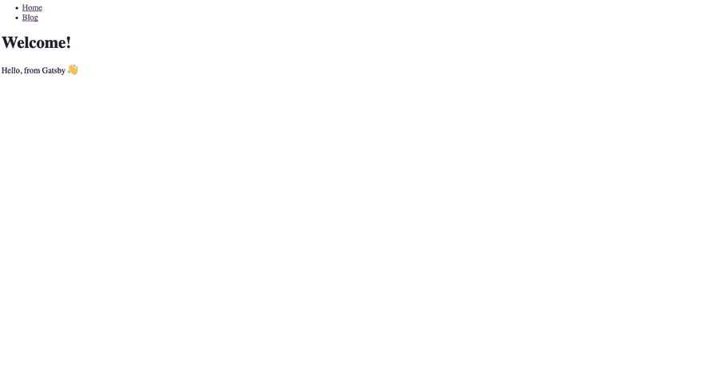

# 使用 Gatsby 主题选项第 2 部分

> 原文：<https://dev.to/hagnerd/using-gatsby-theme-options-part-2-573n>

## 以前的系列

这是《盖茨比主题入门》系列文章的第三篇，我们将逐步了解主题。在第一篇博客文章中，我们从头开始建立了一个 Gatsby 网站，并添加了 gatsby-theme-blog，它在指定的文件夹中获取一些 Markdown 或 Mdx 内容，将其转换为我们网站上的页面，并为我们提供了一些不错的基础组件和样式。

在第二篇文章中，我们讨论了主题中有哪些选项，如何用可用的选项定制主题，以及在主题内部的什么地方可以找到可用的选项以及如何使用这些选项。

如果你还没有使用你的第一个盖茨比主题从系列[的开始阅读，你可能想在继续之前阅读。](https://dev.to/hagnerd/using-your-first-gatsby-theme-hep)

* * *

## 我们今天要讨论什么？

在这篇文章中，我们将通过改变`gatsby-theme-blog`中的一些选项来定制我们的 Gatsby 网站。

在下一篇文章中，我们将讨论《盖茨比》中阴影是什么概念，以及如何在主题中找到可以被阴影笼罩的东西。

如果你想看到这一部分的完整代码，使用 Github 上的 Gatsby 主题选项 Pt 2 检查分支[。](https://github.com/hagnerd/first-gatsby-theme-demo/tree/using-gatsby-theme-options-pt-2)

* * *

## 更改我们博客的基本网址

现在，我们的博客索引，即呈现博客文章列表的页面，呈现在我们的根路径“/”处，但是如果我们想要将博客添加到现有网站，或者如果我们想要将其他内容作为我们的主页，该怎么办呢？

幸运的是，这很容易改变。

如果你还记得的话，`gatsby-theme-blog`有一些我们可以改变的选项。其中一个是名为`basePath`的物业。这个`basePath`决定了我们博客内容的基本 URL。默认值是`/`，但是让我们继续将它更改为`/blog`。

打开 gatsby-config.js

```
// gatsby-config.js
module.exports = {
  plugins: [
    {
      resolve: 'gatsby-theme-blog',
      options: {
        basePath: '/blog',
      }
    }
  ]
} 
```

这将使博客索引在`'/blog'`呈现，并使博客文章在`'/blog/:slug'`呈现，其中`:slug`被替换为你的标题的简化版本。

> 当您将所有字符设置为小写并将任何不在 a-z 或 0-9 之间的字符更改为“-”时，通常称之为 slugifying。

上次我们把`src/pages/index.js`页面改成了`/src/pages/_index.js`，这样 Gatsby 就不会试图用我们的索引页面来代替我们的博客索引。现在我们已经在不同的路径下渲染了博客，让我们把文件名改回`index.js`。

```
mv src/pages/_index.js src/pages/index.js 
```

我们还想添加一个导航组件，这样我们就可以进入我们的主页和博客页面。

让我们首先在`src`目录中创建一个`components`目录。然后我们将制作两个新组件，`layout`和`navigation`。

```
mkdir src/components
touch src/components/{layout,navigation}.js 
```

> 以我使用 Gatsby 的经验，我总是需要一个通用的页面布局，或者为不同类型的页面设计一些不同的布局。你有时会看到这些人生活在`src/templates`或`src/components`。这两种方式都很好，但是我试图坚持在`src/components`中保留影响标记和样式的布局，并且只在将编程页面的数据需求绑定到一个可视组件或一组可视组件时使用`src/templates`。

```
// src/pages/index.js
import React from 'react'
import Layout from '../components/layout'

export default function HomePage() {
  return (
    <Layout>
      <h1>Welcome!</h1>
      <p>
        Hello, from Gatsby{"  "}
        <span role="img" aria-label="hand emoji waving hello">
          👋
        </span>
      </p>
    </Layout>
  )
}

/////////////////////////////////////////
// src/components/layout.js

import React from 'react'
import Navigation from './navigation'

export default function Layout({ children }) {
  return (
    <>
     <Navigation />
      <main>
       {children}
      </main>
    </>
  )
}

/////////////////////////////////////////
// src/components/navigation.js

import React from 'react'
import { Link } from 'gatsby'

export default function Navigation() {
  return (
    <nav>
      <ul>
        <li><Link to="/">Home</Link></li>
        <li><Link to="/blog">Blog</Link></li>
      </ul>
    </nav>
  )
} 
```

当我们开始我们的盖茨比网站时，有一些事情需要注意:1)它真的很丑，2)导航在主页上，而不是在博客页面上:(扫兴。

[](https://res.cloudinary.com/practicaldev/image/fetch/s--M7s_6Wxe--/c_limit%2Cf_auto%2Cfl_progressive%2Cq_66%2Cw_880/https://thepracticaldev.s3.amazonaws.com/i/et1ygkg90nlbz7na6gpf.gif)

要解决问题一，只要使用你最喜欢的样式方法，无论是 CSS-in-JS，CSS 模块，Sass 等等。我不会触及一般的风格，因为这超出了本系列的范围。如果你有兴趣学习不同的方式来设计你的盖茨比网站，请在评论中告诉我，我会写一篇文章。

为了解决第二个问题，我们必须学习如何隐藏组件。我们将在下一篇文章中讨论什么是阴影。

* * *

## 接下来

如果你觉得这篇文章很有用，并想从这个系列中看到更多，请留下你的反应或评论。我试图找到每篇文章的正确长度和深度，所以如果你认为这个长度太短，请告诉我

在下一篇文章中，我们将了解什么是阴影，为什么它如此强大，以及盖茨比如何解决阴影内容。