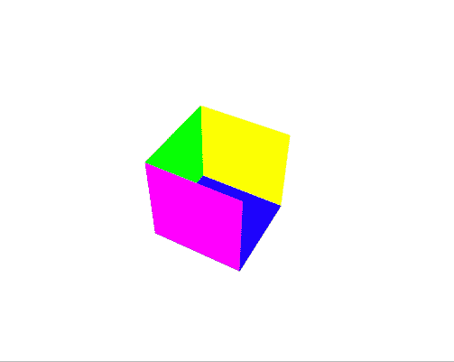
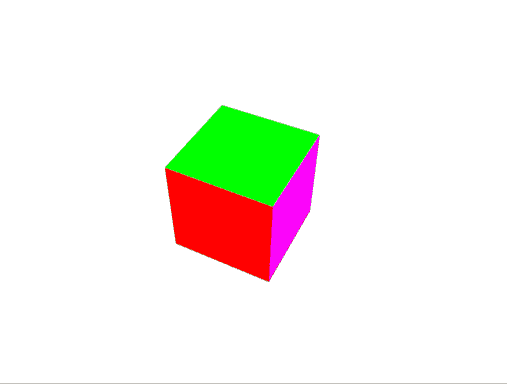

# WebGL 月份。第 16 天。着色立方体:深度缓冲和数组一致性

> 原文：<https://dev.to/lesnitsky/webgl-month-day-16-colorizing-cube-depth-buffer-and-array-uniforms-4nhc>

[](https://github.com/lesnitsky/webgl-month)

[](https://twitter.com/lesnitsky_a)

[加入邮件列表](http://eepurl.com/gwiSeH),让新邮件直接进入你的收件箱

建造于

[](https://github.com/lesnitsky/git-tutor)

## 第十六天。彩色立方体和探索深度缓冲区

嘿👋

欢迎来到[网银月](https://github.com/lesnitsky/webgl-month)

昨天我们已经渲染了一个立方体，但是所有的面都是一样的颜色，让我们改变一下。

让我们来定义脸的颜色

📄src/3d.js

```
 20, 21, 22, 20, 22, 23, // left
  ]);

+ const faceColors = [
+     [1.0, 1.0, 1.0, 1.0], // Front face: white
+     [1.0, 0.0, 0.0, 1.0], // Back face: red
+     [0.0, 1.0, 0.0, 1.0], // Top face: green
+     [0.0, 0.0, 1.0, 1.0], // Bottom face: blue
+     [1.0, 1.0, 0.0, 1.0], // Right face: yellow
+     [1.0, 0.0, 1.0, 1.0], // Left face: purple
+ ];
+ 
  const vertexBuffer = new GLBuffer(gl, gl.ARRAY_BUFFER, cubeVertices, gl.STATIC_DRAW);
  const indexBuffer = new GLBuffer(gl, gl.ELEMENT_ARRAY_BUFFER, indices, gl.STATIC_DRAW); 
```

现在我们需要为每个面顶点重复面颜色

📄src/3d.js

```
 [1.0, 0.0, 1.0, 1.0], // Left face: purple
  ];

+ const colors = [];
+ 
+ for (var j = 0; j < faceColors.length; ++j) {
+     const c = faceColors[j];
+     colors.push(
+         ...c, // vertex 1
+         ...c, // vertex 2
+         ...c, // vertex 3
+         ...c, // vertex 4
+     );
+ }
+ 
+ 
  const vertexBuffer = new GLBuffer(gl, gl.ARRAY_BUFFER, cubeVertices, gl.STATIC_DRAW);
  const indexBuffer = new GLBuffer(gl, gl.ELEMENT_ARRAY_BUFFER, indices, gl.STATIC_DRAW); 
```

并创建一个 webgl 缓冲区

📄src/3d.js

```
 const vertexBuffer = new GLBuffer(gl, gl.ARRAY_BUFFER, cubeVertices, gl.STATIC_DRAW);
+ const colorsBuffer = new GLBuffer(gl, gl.ARRAY_BUFFER, new Float32Array(colors), gl.STATIC_DRAW);
  const indexBuffer = new GLBuffer(gl, gl.ELEMENT_ARRAY_BUFFER, indices, gl.STATIC_DRAW);

  vertexBuffer.bind(gl); 
```

接下来，我们需要定义一个属性，将颜色从 js 传递到顶点着色器，并从顶点着色器传递到片段着色器

📄src/shaders/3d.v.glsl

```
 attribute vec3 position;
+ attribute vec4 color; 
  uniform mat4 modelMatrix;
  uniform mat4 viewMatrix;
  uniform mat4 projectionMatrix;

+ varying vec4 vColor;
+ 
  void main() {
      gl_Position = projectionMatrix * viewMatrix * modelMatrix * vec4(position, 1.0);
+     vColor = color;
  } 
```

并在片段着色器中使用它来代替硬编码的红色

📄src/shaders/3d.f.glsl

```
 precision mediump float;

+ varying vec4 vColor;
+ 
  void main() {
-     gl_FragColor = vec4(1, 0, 0, 1); +     gl_FragColor = vColor;
  } 
```

最后在 js 中设置顶点属性

📄src/3d.js

```
 vertexBuffer.bind(gl);
  gl.vertexAttribPointer(programInfo.attributeLocations.position, 3, gl.FLOAT, false, 0, 0);

+ colorsBuffer.bind(gl);
+ gl.vertexAttribPointer(programInfo.attributeLocations.color, 4, gl.FLOAT, false, 0, 0);
+ 
  const modelMatrix = mat4.create();
  const viewMatrix = mat4.create();
  const projectionMatrix = mat4.create(); 
```

好的，颜色是有的，但是有些地方不对劲

[](https://res.cloudinary.com/practicaldev/image/fetch/s--8J08rKGD--/c_limit%2Cf_auto%2Cfl_progressive%2Cq_66%2Cw_880/https://git-tutor-assets.s3.eu-west-2.amazonaws.com/rotating-colors-cube.gif)

让我们通过渐增渲染人脸来更详细地了解发生了什么

```
let count = 3;

function frame() {
    if (count <= index.data.length) {
        gl.drawElements(gl.TRIANGLES, count, gl.UNSIGNED_BYTE, 0);
        count += 3;

        setTimeout(frame, 500);
    }
} 
```

[](https://res.cloudinary.com/practicaldev/image/fetch/s--GRswPwd1--/c_limit%2Cf_auto%2Cfl_progressive%2Cq_66%2Cw_880/https://git-tutor-assets.s3.eu-west-2.amazonaws.com/incremental-rendering.gif)

看起来像是后来渲染的三角形与实际上离观察者更近的三角形重叠😕我们如何解决这个问题？

📄src/3d.js

```
 gl.linkProgram(program);
  gl.useProgram(program);

+ gl.enable(gl.DEPTH_TEST);
+ 
  const programInfo = setupShaderInput(gl, program, vShaderSource, fShaderSource);

  const cubeVertices = new Float32Array([ 
```

在顶点被组装成图元(三角形)之后，片段着色器在三角形内部绘制每个像素，但是在颜色片段的计算通过一些“测试”之前。其中一个测试是深度，我们需要手动启用它。

其他类型的测试有:

*   `gl.SCISSORS_TEST` -是否是某个三角形内部的片段(不要把这个和 viewport 混淆，有一个特殊的剪刀[[https://developer . Mozilla . org/en-US/docs/Web/API/WebGLRenderingContext/scissor](https://developer.mozilla.org/en-US/docs/Web/API/WebGLRenderingContext/scissor)方法)
*   类似于深度，但是我们可以手动定义一个“遮罩”并丢弃一些像素(我们将在下一个教程中使用模板缓冲)
*   像素所有权测试——屏幕上的一些像素可能属于其他 OpenGL 上下文(假设你的浏览器被其他窗口覆盖了),所以这些像素被丢弃(没有被绘制)

酷，我们现在有一个工作的三维立方体，但我们复制了很多颜色来填充顶点缓冲区，我们能做得更好吗？我们正在使用一个固定的调色板(6 种颜色)，所以我们可以将这些颜色传递给一个着色器，并只使用该颜色的索引。

让我们去掉颜色属性，引入一个颜色索引

📄src/shaders/3d.v.glsl

```
 attribute vec3 position;
- attribute vec4 color; + attribute float colorIndex; 
  uniform mat4 modelMatrix;
  uniform mat4 viewMatrix; 
```

着色器支持制服的“数组”,因此我们可以将调色板传递给该数组，并使用 index 从中获取颜色

📄src/shaders/3d.v.glsl

```
 uniform mat4 modelMatrix;
  uniform mat4 viewMatrix;
  uniform mat4 projectionMatrix;
+ uniform vec4 colors[6]; 
  varying vec4 vColor;

  void main() {
      gl_Position = projectionMatrix * viewMatrix * modelMatrix * vec4(position, 1.0);
-     vColor = color; +     vColor = colors[int(colorIndex)];
  } 
```

我们需要对设置颜色索引属性进行适当的更改

📄src/3d.js

```
 const colors = [];

  for (var j = 0; j < faceColors.length; ++j) {
-     const c = faceColors[j];
-     colors.push(
-         ...c, // vertex 1
-         ...c, // vertex 2
-         ...c, // vertex 3
-         ...c, // vertex 4
-     ); +     colors.push(j, j, j, j);
  }

  gl.vertexAttribPointer(programInfo.attributeLocations.position, 3, gl.FLOAT, false, 0, 0);

  colorsBuffer.bind(gl);
- gl.vertexAttribPointer(programInfo.attributeLocations.color, 4, gl.FLOAT, false, 0, 0); + gl.vertexAttribPointer(programInfo.attributeLocations.colorIndex, 1, gl.FLOAT, false, 0, 0); 
  const modelMatrix = mat4.create();
  const viewMatrix = mat4.create(); 
```

要填充一个数组制服，我们需要单独设置这个数组中的每个“项目”，就像这样

```
gl.uniform4fv(programInfo.uniformLocations[`colors[0]`], color[0]);
gl.uniform4fv(programInfo.uniformLocations[`colors[1]`], colors[1]);
gl.uniform4fv(programInfo.uniformLocations[`colors[2]`], colors[2]);
... 
```

显然这可以在一个循环中完成。

📄src/3d.js

```
 colors.push(j, j, j, j);
  }

+ faceColors.forEach((color, index) => {
+     gl.uniform4fv(programInfo.uniformLocations[`colors[${index}]`], color);
+ }); 
  const vertexBuffer = new GLBuffer(gl, gl.ARRAY_BUFFER, cubeVertices, gl.STATIC_DRAW);
  const colorsBuffer = new GLBuffer(gl, gl.ARRAY_BUFFER, new Float32Array(colors), gl.STATIC_DRAW); 
```

很好，我们得到了相同的结果，但是在属性中使用的数据少了 4 倍。

这可能看起来是一个不必要的优化，但是当你必须频繁地更新大的缓冲区时，它可能会有所帮助

[](https://res.cloudinary.com/practicaldev/image/fetch/s--43fLfQAa--/c_limit%2Cf_auto%2Cfl_progressive%2Cq_66%2Cw_880/https://git-tutor-assets.s3.eu-west-2.amazonaws.com/rotating-cube-fixed-1.gif)

今天到此为止！

下一节教程再见👋

* * *

这是一系列与 WebGL 相关的博文。每天都会有新帖子

[](https://github.com/lesnitsky/webgl-month)
[T6】](https://twitter.com/lesnitsky_a)

[加入邮件列表](http://eepurl.com/gwiSeH),让新邮件直接进入你的收件箱

[此处提供源代码](https://github.com/lesnitsky/webgl-month)

建造于

[](https://github.com/lesnitsky/git-tutor)