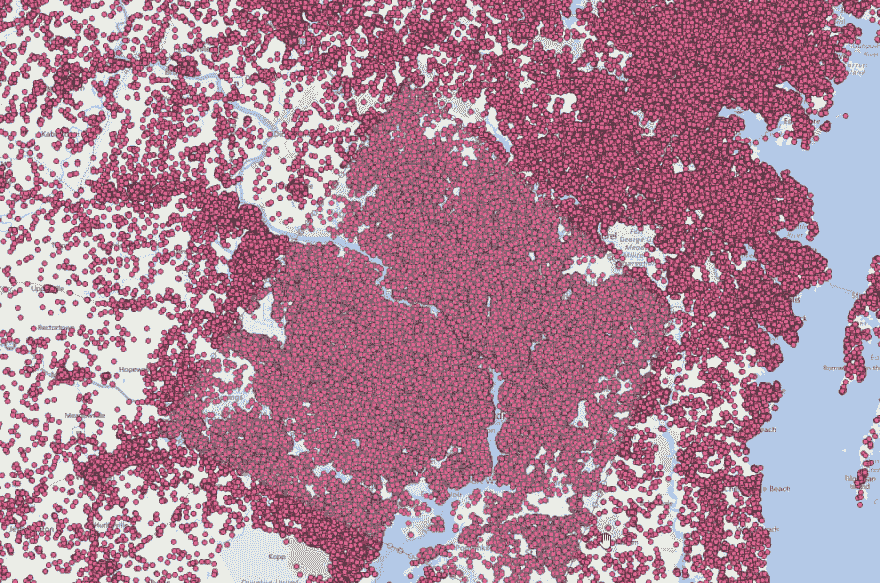
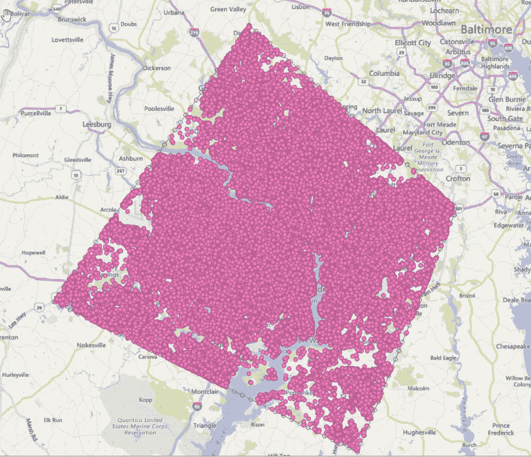
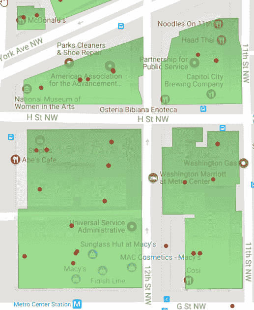
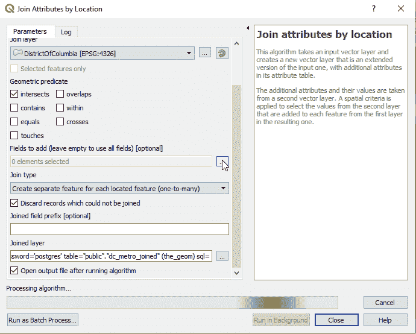

# 创建空间连接的概念证明

> 原文：<https://dev.to/danvoyce/creating-a-proof-of-concept-for-spatial-joins-2l4l>

因此，作为我们地理空间战略的一部分，我们在本地拥有一个庞大的 POI 数据库，作为其中的一部分，我们已经开始将其与我们的地理围栏库合并，使我们能够获得更精细的控制，并执行停留时间计算等任务，以帮助为我们的数据提供更多价值。

## 创建测试数据集:

现在，我们通常使用的数据非常庞大，仅我的测试数据库就超过 150GB，我们没有时间整天等待计算在本地机器上进行，所以诀窍是创建一个小的、可单独验证的数据集，以便为更大的整体创建概念证明。

*我们有一个美国哥伦比亚特区的数据集:*

现在-即使有了这个超级受限的数据集，在 QGIS 中对周围多边形的大量折点执行计算仍然需要大量时间，因此为了简单起见，我使用 QGIS 中的地理处理工具来“简化”此多边形:

(也可以手动操作)。

现在我们有了一个简化的多边形，我们可以覆盖我们的 POI 数据库，以了解我们将处理多少数据:

是的，正如所料，这是一个相当大的数量，我们实际上只对其中非常小的子集感兴趣(我将在后面描述)，但这需要是一个迭代过程，以避免在最终数据集上出现 24 小时的连接。

因此，首先让我们放弃我们已创建的简化多边形之外的任何内容，我们可以使用 QGIS 中的“裁剪”功能来完成此操作:

好多了。现在，我们来了解一下如何管理地理围栏。这些粉色圆圈代表 DC 地铁(ish)区域内的每一个单点 POI，但是点仅仅是单点。我们可以判断一个设备是否靠近了一个点，但是我们不能真正从这个动作中发出意图信号。这就是我们需要地理围栏的地方。因此，我们有我们的数据库，为我们感兴趣的项目建立地理围栏

因此，在这种情况下，让我们从华盛顿国会大厦附近的地理围栏(忽略不匹配的地理围栏-基础地图是不同的，但我想要的标签):

这里的每一栋建筑都代表了一些步行交通位置，我们可以用它们来证明我们的概念。

并非每个 POI 都与建筑物的地理围栏对齐，我们有两种方法可以处理这种情况:

*   创建一个反向数据集，为不在地理围栏内的任何点创建一个新图层，然后在这些点周围创建一个小半径，作为一个独立的地理围栏。
*   使用最近邻函数搜索来估计它们的位置。

实际上，我们需要根据数据来做这两件事，但这超出了本文的范围。现在，让我们只关注地理围栏内的项目。我们可以看到，左边是华盛顿万豪酒店，右边的红点是显示这一点的 POI 点。

现在，我们可以在 QGIS 中进行连接，以创建连接了属性的新数据集:

这将在我的本地测试数据库中创建一个新表，其中包含 POI 的所有信息，并连接到包含它的多边形 ID，为每个定位的要素创建单独的要素。这也意味着每个多边形将有几个项目，在内部，我们使用专有方法来识别每个位置的单独边界，从而将单个多边形分割为多个包含单个 POI 的多边形。

<colgroup><col> <col></colgroup> 
|  | 首席技术官丹尼尔·沃伊斯Daniel 负责本地的技术战略、架构和开发。他把澳大利亚墨尔本作为自己的家，是一名卓有成就的技术领导者，在定义和开发数字路线图、高科技系统和框架以及软件平台方面拥有丰富的经验。 |