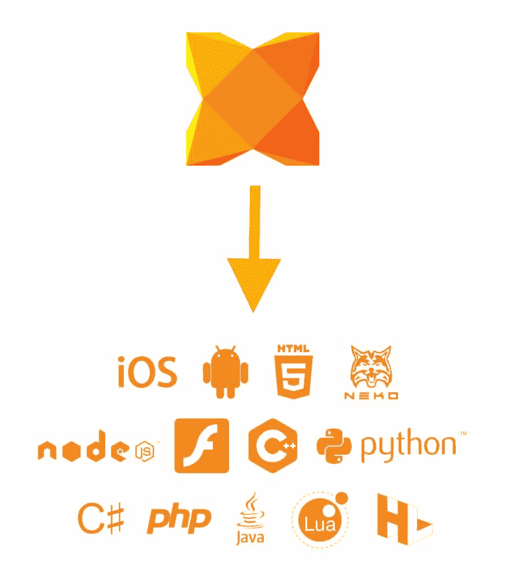
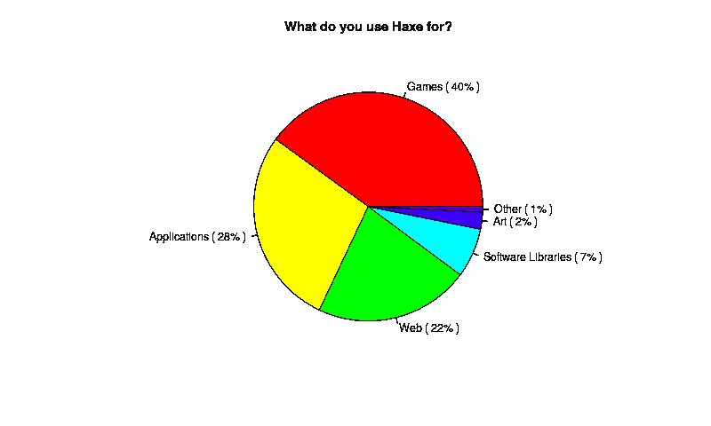

# 什么是 Haxe，我应该关心它吗？

> 原文：<https://dev.to/richardbray/what-is-haxe-and-should-i-care-about-it-4f5n>

在过去的 6 个月里，我一直在用 hax 开发一款游戏，我真的很喜欢用它。来自前端、[、Javascript、](https://developer.mozilla.org/en-US/docs/Web/JavaScript)、网络背景深入研究一门新语言是一件很有趣的事情，Haxe 是一个很好的敲门砖，因为语法非常相似。与 Javascript 社区不同，Haxe one 相当小，这意味着网上谈论它的人不多。我希望通过这篇文章和将来的其他文章来增加关于 hax 的讨论。

## 什么是 Haxe？

网上有很多关于这个的官方解释，如果那是你正在寻找的东西，你可以在这里找到。但是我要给这个问题一个简单的答案，Haxe 是一种被编译成其他语言的语言，就是这样。一种语言支持多种平台。所以你可以在 Haxe 中写一段代码，并在 Javascript 项目中使用相同的代码，无论是 Python 项目、Java 项目还是 C++项目。事实上，根据[这篇文章](https://dev.to/khaled_garbaya/do-you-know-haxe-1he9)，Haxe 支持超过 8 种不同的语言，这很酷。

[](https://res.cloudinary.com/practicaldev/image/fetch/s--L89wVe9z--/c_limit%2Cf_auto%2Cfl_progressive%2Cq_auto%2Cw_880/https://thepracticaldev.s3.amazonaws.com/i/8ntmp8nff1z1fb7tvpvq.jpg)

Haxe 本身于 2006 年发布，是一种开源的强类型语言，看起来与 [ActionScript](https://en.wikipedia.org/wiki/ActionScript) 或 [Typescript](https://en.wikipedia.org/wiki/Microsoft_TypeScript) 非常相似，所以对那些有这两种语言经验的人来说应该很熟悉。

```
// TypeScript
function greet(name?:string):string {
    if (name) {
        return "Hello, " + name;
    } else {
        return "Hello";
    }
} 
```

```
// Haxe
function greet(?name:String):String {
    if (name != null) { // no implicit conversion to Bool
        return "Hello, " + name;
    } else {
        return "Hello";
    }
} 
```

*(代码样本取自[此处](https://blog.onthewings.net/2015/08/05/typescript-vs-haxe/) )*

## 该不该在意？

正如我在第一段中提到的，在 Haxe 之前，我的编程经验主要基于前端技术(HTML、CSS 和 JS)。因此，从这个角度来看，这个问题的答案应该是，不会。如果您是一名开发人员，对您已经使用的语言很满意，也很了解，并且对尝试不同的东西没有兴趣，那么您真的不需要了解或关心 Haxe。然而，如果你是一个好奇的开发者，想看看外面还有什么，最重要的是，对游戏开发感兴趣，那么你肯定应该关心 Haxe。

是的，Haxe 网站确实说你可以用它来进行网络和移动开发，我个人以前没有用过，因为有跨平台的工具，像 [Flutter](https://flutter.dev/) 和 [React Native](https://facebook.github.io/react-native/) 更适合这些东西。游戏开发是大多数人使用 Haxe 最普遍的原因。

[](https://res.cloudinary.com/practicaldev/image/fetch/s--Z1cEyvFO--/c_limit%2Cf_auto%2Cfl_progressive%2Cq_auto%2Cw_880/https://haxe.org/img/blog/2019-03-01-haxe-2018-survey-results/pie-group-usages.png) 
*(Haxe 2018 调查结果)*

## 我为什么用 Haxe 做游戏？

与其他流行的游戏开发引擎( [Unity](https://unity.com/) 、[虚幻引擎](https://www.unrealengine.com/en-US/)、 [Gamemaker](https://www.yoyogames.com/gamemaker) )不同，Haxe 没有 GUI，它只是一种编程语言。因此，如果你对某个 IDE(咳嗽[对代码](https://code.visualstudio.com/))很熟练，你就不必切换，只需在终端运行几个命令，你就可以开始制作游戏了。嗯，没那么简单，像往常一样，你需要先安装一些软件包。就像 Javascript 包的 [NPM](https://www.npmjs.com/) ， [Haxelib](https://lib.haxe.org/) 是 Haxe 的包管理器。

实际上，为了避免在评论中被纠正，让我稍微改写一下上面的段落。有一些基于 Haxe 构建的游戏引擎确实有 GUI，即[军械库](https://armory3d.org/)和 [Stencyl](http://www.stencyl.com/) ，但是一般来说，使用 Haxe 的游戏开发是在代码编辑器中完成的。唷。

我喜欢使用 Haxe 进行游戏开发的另一个原因是它很小，比我想象的要小得多。撰写本文时的最新版本(4.0.0-rc.3)小于 10MB，根据经验，与其他编程语言相比，下载和安装速度要快得多。Haxe 是完全免费的，没有针对特定目标的隐藏成本，也没有你的游戏的拷贝出售量，只是免费的，这对那些出于爱好开发游戏的人来说是理想的。

当然，现在用普通的 Haxe 代码来创建一个游戏是不太可能的。更常见的是用一个游戏框架或者引擎搭配 Haxe。对于我的游戏，我选择使用 HaxeFlixel 主要是因为它有很棒的文档、例子和易用性，但还有很多其他原因。我打算将来写一篇关于它的文章。

## 最后的话

总之，如果你目前是一名网页开发者，想要尝试制作一款可以在 Windows、Mac、Linux、Android、iOS 甚至是游戏机上运行的游戏，你绝对应该去看看 Haxe。没有成本，很容易集成到您的工作流中，看起来非常类似于 Typescript。