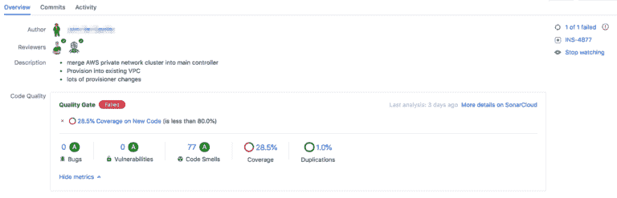
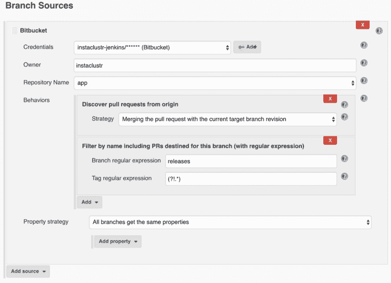
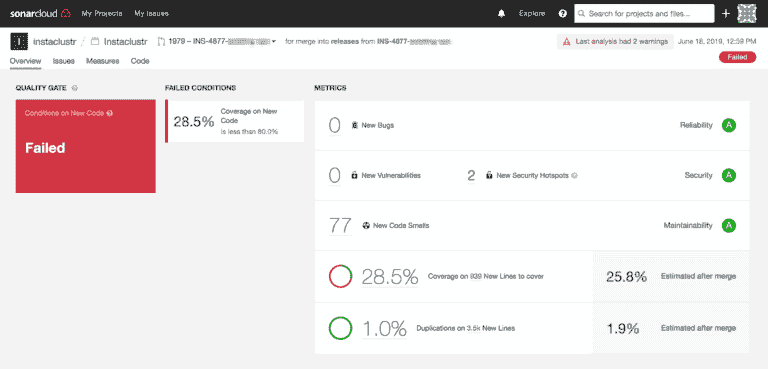
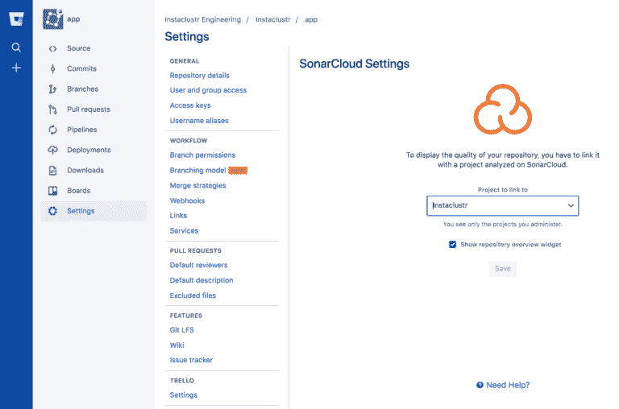

# 使用 Bitbucket、Jenkins 和 sonar cloud-bit bucket 在拉取请求中自动生成覆盖报告

> 原文：<https://dev.to/atlassian/automate-coverage-reports-in-pull-requests-with-bitbucket-jenkins-and-sonarcloud-bitbucket-5hdc>

### 使用 Bitbucket、Jenkins 和 SonarCloud — Bitbucket 在拉取请求中自动生成覆盖报告

在 [Instaclustr](https://www.instaclustr.com/) ，我们的团队规模有了显著增长，这对扩大我们的开发范围和速度大有裨益。这种好处的另一面是，随着项目速度的提高，审批者从自己的任务中抽出时间并以更快的速度提供高质量反馈的压力也随之增加。

为了解决这一问题，我们彻底检查了现有的构建系统，以:

*   自动化静态代码分析
*   暴露重要的度量标准(比如测试覆盖率，测试是否通过)；和
*   在拉取请求中将其公开给审阅者

[](https://res.cloudinary.com/practicaldev/image/fetch/s--8rCyzx5L--/c_limit%2Cf_auto%2Cfl_progressive%2Cq_auto%2Cw_880/https://cdn-images-1.medium.com/max/768/0%2A2l0tbuwUWTzl1Kkr.png)

现在，我们的审核工作流程是:

1.  开发人员在 Bitbucket 中创建一个 PR，目标是发布分支
2.  Jenkins 看到了 PR 的创建，并从单元和系统测试开始启动我们的构建和测试管道。如果成功，管道将进入我们的端到端测试。在每个阶段，覆盖结果都被转发到 SonarCloud 进行分析
3.  当审批者查看 PR 时，Bitbucket(通过 SonarCloud 小部件)获取代码分析结果并提供相关的上下文

审批者可以立即知道:

*   PR 中新代码的覆盖范围
*   是否存在任何常见代码错误(例如，未关闭资源)
*   遵循风格指南(例如，继承树有多深)

最重要的是，实现这一点只需要相对较少的更改！

### 1。詹金斯

我们使用 Jenkins 作为我们的构建系统，因此我们创建了一个多分支管道作业，该作业使用 [Bitbucket 分支源代码插件](https://wiki.jenkins.io/display/JENKINS/Bitbucket+Branch+Source+Plugin)来轮询针对我们的发布分支的任何新的或更新的 PRs。然后可以将管道触发器配置为每分钟扫描一次。

[](https://res.cloudinary.com/practicaldev/image/fetch/s--Yhe8xeJf--/c_limit%2Cf_auto%2Cfl_progressive%2Cq_auto%2Cw_880/https://cdn-images-1.medium.com/max/768/0%2AxnqYkF3XV1Dt0_Gl.png)

一旦被触发，作业将运行我们的测试管道 Jenkinsfile。

我们的 Jenkinsfile 的相关部分是:

```
mvn clean org.jacoco:jacoco-maven-plugin:prepare-agent test --fail-at-end -DskipTests=false -am

mvn sonar:sonar --batch-mode --errors " + "-pl ${context.env.TEST\_MODULES} -am " + "-Dsonar.projectKey=${Constants.SONARCLOUD\_PROJECT\_KEY} " + "-Dsonar.organization=${Constants.SONARCLOUD\_ORGANISATION} " + "-Dsonar.verbose=true " + "-Dsonar.host.url=${Constants.SONARCLOUD\_URL} " + "-Dsonar.login=${context.env.SONARCLOUD\_TOKEN} " + "-Dsonar.pullrequest.branch=${context.env.BRANCH\_NAME} " + "-Dsonar.pullrequest.base=${Constants.RELEASES\_BRANCH} " + "-Dsonar.pullrequest.key=${context.env.CHANGE\_ID} 
```

### 2。声纳云

上传的报告将自动在 SonarCloud 中注册一个新的 PR，并可以通过 SonarCloud 控制台进行浏览，以显示代码问题、测试覆盖趋势以及 PR 是否符合可定制的质量标准的内嵌视图。值得注意的是，这些指标是根据 PR 引入的新代码[计算的，因此开发人员不必对整个代码库的分析进行排序。](https://sonarcloud.io/documentation/analysis/pull-request/)

[](https://res.cloudinary.com/practicaldev/image/fetch/s--kmclOCZz--/c_limit%2Cf_auto%2Cfl_progressive%2Cq_auto%2Cw_880/https://cdn-images-1.medium.com/max/768/0%2AanvUj3utHySXYjz5.png)

### 3\. BitBucket

此时，我们让 Jenkins 自动测试 PRs，SonarCloud 提供分析。为了让审批者尽可能容易地看到这些信息，我们只需要在我们的 Bitbucket 存储库中启用 SonarCloud 小部件。

[](https://res.cloudinary.com/practicaldev/image/fetch/s--99p7j_j0--/c_limit%2Cf_auto%2Cfl_progressive%2Cq_auto%2Cw_880/https://cdn-images-1.medium.com/max/768/0%2Aplqx5i7S2E1eYpJk.png)

现在，无论何时创建 PR，小部件都会引入测试覆盖率、bug 和代码味道指标。使用 Bitbucket Jenkins 插件还意味着我们的 PRs 将显示一个方便的“构建通过”状态，让我们知道一个分支何时成功地通过了所有的测试用例。

### 总结

对于 Instaclustr，该设置具有:

*   通过提供用于评估 PR 质量的汇总指标，简化了审阅者进行的基本检查
*   突出显示在并行设置中不工作的测试用例(例如，不正确地使用单例对象)
*   突出不良测试验证模式(例如，计算测试前后的比较，而不是检查记录的存在)
*   当测试没有运行时，代码覆盖率会突出显示(例如，名称与 Surefire 包含模式不匹配)
*   确保突出显示可能产生重大影响的简单代码错误，例如没有关闭资源

希望这已经提供了一个快速启动和运行静态代码分析的指南；如果您对本文有任何反馈、想法或问题，[我很想听听](mailto:alwyn@instaclustr.com)！

作者简介: [*Alwyn Davis*](mailto:alwyn@instaclustr.com) *是*[*Instaclustr*](https://www.instaclustr.com/)*的高级软件开发人员，除了提供面向客户的支持和交付咨询项目之外，他还参与了多个基础设施和开发项目。他专注于 Instaclustr 面向客户端的管理系统的开发，实现了 Cassanda、Spark 和 Kafka 部署流程。他还拥有搜索引擎、数据库和 CRM 实施、管理和应用程序开发方面的技术咨询经验。*

喜欢分享你的技术专长吗？了解更多关于[位桶编写程序](https://bitbucket.org/product/write?utm_source=blog&utm_medium=post&utm_campaign=bottom-post)的信息。

[扩展您的 Bitbucket 团队？在此升级您的计划](https://bitbucket.org/account/admin/plans/)

*原载于 2019 年 7 月 16 日*[*【https://bitbucket.org】*](https://bitbucket.org/blog/automate-coverage-reports-in-pull-requests-bitbucket-jenkins-sonarcloud)*。*