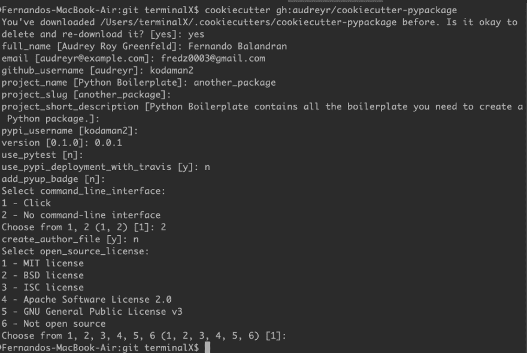
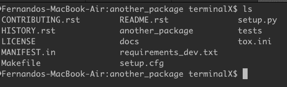

# 第 3 部分使用 Cookiecutter 的另一个包

> 原文：<https://dev.to/thefern/another-package-with-cookiecutter-578d>

[封面图片致谢](https://www.etsy.com/listing/479004974/programming-languages-cookie-cutter-set)

将烤箱温度设置为 350 华氏度或 175 摄氏度。在这篇文章中，我们将烘焙一个 python 包。这是本系列的第三部分。在前一篇文章中，我们已经通过手动创建结构设置了一个基本的包。在这篇文章中，我们将利用一个非常酷的软件包 [Cookiecutter](https://github.com/cookiecutter/cookiecutter) 。Cookiecutter 可以克隆另一个 repo 的目录，甚至是一个本地目录。您很快就会有一个 python 包。还有一个大型的模板数据库，不仅仅是 python 的。

## [T1】安装 Cookiecutter](#installing-cookiecutter)

您可以用 pip 命令安装 cookiecutter(注意:我使用 pip3，因为我也安装了 py2):

```
pip3 install cookiecutter 
```

<svg width="20px" height="20px" viewBox="0 0 24 24" class="highlight-action crayons-icon highlight-action--fullscreen-on"><title>Enter fullscreen mode</title></svg> <svg width="20px" height="20px" viewBox="0 0 24 24" class="highlight-action crayons-icon highlight-action--fullscreen-off"><title>Exit fullscreen mode</title></svg>

## 创建包

在我的 git 目录下，我可以运行:

```
cookiecutter https://github.com/audreyr/cookiecutter-pypackage 
```

<svg width="20px" height="20px" viewBox="0 0 24 24" class="highlight-action crayons-icon highlight-action--fullscreen-on"><title>Enter fullscreen mode</title></svg> <svg width="20px" height="20px" viewBox="0 0 24 24" class="highlight-action crayons-icon highlight-action--fullscreen-off"><title>Exit fullscreen mode</title></svg>

因为 github 实际上是存储库，所以您还可以运行:

```
cookiecutter gh:audreyr/cookiecutter-pypackage 
```

<svg width="20px" height="20px" viewBox="0 0 24 24" class="highlight-action crayons-icon highlight-action--fullscreen-on"><title>Enter fullscreen mode</title></svg> <svg width="20px" height="20px" viewBox="0 0 24 24" class="highlight-action crayons-icon highlight-action--fullscreen-off"><title>Exit fullscreen mode</title></svg>

`Note: Make sure to say 2 for cli`
[T4】](https://res.cloudinary.com/practicaldev/image/fetch/s--_N-Lmnb8--/c_limit%2Cf_auto%2Cfl_progressive%2Cq_auto%2Cw_880/https://kodaman2.github.io/blimg/python-package-series/cookiecutter-prompts.png)

一切就绪:

[](https://res.cloudinary.com/practicaldev/image/fetch/s--0ORcETND--/c_limit%2Cf_auto%2Cfl_progressive%2Cq_auto%2Cw_880/https://kodaman2.github.io/blimg/python-package-series/package-contents.png)

不到一分钟，一个完整的项目就创建好了，包含了 python 包的所有必要文件。

## 添加功能测试包

我使用 vscode，所以在主包目录里面运行:

```
code . 
```

<svg width="20px" height="20px" viewBox="0 0 24 24" class="highlight-action crayons-icon highlight-action--fullscreen-on"><title>Enter fullscreen mode</title></svg> <svg width="20px" height="20px" viewBox="0 0 24 24" class="highlight-action crayons-icon highlight-action--fullscreen-off"><title>Exit fullscreen mode</title></svg>

我们将重用我们的`say_hello`函数来确保项目按预期运行:

```
# -*- coding: utf-8 -*- 
"""Main module."""
def say_hello(name):
    print("hello %s" % (name)) 
```

<svg width="20px" height="20px" viewBox="0 0 24 24" class="highlight-action crayons-icon highlight-action--fullscreen-on"><title>Enter fullscreen mode</title></svg> <svg width="20px" height="20px" viewBox="0 0 24 24" class="highlight-action crayons-icon highlight-action--fullscreen-off"><title>Exit fullscreen mode</title></svg>

## 安装软件包

使用与之前相同的开发参数进行安装:

```
python3 setup.py develop 
```

<svg width="20px" height="20px" viewBox="0 0 24 24" class="highlight-action crayons-icon highlight-action--fullscreen-on"><title>Enter fullscreen mode</title></svg> <svg width="20px" height="20px" viewBox="0 0 24 24" class="highlight-action crayons-icon highlight-action--fullscreen-off"><title>Exit fullscreen mode</title></svg>

## 测试 say_hello 功能

此时，我们可以测试我们的功能。在终端启动 python3 或者启动 idle。

```
>>> from another_package import *
>>> say_hello("fer") 
```

<svg width="20px" height="20px" viewBox="0 0 24 24" class="highlight-action crayons-icon highlight-action--fullscreen-on"><title>Enter fullscreen mode</title></svg> <svg width="20px" height="20px" viewBox="0 0 24 24" class="highlight-action crayons-icon highlight-action--fullscreen-off"><title>Exit fullscreen mode</title></svg>

不会跑吧？我们忘了做一件事，那就是将我们的 python 模块添加到 init 文件中。失败的原因是它不知道包中应该包含哪些函数。

```
>>> from another_package import *
>>> say_hello("fer")
Traceback (most recent call last):
  File "<stdin>", line 1, in <module>
NameError: name 'say_hello' is not defined 
```

<svg width="20px" height="20px" viewBox="0 0 24 24" class="highlight-action crayons-icon highlight-action--fullscreen-on"><title>Enter fullscreen mode</title></svg> <svg width="20px" height="20px" viewBox="0 0 24 24" class="highlight-action crayons-icon highlight-action--fullscreen-off"><title>Exit fullscreen mode</title></svg>

## 向 init 添加 py 模块

Open _ *init* _。py，在版本下面插入下面的`(note the dot before the module name)` :

```
from .another_package import * 
```

<svg width="20px" height="20px" viewBox="0 0 24 24" class="highlight-action crayons-icon highlight-action--fullscreen-on"><title>Enter fullscreen mode</title></svg> <svg width="20px" height="20px" viewBox="0 0 24 24" class="highlight-action crayons-icon highlight-action--fullscreen-off"><title>Exit fullscreen mode</title></svg>

这里我们告诉 init 导入我们所有的函数。

## 测试 2

退出 python，重新启动以重新加载另一个 _package。

```
>>> from another_package import *
>>> say_hello("fer")
hello fer 
```

<svg width="20px" height="20px" viewBox="0 0 24 24" class="highlight-action crayons-icon highlight-action--fullscreen-on"><title>Enter fullscreen mode</title></svg> <svg width="20px" height="20px" viewBox="0 0 24 24" class="highlight-action crayons-icon highlight-action--fullscreen-off"><title>Exit fullscreen mode</title></svg>

有了这个过程，您将不会忘记添加一个自述文件或一个许可证。

## 关于库克的一句话

如果你有一个项目需要某种结构，你可以做另一个模板。我通常只做 python 实用程序并使用 python 模板。如果您需要一个尚不存在的特定模板，请务必阅读关于如何创建模板的文档。

## 下一篇

我们有一个工作包，但目前还没有任何功能。在下一篇文章中，我们将添加一些功能，像 bash 或 cmd 提示符下的脚本一样运行。我们还将学习如何在 argparse 模块中使用参数。更多好玩的来了，敬请期待！

例如:

```
say_hello -n "fer" -l "balandran"
output: hello fer balandran 
```

<svg width="20px" height="20px" viewBox="0 0 24 24" class="highlight-action crayons-icon highlight-action--fullscreen-on"><title>Enter fullscreen mode</title></svg> <svg width="20px" height="20px" viewBox="0 0 24 24" class="highlight-action crayons-icon highlight-action--fullscreen-off"><title>Exit fullscreen mode</title></svg>