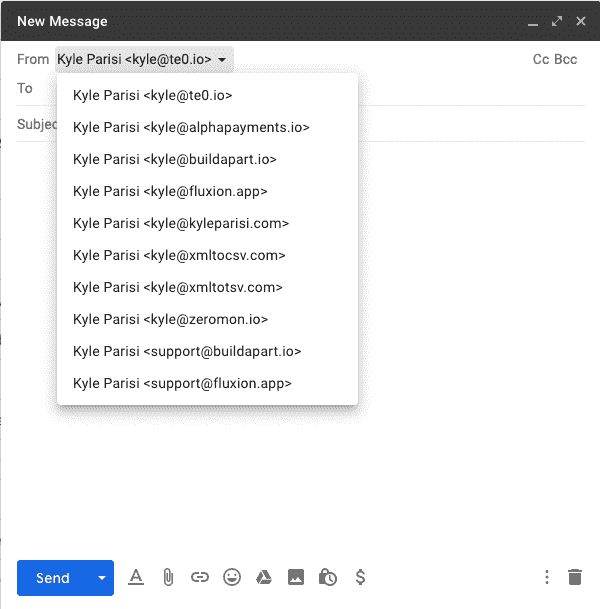

# GSuite 上的多封邮件

> 原文：<https://dev.to/kyleparisi/multiple-emails-on-gsuite-173>

# 邮箱别名

电子邮件别名是让你的钱更有价值的一种方式。GSuite 每月花费我 6.36 美元。为此，一个用户最多可以有 30 个电子邮件别名。如果你是 GSuite 管理员，这就是你的做法。登录后，您可以使用以下链接。

## [确保默认路由](https://admin.google.com/AdminHome?subtab=filters#ServiceSettings/service=email&subtab=domaindefault)

默认路由是一种捕捉发送给用户的所有无效电子邮件的方式。如果有人打错了你的电子邮件地址，这将有助于你仍然收到电子邮件。

## [添加你的域名](https://admin.google.com/AdminHome?subtab=filters#Domains:)

您可以在这里添加您的域，这是对您的 gsuite 域的补充。你可能不希望它是一个别名。

## [添加组织单位](https://admin.google.com/ac/orgunits)

这将允许您在 google groups 下创建共享收件箱。

## [给用户添加电子邮件别名](https://admin.google.com/ac/users)

点击感兴趣的用户，然后点击“用户信息”。添加您当前拥有的任何别名。此时，您需要等待一个小时才能将别名添加到 gmail 中。

## [添加发送自](https://mail.google.com/mail/u/0/#settings/accounts)

在“发送邮件为”部分，您应该能够添加上一步中的电子邮件。选中“作为别名处理”,如果你从上一步开始等待足够长的时间，它应该会接受电子邮件。

## 奖金:[邮箱简介图片](https://www.quora.com/How-do-I-add-a-profile-photo-to-an-alias-email-account-in-my-Gmail)

如果你想在 gmail 客户端显示你的个人资料图片，你可以这样做。