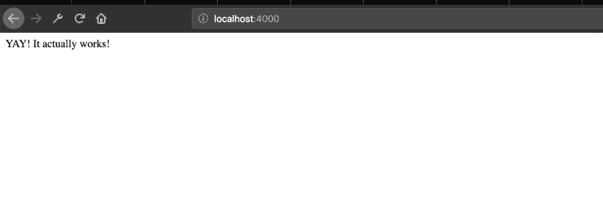

# 在不到 4 分钟的时间内建立一个节点类型脚本项目

> 原文：<https://dev.to/theghostyced/setting-up-a-node-typescript-project-in-under-4-minutes-4gk2>

近年来， [Typescript](https://www.typescriptlang.org) 越来越受欢迎，其突然增长的主要原因之一要归功于它的[强静态打字](https://www.sitepoint.com/typing-versus-dynamic-typing/)。

所以在这篇博文中，我们将设置一个 TSNode(Typescript + Node🤓4 分钟内完成申请(*排除互联网连接等外部因素*

## 目录

*   [项目设置](#chapter-1)
*   [安装依赖关系](#chapter-2)
*   [设置所需的 JSON 文件](#chapter-3)

**NB** -我假设你的机器上已经安装了 node，如果没有，那么我推荐你[在这里下载并安装它](https://nodejs.org/en/)。

### 项目设置

现在您已经在您的机器上安装了节点，让我们创建我们的项目目录并初始化一个新的节点项目

```
cd desired-folder

mkdir tsnode-project

npm init -y 
```

**NB** -提供-y 标志，即 *npm init -y* 让 npm 在初始化新项目时使用默认答案。

接下来，我们需要设置我们的文件夹结构，稍后看起来有点像这样

```
tsnode-project
│   package.json
│   tsconfig.json    
│
└───src
│   │   index.ts
│   │
│   
└───node_modules 
```

所以运行下面的命令来生成各种文件夹和文件

```
// tsnode-project

touch tsconfig.json

mkdir src && touch index.ts 
```

### 安装依赖项

接下来，我们安装 typescript 工作所需的必要包，

```
 npm i -D typescript 
npm i -D ts-node 
npm i -D nodemon 
```

##### 包交代

**ts-node**——这个包使得运行 typescript 代码而不用编译成 Javascript 成为可能。

**nodemon** -当检测到目录中的文件改变时，自动重启应用程序。

typescript 编译成可读的、基于标准的 JavaScript。

### 设置 TSConfig

现在我们已经安装了必要的包，我们可以继续设置我们的 typescript 配置文件。所以打开我们的`tscofig.json`，添加下面的代码。

```
{  "compilerOptions":  {  "target":  "es6",  "module":  "commonjs",  "rootDir":  "src",  "outDir":  "dist",  "sourceMap":  true,  "resolveJsonModule":  true,  "lib":  ["es6",  "dom"],  "esModuleInterop":  true  },  "include":  [  "src/**/*.ts"  ],  "exclude":  [  "node_modules"  ]  } 
```

如果你想知道每个选项的意思，那么去[打字稿文档](https://www.typescriptlang.org/docs/handbook/compiler-options.html)中寻找更多信息，但是现在，我只解释`rootDir`和`outDir`选项。

**rootDir**——这只是指 typescript 编译器应该在其中查找所有 **`.ts`** 文件的目录。

**outDir** -这是编译后的 js 文件所在的目录。想怎么改就怎么改。

在添加了必要的行之后，我们可以添加一个 **`script`** 到我们的`package.json`文件中，这将*启动我们的服务器*并且*运行我们的应用程序*的构建。脚本看起来会像这样

```
 {  ...  "scripts":  {  "start":  "tsc && node dist/index.js",  "dev":  "nodemon --watch 'src/**/*.ts' --exec 'ts-node' src/index.ts"  },  ...  } 
```

目前，我们的`index.ts`文件是空的，所以让我们设置一个[基本快速服务器](https://expressjs.com/)。

运行 **`npm i express -S`** 然后将下面一行添加到 **`index.ts`** 文件中。

```
 // index.ts

import express from 'express';

const app = express();
const port = 4000;

app.get('/', (req, res) => {
  res.send('YAY! It actually works!');
});

app.listen(port, err => {
  if (err) {
    return console.error(err);
  }
  return console.log(`Server is listening on ${port}`);
}); 
```

现在，我们可以通过运行命令`npm start`来运行我们的服务器

## 结果

[](https://res.cloudinary.com/practicaldev/image/fetch/s--7RuUCH-9--/c_limit%2Cf_auto%2Cfl_progressive%2Cq_auto%2Cw_880/https://thepracticaldev.s3.amazonaws.com/i/zmwfisedhgfv5qu2bb95.png)

# 一切搞定

现在你知道了！4 分钟内完成一个完整的节点类型脚本项目。如果由于某种奇怪的原因，它似乎对你不起作用，那么你可以在这里查看代码【https://github.com/theghostyced/tsnode-project-devto。还可以随意扩展应用程序以支持**`tslint`****`prettier`**等。

我也是，感谢你的阅读。如果你发现帖子有问题，请分享。