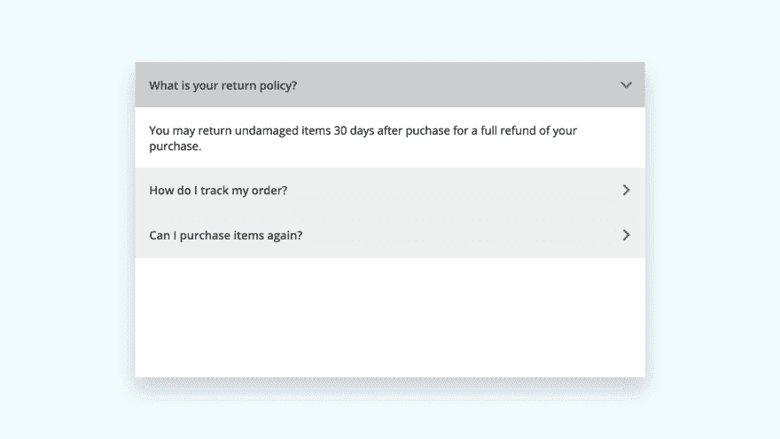

# 使用 React 挂钩构建 React Accordion 组件

> 原文：<https://dev.to/hunterbecton/build-a-react-accordion-component-using-react-hooks-jg2>

## 使用 React 挂钩从头开始构建 React 手风琴组件

在本教程中，你将学习如何使用 React 钩子`useState`和`useRef`创建一个动画 React 手风琴组件。

## 什么是 React 钩子？

以最简单的形式，React 钩子使得使用状态而不需要创建一个类成为可能。如果这足以说服你使用钩子，那么继续读下去。然而，如果你想更深入地了解 React 钩子，可以看看 Redux 和 Create React App 的合著者[丹·阿布拉莫夫](https://medium.com/@dan_abramov)的[理解 React 钩子](https://medium.com/@dan_abramov/making-sense-of-react-hooks-fdbde8803889)。

你可以从 CodeSandbox.io 的这里获得最终代码[。我也在下面的视频中记录了整个过程，并在随后的帖子中概述了每个步骤——享受吧！](https://codesandbox.io/s/react-accordion-using-react-hooks-9uuvc)

[https://www.youtube.com/embed/MAD2HnUFjgg](https://www.youtube.com/embed/MAD2HnUFjgg)

## 最终项目

[https://codesandbox.io/embed/9uuvc](https://codesandbox.io/embed/9uuvc)

## 在 CodeSandbox.io 中创建 React App

首先进入 [CodeSandbox.io](https://codesandbox.io/) ，注册你的 [GitHub](https://github.com/) 账户。CodeSandbox 是一个基于 web 的代码编辑器，它使编写代码和创建 web 应用程序变得容易，而不需要在您的计算机上进行任何本地设置——非常适合快速教程。

一旦你在仪表板上点击创建沙箱按钮，并选择反应客户端模板。这将创建一个基本的 React 应用程序，您可以开始使用它来构建 accordion。

在开始编写 accordion 组件之前，首先要做的是删除`styles.css`文件中的现成样式。然后添加以下全局样式: