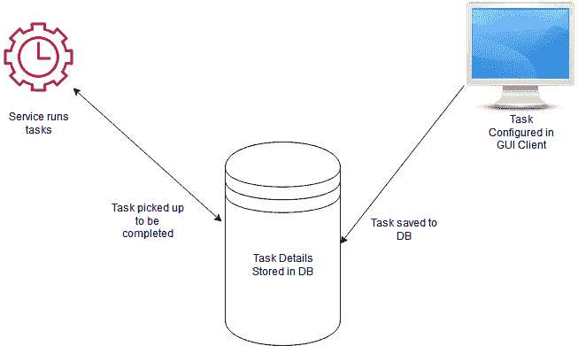
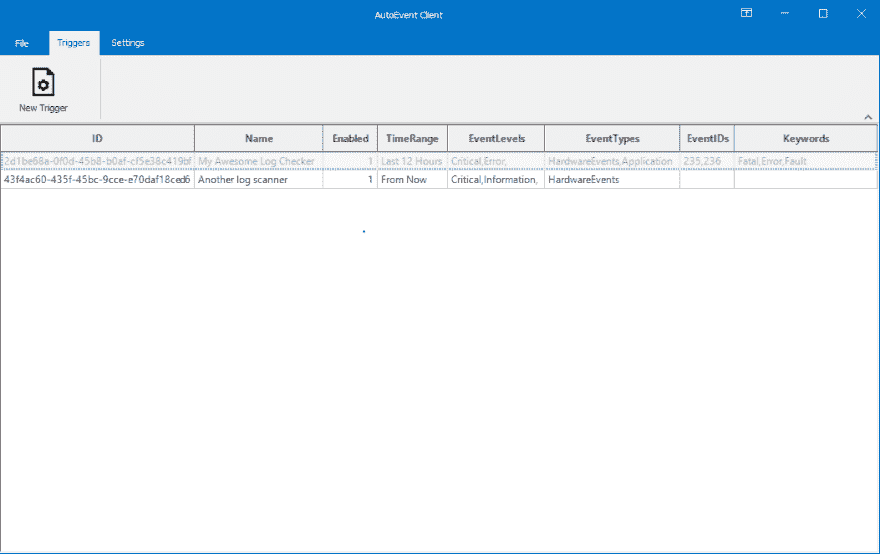
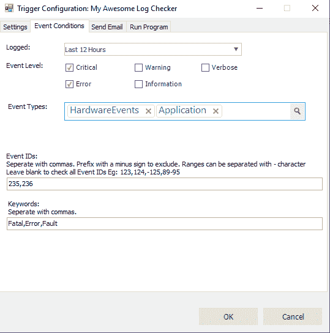
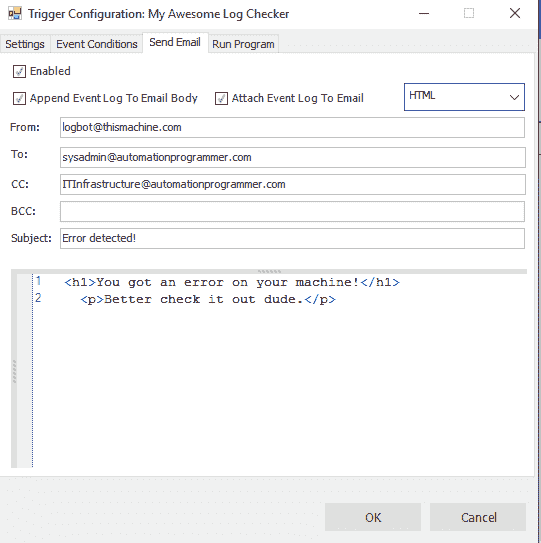

# 通过客户端服务桌面应用程序实现流程自动化

> 原文：<https://dev.to/nickproud/automating-processes-with-a-client-service-desktop-app-2kif>

### 微型 RPA 并不性感，但男孩可以解决问题。

在一个组织中实现数据流的自动化绝非易事。在与人合作或添加新流程时尤其如此。需要考虑的变量太多了(包括逻辑变量和代码变量)。

在大多数情况下，当企业决定自动化将解决流程瓶颈时，开发人员会参与进来，通过一系列脚本、小程序和定制服务来挽救局面，这些服务旨在:

*   仅可由所述开发者维护。
*   用特定的编程语言编写。
*   非技术人员无法接触到。

另一种选择？现成的 RPA 解决方案可能是最佳选择。像 Blue Prism 和 ThinkAutomation 这样的解决方案是非常棒的工具，在全球范围内用于控制日常数据流。

但是，如果公司希望开发人员创建类似的东西，但是没有用自动化工具和技巧武装到牙齿，该怎么办呢？

“客户服务”应用程序是一个可行的解决方案。

### 什么是“客户端服务”应用？

“客户服务”是一个术语，用来描述一个简单的软件架构，用来创建可管理的基于服务器的自动化软件。它最适合存在自动化问题的类似子集的情况，但也有必要让非技术人员容易访问系统。

该模型包括一个客户端；一个前端桌面应用程序，只有一个目的:将配置数据放在数据库中，然后是一个服务，(在我的大部分工作中，是一个 Windows 服务)，它的工作是不断检查数据库中要执行的新任务，然后执行它们，从而实现一个可配置的自动化解决方案。

这里的主要好处是 GUI。如果需求在早期被恰当地设定，开发人员可以确保 GUI 尽可能地灵活，以便有人配置新的自动化任务。

同样，服务也不必过于复杂。通常，服务本身是一个计时器，每 x 秒或每分钟检查一次数据库，看是否有新记录要处理。

一旦找到记录，服务就可以调用相关的逻辑来完成任务，并从提取的数据中获取所需的参数。我们甚至可以想出真正的妙招，将处理工作交给一个单独的服务。我喜欢这种方法，因为它鼓励软件工程实践中称为解耦的职责分离。分离的优点是故障点被限制在架构的一个区域，限制了对其他区域的影响，比如数据库或 GUI 客户机。

### 我进军微型 RPA

我最近在开发自己的应用程序 AutoEvent 时采用了这种方法。AutoEvent 是为系统管理员编写的，它自动扫描 Windows 计算机的事件查看器，查找符合特定条件的日志(例如:错误日志、包含特定关键字的日志等)。生成这些日志后，AutoEvent 会执行一个基本操作作为响应，例如发送电子邮件或运行程序。(一个类似的功能曾经是 Windows 自带的，但不久前被移除了，这也是我编写这个应用程序的原因。)

AutoEvent 采用客户端-服务方法，因为它有一个前端客户端，允许用户设置一些触发器，这些触发器存储在数据库中，供后台服务获取。

### 这不是故作性感吗

是的，这是最基本的。它使用 WinForms 所以不性感，但也不需要。当在 AutoEvent 这样的微应用中使用这种模式时，更容易牺牲大型企业应用中的圆滑视觉效果。相反，重点在于重新获得对业务自动化处理方式的控制。正如你可能已经注意到的，这是一个非常基本的架构，这可能是它最大的资产。

所以下次你想添加一个只有你能维护的自动化脚本库的时候，考虑一下使用客户端服务模型构建一个新的微型应用。您不会后悔拥有自己的一份 micro-RPA 好处，更重要的是，您办公室中的非技术人员会为此感谢您。