# 浪子风味飘动-又一个指南

> 原文：<https://dev.to/orestesgaolin/flavors-in-flutter-with-fastlane-yet-another-guide-1799>

为开发、测试和生产环境构建单独的应用程序是一个很好的做法。在移动应用程序的情况下，一个很好的方法是使用不同的配置。

在本教程中，您将学习如何准备普通的 Flutter 项目，使其具有 3 种不同的风格(**开发**、**测试**和**生产**)，以及如何使用 fastlane 处理构建、签署和部署。

**TL；博士**只需去[仓库](https://github.com/orestesgaolin/flutter-flavors)那里所有的口味都已经配置好了。

> 也可以在我的博客上看没有大 gif[的教程。](https://roszkowski.dev/2019/flutter-flavors/)

## 基础知识

口味的概念取自 Android 应用程序，可以以各种方式应用于 iOS(稍后将详细介绍)。通过在项目中加入各种风格，你可以用不同的配置选项、风格或功能集来构建你的应用。在商业项目中，这是分发应用程序的标准方式。

有几篇关于构建风格的文章值得一提:

*   [创造一个 Flutter 应用程序的风格(Flutter & Android 设置)](https://cogitas.net/creating-flavors-of-a-flutter-app/)Natalie Masse Hooper，
*   萨尔瓦托·佐丹奴的《风味飘动》，
*   [Flutter Ready to Go(口味、连接性等)](https://medium.com/flutter-community/flutter-ready-to-go-e59873f9d7de#c38c)作者 Julio Henrique Bitencourt。

在本文中，我将展示一种类似但略有不同的方法，并主要关注 iOS 部分。这种展示方式对我和我的同事来说非常有效。它已经通过了几个应用程序的测试，并且随着每个新项目的进行越来越好。

例如，我们的测试版本有 AppCenter 分发包来自动更新，并包括额外的日志记录，开发版本有非常详细的日志记录，生产应用程序没有不必要的诊断，但有生产日志记录配置。

Flutter 带有内置的风味支持，但默认项目不准备处理它们。定义风格所需要的只是添加和编辑一些文件。有多种方法可以实现这一点，每个新项目你都有机会改进你的方法。尤其是在 iOS 上，有多种方式可以提供不同的包 id 或配置参数。

### 浪子

在我的日常工作中，我使用 **fastlane** 自动将应用部署到 QA 和应用商店。在本文中，我将展示如何在 fastlane 中使用 flavors，但一般来说，您可以手动处理 flavors，或者在 Codemagic 或 Bitrise 等典型的 CI 环境中处理 flavors。

浪子允许你用类似`deploy_to_appcenter`或`deploy_to_store`的代码为每个应用定义具体的*车道*。一组文件可以描述签名、构建和部署阶段。这些既可以在开发者的计算机上复制，也可以在 CI/CD 平台上复制。浪子允许自动提供和签署 iOS 应用程序，以及截图或更新商店中的描述。这给了我们一个非常方便和可复制的方式来分发我们的应用程序。

fastlane 中没有对 Flutter 应用程序的本机支持，但我们可以为 Android 和 iOS 项目定义 fastlane 配置，并将它们视为典型的本机应用程序。

## 镖中风味

### 准备

在本文中，我使用的是 Flutter v1.7.8+hotfix.3，演示应用程序是由 Kotlin、AndroidX 和 Swift 支持创建的:

[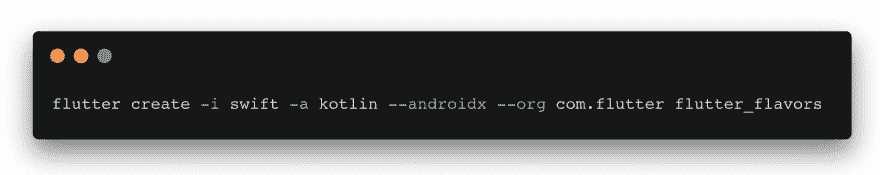](https://res.cloudinary.com/practicaldev/image/fetch/s--ukg_tC8_--/c_limit%2Cf_auto%2Cfl_progressive%2Cq_auto%2Cw_880/https://roszkowski.dimg/2019-07-15-flutter-guide-flavors/flutter-create.png)

使用 Kotlin 和 Swift 支持创建新项目是一个很好的实践。AndroidX 是 Android 开发的未来，所以在开始新项目时，你一定要启用它。在您的项目后期，当您必须编写一些特定于平台的代码时，您将受益于 Swift。

### 如何配置颤振项目

为了利用 Flutter 应用程序的优势，你应该定义 3 个独立的主文件 <sup id="fnref1">[1](#fn1)</sup> ，它们将处理每个方案不同的配置细节。最简单的方法是将`main.dart`重命名为`main_common.dart`并创建:

*   `main_dev.dart`
*   `main_tst.dart`
*   `main_prod.dart`

在每个应用程序中，您都可以定义各自的配置，稍后只需从一个公共功能开始执行应用程序。

```
import 'dart:async';

import 'package:flutter_flavors/app_config.dart';
import 'package:flutter_flavors/main_common.dart';

Future<void> main() async { // async can be useful if you fetch from disk or network
  // do flavor specific configuration here e.g. API endpoints
  final config = AppConfig('tst');

  mainCommon(config);
} 
```

Enter fullscreen mode Exit fullscreen mode

`AppConfig`类用于存储一些基本的配置选项，如名称或 API 端点。

在`main_common.dart`中，您应该将第三行替换为:

```
void mainCommon(AppConfig config) => runApp(MyApp(config)); 
```

Enter fullscreen mode Exit fullscreen mode

这一步的配置你可以在 [commit a4c7ef8e](https://github.com/orestesgaolin/flutter-flavors/commit/a4c7ef8e351676825b422839baa539ecf7f021d9) 中调查。

### 如何构建或运行颤振项目

通常，您会运行以下命令来构建有特色的应用程序:

**普通 apk:** `flutter build apk --release -t lib/main_tst.dart --build-name=1.0.0 --build-number=1 --flavor tst`

**App 捆绑:** `flutter build appbundle --target-platform android-arm,android-arm64 --release -t lib/main_tst.dart --build-name=1.0.0 --build-number=1 --flavor tst`

**iOS:**T0】

这里需要注意一些重要的事情:

*   我们定义了构建号(`1`)和构建名(`1.0.0`)
*   我们用 **tst** 口味
*   我们跳过 iOS 的代码设计(我们将用 fastlane 签署我们的应用程序)
*   我们稍后会签署我们的 android 应用程序

为了在 VS 代码中运行应用程序，你可以定义你自己的`launch.json`配置。下面你可以找到一个我在应用程序中使用的例子。您可以将它复制到在 VS 代码中单击调试面板上的齿轮时打开的配置文件中。

[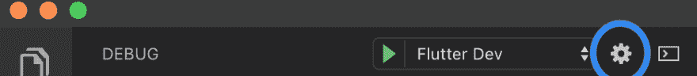](https://res.cloudinary.com/practicaldev/image/fetch/s--LiVXTDO9--/c_limit%2Cf_auto%2Cfl_progressive%2Cq_auto%2Cw_880/https://roszkowski.dimg/2019-07-15-flutter-guide-flavors/vscode-cog.png)T3】

```
{  "version":  "0.2.0",  "configurations":  [  {  "name":  "Flutter Dev",  "request":  "launch",  "type":  "dart",  "flutterMode":  "debug",  "program":  "lib/main_dev.dart",  "args":  [  "--flavor",  "dev"  ]  },  {  "name":  "Flutter Dev Release",  "request":  "launch",  "type":  "dart",  "flutterMode":  "release",  "program":  "lib/main_dev.dart",  "args":  [  "--flavor",  "dev"  ]  },  {  "name":  "Flutter Profile",  "request":  "launch",  "type":  "dart",  "flutterMode":  "profile",  "program":  "lib/main_dev.dart",  "args":  [  "--flavor",  "dev"  ]  },  {  "name":  "Flutter Test",  "request":  "launch",  "type":  "dart",  "flutterMode":  "release",  "program":  "lib/main_tst.dart",  "args":  [  "--flavor",  "tst"  ]  },  {  "name":  "Flutter Prod",  "request":  "launch",  "type":  "dart",  "flutterMode":  "release",  "program":  "lib/main_prod.dart",  "args":  [  "--flavor",  "prod"  ]  },  ]  } 
```

Enter fullscreen mode Exit fullscreen mode

此时，这些命令会失败，因为我们还没有在 Android 和 iOS 应用程序中定义口味。

## 安卓上的口味

在 Android 上定义口味非常简单。唯一要更改的文件是`app`目录中的`build.gradle`。

只需在 buildTypes 节点之后和方括号之前添加以下代码行:

```
 flavorDimensions "flavor-type"

    productFlavors {
        dev {
            dimension "flavor-type"
            applicationIdSuffix ".dev"
            versionNameSuffix "-dev"
            manifestPlaceholders = [appName: "Flavor DEV"]
        }
        tst {
            dimension "flavor-type"
            applicationIdSuffix ".test"
            versionNameSuffix "-test"
            manifestPlaceholders = [appName: "Flavor TST"]
        }
        prod {
            dimension "flavor-type"
            manifestPlaceholders = [appName: "Flavor"]
        }
    } 
```

Enter fullscreen mode Exit fullscreen mode

您可以在 [commit cef5fbff](https://github.com/orestesgaolin/flutter-flavors/commit/cef5fbffea052c9c26f93aa4ab63d3434b0a44e1) 中查看确切的差异。

以下是一些重要注意事项:

*   我们对每种风格都有不同的应用程序 id:`com.flutter.flutter_flavor.dev`、`com.flutter.flutter_flavor.test`和`com.flutter.flutter_flavor`——这样你就可以在一台设备上安装所有 3 个应用程序，拥有单独的 google-services.json 文件，并在一些日志服务或 Firebase 中区分应用程序
*   我们设置了不同的应用程序名称
*   我们设置了不同的版本名称后缀，例如`1.0.0`变成了`1.0.0-test`

[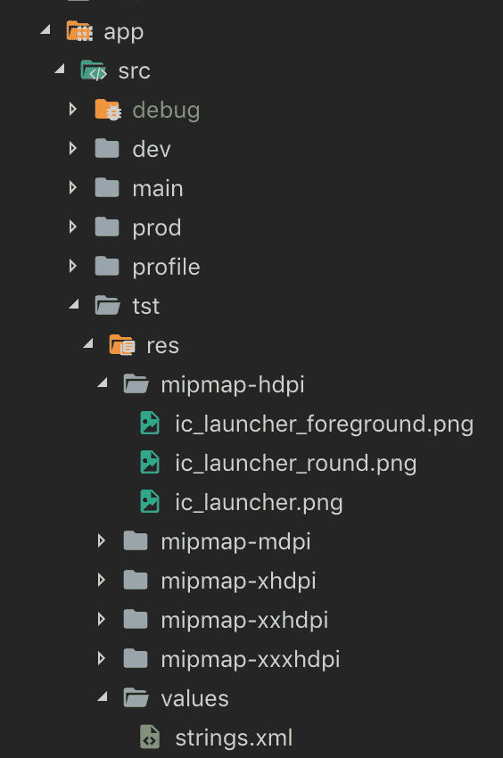](https://res.cloudinary.com/practicaldev/image/fetch/s--FPZYZQnb--/c_limit%2Cf_auto%2Cfl_progressive%2Cq_auto%2Cw_880/https://roszkowski.dimg/2019-07-15-flutter-guide-flavors/android-res.png)

Android 上的风格允许我们为它们定义单独的资源。例如，您可以为 QA 版本或不同的字符串资源创建一个特殊的图标。
你需要做的就是在`app/src/tst`目录下创建带有图标的`mipmap-...`文件夹来提供新图标。这同样适用于任何其他资源和方案。

```
app
| - src
   | - debug (default)
   | - main (default)
   | - profile (default)
   | - tst (add this with desired subdirectories) 
```

Enter fullscreen mode Exit fullscreen mode

在这一点上，你应该能够为 Android 构建 3 个不同风格的应用程序。

## iOS 上的口味

通常，在 iOS 应用程序中，你可以根据构建方案来选择风格。为了配置它，你需要 macOS 和 Xcode。首先，您应该在 Xcode 中打开`ios/Runner.xcworkspace`。

[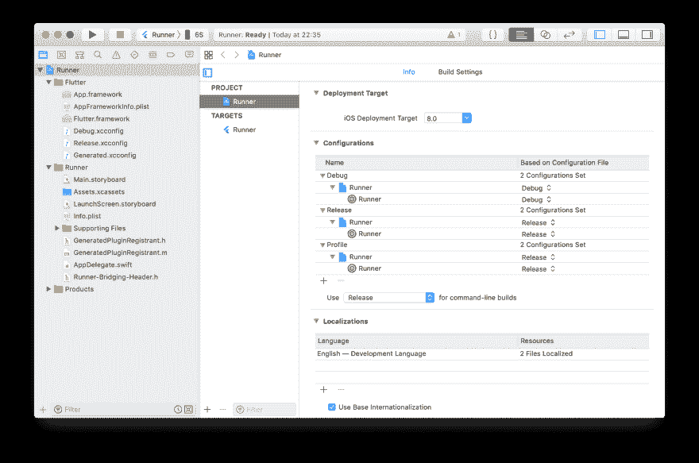](https://res.cloudinary.com/practicaldev/image/fetch/s--smpHl2kV--/c_limit%2Cf_auto%2Cfl_progressive%2Cq_auto%2Cw_880/https://roszkowski.dimg/2019-07-15-flutter-guide-flavors/ios-xcode.png)

### 创建方案

Flutter 应用程序的默认方案是 Runner。我们将定义另外 3 个方案，其名称与之前定义的口味完全相同，即`dev`、`tst`和`prod`。你应该去`Product > Scheme > Manage`方案，通过`+`按钮添加。确保方案被标记为*共享*。

[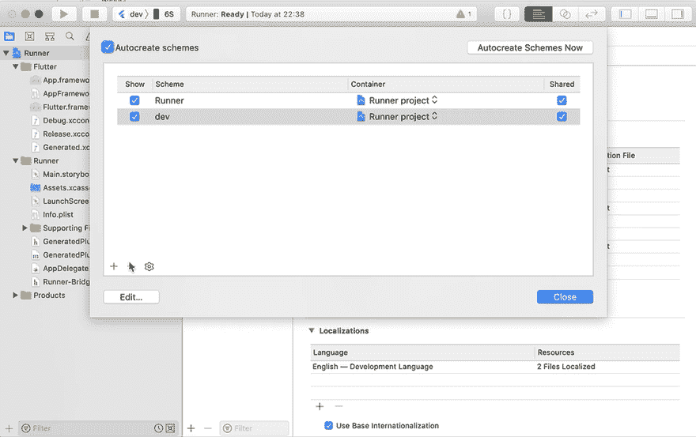](https://res.cloudinary.com/practicaldev/image/fetch/s--WwonpIza--/c_limit%2Cf_auto%2Cfl_progressive%2Cq_66%2Cw_880/https://roszkowski.dimg/2019-07-15-flutter-guide-flavors/ios-xcode-scheme.gif)

参见 [mp4](https://roszkowski.dev/asseimg/ios-xcode-scheme.mp4) / [webm](https://roszkowski.dev/asseimg/ios-xcode-scheme.webm)

然后你应该在 Debug，Release 和 Generated 旁边的 Flutter 目录中添加 3 个 xconfig 文件。在 Xcode 中右键点击左边 pad 上的 Flutter 目录，选择`New File`。选择`Configuration Settings File`并添加`dev.xconfig`、`tst.xconfig`和`prod.xconfig`。确保它们在 Flutter 目录中，如下图所示。

[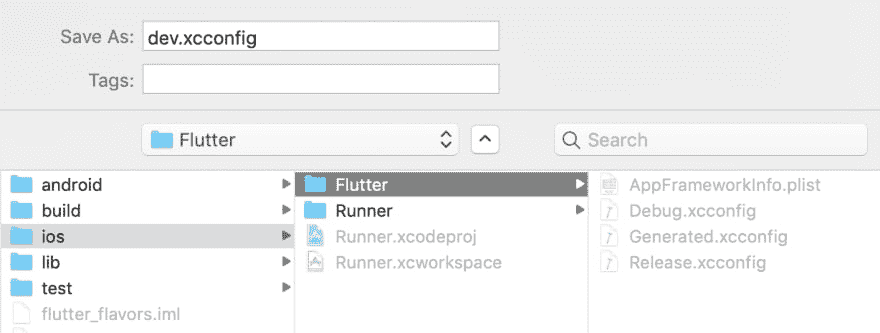](https://res.cloudinary.com/practicaldev/image/fetch/s--HtEkND0e--/c_limit%2Cf_auto%2Cfl_progressive%2Cq_auto%2Cw_880/https://roszkowski.dimg/2019-07-15-flutter-guide-flavors/ios-xcode-xconfig.png)

这些文件允许您定义自定义变量，这些变量可以在以后的构建过程中或在`Info.plist`文件中使用。我们将在这里定义我们的自定义应用捆绑包 id。

我的典型的`dev.xconfig`文件如下所示:

```
#include "Generated.xcconfig"  BUNDLE_ID_SUFFIX=.dev
PRODUCT_BUNDLE_IDENTIFIER=com.flutter.flutterflavors.dev
FLUTTER_TARGET=lib/main_dev.dart
APP_NAME=Flavor DEV 
```

Enter fullscreen mode Exit fullscreen mode

还有`tst.xconfig`(注意`.test`后缀，不是`.tst` <sup id="fnref2">[2](#fn2)</sup> ):

```
#include "Generated.xcconfig"  BUNDLE_ID_SUFFIX=.test
PRODUCT_BUNDLE_IDENTIFIER=com.flutter.flutterflavors.test
FLUTTER_TARGET=lib/main_tst.dart
APP_NAME=Flavor TST 
```

Enter fullscreen mode Exit fullscreen mode

### 扩展配置

此时，您应该复制并粘贴一些构建配置，并将它们分配给各自的方案。现在会有很多点击和输入，所以要有耐心。

进入 Xcode 中的项目设置，选择`Runner`，然后在*配置*部分选择`Debug`。按回车键将其重命名为`Debug-dev`。然后复制一个叫`Debug-tst`，另一个叫`Debug-prod`。重复`Release`和`Profile`配置的程序。然后将先前创建的方案分配给各自的配置。您应该以下面的布局结束:

[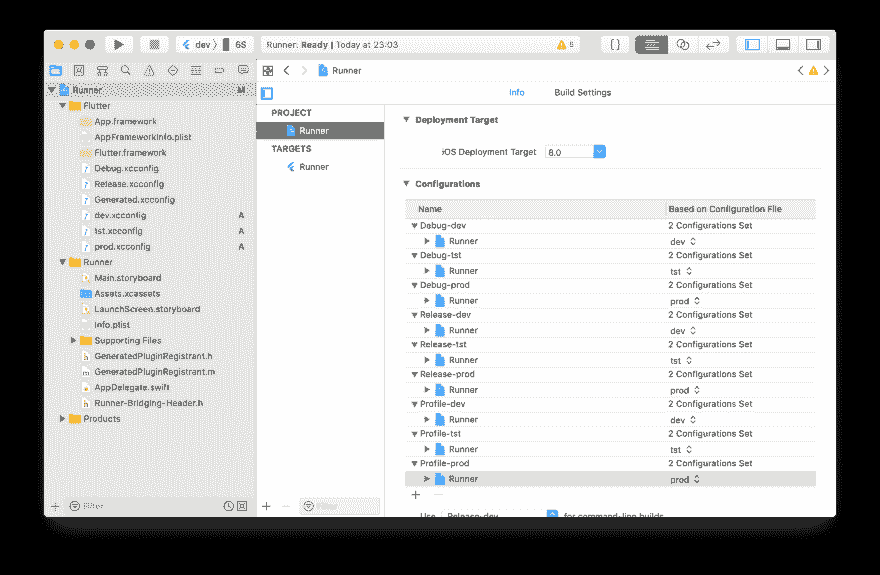](https://res.cloudinary.com/practicaldev/image/fetch/s--_HIlYLdW--/c_limit%2Cf_auto%2Cfl_progressive%2Cq_auto%2Cw_880/https://roszkowski.dimg/2019-07-15-flutter-guide-flavors/ios-xcode-configs.png)

这应该允许你用不同风格的包 id 来构建你的应用。确保您可以进入跑步者目标的构建设置，并寻找`Product Bundle Identifier`位置。

[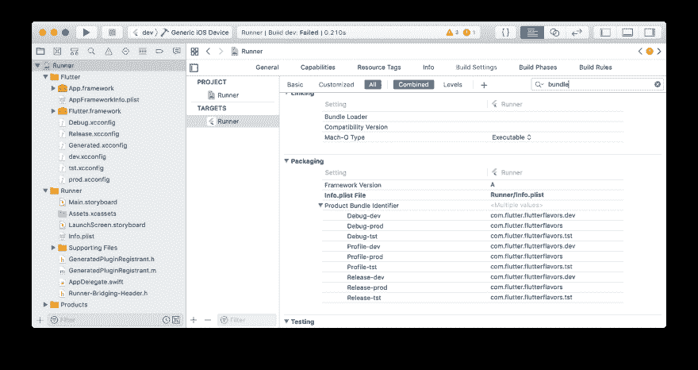](https://res.cloudinary.com/practicaldev/image/fetch/s--j_8qH5kK--/c_limit%2Cf_auto%2Cfl_progressive%2Cq_auto%2Cw_880/https://roszkowski.dimg/2019-07-15-flutter-guide-flavors/ios-xcode-packaging.png)

还有一个问题需要解决。构建应用程序时，Flutter 会考虑在目标属性的 *General* 选项卡中可见的产品捆绑标识符。因此，即使使用`tst` flavor，您也会在控制台中看到以下输出:

[](https://res.cloudinary.com/practicaldev/image/fetch/s--jtW2e-z_--/c_limit%2Cf_auto%2Cfl_progressive%2Cq_auto%2Cw_880/https://roszkowski.dimg/2019-07-15-flutter-guide-flavors/ios-signing.png)

看看`Release-tst`方案的错误捆绑 id。

幸运的是，如果我们在`tst.xconfig`文件中定义了一个`PRODUCT_BUNDLE_IDENTIFIER`变量，这个变量将在构建过程中被覆盖，这样就有可能生成和签署`.test`包 id。

### 归档

最后，我们应该用正确的构建配置更新每个构建方案。

转到`Product > Schemes > Manage Schemes`，选择`dev`，点击`Edit`。现在，对于每个流程(运行、测试、剖析、分析、归档)，将构建配置更改为`-dev`1。对`tst`和`prod`方案重复上述过程。

[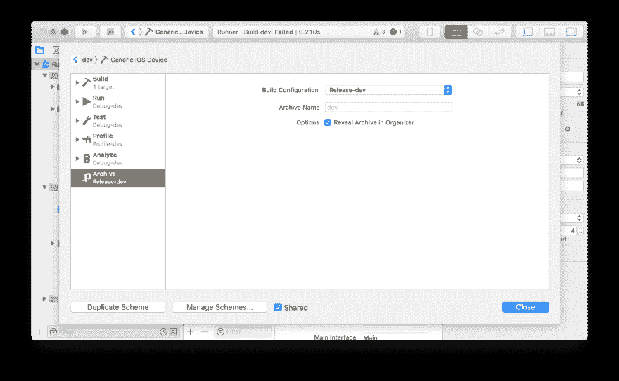](https://res.cloudinary.com/practicaldev/image/fetch/s--ihDy6Z__--/c_limit%2Cf_auto%2Cfl_progressive%2Cq_auto%2Cw_880/https://roszkowski.dimg/2019-07-15-flutter-guide-flavors/ios-xcode-build-configs.png)

## 用 fastlane 签约 iOS 应用

为了签署和提供您的应用程序，您需要配置 Apple 开发人员帐户和 fastlane。我建议只使用单独的证书为 fastlane 创建一个单独的“服务”帐户。在苹果开发者门户创建 3 个应用标识符，例如`com.flutter.flutterflavors`、`com.flutter.flutterflavors.test`和`com.flutter.flutterflavors.dev`。

转到控制台中的`ios`文件夹，用手动模式(选项 4)初始化快速通道。).在 fastlane 文件夹中，在`Fastfile`和`Appfile`旁边创建`Matchfile`文件。

我典型的`Matchfile`长这样:

```
# you should store your provisioning profiles and certs in repository
# this repository is encrypted with MATCH_PASSWORD env variable
git_url(ENV["FASTLANE_GIT"])
storage_mode("git")
username(ENV["FASTLANE_USERNAME"])
team_id(ENV["FASTLANE_TEAM"])
# this is useful on CI/CD if you build test and production app 
# flavors with the same steps configuration
app_identifier(ENV["APP_NAME"])
type("development") 
```

Enter fullscreen mode Exit fullscreen mode

创建应用程序 id 并添加文件后，您应该能够生成配置文件。执行以下命令，并在提示时输入所需的包 id:

```
bundle exec fastlane match development
bundle exec fastlane match adhoc
bundle exec fastlane match release 
```

Enter fullscreen mode Exit fullscreen mode

这整个 iOS 步骤可以在[提交 162d2015](https://github.com/orestesgaolin/flutter-flavors/commit/162d2015cdab401fb1eafa8e06da88fa71351e16) 中观察到。

### 重建并签约快线

遗憾的是，在部署到测试人员或 AppStore <sup id="fnref3">[3](#fn3)</sup> 之前，需要重新构建 iOS app 进行存档和签名。对于自定义风格，有必要手动提供预配配置文件匹配映射。我不能让快车道自动检测所有的配置文件。如果有人知道更好的方法，请分享！

我的 QA/测试构建的典型`Fastfile`如下所示 <sup id="fnref4">[4](#fn4)</sup> :

```
# update_fastlane

default_platform(:ios)

platform :ios do
  desc "Submit a new build to AppCenter"
  lane :test do
    # add_badge(dark: true)
    register_devices(
        devices_file: "fastlane/devices.txt",
        team_id: ENV["FASTLANE_TEAM"],
        username: ENV["FASTLANE_USERNAME"]
    )
    match(
      type: "adhoc",
      force_for_new_devices: true,
    )
    automatic_code_signing(
      use_automatic_signing: false
    )
    update_project_provisioning(
      profile: ENV["sigh_com.flutter.flutterflavors.test_adhoc_profile-path"],
      build_configuration: "Release-tst",
      code_signing_identity: "iPhone Distribution"
    )
    build_app(
      scheme: "tst",
      configuration: "Release-tst",
      xcargs: "-allowProvisioningUpdates",
      export_options: {
        signingStyle: "manual",
        method: "ad-hoc",
        provisioningProfiles: {
          "com.flutter.flutterflavors.test": "match AdHoc com.flutter.flutterflavors.test",
        }
      },
      output_name: "Runner.ipa"
    )
    # upload to AppCenter or anywhere else
  end

  desc "Deploy a new version to the AppStore"
  lane :prod do

  end
end 
```

Enter fullscreen mode Exit fullscreen mode

要使用 fastlane 构建应用程序，您只需执行:

```
bundle exec fastlane ios test 
```

Enter fullscreen mode Exit fullscreen mode

此时，您可能会遇到一个非常严重的错误，fastlane 试图构建`com.flutter.flutterflavors.dev`而不是`com.flutter.flutterflavors.test`:

[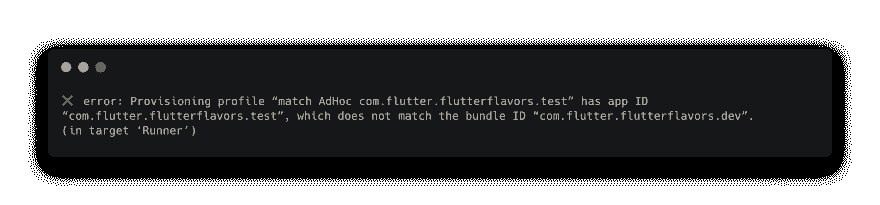](https://res.cloudinary.com/practicaldev/image/fetch/s--zglHpc5k--/c_limit%2Cf_auto%2Cfl_progressive%2Cq_auto%2Cw_880/https://roszkowski.dimg/2019-07-15-flutter-guide-flavors/error-signing.png)

我花了几个小时找到的最简单的解决方案就是在 Xcode 的 General 标签中删除 bundle id。

[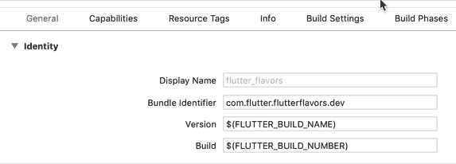](https://res.cloudinary.com/practicaldev/image/fetch/s--EDYkntwu--/c_limit%2Cf_auto%2Cfl_progressive%2Cq_66%2Cw_880/https://roszkowski.dimg/2019-07-15-flutter-guide-flavors/ios-xcode-delete.gif)

参见 [mp4](https://roszkowski.dev/asseimg/ios-xcode-delete.mp4) / [webm](https://roszkowski.dev/asseimg/ios-xcode-delete.webm)

现在你应该可以准备好你的`.ipa`文档，提交给 AppCenter，Beta 或者直接提交给你的测试人员。

[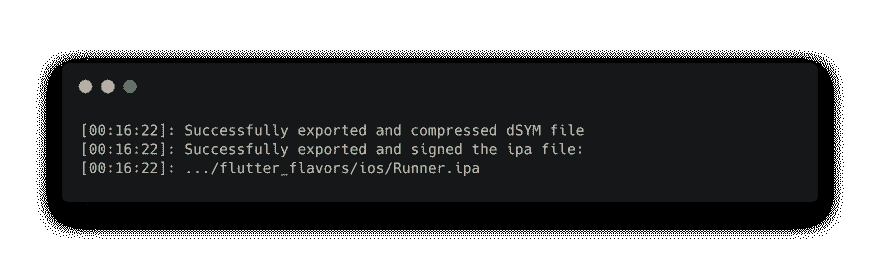](https://res.cloudinary.com/practicaldev/image/fetch/s--2nnoMFbV--/c_limit%2Cf_auto%2Cfl_progressive%2Cq_auto%2Cw_880/https://roszkowski.dimg/2019-07-15-flutter-guide-flavors/success.png)

查看一下[提交 a3c5512a](https://github.com/orestesgaolin/flutter-flavors/commit/a3c5512af215e48a9e38912c073ec4b79b41831b) 以了解与 fastlane 相关的所有更改。

## 总结

阅读完本文后，您应该能够自己配置 Flutter 风格了。口味、方案和配置几乎有无限的可能性。例如，你可以为每种口味设置单独的谷歌服务文件或脸书 id。您可以启用或禁用测试版本的某些功能。你甚至可以从一个代码库创建多个应用程序。

我希望你从我这里学到了一些东西。在下一篇博文中再见🖖.

* * *

* * *

1.  当然，你可以随意定义多种口味，3 种口味是一个很好的折中方案 [↩](#fnref1)

2.  在 Android 上你不能定义*测试*的味道，所以我们把它命名为 *tst* ，但是我们想要*。测试*后缀，让它对 QA 更明显。如果你愿意，你可以一直用*测试*的名字和文件。 [↩](#fnref2)

3.  这可能会在未来的颤振版本 [↩](#fnref3) 中改变

4.  我使用几个插件来快速通道，如[徽章](https://github.com/HazAT/fastlane-plugin-badge)或[应用中心](https://github.com/microsoft/fastlane-plugin-appcenter)。我真的建议你去看看。 [↩](#fnref4)