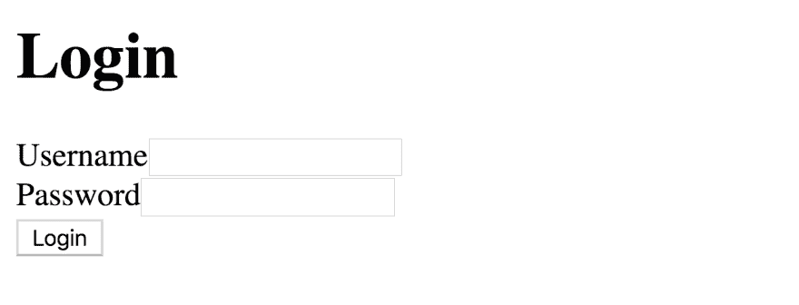
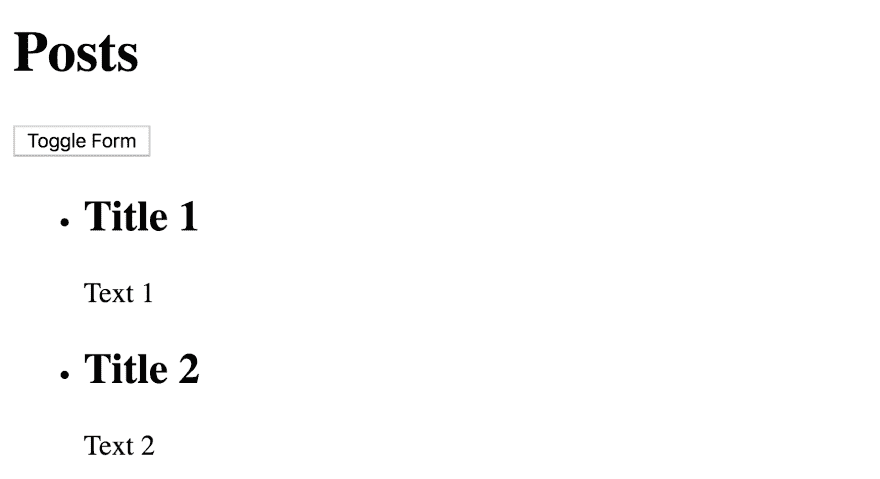
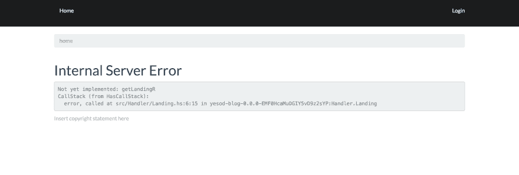
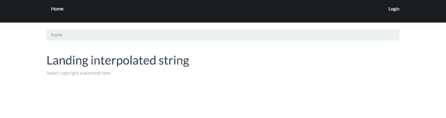
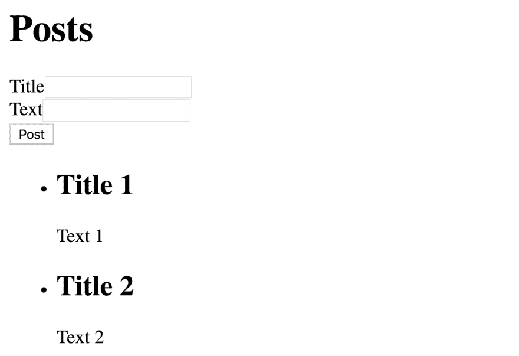

# 用 Yesod 在 Haskell 中构建一个博客——基本结构

> 原文：<https://dev.to/riccardoodone/building-a-blog-in-haskell-with-yesod-the-basic-structure-43i7>

你可以继续在这里阅读或者[跳转到我的博客](https://odone.io/posts/2019-07-15-building-a-blog-in-haskell-with-yesod%E2%80%93the-basic-structure.html)来获得完整的体验，包括美妙的粉色、蓝色和白色调色板。

* * *

这是一个关于 [Yesod](https://www.yesodweb.com/) 的系列:一个 Haskell web 框架，遵循类似于 [Rails](https://rubyonrails.org/) 的哲学。事实上，它非常固执己见，并且提供了许多现成的功能。

一本关于 Yesod 的好书可以在网上免费获得:[用 Haskell 和 Yesod 开发 web 应用](https://www.yesodweb.com/book)。这就是为什么这个系列将是对来自[回购](https://github.com/3v0k4/yesod-blog)的提交的评论，我们将使用它来开发一个超级简单的博客。

换句话说，这不是学习如何使用 Yesod 的好材料。然而，它有望给出该框架如何工作的概述。

* * *

## [T1】简介](#intro)

在这篇文章中，我们将开发我们博客的基本结构。用户的流程很简单:

1.  登录页面是一个登录表单:

[](https://res.cloudinary.com/practicaldev/image/fetch/s--iAZdAl5h--/c_limit%2Cf_auto%2Cfl_progressive%2Cq_auto%2Cw_880/https://thepracticaldev.s3.amazonaws.com/i/bhbjvgeyw2i1de2lvy8c.png)

1.  成功登录后，用户被重定向到帖子页面。在这里，用户可以创建一个新的帖子，并查看所有已经发布的帖子:

[](https://res.cloudinary.com/practicaldev/image/fetch/s--UE9FFs66--/c_limit%2Cf_auto%2Cfl_progressive%2Cq_auto%2Cw_880/https://thepracticaldev.s3.amazonaws.com/i/5xxzkng7hzs8yu5yt5u0.png)

为了使本文简单，我们不打算连接到数据库，也不检查登录凭证。

## 初始化

提交[7a 5782d 47 e 082 a 8 cfcb 4 e 07 BAC 71d 88709179 c0c](https://github.com/3v0k4/yesod-blog/commit/7a5782d47e082a8cfcb4e07bac71d88709179c0c)只是实现了 [Yesod 快速入门指南](https://www.yesodweb.com/page/quickstart)中列出的步骤。

## 登陆页面

`stack exec -- yesod add-handler`命令允许创建新的路线和处理程序。换句话说，就是处理特定 URL 上的请求的逻辑。

commit[354 fac 670 be 4b 9869 b 171 A0 FDD 7d 15063d 094 fdb](https://github.com/3v0k4/yesod-blog/commit/354fac670be4b9869b171a0fdd7d15063d094fdb)使用该命令添加登陆页面路由

```
diff --git a/config/routes b/config/routes
index 37e8bea..df5e055 100644 --- a/config/routes +++ b/config/routes @@ -12,3 +12,4 @@
 /comments CommentR POST

 /profile ProfileR GET
+/landing LandingR GET 
```

<svg width="20px" height="20px" viewBox="0 0 24 24" class="highlight-action crayons-icon highlight-action--fullscreen-on"><title>Enter fullscreen mode</title></svg> <svg width="20px" height="20px" viewBox="0 0 24 24" class="highlight-action crayons-icon highlight-action--fullscreen-off"><title>Exit fullscreen mode</title></svg>

和处理程序:

```
diff --git a/src/Handler/Landing.hs b/src/Handler/Landing.hs new file mode 100644 index 0000000..8a1fbdc --- /dev/null +++ b/src/Handler/Landing.hs @@ -0,0 +1,6 @@
+module Handler.Landing where
+
+import Import
+
+getLandingR :: Handler Html
+getLandingR = error "Not yet implemented: getLandingR" 
```

<svg width="20px" height="20px" viewBox="0 0 24 24" class="highlight-action crayons-icon highlight-action--fullscreen-on"><title>Enter fullscreen mode</title></svg> <svg width="20px" height="20px" viewBox="0 0 24 24" class="highlight-action crayons-icon highlight-action--fullscreen-off"><title>Exit fullscreen mode</title></svg>

## 授权

Yesod 提供了现成的身份验证/授权支持。这就是应用程序无法编译的原因:

```
 Pattern match(es) are non-exhaustive
    In an equation for ‘isAuthorized’: Patterns not matched: LandingR _
    |
163 |     isAuthorized (AuthR _) _ = return Authorized
    |     ^^^^^^^^^^^^^^^^^^^^^^^^^^^^^^^^^^^^^^^^^^^^... 
```

<svg width="20px" height="20px" viewBox="0 0 24 24" class="highlight-action crayons-icon highlight-action--fullscreen-on"><title>Enter fullscreen mode</title></svg> <svg width="20px" height="20px" viewBox="0 0 24 24" class="highlight-action crayons-icon highlight-action--fullscreen-off"><title>Exit fullscreen mode</title></svg>

特别是，我们缺少新的`LandingR`处理程序的`isAuthorized`。让我们通过始终允许访问来解决这个问题:

```
diff --git a/src/Foundation.hs b/src/Foundation.hs
index f91122a..011e171 100644 --- a/src/Foundation.hs +++ b/src/Foundation.hs @@ -171,6 +171,8 @@ instance Yesod App where
     -- delegate to that function
     isAuthorized ProfileR _ = isAuthenticated

+    isAuthorized LandingR _ = return Authorized
+
     -- This function creates static content files in the static folder
     -- and names them based on a hash of their content. This allows
     -- expiration dates to be set far in the future without worry of 
```

<svg width="20px" height="20px" viewBox="0 0 24 24" class="highlight-action crayons-icon highlight-action--fullscreen-on"><title>Enter fullscreen mode</title></svg> <svg width="20px" height="20px" viewBox="0 0 24 24" class="highlight-action crayons-icon highlight-action--fullscreen-off"><title>Exit fullscreen mode</title></svg>

这样，就可以启动开发服务器`stack exec -- yesod devel`并访问`/landing`。

[](https://res.cloudinary.com/practicaldev/image/fetch/s--Dvk2b_5a--/c_limit%2Cf_auto%2Cfl_progressive%2Cq_auto%2Cw_880/https://thepracticaldev.s3.amazonaws.com/i/599fgi6u64xn2aj6eh0e.png)

错误来自于处理程序尚未开发的事实。

## 在某地着陆

本着循序渐进的精神，让我们先在屏幕上为`/landing`放些东西。提交[5271 b5 f 514782 f 659 c 89101 ee 0 C1 CD 4 f 8d 691 ade](https://github.com/3v0k4/yesod-blog/commit/5271b5f514782f659c89101ee0c1cd4f8d691ade)引入一个用于生成 HTML 的 Hamlet 模板:

```
diff --git a/templates/landing.hamlet b/templates/landing.hamlet new file mode 100644 index 0000000..af3d162 --- /dev/null +++ b/templates/landing.hamlet @@ -0,0 +1,2 @@
+<h1>
+  Landing #{interpolated} 
```

<svg width="20px" height="20px" viewBox="0 0 24 24" class="highlight-action crayons-icon highlight-action--fullscreen-on"><title>Enter fullscreen mode</title></svg> <svg width="20px" height="20px" viewBox="0 0 24 24" class="highlight-action crayons-icon highlight-action--fullscreen-off"><title>Exit fullscreen mode</title></svg>

特别是，`#{interpolated}`来自处理程序:

```
diff --git a/src/Handler/Landing.hs b/src/Handler/Landing.hs
index 8a1fbdc..aefaa65 100644 --- a/src/Handler/Landing.hs +++ b/src/Handler/Landing.hs @@ -1,6 +1,15 @@
+{-# LANGUAGE NoImplicitPrelude #-}
+{-# LANGUAGE OverloadedStrings #-}
+{-# LANGUAGE TemplateHaskell #-}
+{-# LANGUAGE MultiParamTypeClasses #-}
+{-# LANGUAGE TypeFamilies #-}
+
 module Handler.Landing where

 import Import

 getLandingR :: Handler Html
-getLandingR = error "Not yet implemented: getLandingR" +getLandingR = do
+  defaultLayout $ do
+    let interpolated = "interpolated string" :: Text
+    $(widgetFile "landing") 
```

<svg width="20px" height="20px" viewBox="0 0 24 24" class="highlight-action crayons-icon highlight-action--fullscreen-on"><title>Enter fullscreen mode</title></svg> <svg width="20px" height="20px" viewBox="0 0 24 24" class="highlight-action crayons-icon highlight-action--fullscreen-off"><title>Exit fullscreen mode</title></svg>

换句话说，作用域中的每个变量都可以在模板中使用。

如果我们现在访问`/landing`，我们会看到: [](https://res.cloudinary.com/practicaldev/image/fetch/s--svbwGQQ6--/c_limit%2Cf_auto%2Cfl_progressive%2Cq_auto%2Cw_880/https://thepracticaldev.s3.amazonaws.com/i/cm29u5nflmmxmwfuy8cw.png)

## 调整落地

提交[bb 89035 c 9 E4 F4 b 9265 Bebe 378 EC 38 e 932 BC 47 BCD](https://github.com/3v0k4/yesod-blog/commit/bb89035c9e4f4b9265bebe378ec38e932bc47bcd)做几件事:

1.  将`LandingR`处理器置于`/`:

```
diff --git a/config/routes b/config/routes
index df5e055..c2d4fd2 100644 --- a/config/routes +++ b/config/routes @@ -7,9 +7,9 @@
 /favicon.ico FaviconR GET
 /robots.txt RobotsR GET

-/ HomeR GET POST
+/home HomeR GET POST 
 /comments CommentR POST

 /profile ProfileR GET
-/landing LandingR GET +/ LandingR GET 
```

<svg width="20px" height="20px" viewBox="0 0 24 24" class="highlight-action crayons-icon highlight-action--fullscreen-on"><title>Enter fullscreen mode</title></svg> <svg width="20px" height="20px" viewBox="0 0 24 24" class="highlight-action crayons-icon highlight-action--fullscreen-off"><title>Exit fullscreen mode</title></svg>

1.  创建一个`emptyLayout`。这样做是为了消除初始化 Yesod 应用程序时产生的所有干扰，从而使代码更容易导航。我们不会进入细节，重要的是我们现在可以使用`emptyLayout`而不是`defaultLayout`。

```
diff --git a/src/Handler/Landing.hs b/src/Handler/Landing.hs
index aefaa65..7675a0f 100644 --- a/src/Handler/Landing.hs +++ b/src/Handler/Landing.hs @@ -7,9 +7,15 @@
 module Handler.Landing where

 import Import
+import Text.Hamlet          (hamletFile)
+
+emptyLayout :: Widget -> Handler Html
+emptyLayout widget = do
+    pc <- widgetToPageContent $ do
+        $(widgetFile "empty-layout")
+    withUrlRenderer $(hamletFile "templates/empty-layout-wrapper.hamlet") 
 getLandingR :: Handler Html
 getLandingR = do
-  defaultLayout $ do
-    let interpolated = "interpolated string" :: Text +  emptyLayout $ do
     $(widgetFile "landing")
diff --git a/templates/empty-layout-wrapper.hamlet b/templates/empty-layout-wrapper.hamlet new file mode 100644 index 0000000..18bb787 --- /dev/null +++ b/templates/empty-layout-wrapper.hamlet @@ -0,0 +1,5 @@
+\<!doctype html>
+<html>
+  <head>
+  <body>
+    ^{pageBody pc} diff --git a/templates/empty-layout.hamlet b/templates/empty-layout.hamlet new file mode 100644 index 0000000..42cfe82 --- /dev/null +++ b/templates/empty-layout.hamlet @@ -0,0 +1,2 @@
+<div .container>
+  ^{widget} 
```

<svg width="20px" height="20px" viewBox="0 0 24 24" class="highlight-action crayons-icon highlight-action--fullscreen-on"><title>Enter fullscreen mode</title></svg> <svg width="20px" height="20px" viewBox="0 0 24 24" class="highlight-action crayons-icon highlight-action--fullscreen-off"><title>Exit fullscreen mode</title></svg>

此外，我们准备添加登录表单:

```
diff --git a/templates/landing.hamlet b/templates/landing.hamlet
index af3d162..24a77b3 100644 --- a/templates/landing.hamlet +++ b/templates/landing.hamlet @@ -1,2 +1 @@
-<h1>
-  Landing #{interpolated} +<h1>Login 
```

<svg width="20px" height="20px" viewBox="0 0 24 24" class="highlight-action crayons-icon highlight-action--fullscreen-on"><title>Enter fullscreen mode</title></svg> <svg width="20px" height="20px" viewBox="0 0 24 24" class="highlight-action crayons-icon highlight-action--fullscreen-off"><title>Exit fullscreen mode</title></svg>

如果我们现在访问`/`，我们只会看到一个“登录”标题。

## 登录表单

提交[8d 89 a 7101 a 979 b 06 ea 324 c8 d6d 9 aa 0373 f 49 d6ee](https://github.com/3v0k4/yesod-blog/commit/8d89a7101a979b06ea324c8d6d9aa0373f49d6ee)添加登录表单逻辑。

具体来说，我们首先用`stack exec -- yesod add-handler`添加 posts route 和 handler。这将是成功登录后重定向的页面。此外，我们为`LandingR`添加了一个 POST 处理程序来处理表单提交:

```
diff --git a/config/routes b/config/routes
index c2d4fd2..db4ac58 100644 --- a/config/routes +++ b/config/routes @@ -12,4 +12,5 @@
 /comments CommentR POST

 /profile ProfileR GET
-/ LandingR GET +/ LandingR GET POST
+/posts PostsR GET 
```

<svg width="20px" height="20px" viewBox="0 0 24 24" class="highlight-action crayons-icon highlight-action--fullscreen-on"><title>Enter fullscreen mode</title></svg> <svg width="20px" height="20px" viewBox="0 0 24 24" class="highlight-action crayons-icon highlight-action--fullscreen-off"><title>Exit fullscreen mode</title></svg>

然后我们允许任何人访问`PostR`。将来，我们会将此资源限制为已登录的用户。

```
diff --git a/src/Application.hs b/src/Application.hs
index 99dbb26..6045a41 100644 --- a/src/Application.hs +++ b/src/Application.hs @@ -45,6 +45,7 @@ import Handler.Home
 import Handler.Comment
 import Handler.Profile
 import Handler.Landing
+import Handler.Posts 
 -- This line actually creates our YesodDispatch instance. It is the second half
 -- of the call to mkYesodData which occurs in Foundation.hs. Please see the
diff --git a/src/Foundation.hs b/src/Foundation.hs
index 011e171..e96228a 100644 --- a/src/Foundation.hs +++ b/src/Foundation.hs @@ -173,6 +173,8 @@ instance Yesod App where

     isAuthorized LandingR _ = return Authorized

+    isAuthorized PostsR _ = return Authorized
+ 
```

<svg width="20px" height="20px" viewBox="0 0 24 24" class="highlight-action crayons-icon highlight-action--fullscreen-on"><title>Enter fullscreen mode</title></svg> <svg width="20px" height="20px" viewBox="0 0 24 24" class="highlight-action crayons-icon highlight-action--fullscreen-off"><title>Exit fullscreen mode</title></svg>

我们添加登录表单。这里的重要部分:

*   类型安全的 url `@{LandingR}`:表单被提交给 POST `LandingR`处理程序
*   来自 GET `LandingR`处理程序的插值形式`^{widget}`

```
diff --git a/templates/landing.hamlet b/templates/landing.hamlet
index 24a77b3..8df39e9 100644 --- a/templates/landing.hamlet +++ b/templates/landing.hamlet @@ -1 +1,4 @@
 <h1>Login
+<form method=post action=@{LandingR} enctype=#{enctype}>
+  ^{widget}
+  <button>Login 
```

<svg width="20px" height="20px" viewBox="0 0 24 24" class="highlight-action crayons-icon highlight-action--fullscreen-on"><title>Enter fullscreen mode</title></svg> <svg width="20px" height="20px" viewBox="0 0 24 24" class="highlight-action crayons-icon highlight-action--fullscreen-off"><title>Exit fullscreen mode</title></svg>

使用`generateFormPost`在 GET `LandingR`处理程序中生成表单。换句话说，就是通过邮件提交的表单。

随后，POST `LandingR`处理程序获取提交的表单参数，并使用`runFormPost`运行验证。如果成功，用户将被重定向到文章页面。否则，登录页面会重新显示验证错误。

```
diff --git a/src/Handler/Landing.hs b/src/Handler/Landing.hs
index 7675a0f..c2d4d10 100644 --- a/src/Handler/Landing.hs +++ b/src/Handler/Landing.hs @@ -3,19 +3,33 @@
 {-# LANGUAGE TemplateHaskell #-}
 {-# LANGUAGE MultiParamTypeClasses #-}
 {-# LANGUAGE TypeFamilies #-}
+{-# LANGUAGE OverloadedStrings #-} 
 module Handler.Landing where

 import Import

+data Login =
+  Login { username :: Text, password :: Text }
+  deriving Show
+
+loginForm :: Form Login
+loginForm =
+  renderDivs $
+    Login <$> areq textField "Username" Nothing <*> areq textField "Password" Nothing 
 getLandingR :: Handler Html
 getLandingR = do
+  (widget, enctype) <- generateFormPost loginForm
   emptyLayout $ do
     $(widgetFile "landing")
+
+postLandingR :: Handler Html
+postLandingR = do
+  ((result, widget), enctype) <- runFormPost loginForm
+  case result of
+    FormSuccess _ ->
+      redirect PostsR
+    _ ->
+      emptyLayout $ do
+        $(widgetFile "landing") 
```

<svg width="20px" height="20px" viewBox="0 0 24 24" class="highlight-action crayons-icon highlight-action--fullscreen-on"><title>Enter fullscreen mode</title></svg> <svg width="20px" height="20px" viewBox="0 0 24 24" class="highlight-action crayons-icon highlight-action--fullscreen-off"><title>Exit fullscreen mode</title></svg>

如果我们现在访问`/`，我们会看到: [](https://res.cloudinary.com/practicaldev/image/fetch/s--iAZdAl5h--/c_limit%2Cf_auto%2Cfl_progressive%2Cq_auto%2Cw_880/https://thepracticaldev.s3.amazonaws.com/i/bhbjvgeyw2i1de2lvy8c.png)

## 帖子页面

因为文章页面是用`stack exec -- yesod add-handler`创建的，所以它只有一个空的处理程序:

```
diff --git a/src/Handler/Posts.hs b/src/Handler/Posts.hs new file mode 100644 index 0000000..138f43b --- /dev/null +++ b/src/Handler/Posts.hs @@ -0,0 +1,6 @@
+module Handler.Posts where
+
+import Import
+
+getPostsR :: Handler Html
+getPostsR = error "Not yet implemented: getPostsR" 
```

<svg width="20px" height="20px" viewBox="0 0 24 24" class="highlight-action crayons-icon highlight-action--fullscreen-on"><title>Enter fullscreen mode</title></svg> <svg width="20px" height="20px" viewBox="0 0 24 24" class="highlight-action crayons-icon highlight-action--fullscreen-off"><title>Exit fullscreen mode</title></svg>

commit[a 176 ea 0d 10 b 63 b 9613 CBF C5 bbf 86 FBE 264461111](https://github.com/3v0k4/yesod-blog/commit/a176ea0d10b63b9613cbfc5bbf86fbe264461111)通过调整帖子页面来修复它。特别是，它添加了几个硬编码的帖子和一个创建新帖子的表单。

该结构与上面看到的登录页面完全相同:

```
diff --git a/config/routes b/config/routes
index db4ac58..5a01ba2 100644 --- a/config/routes +++ b/config/routes @@ -13,4 +13,4 @@

 /profile ProfileR GET
 / LandingR GET POST
-/posts PostsR GET +/posts PostsR GET POST diff --git a/src/Handler/Posts.hs b/src/Handler/Posts.hs
index 138f43b..8d0b8c4 100644 --- a/src/Handler/Posts.hs +++ b/src/Handler/Posts.hs @@ -1,6 +1,35 @@
+{-# LANGUAGE NoImplicitPrelude #-}
+{-# LANGUAGE OverloadedStrings #-}
+{-# LANGUAGE TemplateHaskell #-}
+{-# LANGUAGE MultiParamTypeClasses #-}
+{-# LANGUAGE TypeFamilies #-}
+{-# LANGUAGE OverloadedStrings #-}
+
 module Handler.Posts where

 import Import

+data Post =
+  Post { title :: Text, text :: Text }
+  deriving Show
+
+postForm :: Form Post
+postForm =
+  renderDivs $
+    Post <$> areq textField "Title" Nothing <*> areq textField "Text" Nothing
+
 getPostsR :: Handler Html
-getPostsR = error "Not yet implemented: getPostsR" +getPostsR = do
+  (widget, enctype) <- generateFormPost postForm
+  emptyLayout $ do
+    $(widgetFile "posts")
+
+postPostsR :: Handler Html
+postPostsR = do
+  ((result, widget), enctype) <- runFormPost postForm
+  case result of
+    FormSuccess _ ->
+      redirect PostsR
+    _ ->
+      emptyLayout $ do
+        $(widgetFile "posts") diff --git a/templates/posts.hamlet b/templates/posts.hamlet new file mode 100644 index 0000000..2445442 --- /dev/null +++ b/templates/posts.hamlet @@ -0,0 +1,15 @@
+<h1>Posts
+
+<div id="new-post">
+  <form method=post action=@{PostsR} enctype=#{enctype}>
+    ^{widget}
+    <button>Post
+
+<ul>
+  <li>
+    <h2>Title 1
+    <p>Text 1
+
+  <li>
+    <h2>Title 2
+    <p>Text 2 
```

<svg width="20px" height="20px" viewBox="0 0 24 24" class="highlight-action crayons-icon highlight-action--fullscreen-on"><title>Enter fullscreen mode</title></svg> <svg width="20px" height="20px" viewBox="0 0 24 24" class="highlight-action crayons-icon highlight-action--fullscreen-off"><title>Exit fullscreen mode</title></svg>

如果我们现在访问`/posts`，我们会看到: [](https://res.cloudinary.com/practicaldev/image/fetch/s--9BbiR3yS--/c_limit%2Cf_auto%2Cfl_progressive%2Cq_auto%2Cw_880/https://thepracticaldev.s3.amazonaws.com/i/x7sxmm1jt5zq28n83jjy.png)

## 调整空布局

commit[77567 ed 74 b 12685 bbf 319 a 6764 f1 ff 83 AC 9604 b 8](https://github.com/3v0k4/yesod-blog/commit/77567ed74b12685bbf319a6764f1ff83ac9604b8)向空布局添加一个重要元素。我们不会进入细节，但它将是重要的，当添加 CSS。

```
diff --git a/templates/empty-layout-wrapper.hamlet b/templates/empty-layout-wrapper.hamlet
index 18bb787..c98c0a0 100644 --- a/templates/empty-layout-wrapper.hamlet +++ b/templates/empty-layout-wrapper.hamlet @@ -1,5 +1,6 @@
 \<!doctype html>
 <html>
   <head>
+    ^{pageHead pc}
   <body>
     ^{pageBody pc} 
```

<svg width="20px" height="20px" viewBox="0 0 24 24" class="highlight-action crayons-icon highlight-action--fullscreen-on"><title>Enter fullscreen mode</title></svg> <svg width="20px" height="20px" viewBox="0 0 24 24" class="highlight-action crayons-icon highlight-action--fullscreen-off"><title>Exit fullscreen mode</title></svg>

## 给帖子添加 JavaScript 和 CSS

提交[5 fb4b 964 e 0890 a 042 b 868738d 32 a 99680 c 06836 e](https://github.com/3v0k4/yesod-blog/commit/5fb4b964e0890a042b868738d32a99680c06836e)展示了如何将 JavaScript 和 CSS 添加到模板中。

到目前为止，我们一直使用`$(widgetFile "NAME")`来渲染哈姆雷特模板。结果是`widgetFile`寻找其他类型的模板并将它们放在一起。事实上，通过使用 Julius 和 Cassius 模板，我们可以分别添加 JavaScript 和 CSS。

以下更改引入了一个按钮，允许用按钮显示/隐藏帖子表单:

```
diff --git a/templates/posts.cassius b/templates/posts.cassius new file mode 100644 index 0000000..f16f327 --- /dev/null +++ b/templates/posts.cassius @@ -0,0 +1,2 @@
+#new-post
+  display: none diff --git a/templates/posts.hamlet b/templates/posts.hamlet
index 2445442..82e717c 100644 --- a/templates/posts.hamlet +++ b/templates/posts.hamlet @@ -1,5 +1,8 @@
 <h1>Posts

+<button id="toggle-new-post">
+  Toggle Form
+
 <div id="new-post">
   <form method=post action=@{PostsR} enctype=#{enctype}>
     ^{widget}
diff --git a/templates/posts.julius b/templates/posts.julius new file mode 100644 index 0000000..3790b61 --- /dev/null +++ b/templates/posts.julius @@ -0,0 +1,10 @@
+document.addEventListener("DOMContentLoaded", function() {
+  document.getElementById("toggle-new-post").addEventListener("click", function() {
+    var value =
+      document.getElementById("new-post").style.display === "block"
+      ? "none"
+      : "block";
+
+    document.getElementById("new-post").style.display = value;
+  });
+}); 
```

<svg width="20px" height="20px" viewBox="0 0 24 24" class="highlight-action crayons-icon highlight-action--fullscreen-on"><title>Enter fullscreen mode</title></svg> <svg width="20px" height="20px" viewBox="0 0 24 24" class="highlight-action crayons-icon highlight-action--fullscreen-off"><title>Exit fullscreen mode</title></svg>

如果我们现在访问`/`，我们会看到: [](https://res.cloudinary.com/practicaldev/image/fetch/s--UE9FFs66--/c_limit%2Cf_auto%2Cfl_progressive%2Cq_auto%2Cw_880/https://thepracticaldev.s3.amazonaws.com/i/5xxzkng7hzs8yu5yt5u0.png)

* * *

从我个人的电子邮件中获取最新内容。用你的想法回复。让我们互相学习。订阅我的 [PinkLetter](https://odone.io#newsletter) ！