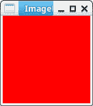
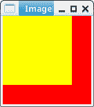
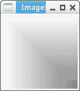

# 使用 Python PIL 生成影像

> 原文：<https://dev.to/petercour/generate-images-with-python-pil-302k>

您可以使用 Python 代码创建自己的图像。那么如何开始呢？
首先使用 PIL 模块。

Python 图像库(PIL)允许您使用 Python 处理图像。

[](https://res.cloudinary.com/practicaldev/image/fetch/s--mUv3Jx58--/c_limit%2Cf_auto%2Cfl_progressive%2Cq_66%2Cw_880/https://proxy.duckduckgo.com/iu/%3Fu%3Dhttps%253A%252F%252Fmedia1.tenor.com%252Fimages%252F040dcd8f6943b15ff8bda3acb3daa5c5%252Ftenor.gif%253Fitemid%253D13324234%26f%3D1)

要使用红色(#FF0000)创建 128x128 像素的图像，请使用:

```
#!/usr/bin/python3
from PIL import Image

im= Image.new("RGB", (128, 128), "#FF0000")
im.show()
im.show() 
```

创建图像:

[](https://res.cloudinary.com/practicaldev/image/fetch/s--VJ-uTUeV--/c_limit%2Cf_auto%2Cfl_progressive%2Cq_auto%2Cw_880/https://thepracticaldev.s3.amazonaws.com/i/jjh6io2puossnx77zvw8.png)

对于绿色和蓝色，您可以使用“#0000FF”或“#00FF00”。它也接受像“绿色”这样的关键字。

```
im= Image.new("RGB", (128, 128),"green") 
```

要更改单个像素:

```
#!/usr/bin/python3
# change pixel                                                                             
pixels = im.load()
pixels[10,10] = (0,0,0) 
```

您可以将矩形添加到图像:

```
#!/usr/bin/python3
from PIL import Image

im= Image.new("RGB", (128, 128), "#FF0000")
im.paste((256,256,0),(0,0,100,100))
im.show() 
```

然后

[](https://res.cloudinary.com/practicaldev/image/fetch/s--uzld7wY7--/c_limit%2Cf_auto%2Cfl_progressive%2Cq_auto%2Cw_880/https://thepracticaldev.s3.amazonaws.com/i/ob3s9vx2y3gige3gkj6h.png)

你可以做这样的效果

```
#!/usr/bin/python3
from PIL import Image

im= Image.new("RGB", (128, 128), "#FF0000")
for i in range(0,256):
    im.paste((256-i,256-i,256-i),(i,i,128,128))
im.show() 
```

然后

[](https://res.cloudinary.com/practicaldev/image/fetch/s--dfugxZj7--/c_limit%2Cf_auto%2Cfl_progressive%2Cq_auto%2Cw_880/https://thepracticaldev.s3.amazonaws.com/i/2vnxlboxl764tx8p1zkw.png)

相关链接:

*   [PIL Python 图像库](https://pythonware.com/products/pil/)
*   [学习 Python 编程](https://pythonprogramminglanguage.com/)
*   [使用 Python 的桌面应用](https://pythonprogramminglanguage.com/pyqt-tutorials)