# 在 vexpress 和 vue 中创建你的下一个静态博客

> 原文：<https://dev.to/itnext/creating-a-blog-easier-than-ever-starring-vuepress-and-vue-3p8c>

在 [Twitter](https://twitter.com/chris_noring) 上关注我，很乐意接受您对主题或改进的建议/Chris

> 这个系列的想法是看看如何使用一个已知的静态站点生成器来构建自己的博客。

TLDR；是的，这篇文章有点长，但很值得一读，因为它告诉你如何开始创建自己的主页，以及如何构建自定义组件和使用默认主题。此外，如果您以前从未使用过静态站点生成器，这也很容易上手。

建立自己的博客可能是一个非常雄心勃勃的项目，你要花时间编码或整合和调整你绝对必须拥有的不同组件，或者一些非常简单的东西，你只需要专注于写文章。

博客通常是静态网站，人们通常不想用 HTML 来写博客，而是喜欢用 Markdown 或纯文本等其他方式来写。出于这个原因，静态站点生成器工具既可以满足初学者的需求，也可以满足最高级用户的需求。

> 我肯定是那种人，Markdown FTW，我需要处理的博客越少越好:)

这是我们研究不同静态站点生成器的系列文章的一部分。在本文中，我们将关注 VuePress，一个来自 Vue 团队自己的静态站点生成器。

我们将涵盖以下内容:

*   **安装并设置**。这一部分非常重要，因为它既流畅又容易
*   **Hello world** 创建第一页是体验的重要部分，让我们看看我们能以多快的速度运行。
*   **静态页面**为简历、简介等页面
*   **创建博客文章**我们着眼于不同的静态站点生成器，希望能够将其用作博客引擎，因此我们需要了解如何命名这些文件，如何处理 frontmatter、标签、slugs 和其他内容
*   **定制**外观、颜色、布局等。我们可能会对给我们的主题感到满意，但有时我们希望能够调整外观。或者更好的是有一个很棒的默认主题我们可以使用*提示*
*   创建自定义控件，就像一个文章列表页面。想要列出你的博客包含的所有文章或者标签云是一件很常见的事情。关键是我们要么想要使用这些类型的文章，要么能够自己创建它们，如果它们不可用的话。

## 资源

如果你真的想开始使用 Vuepress，有一些很棒的链接你应该看看

*   官方文档
    它包含了很多关于如何开始、配置你的网站、使用主题、使用 markdown 等等的信息。

*   [关于创建自定义 VuePress 主题的文章](https://dev.to/vuevixens/build-a-beautiful-website-with-vuepress-and-tailwindcss--3a03)
    我同事的精彩文章 [Jen Looper](https://twitter.com/jenlooper) 如何创建自定义主题。

*   [如何创建自定义组件](https://www.raymondcamden.com/2018/05/09/adding-a-recent-content-component-to-vuepress)
    Raymond 的这篇优秀文章真的让我点击了如何创建自定义组件

## 安装&设置

首先，我们需要在我们的系统上安装 Node.js，如果没有的话，先安装它:

> [https://nodejs . org/en/download/](https://nodejs.org/en/download/)

要安装 Vuepress CLI，我们需要在全球范围内进行，请注意下面我们如何使用`global`标志来安装纱线，或使用`-g`来安装 NPM。

```
yarn global add vuepress # OR npm install -g vuepress 
```

**创建一个目录**
下一步是创建一个目录并把自己放在其中:

```
mkdir my-blog
cd my-blog 
```

**创建一些博客内容**

下一步是创建一个`README.md`文件，如下所示:

```
# My blog

Welcome to my blog 
```

**创建并运营我们的博客**

下一步是在终端中键入`vuepress dev`:

[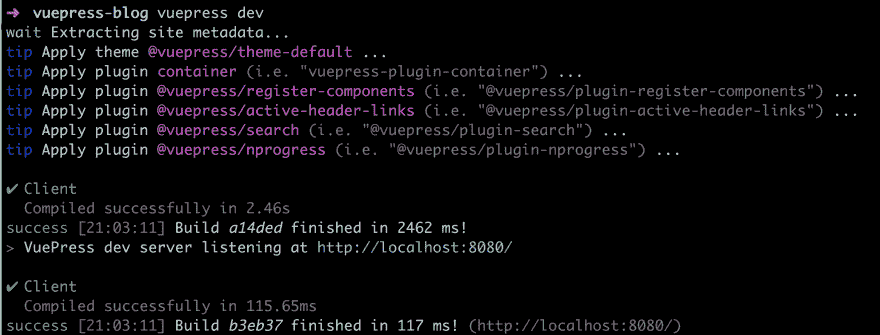](https://res.cloudinary.com/practicaldev/image/fetch/s--9DGu2iGG--/c_limit%2Cf_auto%2Cfl_progressive%2Cq_auto%2Cw_880/https://thepracticaldev.s3.amazonaws.com/i/m7p0fhsa1imhpshu2jc1.png)

做了很多事情。添加主题，应用插件，并在`http://localhost:8080`结束了我们的页面服务

[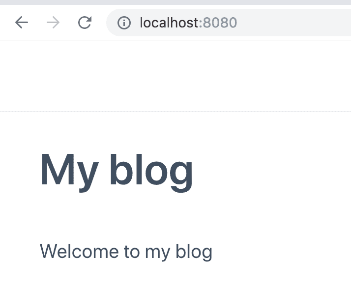](https://res.cloudinary.com/practicaldev/image/fetch/s--Nvl6OufN--/c_limit%2Cf_auto%2Cfl_progressive%2Cq_auto%2Cw_880/https://thepracticaldev.s3.amazonaws.com/i/9gm9pvl5vura8dlnu18n.png)

我们找到了。我们的首页。

> 真快。

不可否认的是，开始非常简单。

然而，一个好的静态站点生成器应该能够做到一些技巧，所以让我们继续。

## 创建静态页面

我们已经看到了我们的`README.md`文件是如何变成我们的默认页面的，但是一个博客很可能需要几个支持页面，比如一个*关于页面*或者一个文章列表页面等等，一个菜单就很好了。

### 支持页面

让我们创建一些支持页面`about.md`和`cv.md`，这样我们的项目看起来就像这样:

*   `README.md`，我们的默认页面
*   `cv.md`，一页包含我们的简历
*   包含更多关于我们的详细信息的页面

我们的`vuepress` CLI 命令已经在后台运行，所以当我们用它们的内容创建上述文件时，它被重新编译，我们现在可以用它们的文件名访问这些页面，所以`http://localhost:8080/about.html`和`http://localhost:8080/about`。后者被重写为 HTML 版本。

[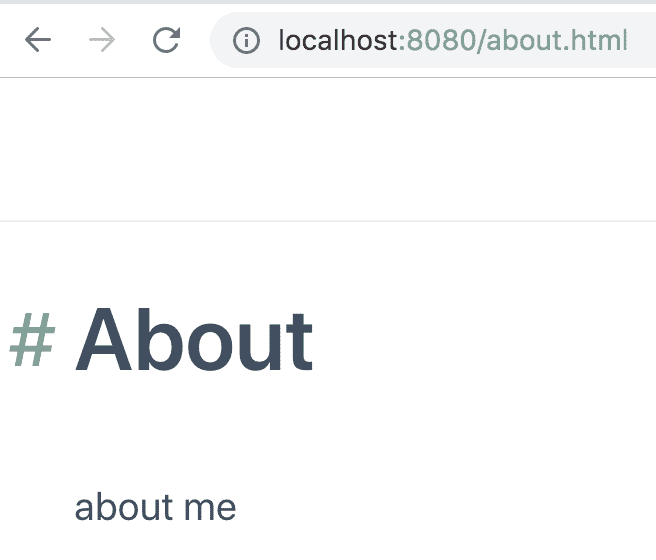](https://res.cloudinary.com/practicaldev/image/fetch/s--vaNhecef--/c_limit%2Cf_auto%2Cfl_progressive%2Cq_auto%2Cw_880/https://thepracticaldev.s3.amazonaws.com/i/f48sb2i2o1ashrcgvlxo.png)

简单回顾一下我们目前为止的文件结构:

[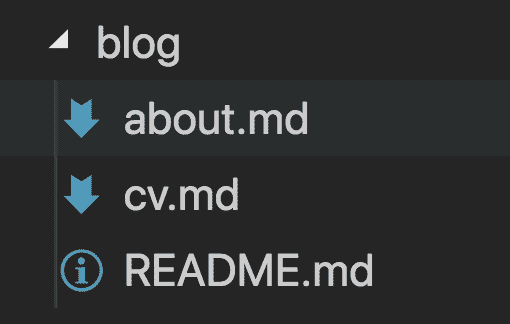](https://res.cloudinary.com/practicaldev/image/fetch/s--ySUMuV2---/c_limit%2Cf_auto%2Cfl_progressive%2Cq_auto%2Cw_880/https://thepracticaldev.s3.amazonaws.com/i/gw4y3ufqoxrzfwv2f9gf.png)

### 导航

那么导航呢，我如何在页面之间导航呢？让我们来看看我们在官方文件中找到的摘录:

```
[Home](/) <!-- Sends the user to the root README.md -->
[foo](/foo/) <!-- Sends the user to index.html of directory foo -->
[foo heading anchor](/foo/#heading) <!-- Anchors user to a heading in the foo README file -->
[foo - one](/foo/one.html) <!-- You can append .html -->
[foo - two](/foo/two.md) <!-- Or you can append .md --> 
```

好的，这意味着我们可以链接到主页，链接到目录下的登录页面，链接到页面上的特定锚，我们可以键入`.md`或`.html`文件结尾。

> 令人印象深刻让我们试一试

将`README.md`改为:

```
# My blog

Welcome to my blog
 - [About](/about/)
- [CV](/cv/) 
```

我们再补充:

```
[Home](/) 
```

到`about.md`和`cv.md`的底部。现在，在我们的起始页和另外两个页面之间，我们有了一个完全正常工作的导航系统。

## 做好生产准备

到目前为止，我们一直使用`vuepress dev`在浏览器中托管博客，但是我们如何实际上让它为生产做好准备，你知道让它生成 HTML、CSS 和所有其他的东西？因为如果我们现在看我们的文件结构，它只是降价文件。答案很简单，我们输入:

```
vuepress build 
```

运行上述命令将得到以下结果

[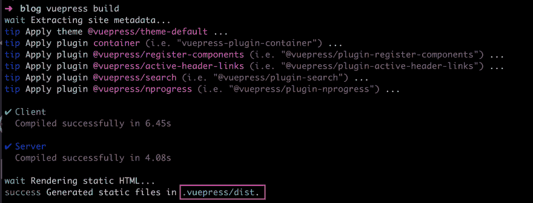](https://res.cloudinary.com/practicaldev/image/fetch/s--leKIVIQ5--/c_limit%2Cf_auto%2Cfl_progressive%2Cq_auto%2Cw_880/https://thepracticaldev.s3.amazonaws.com/i/9d6y6ctgeqrzhgvy87wp.png)

如上所示，这将创建一个`.vuepress`目录和一个`dist`目录

[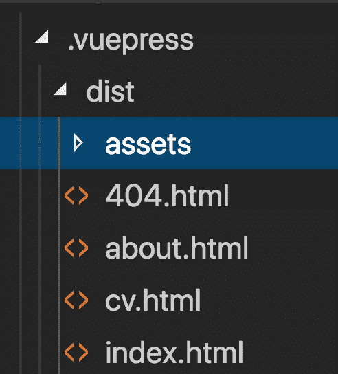](https://res.cloudinary.com/practicaldev/image/fetch/s--dlYupR9---/c_limit%2Cf_auto%2Cfl_progressive%2Cq_auto%2Cw_880/https://thepracticaldev.s3.amazonaws.com/i/yy4zyd26xdmc78b1mlf0.png)

从上面我们可以看到，我们的每一个降价文件都变成了 HTML 文件。我们还获得了一个包含 JavaScript、CSS 和图像的`assets`子目录。

> 几乎太容易了，对吗？

## 用 Markdown 写博客

我们开始评估静态站点生成器的主要原因是找到支持我们博客工作的东西。让我们试着列出我们想要的功能，以及我们需要为每篇文章添加的标签:

*   **主题标签**，一种赋予页面适当标签的方式。对于读者来说，他们能容易地看到文章的内容是很重要的。
*   一个描述性的标题是让人们选择阅读我们文章的关键
*   写文章的日期，重要的是我们可以给文章指定一个日期，这样我们就可以很容易地看到我们写文章的时间，而且还可以根据日期对文章进行分组/排序
*   **代码高亮**，这是必须的。阅读没有亮点的长行源代码是无法忍受的。

### 写文章

好了，现在让我们创建一个目录`pages`并开始创建一篇文章`article.md`。让我们添加几个段落，像我们习惯的那样添加 som 代码，现在用`vuepress dev`渲染:

[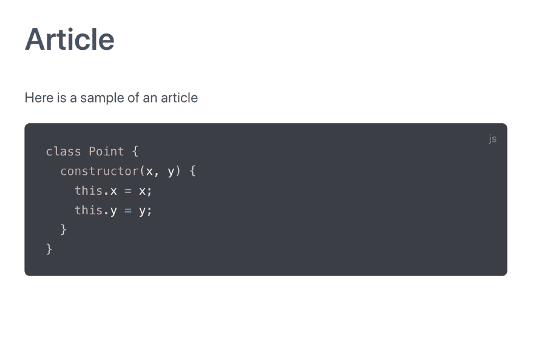](https://res.cloudinary.com/practicaldev/image/fetch/s--BBmpkS2u--/c_limit%2Cf_auto%2Cfl_progressive%2Cq_auto%2Cw_880/https://thepracticaldev.s3.amazonaws.com/i/0v3vvvofm10wapff7wbv.png)

好的，看起来很好，我们得到了很好的文章文本渲染，作为代码的亮点。但是等等，还有更多。我们实际上可以这样表示特定的行:

[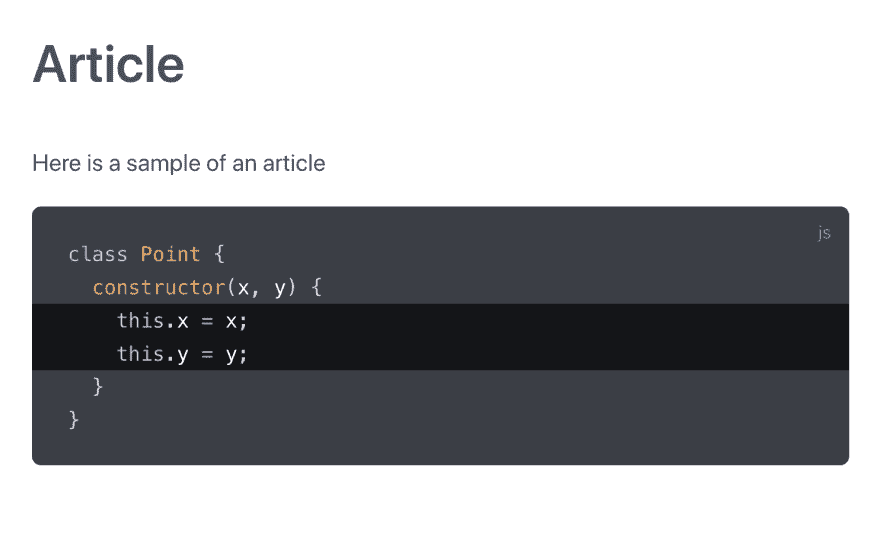](https://res.cloudinary.com/practicaldev/image/fetch/s--0mWaeG-E--/c_limit%2Cf_auto%2Cfl_progressive%2Cq_auto%2Cw_880/https://thepracticaldev.s3.amazonaws.com/i/otq6i32aec9lcpsj6vnj.png)

> 什么...

我知道这是对的，当你想突出代码的新增加时，这非常有用。那么我们是怎么做到的呢？

通常我们用三个反斜杠开始代码部分，然后我们添加`js`来表示语言，在这个例子中是 JavaScript。如果我们给这个`{}`添加一些东西，我们可以指出我们想要突出显示的行。为了完成上面的操作，我们在反勾号后面输入了`js{3,4}`，表示我们希望第`3`和`4`行被额外高亮显示。

关于代码呈现的另一件事是，我们可以通过在目录`.vuepress`下创建一个文件`config.js`来启用行号，并像下面这样设置`lineNumbers`属性:

```
module.exports = {
  markdown: {
    lineNumbers: true
  }
} 
```

### 正面物质

这是文章顶部的部分。我们可以用它来设置如下内容:

*   标题
*   小路
*   关键词
*   出版日期
*   元信息

在 Vuepress 中，我们将这个标题，即 *frontmatter* 定义为 YAML。它可以是这样的:

```
---
property: value
objectproperty: 
  prop: value
  prop2: value
--- 
```

再比如:

```
title: Blogging Like a Hacker
lang: en-US 
```

> 那么这一切什么时候重要呢？

你需要知道的第一件事是，它的底层引擎是 Vue，Vue 作为对象读取所有不同的页面，而前面的内容将作为对象被读取。

如果我们用有趣的信息填充前面的内容，比如标题、关键词、发布数据等等，那么就很容易创建不同的组件来展示你的博客信息，比如文章列表，按日期排序，或者为什么不是最常用标签的标签云呢？

> 好的，听起来不错，但是我该怎么做呢？

继续读下去，你会在下一节找到答案。

## 自定义控件

应该说没有多少现成的控件。然而，鉴于创建它们是如此容易，你并不真的需要它们。下面我们将展示一个简单的组件，这样你就能掌握它和一个更高级的组件。

好的，我们刚刚介绍了前沿问题的概念，在每篇文章的顶部有一段 YAML，但是我们实际上如何用它做一些有用的事情呢？答案是我们创建自定义控件。

> 好吧，你已经说过了，但是怎么说呢？

还记得我怎么说一切都是 Vue.js 吗？没有吗？嗯，确实是。这意味着，如果我们在运行`vue build`时创建的`.vuepress`目录下创建一个目录`components`，我们就可以创建可以在网站上任何地方使用的 Vue 组件。

> 真的吗？我知道如何创建 Vue 组件，但我如何使用它们？

让我们从创建一个组件`About.vue`开始

[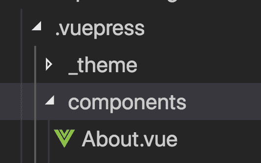](https://res.cloudinary.com/practicaldev/image/fetch/s--cnwClqWt--/c_limit%2Cf_auto%2Cfl_progressive%2Cq_auto%2Cw_880/https://thepracticaldev.s3.amazonaws.com/i/qzldtrpp1rk0nckkt55b.png)

并赋予该文件以下内容:

```
// About.vue

<template>
  <div class="box">
    <h2>{{title}}</h2>
    {{message}}<button @click="click">Hi</button>
  </div> </template> <script>
export default {
  data() {
    return {
      message: 'about page'
    }
  },
  methods: {
    click() {
      alert('hi')
    }
  },
  props: ['title']
}
</script> <style scoped>
 .box {
   padding: 20px;
   margin: 2px;
   box-shadow: 0 0 10px black;
 }
</style> 
```

上面看起来像一个非常普通的 Vue.js 组件，它有一个数据属性`message`，一个输入参数`title`和一个方法`click`。

> 你是说我可以在 page 中使用这个？

正确，就像这样添加到`about.md` :

```
# About

<About title="about me" /> 
```

> 等等，所以你混合了 markdown 和 HTML 元素？

是的，这很管用。结果看起来像这样:

[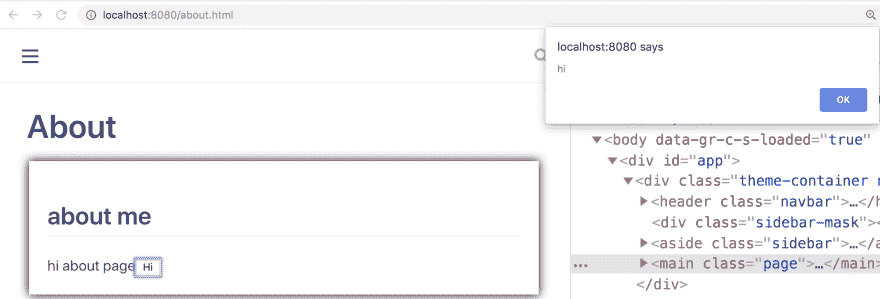](https://res.cloudinary.com/practicaldev/image/fetch/s--RL9wQOAR--/c_limit%2Cf_auto%2Cfl_progressive%2Cq_auto%2Cw_880/https://thepracticaldev.s3.amazonaws.com/i/r887jd2yo3wusmmer2il.png)

正如你在上面看到的，这个渲染得很好，甚至 javascript 部分也工作得很好，当我们点击这个按钮时，我们会看到一个警告窗口。

### 一个列表控件

好了，我们已经创建了我们的第一个自定义控件，这真的很酷，非常简单，但我们还没有展示它的真正价值，即-我们如何与前面的事情进行交互。

我们要做的是创建一个列表控件。一个控件，接受我们写的所有文章，并能够以列表格式呈现。让我们执行以下操作:

1.  **创建一个目录和文章**，让我们为我们的文章创建一个目录，让我们称之为`pages`接下来创建`typescript.md`和`vuex.md`

2.  **添加封面内容**，让我们给他们每人一个封面内容，包括标题、语言、发布数据和关键字列表

3.  **创建一个列表组件**，让我们创建一个能够迭代这些文章的列表组件，获取它需要的数据并很好地格式化它

**创建一个目录和文章**
它应该看起来像下面这样

[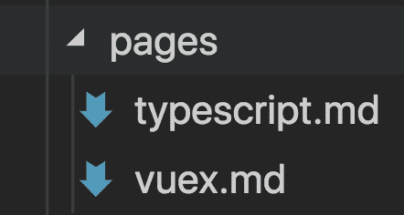](https://res.cloudinary.com/practicaldev/image/fetch/s--NUWmAz97--/c_limit%2Cf_auto%2Cfl_progressive%2Cq_auto%2Cw_880/https://thepracticaldev.s3.amazonaws.com/i/2gbjli8ui5st3m073zrx.png)

**添加 frontmatter**
我们之前说过这是 YAML，所以让我们试着包括我们提到的所有需要的信息，就像这样:

```
---
title: My first article on TypeScript
lang: en-US
published: 2019-09-19
meta:
  keywords:
    - TypeScript
    - JavaScript
    - Tutorial
  description:
    content: Article on TypeScript
--- 
```

上面是一篇名为`typescript.md`的文章的例子。显然，另一篇文章的标题、出版日期、关键词和描述会有所不同。我们可以决定如何构建上面的内容，只要它是有效的 YAML。

**创建列表组件**

有一件事让这一切成为可能。放置在`components`目录中的 Vue 组件可以访问像 so `this.$site`这样的站点对象。那个站点对象有属性`pages`，它是一个包含所有页面的列表。

这是个好消息，但是我们需要过滤一下，因为我们只需要在`pages`目录中的页面。我们可以很容易地通过下面的代码得到这一点:

```
return this.$site.pages
  .filter(p => {
    return p.path.indexOf('/pages/') >= 0;
}); 
```

现在是我们前面的问题出现的时候。我们在页面的 frontmatter 中定义的所有内容都被解析为一个对象，所以当我们遍历每个页面时，我们可以访问`page.frontmatter`。因此，我们可以很容易地访问我们的关键字，例如`page.frontmatter.meta.keywords`。

这意味着我们可以继续构建我们的列表组件，看起来像这样:

```
// List.vue

<template>
  <div>
    <div class="article" v-for="page in files">
      <a v-bind:href="page.path">{{page.title}}</a>
      <div class="keywords">
        <span class="keyword" v-for="key in page.frontmatter.meta.keywords">{{key}}</span>
      </div>
    </div>
  </div> </template> <script>
export default {
  computed: {
    files() {
      return this.$site.pages
        .filter(p => { 
          return p.path.indexOf('/pages/') >= 0;
        });
    }
  }
}
</script> <style scoped>
  .article {
    margin-bottom: 20px;
    border-left: solid 5px #3eaf7c;
    padding: 20px;
  }
  .keywords {
    margin-top: 10px;
  }
  .keyword {
    padding: 5px;
    border-radius: 7px;
    font-size: small;
    background: #3eaf7c;
    margin-right: 5px;
    color: white;
    font-weight: 500;
  }
</style> 
```

将它投入使用，它将呈现如下:

[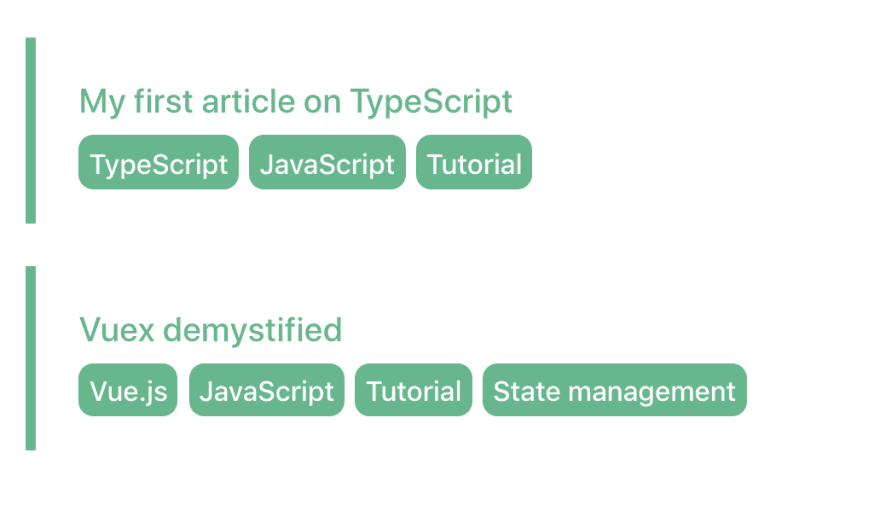](https://res.cloudinary.com/practicaldev/image/fetch/s--z8OlSwrH--/c_limit%2Cf_auto%2Cfl_progressive%2Cq_auto%2Cw_880/https://thepracticaldev.s3.amazonaws.com/i/i1565yctim4ngty276u1.png)

现在，我们肯定可以通过确保当我们点击一个关键字时，我们最终会得到一个与该关键字匹配的文章列表来改善上述情况，嗯，天空是极限。我将把这项工作留给你去做。您应该已经获得了足够的信息，知道如何继续。

## 默认主题

主题化本身是一个大话题，所以我将把自定义主题化留到以后的文章中。我将描述的是你如何使用当前的默认主题，并帮助你的网站看起来更好。

它包含相当多的功能，完整的功能列表如下:

> [https://vuepress . vuej . org/default-theme-config/](https://vuepress.vuejs.org/default-theme-config/)

我们可以改变的一件事是我们的主页。我们可以通过添加 frontmatter 来彻底改变它，就像这样:

```
---
home: true
heroImage: ./logo.png
actionText: Get Started →
actionLink: /articles/
features:
- title: Blog
  details: This is a blog consisting of articles on various tech topics
- title: CV
  details: This is my CV
- title: About
  details: This tells you everything about who I am as a person
footer: MIT Licensed | Copyright © 2018-present Evan You
--- 
```

这将给我们一个页面的*英雄*部分，一条突出的信息，后面是三列*特色*。上面的 YAML 会这样渲染:

[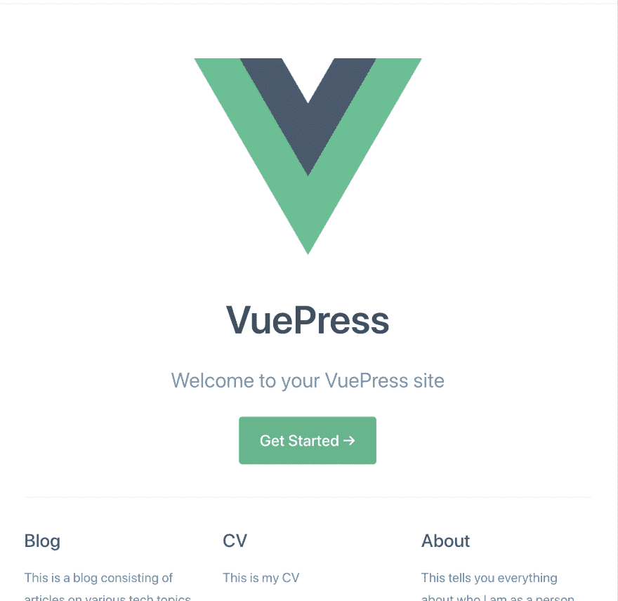](https://res.cloudinary.com/practicaldev/image/fetch/s--TsNwFLw1--/c_limit%2Cf_auto%2Cfl_progressive%2Cq_auto%2Cw_880/https://thepracticaldev.s3.amazonaws.com/i/w5xu7c68w5d2tbp913o2.png)

请注意，我们还没有讨论我们如何管理资产，您可能想知道它如何知道如何解析指向`./logo.png`的`heroImage`。我们实际上在`.vuepress`下创建了一个目录`public`，那就是我们放图片的地方。

我想我应该在我们的默认主题上再提一件事，那就是菜单功能。我们需要在`.vuepress`目录下创建一个文件`config.js`，并确保我们像这样设置属性【T2:

```
module.exports = {
  themeConfig: {
    nav: [{
        text: 'Home',
        link: '/'
      },
      {
        text: 'About',
        link: '/about/'
      },
      {
        text: 'CV',
        link: '/cv/'
      },
      {
        text: 'Blog',
        link: '/articles/'
      },
      {
        text: 'Public Speaking',
        link: '/speaking/'
      }
    ]
  }
} 
```

## 总结

那是所有的人。:)

我们从安装 CLI 一直到学习一些有用的命令，如`vuepress dev`来使用它。此外，我们还了解了会渲染完成的静态文件的`vuepress build`。

我们展示的一件非常酷的事情是创建自定义控件是多么容易，最后，我们展示了当您使用默认主题时已经有了多少功能。

就个人而言，这是我用过的最简单的静态站点生成器。我迫不及待地想让这个已经很好的水平变得更好。试试看！