# 如何使用 Node-RED 将音频流式传输到呼叫中

> 原文：<https://dev.to/vonagedev/how-to-stream-audio-into-a-call-with-node-red-1c1m>

在之前的教程中，您已经学习了如何使用 Nexmo Voice API 处理呼入电话和呼出电话。对于这些例子，我们使用了文本到语音的转换，但有时需要更人性化的方法。当打电话给一家公司时，被一个人的声音问候总是一种很好的接触，而不是众所周知的友好的邻居机器人。此外，当你拿着电话时，播放高质量的音乐，时间会过得更快。

在这篇博客文章中，我们将改变它一点，你会发现如何流音频到一个电话。结束时，您将能够向来电者播放音频文件，并知道如何将音频传输给呼出电话的接收者。

从下面的 Node-RED 库获取流或跟随！

–[将音频流传入呼出电话](https://flows.nodered.org/flow/12be7fb502cba62ef00ea9d06d5b8cef)

–[向来电者播放音频文件](https://flows.nodered.org/flow/24f972c23b92a120bde39a9b8163d872)

## 先决条件

开始之前，您需要一些东西:

*   安装在您机器上的 [Node.js](https://nodejs.org/en/) 和 [Node-RED](https://nodered.org/docs/getting-started/installation)
*   Nexmo 帐户–[如果您还没有，请免费创建一个帐户](https://dashboard.nexmo.com/sign-up?utm_source=DEV_REL&utm_medium=nexmoblog&utm_campaign=stream-audio-nodered)
*   一种向互联网公开服务器的方式。这意味着你运行的是 Node-RED 的托管版本，或者如果你在本地开发，使用类似 [ngrok](https://ngrok.com/download) 的隧道服务——通过 Node-RED 教程中的这个[开始使用 ngrok](https://dev.to/nexmo/getting-started-with-ngrok-in-node-red-4cn7)

### 领取证件

为了与语音 API 进行交互，您需要注意一些事情。一旦你创建了一个 Nexmo 账户，进入[仪表盘](https://dashboard.nexmo.com)找到你的 API 密匙和密码。

接下来，你需要一个支持语音的虚拟号码。前往 Numbers > [购买 numbers](https://dashboard.nexmo.com/buy-numbers) 获得一个。

[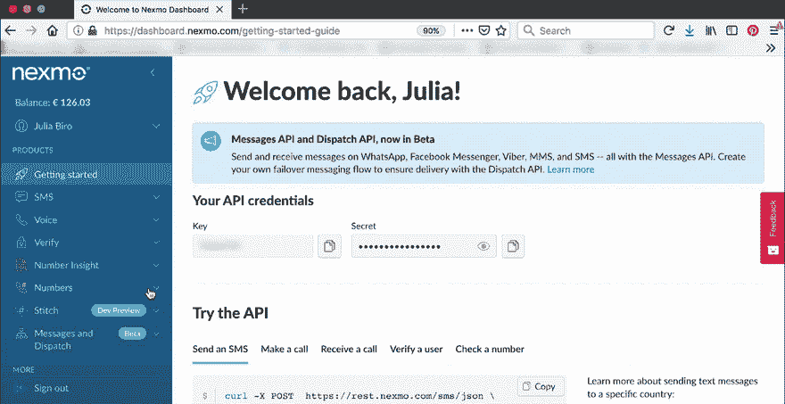](https://res.cloudinary.com/practicaldev/image/fetch/s--WZszTx09--/c_limit%2Cf_auto%2Cfl_progressive%2Cq_66%2Cw_880/https://www.nexmo.com/wp-content/uploads/2019/04/buy-number-nexmo-dashboard.gif)

### 设置你的节点-红色编辑器

首先，你需要[安装](https://nodered.org/docs/getting-started/installation)运行时和编辑器。这可以在您的本地机器、单板计算机(例如 Raspberry Pi)上完成，也可以在许多云托管选项上完成。这个示例将使用您的本地机器，所以一旦您已经全局安装了 Node-RED，只需在您的终端中键入以下命令即可开始。

```
$ node-red 
```

然后，您可以通过将浏览器指向 [http://localhost:1880](http://localhost:1880) 来访问 Node-RED 编辑器。

打开编辑器后，您需要安装 Nexmo 节点。你可以在*管理调色板*菜单下搜索`node-red-contrib-nexmo`包并点击安装。

[](https://res.cloudinary.com/practicaldev/image/fetch/s--5qphdIGB--/c_limit%2Cf_auto%2Cfl_progressive%2Cq_66%2Cw_880/https://www.nexmo.com/wp-content/uploads/2019/07/install-nexmo-nodered.gif)

现在，您应该看到所有的 Nexmo 节点出现在屏幕的左侧，在其他默认节点中。

### 将您的本地服务器暴露在互联网上

接下来你必须[将你的本地服务器暴露给互联网](https://dev.to/nexmo/getting-started-with-ngrok-in-node-red-4cn7)，这样 Nexmo 就可以访问它。如果你在一个公共的网络服务器上运行 Node-RED，而不是在你的本地机器上，你可以跳过这个阶段。

否则，一种方便的方法是使用隧道服务，如 [ngrok](https://ngrok.com) 。

首先，您需要安装 ngrok 节点。为此，在你的 Node-RED 编辑器的 hamburger 菜单中打开*管理调色板*，搜索`node-red-contrib-ngrok`包并点击 install。重启编辑器后， **`ngrok`** 节点应该出现在节点面板中。

[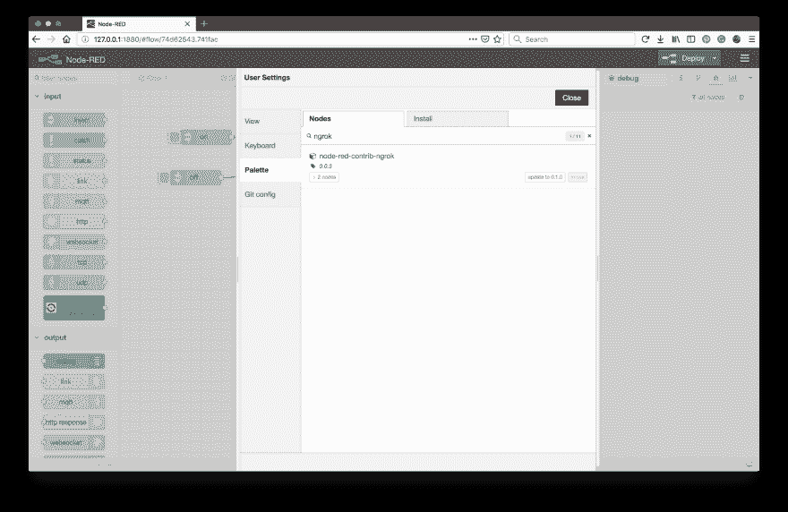](https://res.cloudinary.com/practicaldev/image/fetch/s--MWh41Ebe--/c_limit%2Cf_auto%2Cfl_progressive%2Cq_auto%2Cw_880/https://www.nexmo.com/wp-content/uploads/2019/07/ngrok-manage-palette.png)

`ngrok`节点将上的字符串**或**下的字符串**作为启动/停止隧道的输入，并将 ngrok 主机地址作为 *msg.payload* 输出。**

最简单的设置方法是连接两个`inject`节点作为 **`ngrok`** 节点的输入，一个在上使用字符串**的有效负载，另一个在**上关闭**。为了更容易使用，您还可以在节点属性中相应地设置这些节点的`Name`，这样就可以清楚它们有什么功能。**

接下来，为了在调试侧栏中显示主机地址，在 **`ngrok`** 之后连接一个`debug`节点。

作为点击**部署**前的最后一步，打开 **`ngrok`** 节点属性，指定端口号。在 Node-RED 的情况下，默认值为`1880`。默认的 ngrok 地区是美国，但是您也可以将其设置为欧洲或亚洲。如果您有 ngrok 帐户，也可以为其添加 authtoken。如果你不知道，不要担心，只是暂时跳过这一步。节点将警告它未完全配置，但这不是问题。

[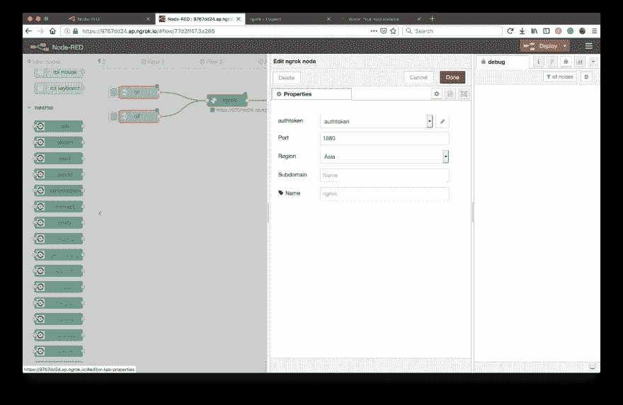T10】](https://res.cloudinary.com/practicaldev/image/fetch/s--QjfldJTT--/c_limit%2Cf_auto%2Cfl_progressive%2Cq_auto%2Cw_880/https://www.nexmo.com/wp-content/uploads/2019/07/ngrok-node-properties-1.png)

一切都准备好了！点击 deploy 并点击 `inject`节点上的**按钮后，导航到调试区域中显示的 URL(YOUR _ URL，以供将来参考),在公共地址找到您的 Node-RED 编辑器。**

[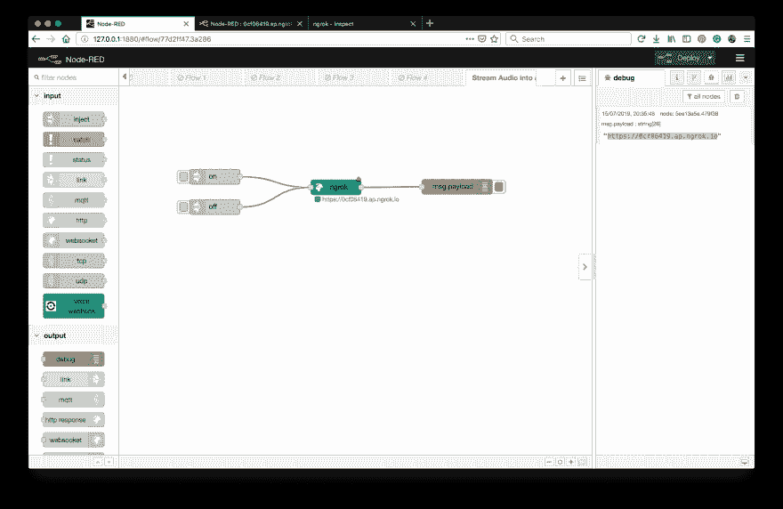](https://res.cloudinary.com/practicaldev/image/fetch/s--cUbS4C8V--/c_limit%2Cf_auto%2Cfl_progressive%2Cq_auto%2Cw_880/https://www.nexmo.com/wp-content/uploads/2019/07/ngrok-nodered-1.png)

### 事件 Webhook

如果您想接收有关通话进度的事件，您还可以设置一个事件 webhook。

将一个`http`输入节点连接到一个`http response`节点，以及一个`debug`节点，这样您就可以在调试区域查看您的调用事件。

在`http`输入节点中，选择`POST`作为`Method`，因为这是您的[语音应用设置](https://dashboard.nexmo.com/voice/your-applications)中的默认方法，并在`URL`字段中填入`/event`。

`http response`节点应该将`200`设置为`Status code`，但是不用担心，这也是默认值。

[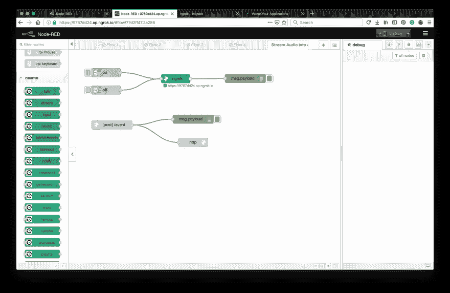](https://res.cloudinary.com/practicaldev/image/fetch/s--gMg3mi2b--/c_limit%2Cf_auto%2Cfl_progressive%2Cq_auto%2Cw_880/https://www.nexmo.com/wp-content/uploads/2019/07/event-webhook-1.png)

### 提供音频文件

找到您希望在通话中播放的音频文件。如果你在网上有它，确保它是 MP3 或 WAV 格式，记下它所在的 URL，然后继续下一步。

另一个选择是从你的电脑上提供服务。为此，依次连接一个`http`输入节点、一个`file in`、一个`change`和一个`http response`节点。

在`http`输入节点中，选择`GET`作为`Method`，在`URL`字段中填入类似`/filename.mp3`的内容，这样你就可以在 *YOUR-URL/filename.mp3* 中找到你的音频文件。

接下来，打开`file in`节点属性，在`Filename`字段中提供您提供的音频文件的绝对本地路径，并将`Output`设置为`a single Buffer object`。这将把文件的内容作为二进制缓冲区读取。

您还需要指定您提供的文件类型，这就是`change`节点发挥作用的地方。将`msg.headers`设置为`{}`，将`msg.headers.content-type`设置为`audio/mp3`。

[](https://res.cloudinary.com/practicaldev/image/fetch/s--O4AXVzb9--/c_limit%2Cf_auto%2Cfl_progressive%2Cq_66%2Cw_880/https://www.nexmo.com/wp-content/uploads/2019/07/serve-up-audio-nodered-1.gif)

现在点击**部署**后，将浏览器指向`YOUR_URL/filename.mp3`，你应该会听到你的音频文件正在播放。

### 创建 Nexmo 应用程序

包括语音 API 在内的一些 Nexmo API 使用 Nexmo 应用程序来保存连接到 NEX mo 端点所需的安全和配置信息。

在 Nexmo Node-RED 调色板中，有几个节点能够创建这些应用程序:`getrecording`、`earmuff`、`mute`、`hangup`、`transfer`、`createcall`、`playaudio`、`playtts`和`playdtmf`。

让我们使用 **`createcall`** 节点，它也能够使用您接下来将构建的 NCCO 进行出站调用。

一旦你把它放到你的工作区，双击 **`createcall`** 节点打开节点编辑器。`Nexmo Credentials`旁边的

，从下拉菜单中选择“添加新 nexmovoiceapp…”并点击编辑按钮。填写下面的详细信息，然后点击`Create New Application`。

| 键 | 描述 |
| --- | --- |
| `Name` | 为您的语音应用程序选择一个名称，例如`Stream audio`。 |
| `API Key` | 您的 Nexmo API 密钥，显示在您的[账户概述](https://dashboard.nexmo.com/getting-started-guide)中。 |
| `API Secret` | 您的 Nexmo API 秘密，显示在您的[账户概述](https://dashboard.nexmo.com/getting-started-guide)中。 |
| `Answer URL` | 当处理[入站呼叫](https://dev.to/nexmo/how-to-receive-phone-calls-with-node-red-3ihc)时，Nexmo 向其发出请求的 URL。如果你只对打外线感兴趣，就用 http://example.com 的——你不会需要它。否则，将其设置为 YOUR_URL/answer，您将在这里托管一个 Nexmo 呼叫控制对象(NCCO)。稍后会有更多相关内容。 |
| `Event URL` | Nexmo 将向该 URL 发送呼叫事件(如响铃、应答)。如果您想要接收有关通话进度的事件，请确保您的服务器已接入互联网，然后在此字段中使用`YOUR_URL/event`。否则，请随意使用 http://example.com 的[——这将响应 200 OK。您还可以在其节点属性中为特定的`createCall`节点覆盖这个 eventURL。](http://example.com) |

Node-RED 将在您的帐户上创建一个新的 Nexmo 应用程序，并填写应用程序 ID 和私钥字段供您保存。现在你可以在你的 Nexmo 仪表盘的*语音* > *[你的应用](https://dashboard.nexmo.com/voice/your-applications)* 下找到这个应用。

[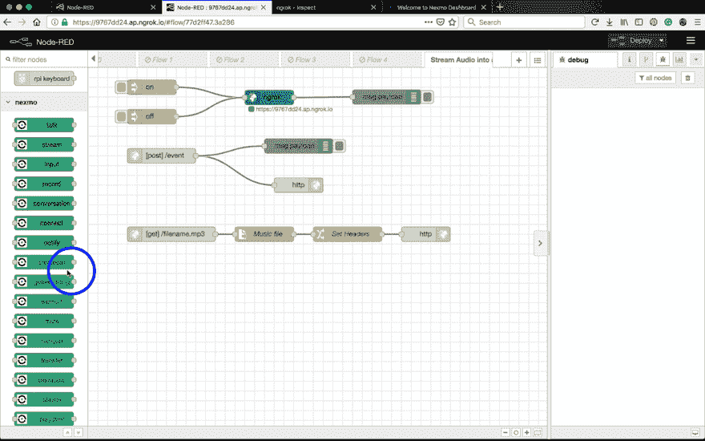](https://res.cloudinary.com/practicaldev/image/fetch/s--4zUJ2uxf--/c_limit%2Cf_auto%2Cfl_progressive%2Cq_66%2Cw_880/https://www.nexmo.com/wp-content/uploads/2019/07/create-voice-app-example-1.gif)

## 向来电者播放音频文件

### 链接您的虚拟号码

接下来，您需要将您的虚拟号码链接到之前由 **`createcall`** 节点创建的应用程序。

导航至*语音* > *[您的应用](https://dashboard.nexmo.com/voice/your-applications)* ，在 Nexmo 仪表盘中找到您刚刚创建的语音应用。

点击这个应用的名字，然后在*数字*标签下点击你之前租用的虚拟号码旁边的**链接**按钮。

[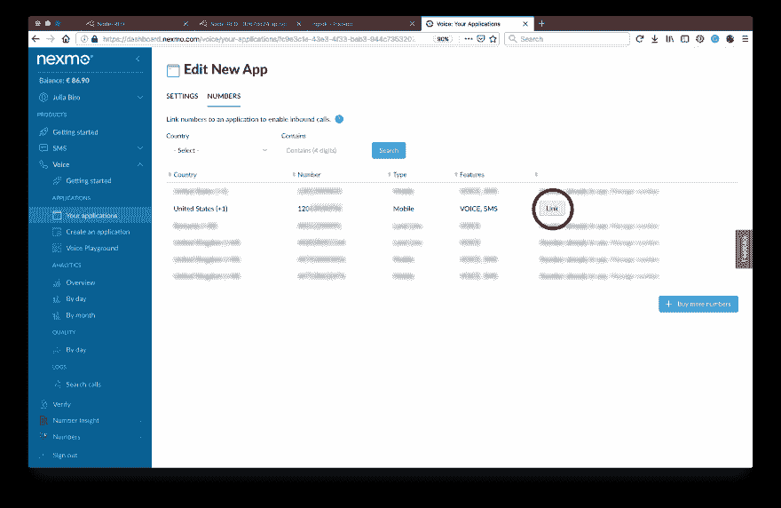](https://res.cloudinary.com/practicaldev/image/fetch/s---zqw-E9n--/c_limit%2Cf_auto%2Cfl_progressive%2Cq_auto%2Cw_880/https://www.nexmo.com/wp-content/uploads/2019/07/link-number-voiceapp-1.png)

### 构建 Nexmo 呼叫控制对象(NCCO)

Nexmo 调用使用 *Nexmo 调用控制对象*进行控制，也称为 NCCOs。NCCO 定义了处理呼叫时要遵循的操作列表。有许多不同的动作可用，在你的 Node-RED 编辑器中的 Nexmo 调色板下找到相应的节点，或者查看 [NCCO 参考](https://developer.nexmo.com/api/voice/ncco)以找到更多关于它们的信息。

处理来电时，您需要将 NCCO 托管在一个*应答 URL* ，对于本教程，您将使用 **`stream`** 操作。

将 **`stream`** 节点拖放到您的工作区，设置`Stream URL`，然后将其连接到一个 **`voice webhook`** 输入节点和一个 **`return NCCO`** 输出节点。

接下来，在 **`voice webhook`** 节点中，选择`GET`作为方法，并在答案 URL 字段中键入类似`/answer`的内容。

[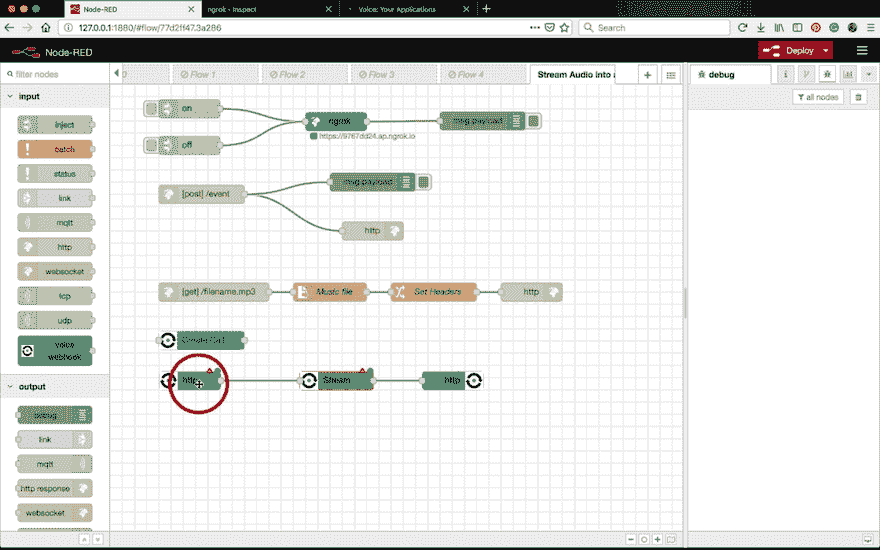](https://res.cloudinary.com/practicaldev/image/fetch/s--PuIwJjLG--/c_limit%2Cf_auto%2Cfl_progressive%2Cq_66%2Cw_880/https://www.nexmo.com/wp-content/uploads/2019/07/stream-ncco-answer-url-1.gif)

最后，进入 **`createcall`** 节点属性，从`Answer`下拉列表中选择`URL`，在字段中填入`YOUR_URL/answer`。

拨打您关联的 Nexmo 号码，轻松享受！你的音频文件会等着你。

Psst，你也可以在调试侧边栏关注你的调用事件！

## 将音频文件流式传输到电话中

### 构建 Nexmo 呼叫控制对象(NCCO)

在构建 NCCO 之后，它将被传递到`createcall`节点，然后被用来进行出站调用。该`createcall`节点接受`Answer`字段中 NCCO 的 3 种输入:`JSON`、`URL`或`msg.ncco`。根据您选择的方式，有 3 种相应的方式来构建 NCCO，如下所示。

#### msg.ncco

将 **`stream`** 节点拖放到您的工作区，双击它打开节点属性，并将`Stream URL {}`字段设置为您的音频文件所在的链接— `YOUR_URL/filename.mp3`。注意标签旁边的`{}`符号，表示该值可以使用 [Mustache 模板](https://mustache.github.io/)动态设置。您也可以设置`Barge In`、`Loop`和`Level`值，尽管这些不是必需的。参见 NCCO 参考的[流部分](https://developer.nexmo.com/voice/voice-api/ncco-reference#stream)了解更多信息。

接下来，将 **`stream`** 节点的导线输出到 **`createcall`** 节点，然后在 **`createcall`** 节点属性下从`Answer`下拉菜单中选择`msg.ncco`。

[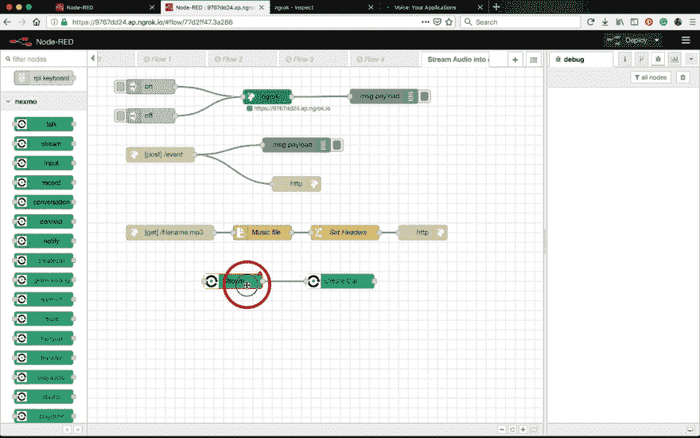](https://res.cloudinary.com/practicaldev/image/fetch/s--EPO82DmI--/c_limit%2Cf_auto%2Cfl_progressive%2Cq_66%2Cw_880/https://www.nexmo.com/wp-content/uploads/2019/07/stream-msg-ncco-1.gif)

#### JSON

如果你想把你的 NCCO 写成 JSON，而不是使用 action 节点，你可以在 **`createcall`** 节点中这样做。打开节点属性并在`Answer`字段中选择`JSON`。

展开 JSON 编辑器并粘贴到下面的代码片段中:

```
[{ "action": "stream", "streamUrl": ["https://YOUR\_URL/filename.mp3"] }] 
```

#### 回答网址

或者，您可以在 AnswerURL 提供 NCCO。

将 **`stream`** 节点拖放到您的工作区，设置`Stream URL`，然后将其连接到一个 **`voice webhook`** 输入节点和一个 **`return NCCO`** 输出节点。

接下来，在 **`voice webhook`** 节点中，选择`GET`作为方法，并在答案 URL 字段中键入`/answer`。

[](https://res.cloudinary.com/practicaldev/image/fetch/s--PuIwJjLG--/c_limit%2Cf_auto%2Cfl_progressive%2Cq_66%2Cw_880/https://www.nexmo.com/wp-content/uploads/2019/07/stream-ncco-answer-url-1.gif)

最后，进入 **`createcall`** 节点属性，从`Answer`下拉列表中选择`URL`，在字段中填入`YOUR_URL/answer`。

### 拨打呼出电话

接下来，让我们仔细看看 **`createcall`** 节点的属性。要实际拨打电话，您需要填写更多的细节。

首先，从`Endpoint`下拉菜单中选择`Phone`。这将把呼叫转移到一个电话号码，您可以在`Number{}`标签旁边的文本字段中指定该号码。

注意`{}`符号，这意味着这些字段支持 [Mustache 模板](https://mustache.github.io/)。您可以在这里硬编码一个电话号码，或者使用一个 **`inject`** 节点动态传递它，在这种情况下，用`{{msg.payload}}`引用它。

进入下一步，将你的虚拟号码[中的一个](https://dashboard.nexmo.com/your-numbers)设为`From{}`号码。

[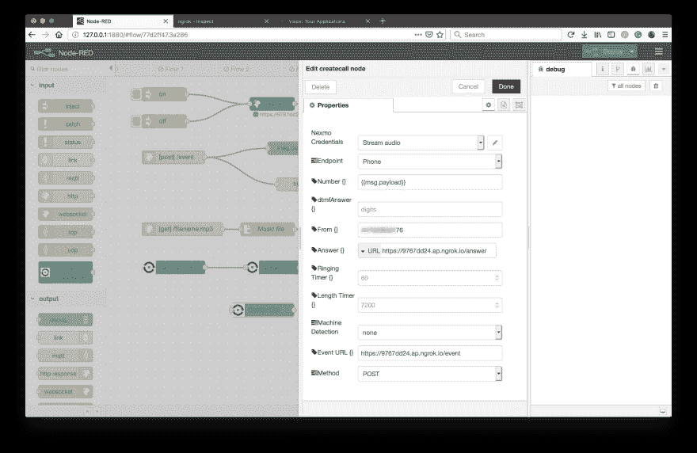](https://res.cloudinary.com/practicaldev/image/fetch/s--zqPgEqIW--/c_limit%2Cf_auto%2Cfl_progressive%2Cq_auto%2Cw_880/https://www.nexmo.com/wp-content/uploads/2019/07/edit-createcall-1.png)

添加一个 **`inject`** 节点来设置流，并将其连接为包含 **`createcall`** 节点的路径的输入。在其节点属性中，您可以从`Payload`下拉菜单中选择`Number`，并在旁边的文本字段中填写您希望以 E.164 格式拨打的电话号码。例如 447401234567。在这种情况下，不要忘记使用 **`createcall`** 节点属性中的`{{msg.payload}}`作为`Number{}`的值来引用这个数字。

为了更深入地了解调用时发生了什么，将 **`createcall`** 的输出连接到一个 **`debug`** 节点。

现在点击**部署**并点击 **`inject`** 节点的按钮——你的手机应该随时会响！如果已经实现了 event webhook，还可以在 debug 侧边栏中跟踪调用流程。

[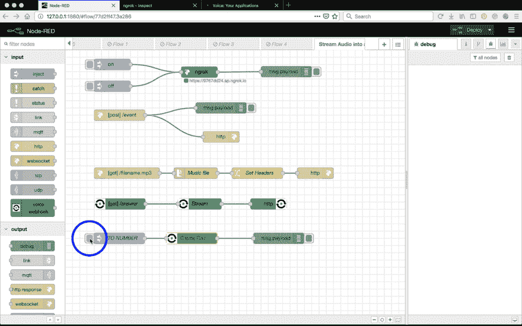](https://res.cloudinary.com/practicaldev/image/fetch/s--wr-Uok8s--/c_limit%2Cf_auto%2Cfl_progressive%2Cq_66%2Cw_880/https://www.nexmo.com/wp-content/uploads/2019/07/stream-outbound-debug-1.gif)

### 下一步去哪里？

*   关于[语音 API](https://developer.nexmo.com/voice/voice-api/overview) 的更多信息
*   查看 [NCCO 参考资料](https://developer.nexmo.com/voice/voice-api/ncco-reference)，了解控制通话的多种方式。
*   [流媒体指南](https://developer.nexmo.com/voice/voice-api/ncco-reference#stream)
*   [如何使用 Node-RED 进行文本语音通话](https://dev.to/nexmo/how-to-make-text-to-speech-phone-calls-with-node-red-2nfj)
*   [如何用 Node-RED 接听电话](https://dev.to/nexmo/how-to-receive-phone-calls-with-node-red-3ihc)
*   [宣布 Nexmo Node-RED 包](https://www.nexmo.com/blog/2019/02/21/nexmo-node-red-package-dr/)
*   [如何用 Node-RED 发送短信](https://dev.to/nexmo/how-to-send-sms-messages-with-node-red-2l2o)
*   [如何用 Node-RED 接收短信](https://dev.to/nexmo/how-to-receive-sms-messages-with-node-red-55ll)
*   仔细看看[节点——红色](https://nodered.org/docs/)