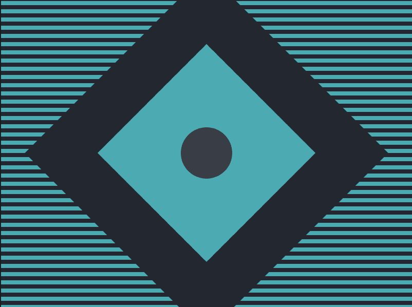
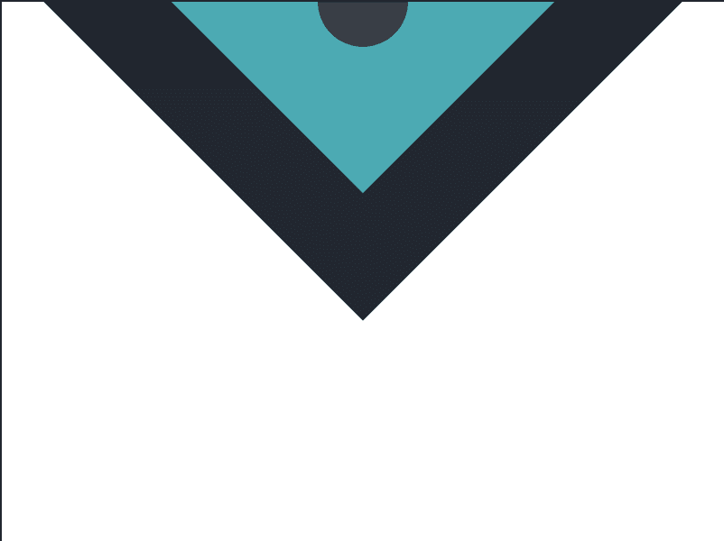

# CSS 战#9 -宇宙魔方

> 原文:# t0]https://dev . to/pheeria/CSS-battlefield-9-tesselat-5d8g

这些剧集和网飞剧集的不同之处在于，在网飞你可以一次看到所有剧集。相比之下，我需要先写我的。三天一贴。至少，这是我最开始想要的。天真的我。

* * *

你知道有一个 CSS 战斗社区吗？好吧，如果你没有的话，给你。猜猜哪类帖子出现频率最高？只差一点点就达到 100%了。斗争是真实的。因此，该系列。希望有帮助。

## 解

我需要坦白。这个我没管。但是我很乐观。[我能做到的已经足够好了。](https://www.youtube.com/watch?v=COUaNmm53VA)
先说`body`。我们通过使用`linear-gradient`使其条纹化。前 25%和后 25%以`#222730`为背景色，中间 50%以`#4CAAB3`为背景色。基础工作已经完成。

```
body {
  background: linear-gradient(#222730 25%, #4caab3 25% 75%, #222730 75%);
} 
```

<svg width="20px" height="20px" viewBox="0 0 24 24" class="highlight-action crayons-icon highlight-action--fullscreen-on"><title>Enter fullscreen mode</title></svg> <svg width="20px" height="20px" viewBox="0 0 24 24" class="highlight-action crayons-icon highlight-action--fullscreen-off"><title>Exit fullscreen mode</title></svg>

在情节的中间，我们应该有一个菱形。里面是一个圆圈。让我们把它们标上。注意，你可以在一个`div`中使用一个`p`标签，而不是通过一个`id`来赋予一个普通的分部一种语义。毕竟一个段落也是一个`block`元素。

```
<div id="rhombus">
  <div id="circle"></div>
</div> 
```

<svg width="20px" height="20px" viewBox="0 0 24 24" class="highlight-action crayons-icon highlight-action--fullscreen-on"><title>Enter fullscreen mode</title></svg> <svg width="20px" height="20px" viewBox="0 0 24 24" class="highlight-action crayons-icon highlight-action--fullscreen-off"><title>Exit fullscreen mode</title></svg>

说到菱形，我们做一个正方形，给它一个尺寸`150 x 150`，漂亮的背景色和一个边框`50px`，让它看起来像是被裁剪过的。然后我们用一种更老的方法，用一个[固定定位](https://learnlayout.com/position.html)，将它居中。请注意，这里我们也可以使用相对于其父节点的绝对定位，但是因为`body`是父节点，`fixed`将带我们到同样的结果，而不那么麻烦。最后，我们还将正方形旋转成菱形。

```
#rhombus {
  width: 150px;
  height: 150px;
  background: #4caab3;
  border: 50px solid #222730;
  position: fixed;
  top: 50%;
  left: 50%;
  transform: translate(-50%, -50%) rotate(45deg);
} 
```

<svg width="20px" height="20px" viewBox="0 0 24 24" class="highlight-action crayons-icon highlight-action--fullscreen-on"><title>Enter fullscreen mode</title></svg> <svg width="20px" height="20px" viewBox="0 0 24 24" class="highlight-action crayons-icon highlight-action--fullscreen-off"><title>Exit fullscreen mode</title></svg>

最后一个是圆。我们使用边距`50px`对其进行定位。剩下的就很简单了。大小、背景和边框半径。

```
#circle {
  width: 50px;
  height: 50px;
  background: #393e46;
  border-radius: 50px;
  margin: 50px;
} 
```

<svg width="20px" height="20px" viewBox="0 0 24 24" class="highlight-action crayons-icon highlight-action--fullscreen-on"><title>Enter fullscreen mode</title></svg> <svg width="20px" height="20px" viewBox="0 0 24 24" class="highlight-action crayons-icon highlight-action--fullscreen-off"><title>Exit fullscreen mode</title></svg>

这就是全部的解决方案。

```
<div id="rhombus">
  <div id="circle"></div>
</div>

<style>
  body {
    background: linear-gradient(#222730 25%, #4CAAB3 25% 75%, #222730 75%);
  }
  #rhombus {
    width: 150px;
    height: 150px;
    background: #4CAAB3;
    border: 50px solid #222730;
    position: fixed;
    top: 50%;
    left: 50%;
    transform: translate(-50%, -50%) rotate(45deg);
  }
  #circle {
    width: 50px;
    height: 50px;
    background: #393E46;
    border-radius: 50px;
    margin: 50px;
  }
</style> 
```

<svg width="20px" height="20px" viewBox="0 0 24 24" class="highlight-action crayons-icon highlight-action--fullscreen-on"><title>Enter fullscreen mode</title></svg> <svg width="20px" height="20px" viewBox="0 0 24 24" class="highlight-action crayons-icon highlight-action--fullscreen-off"><title>Exit fullscreen mode</title></svg>

在写这篇文章的时候，我必须承认，我已经放弃了，我只是想搜索术语的名称。你怎么称呼这条细线？显然，它被称为*出血*。而[的一个搜索结果](https://tumble.sneak.co.nz/post/928998513/fixing-the-background-bleed)有望解决这个问题。我想，为什么不呢？你知道吗？成功了。所以，为了使代码达到完全匹配，只需将`background-clip: padding-box`加到`#rhombus`上。这个[填充框](https://lmgtfy.com/?q=padding%20box&s=g)是什么？

### 花絮

[这个](https://cssbattle.dev/play/9)挺搞笑的。上面的代码在 Firefox 中不起作用。事实上，它看起来会像这样。

[](https://res.cloudinary.com/practicaldev/image/fetch/s--vGzGpWOb--/c_limit%2Cf_auto%2Cfl_progressive%2Cq_auto%2Cw_880/https://thepracticaldev.s3.amazonaws.com/i/q1dsz809b5xajr2s7rgd.png)

最开始，*原本流血的*版本会这样。

[](https://res.cloudinary.com/practicaldev/image/fetch/s--YKGL7VIO--/c_limit%2Cf_auto%2Cfl_progressive%2Cq_auto%2Cw_880/https://thepracticaldev.s3.amazonaws.com/i/rtxlu4n3rjkagtyo04j4.png)

密码来了。请记住，这是一个未经润色的版本。

```
<div><p></p></div>

<style>
  body {
    margin: 0;
    position: relative;
    background: linear-gradient(#222730 25%, #4CAAB3 25% 75%, #222730 75%);
  }
  div {
    width: 150px;
    height: 150px;
    background: #4CAAB3;
    border: 50px solid #222730;
    position: absolute;
    top: 50%;
    left: 50%;
    transform: translate(-50%, -50%) rotate(45deg);
    background-clip: padding-box;
  }
  p {
    width: 50px;
    height: 50px;
    background: #393E46;
    border-radius: 50px;
    margin: 50px;
  }
</style> 
```

<svg width="20px" height="20px" viewBox="0 0 24 24" class="highlight-action crayons-icon highlight-action--fullscreen-on"><title>Enter fullscreen mode</title></svg> <svg width="20px" height="20px" viewBox="0 0 24 24" class="highlight-action crayons-icon highlight-action--fullscreen-off"><title>Exit fullscreen mode</title></svg>

* * *

顺便问一下，到目前为止你喜欢 CSS 战吗？这些家伙投入了大量的工作。因此，如果你想知道如何支持他们，你可以这样做:

> CSS battle@ CSS _ battleCSS battle 的玩家们，我们终于推出了我们过去几个月一直在努力的东西。《CSSBattle PRO》！！🔥⚔️🥳和它今天上 [@ProductHunt](https://twitter.com/ProductHunt) 。producthunt.com/posts/cssbattl…我们希望你会喜欢。分享传播！🙏🏼2019 年 7 月 11 日上午 08:11[](https://twitter.com/intent/tweet?in_reply_to=1149229650809430016)[](https://twitter.com/intent/retweet?tweet_id=1149229650809430016)[](https://twitter.com/intent/like?tweet_id=1149229650809430016)

我个人觉得轻松的主题很有趣，但是除了玩笑之外，还有一些潜在的改变游戏的特性，比如社区和自己的战斗创造的目标。如果你想雇佣一个[前端开发者](https://css-tricks.com/the-great-divide/)或者只是想吹嘘你的缩小技术，这是个好东西。