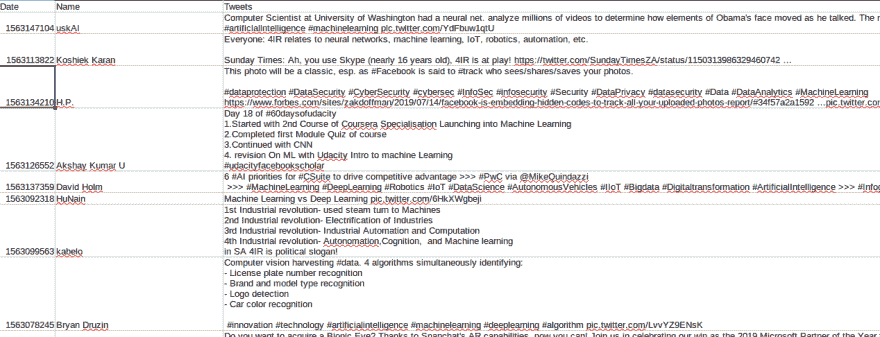

# 用 Python 抓取 Twitter

> 原文：<https://dev.to/petercour/twitter-scraping-with-python-1nmo>

网络抓取很有趣。网络包含大量的数据。计算机都是关于数据的。那么为什么不从网上收集一些呢？

一个有趣的收集来源是 Twitter。有两种默认的收集数据的方法。使用 API 或使用 Selenium。

API 是最简单的方法，所以我们将使用 Selenium。 [Selenium 让你自动操作网络浏览器](https://gumroad.com/l/Gjujxo)。

[](https://res.cloudinary.com/practicaldev/image/fetch/s--G-dBOn2C--/c_limit%2Cf_auto%2Cfl_progressive%2Cq_66%2Cw_880/https://proxy.duckduckgo.com/iu/%3Fu%3Dhttps%253A%252F%252Fmedia1.tenor.com%252Fimages%252Fe17177fb486d3f88d965e4f09ceebfe6%252Ftenor.gif%253Fitemid%253D6388340%26f%3D1)

### 刮削

下面的脚本收集给定搜索查询的 tweets。然后将它们保存到 csv 文件中。它基于一个 github 脚本，但这个脚本不起作用，所以我修复了它。

您可以在任何办公套件中加载 CSV 数据。对于搜索“机器学习”，它收集了这些:

[](https://res.cloudinary.com/practicaldev/image/fetch/s--XESiZahC--/c_limit%2Cf_auto%2Cfl_progressive%2Cq_auto%2Cw_880/https://thepracticaldev.s3.amazonaws.com/i/x5sw8uvy8nn5gwlogfhy.png)

所以代码并不完美，但它是有效的。

```
#!usr/bin/python3

from bs4 import BeautifulSoup
import time
from csv import DictWriter
import pprint
import datetime
from datetime import date, timedelta
from selenium import webdriver
from selenium.webdriver.common.by import By
from selenium.webdriver.support.ui import WebDriverWait
from selenium.webdriver.support import expected_conditions as EC
from selenium.common.exceptions import TimeoutException

def init_driver(driver_type):
    if driver_type == 1:
        driver = webdriver.Firefox()
    elif driver_type == 2:
        driver = webdriver.Chrome()
    elif driver_type == 3:
        driver = webdriver.Ie()
    elif driver_type == 4:
        driver = webdriver.Opera()
    elif driver_type == 5:
        driver = webdriver.PhantomJS()
    driver.wait = WebDriverWait(driver, 5)
    return driver

def scroll(driver, start_date, end_date, words, lang, max_time=180):
    languages = { 1: 'en', 2: 'it', 3: 'es', 4: 'fr', 5: 'de', 6: 'ru', 7: 'zh'}
    url = "https://twitter.com/search?q="
    for w in words[:-1]:
        url += "{}%20OR".format(w)
    url += "{}%20".format(words[-1])
    url += "since%3A{}%20until%3A{}&".format(start_date, end_date)
    if lang != 0:
        url += "l={}&".format(languages[lang])
    url += "src=typd"
    print(url)
    driver.get(url)
    start_time = time.time()  # remember when we started
    while (time.time() - start_time) < max_time:
        driver.execute_script("window.scrollTo(0, document.body.scrollHeight);")
        print( str(time.time() - start_time) + " < " + str(max_time) )

def scrape_tweets(driver):
    try:
        tweet_divs = driver.page_source
        obj = BeautifulSoup(tweet_divs, "html.parser")
        content = obj.find_all("div", class_="content")
        print(content)

        print("content printed")
        print(len(content))
        for c in content:
            tweets = c.find("p", class_="tweet-text").strings
            tweet_text = "".join(tweets)
            print(tweet_text)
            print("-----------")
            try:
                name = (c.find_all("strong", class_="fullname")[0].string).strip()
            except AttributeError:
                name = "Anonymous"
            date = (c.find_all("span", class_="_timestamp")[0].string).strip()

            datestring = str(c.find_all("span", class_="_timestamp")[0])
            print(datestring)
            datestring = datestring[datestring.index("data-time")+11:]
            datestring = datestring[:datestring.index("\"")]
            print(datestring)
            # print(tweet_text)            
            try:
                write_csv(datestring,tweet_text,name)
            except:
                print('csv error')

    except Exception as e:
        print("Something went wrong!")
        print(e)
        driver.quit()

def write_csv_header():
    with open("twitterData.csv", "w+") as csv_file:
        fieldnames = ['Date', 'Name', 'Tweets','Tags']
        writer = DictWriter(csv_file, fieldnames=fieldnames)
        writer.writeheader()

def write_csv(date,tweet,name):
    with open("twitterData.csv", "a+") as csv_file:
        fieldnames = ['Date', 'Name', 'Tweets','Tags']
        writer = DictWriter(csv_file, fieldnames=fieldnames)
        #writer.writeheader()
        writer.writerow({'Date': date,'Name': name,'Tweets': tweet})

def make_csv(data):
    l = len(data['date'])
    print("count: %d" % l)
    with open("twitterData.csv", "a+") as file:
        fieldnames = ['Date', 'Name', 'Tweets']
        writer = DictWriter(file, fieldnames=fieldnames)
        writer.writeheader()
        for i in range(l):
            writer.writerow({'Date': data['date'][i],
                            'Name': data['name'][i],
                            'Tweets': data['tweet'][i],
                            })

def get_all_dates(start_date, end_date):
    dates = []
    start_date = datetime.datetime.strptime(start_date, "%Y-%m-%d")
    end_date = datetime.datetime.strptime(end_date, "%Y-%m-%d")
    step = timedelta(days=1)
    while start_date <= end_date:
        dates.append(str(start_date.date()))
        start_date += step

    return dates

def main():
    driver_type = int(input("1) Firefox | 2) Chrome | 3) IE | 4) Opera | 5) PhantomJS\nEnter the driver you want to use: "))
    wordsToSearch = input("Enter the words: ").split(',')
    for w in wordsToSearch:
        w = w.strip()
    start_date = input("Enter the start date in (YYYY-MM-DD): ")
    end_date = input("Enter the end date in (YYYY-MM-DD): ")

    lang = int(input("0) All Languages 1) English | 2) Italian | 3) Spanish | 4) French | 5) German | 6) Russian | 7) Chinese\nEnter the language you want to use: "))
    all_dates = get_all_dates(start_date, end_date)
    print(all_dates)
    write_csv_header()
    for i in range(len(all_dates) - 1):
        driver = init_driver(driver_type)
        scroll(driver, str(all_dates[i]), str(all_dates[i + 1]), wordsToSearch, lang)
        scrape_tweets(driver)
        time.sleep(5)
        print("The tweets for {} are ready!".format(all_dates[i]))
        driver.quit()

if __name__ == "__main__":
    main() 
```

相关链接:

*   [硒课程及实例](https://gumroad.com/l/Gjujxo)
*   [Python 教程](https://pythonbasics.org/)